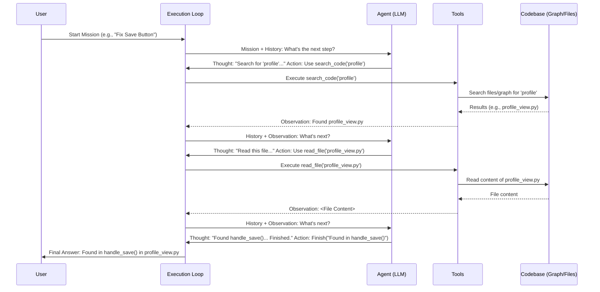

# Chapter 1: Agent Execution Loop

Welcome to the LocAgent tutorial! We're excited to guide you through how LocAgent works. LocAgent is designed to automatically find the specific locations in source code related to a bug report or a feature request.

Imagine you have a large software project with thousands of files. A user reports a bug, maybe something like "The 'Save' button doesn't work on the profile page." How do you find the exact lines of code responsible for this button? It can be like searching for a needle in a haystack!

This is where LocAgent steps in. It acts like an automated detective, examining the codebase to pinpoint the relevant code sections. But how does this detective work? It needs a central system to manage its investigation process.

That central system is the **Agent Execution Loop**.

## What is the Agent Execution Loop?

Think of the Agent Execution Loop as the **engine or control room** of LocAgent. It's the main process that manages the entire investigation (code localization) task from start to finish.

Its job is to coordinate several key players:

1. **The Mission:** This is the initial problem description, like the bug report ("'Save' button broken").
2. **The Agent (LLM):** This is the "brain" – a Large Language Model (like GPT-4 or Claude). It reads the mission, thinks about the next step, and decides what action to take.
3. **The Tools:** These are the specific actions the Agent can perform, like searching the code, reading a file, or exploring the project structure. We'll cover these in detail in [Chapter 4: Location Tools (Agent Skills)](04_location_tools__agent_skills_.md).
4. **The Codebase Representation:** This is how the Agent "sees" the code, often structured as a graph showing how different parts of the code are connected. More on this in [Chapter 2: Dependency Graph Representation](02_dependency_graph_representation_.md).

The Execution Loop runs a cycle: it gives the mission to the Agent, gets the Agent's chosen action, executes that action (often using a Tool), gets the result, shows the result back to the Agent, and repeats. This continues until the Agent believes it has found the code location and decides to finish.

**Analogy:** Imagine an orchestra conductor (the Execution Loop). The conductor has the musical score (the Mission) and directs different sections of the orchestra (the Tools) based on the input from the lead musician (the Agent/LLM) who interprets the score and decides what sounds right next. The loop continues measure by measure until the piece (the Mission) is complete.

## The Loop in Action: A Simple Example

Let's revisit our bug: "The 'Save' button doesn't work on the profile page."

Here's how the Execution Loop might handle this:

1. **Start:** The Loop receives the mission: "Find code for the broken 'Save' button on the profile page."
2. **Think (Agent):** The Loop sends the mission to the Agent (LLM). The Agent thinks, "Okay, I should probably search for files related to 'profile' and 'save'." It decides to use the `search_code` tool.
3. **Act (Loop & Tools):** The Loop receives the Agent's decision. It calls the `search_code` tool with keywords "profile" and "save". The tool searches the codebase.
4. **Observe (Agent):** The tool returns a list of potential files (e.g., `profile_view.py`, `user_settings.js`, `save_handler.py`). The Loop passes this list back to the Agent as an observation.
5. **Think (Agent):** The Agent sees the files. It thinks, "`profile_view.py` seems most relevant for the button itself." It decides to use the `read_file` tool for `profile_view.py`.
6. **Act (Loop & Tools):** The Loop calls the `read_file` tool for `profile_view.py`.
7. **Observe (Agent):** The tool returns the content of `profile_view.py`. The Loop shows this content to the Agent.
8. **Think (Agent):** The Agent reads the code. It finds a function named `handle_profile_save()`. It thinks, "This looks promising! Let me confirm." It might decide to use another tool to see what calls this function or analyze the function's code more deeply using techniques discussed in [Chapter 6: Graph Search & Traversal](06_graph_search___traversal_.md).
9. **(Repeat):** The loop continues – think, act, observe – as the Agent uses various tools to explore the code.
10. **Finish:** Eventually, the Agent determines the most likely location(s) (e.g., function `handle_profile_save` in `profile_view.py`). It signals it's finished.
11. **End:** The Loop receives the finish signal and outputs the final location(s) found by the Agent.

This cycle is the core of LocAgent's automated process.

## Looking Under the Hood (Code Flow)

The heart of the execution loop resides in the `auto_search_process` function within the `auto_search_main.py` file. Let's break down a simplified version of how it works.

**1. The Main Loop:**

The process runs in a loop that continues until the Agent decides the mission is complete or a limit is reached.

```python
# --- Simplified from auto_search_main.py ---
def auto_search_process(messages, tools, ...):
    # ... initialization ...
    parser = ResponseParser() # Used to understand the Agent's response
    finish = False
    cur_interation_num = 0
    max_iteration_num = 20 # Safety limit

    while not finish: # Keep looping until the Agent says "finish"
        cur_interation_num += 1
        if cur_interation_num == max_iteration_num:
            # Tell the agent to wrap up if it takes too long
            messages.append({'role': 'user', 'content': 'Max iterations reached. Please conclude.'})
            # ... (prepare for final response) ...

        # Step 1: Ask the Agent (LLM) what to do next
        # ... (LLM call happens here, see below) ...

        # Step 2: Parse the Agent's response into actions
        # ... (Parsing happens here, see below) ...

        # Step 3: Execute the actions
        # ... (Action execution happens here, see below) ...

        # The loop repeats until 'finish' becomes True
```

This `while` loop is the engine. Inside it, three main things happen in each cycle: Ask the Agent, Parse the Response, Execute the Action.

**2. Asking the Agent (LLM):**

The loop sends the current conversation history (including the mission and previous observations) to the Agent (LLM) and asks for the next step.

```python
# --- Simplified from auto_search_main.py inside the loop ---

        try:
            # Send current messages + tools description to the LLM
            response = litellm.completion(
                model=model_name,
                messages=messages, # The conversation history
                tools=tools,       # Available tools the agent can use
                # ... other parameters like temperature ...
            )
            # 'response' now contains the Agent's thought process and chosen action(s)

        except Exception as e:
            # Handle errors if the LLM call fails
            print(f"Error calling LLM: {e}")
            break # Exit the loop on error
```

We use the `litellm.completion` function to communicate with the chosen LLM (like GPT-4). We send the `messages` (the story so far) and information about the `tools` it can use.

**3. Parsing the Agent's Response:**

The LLM's response isn't always simple. It might contain thoughts, instructions to use a tool, or just a message. We need to parse this response to understand what the Agent wants to do. This is handled by the `ResponseParser`, which relates closely to [Chapter 5: Function Calling & Action Parsing](05_function_calling___action_parsing_.md).

```python
# --- Simplified from auto_search_main.py inside the loop ---

        # Get the primary message from the LLM response
        assistant_message = response.choices[0].message
        messages.append(convert_to_json(assistant_message)) # Add agent's response to history

        # Use the parser to convert the LLM's message into structured Action objects
        actions = parser.parse(response) # E.g., FinishAction, IPythonRunCellAction
        if not isinstance(actions, List):
            actions = [actions] # Ensure it's always a list
```

The `parser.parse(response)` line takes the raw LLM response and figures out the intended action(s).

**4. Executing the Actions:**

Based on the parsed actions, the loop performs the requested operations.

```python
# --- Simplified from auto_search_main.py inside the loop ---

        for action in actions:
            if action.action_type == ActionType.FINISH:
                # Agent decided the task is complete
                final_output = action.thought # Get the final answer
                print(f"Mission Complete! Final Answer: {final_output}")
                finish = True # Set flag to exit the 'while' loop

            elif action.action_type == ActionType.RUN_IPYTHON:
                # Agent wants to run a tool (represented as Python code)
                code_to_run = action.code
                print(f"Agent wants to run code: {code_to_run}")

                # Execute the code (e.g., call a search tool, read a file)
                observation = execute_ipython(code_to_run)
                print(f"Observation from code: {observation}")

                # Add the result back to the message history for the Agent to see
                messages.append({
                    "role": "tool", # Or "user" depending on setup
                    "content": "OBSERVATION:\n" + observation,
                    # ... (tool call ID might be needed) ...
                })

            elif action.action_type == ActionType.MESSAGE:
                # Agent just wants to think or say something (no tool used)
                print(f"Agent thought: {action.content}")
                # Often followed by adding a generic prompt to ask the agent what's next
                messages.append({"role": "user", "content": "Okay, what is the next step?"})

            else:
                print("Unknown action type!")
                # Handle unexpected actions
```

This `if/elif/else` block checks the `action_type`.

* If it's `FINISH`, we grab the final answer and set `finish = True` to stop the loop.
* If it's `RUN_IPYTHON` (our way of running tools), we execute the provided `action.code` using `execute_ipython` (which accesses the functionality described in [Chapter 4: Location Tools (Agent Skills)](04_location_tools__agent_skills_.md)). The result (`observation`) is added back to the `messages` so the agent knows what happened.
* If it's `MESSAGE`, it means the agent is just thinking or providing intermediate text. We usually add a follow-up prompt to keep the process going.

## Visualizing the Loop

We can visualize this flow using a sequence diagram:



This diagram shows the back-and-forth communication managed by the Execution Loop until the task is finished.

## Conclusion

The Agent Execution Loop is the conductor of LocAgent. It orchestrates the conversation between the intelligent Agent (LLM) and the available Tools, constantly driving towards solving the initial Mission by repeating a cycle of "Think -> Act -> Observe". It's the core engine that enables automated code localization.

Understanding this loop is fundamental to understanding how LocAgent operates. In the next chapter, we'll dive into one of the key components the loop interacts with: how the codebase is represented so the agent can understand its structure.

Ready to learn more? Let's explore the [Dependency Graph Representation](02_dependency_graph_representation_.md).

---

Generated by [AI Codebase Knowledge Builder](https://github.com/The-Pocket/Tutorial-Codebase-Knowledge)
