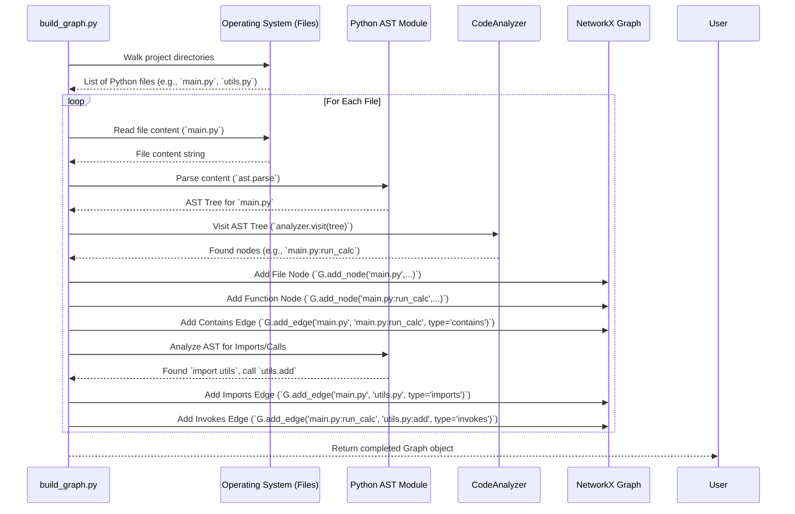

# Chapter 3: Graph Building Process

Welcome back! In [Chapter 2: Dependency Graph Representation](02_dependency_graph_representation_.md), we discovered the "map" that LocAgent uses to understand a software project – the **Dependency Graph**. This map shows all the important code pieces (files, classes, functions) and how they're connected (imports, calls, etc.).

But how is this incredibly useful map created in the first place? You can't just wish it into existence! LocAgent needs a way to survey the actual "terrain" – the raw source code – and carefully draw the map from scratch. This surveying and drawing process is what we call the **Graph Building Process**.

Think of it like this: before you can use a city map, someone (a cartographer) needs to go out, survey the land, identify streets, buildings, and landmarks, and then plot them accurately onto paper. Our Graph Building Process is LocAgent's cartographer.

## From Raw Code to Structured Map

The goal is simple: start with potentially thousands of lines of Python code spread across many files, and end up with a structured, connected Dependency Graph that the Agent can easily explore.

Why do we need this process? Without it, the Agent would be blind. It wouldn't know that `main.py` uses a function from `utils.py`, or that the `UserProfile` class has a `save_profile` method. The Graph Building Process provides this essential structural awareness *before* the Agent even starts its investigation (described in [Chapter 1: Agent Execution Loop](01_agent_execution_loop_.md)).

## The Magic Ingredient: Abstract Syntax Trees (ASTs)

How can a program *read* and *understand* code structure without actually running it? The secret sauce is something called an **Abstract Syntax Tree (AST)**.

Imagine you have a simple English sentence: "The quick brown fox jumps over the lazy dog."
To understand its grammar, you might break it down:
*   Subject: "The quick brown fox"
    *   Article: "The"
    *   Adjectives: "quick", "brown"
    *   Noun: "fox"
*   Verb: "jumps"
*   Prepositional Phrase: "over the lazy dog"
    *   Preposition: "over"
    *   Object: "the lazy dog"
        *   Article: "the"
        *   Adjective: "lazy"
        *   Noun: "dog"

An AST does something very similar for code. It takes raw code text and breaks it down into its grammatical components and their relationships, representing the code's structure as a tree.

Let's take a tiny piece of Python code:

```python
# simple_example.py
def greet(name):
  message = "Hello, " + name
  print(message)
```

Python's built-in `ast` module can parse this into an AST. Conceptually, the AST might look something like this (simplified):

```
Module
└── FunctionDef (name='greet', args=['name'])
    └── Body
        ├── Assign (target='message')
        │   └── Value: BinaryOp (op=Add)
        │       ├── Left: Constant (value="Hello, ")
        │       └── Right: Name (id='name')
        └── Expr
            └── Value: Call (func=Name(id='print'))
                └── Args
                    └── Name (id='message')
```

This tree structure tells us:
*   There's a function definition named `greet` that takes one argument `name`.
*   Inside the function, there's an assignment to a variable `message`.
*   The value assigned is the result of adding the string `"Hello, "` and the variable `name`.
*   Then, there's an expression involving a function call to `print`.
*   The argument to `print` is the variable `message`.

By looking at this tree, LocAgent can understand the code's structure (function definition, assignment, function call) without executing it.

## The Graph Building Steps

LocAgent uses ASTs as a core part of its graph building process. Here’s a step-by-step breakdown:

**Step 1: Scan the Project Folders**

First, LocAgent needs to find all the Python files (`.py`) within the project directory. It ignores irrelevant folders like `.git` or build directories. This is like the cartographer first identifying all the plots of land in the city.

*   **How:** Uses Python's `os.walk` to go through all directories and files.
*   **Key File:** `dependency_graph/build_graph.py`

```python
# --- Simplified concept from build_graph.py ---
import os

SKIP_DIRS = ['.git', '__pycache__'] # Folders to ignore

def find_python_files(repo_path):
    python_files = []
    for root, dirs, files in os.walk(repo_path):
        # Skip specified directories
        dirs[:] = [d for d in dirs if d not in SKIP_DIRS]

        for file in files:
            if file.endswith('.py'):
                file_path = os.path.join(root, file)
                python_files.append(file_path)
    return python_files

# Example Usage:
# all_files = find_python_files('/path/to/your/project')
```
This snippet shows the basic idea of walking through directories and collecting `.py` files.

**Step 2: Parse Each File (AST Analysis)**

For each Python file found, LocAgent reads its content and uses Python's `ast.parse` function to generate the Abstract Syntax Tree.

Then, it uses a special pattern called an "AST Visitor" (like our `CodeAnalyzer` class) to "walk" through this tree and identify important structures.

*   **How:** `ast.parse(file_content)` creates the tree. `CodeAnalyzer().visit(tree)` traverses it.
*   **Identifies:**
    *   `File` nodes (the file itself).
    *   `Class` nodes (using `visit_ClassDef`).
    *   `Function` nodes (using `visit_FunctionDef`).
*   **Key File:** `dependency_graph/build_graph.py` (contains `CodeAnalyzer`)

```python
# --- Simplified concept from build_graph.py ---
import ast

class CodeAnalyzer(ast.NodeVisitor):
    def __init__(self, filename):
        self.filename = filename
        self.nodes_found = [] # Store info about classes/functions

    def visit_ClassDef(self, node):
        print(f"Found Class: {node.name} in {self.filename}")
        self.nodes_found.append({'type': 'class', 'name': node.name, ...})
        self.generic_visit(node) # Visit children nodes (like methods)

    def visit_FunctionDef(self, node):
        print(f"Found Function: {node.name} in {self.filename}")
        self.nodes_found.append({'type': 'function', 'name': node.name, ...})
        self.generic_visit(node) # Visit nodes inside the function

def analyze_file_structure(filepath):
    try:
        with open(filepath, 'r') as f:
            content = f.read()
        tree = ast.parse(content, filename=filepath)
        analyzer = CodeAnalyzer(filepath)
        analyzer.visit(tree)
        return analyzer.nodes_found
    except Exception as e:
        print(f"Could not parse {filepath}: {e}")
        return []

# Conceptual Usage:
# nodes_in_file = analyze_file_structure('my_module.py')
```
This shows how an AST Visitor can be used to find specific code structures like classes and functions within the parsed tree.

**Step 3: Identify Relationships (Edges)**

Just knowing the buildings (classes, functions) isn't enough. The cartographer also needs to draw the roads (relationships). LocAgent does this by analyzing the ASTs further:

*   **Contains:** This is straightforward. If a function is found inside a file's AST, a `contains` edge is added from the file node to the function node. Similarly for classes containing methods.
*   **Imports:** LocAgent looks for `ast.Import` and `ast.ImportFrom` nodes in the AST to see which modules or specific names are being imported. It then tries to resolve these imports to other files or code entities in the project. (`find_imports` function).
*   **Invokes (Function Calls):** It searches the AST within function bodies for `ast.Call` nodes. These represent function calls. LocAgent tries to figure out *which* function is being called (this can be tricky!) and adds an `invokes` edge. (`analyze_invokes` function).
*   **Inherits:** For classes (`ast.ClassDef`), it looks at the `bases` attribute in the AST node, which lists the parent classes. An `inherits` edge is added for each parent. (`analyze_init` function handles class inheritance).

*   **Key File:** `dependency_graph/build_graph.py` (contains helper functions like `find_imports`, `analyze_invokes`, `analyze_init`).

**Step 4: Assemble the Graph**

As LocAgent scans files, parses ASTs, and identifies nodes and relationships, it adds them to the final Dependency Graph structure. We use a powerful library called `networkx` to manage the graph.

*   **How:** Conceptually, calls like `graph.add_node(...)` and `graph.add_edge(...)` are made.
*   **Result:** A complete `networkx.MultiDiGraph` object representing the entire project's structure.

```python
# --- Conceptual Example using networkx ---
import networkx as nx

# Graph Building starts with an empty graph
G = nx.MultiDiGraph() # MultiDiGraph allows multiple edges between nodes

# Step 1 & 2 results: Add nodes found by AST analysis
G.add_node("my_module.py", type="file", code="...")
G.add_node("my_module.py:my_function", type="function", code="...", start_line=5)
G.add_node("utils.py", type="file", code="...")
G.add_node("utils.py:helper_function", type="function", code="...")

# Step 3 results: Add edges based on relationships found
G.add_edge("my_module.py", "my_module.py:my_function", type="contains")
G.add_edge("utils.py", "utils.py:helper_function", type="contains")

# If my_function imports utils.py
G.add_edge("my_module.py:my_function", "utils.py", type="imports")

# If my_function calls helper_function
G.add_edge("my_module.py:my_function", "utils.py:helper_function", type="invokes")

# Now G holds the structured map!
```
This example shows how the information gathered in the previous steps is used to populate the `networkx` graph with nodes and typed edges.

## The Cartographer at Work: Under the Hood

The main script orchestrating this process is `dependency_graph/build_graph.py`. It calls the necessary functions to perform the steps described above. The script `dependency_graph/batch_build_graph.py` can run this process for many projects efficiently.

Let's visualize the simplified flow when `build_graph.py` runs for a small project:



This diagram shows the script interacting with the file system, Python's `ast` module, the `CodeAnalyzer` visitor, and the `networkx` graph object to systematically build the map by processing each file.

## Conclusion

The Graph Building Process is the essential first step where LocAgent transforms unstructured source code into a meaningful, queryable map – the Dependency Graph. By leveraging Abstract Syntax Trees (ASTs), it meticulously scans files, identifies code structures like classes and functions, and plots the relationships (imports, calls, inheritance) between them. This process acts like a cartographer, providing the detailed city map (Dependency Graph) that the Agent (our detective) needs to navigate the codebase efficiently.

Now that we have the map (the graph), how does the Agent actually use it? The Agent needs tools, or "skills," to interact with the code and the graph.

Let's explore these skills in the next chapter: [Chapter 4: Location Tools (Agent Skills)](04_location_tools__agent_skills_.md).

---

Generated by [AI Codebase Knowledge Builder](https://github.com/The-Pocket/Tutorial-Codebase-Knowledge)