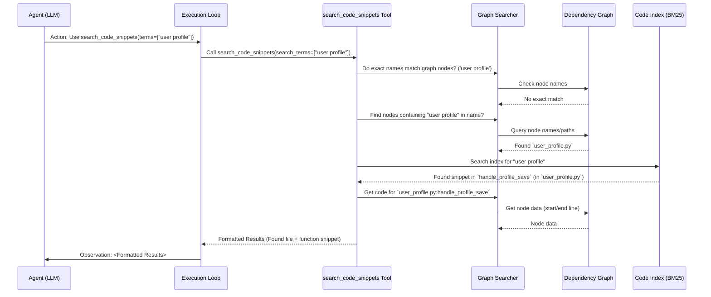

# Chapter 4: Location Tools (Agent Skills)

Welcome back! In [Chapter 3: Graph Building Process](03_graph_building_process_.md), we learned how LocAgent creates the indispensable "map" of our codebase – the **Dependency Graph**. This map shows files, functions, classes, and how they connect.

But having a map isn't enough! Imagine you're a detective with a city map, trying to find a specific location related to a clue. You need tools to use that map effectively – maybe a magnifying glass to see details, a phonebook to look up addresses, or even the ability to physically go to a location and look around.

Similarly, our LocAgent, the AI detective, needs its own toolkit to interact with the codebase map (the Dependency Graph) and the code itself. These tools are the agent's "hands and eyes," allowing it to perform actions and gather information. We call these the **Location Tools**, or the agent's **Skills**.

## What are Location Tools?

Location Tools are a set of pre-defined Python functions that the LocAgent's "brain" (the LLM) can ask to be executed. Think of them as special commands the agent knows how to use.

Why are they needed? The LLM itself doesn't directly access your files or run complex graph queries. It operates based on text prompts and its training. The Location Tools act as intermediaries:

1.  The LLM decides it needs specific information (e.g., "Find functions related to 'saving profile data'").
2.  It formulates a request to use a specific Location Tool (e.g., `search_code_snippets`).
3.  The [Agent Execution Loop](01_agent_execution_loop_.md) receives this request.
4.  The Loop executes the corresponding Python function (the Location Tool).
5.  The tool interacts with the Dependency Graph or code index.
6.  The tool returns the results as text.
7.  The Loop passes this text back to the LLM as an observation.

This allows the LLM to safely and effectively explore the codebase structure and content without needing direct, unrestricted access.

## The Agent's Toolkit: Main Categories

LocAgent comes equipped with several types of tools, primarily focused on exploring the code structure and content:

1.  **Code Search Tools (`search_code_snippets`)**:
    *   **Analogy:** Using a search engine or a detailed index for the city map.
    *   **Purpose:** Find code entities (files, classes, functions) or specific lines of code based on keywords, names, or line numbers. This is often the agent's first step to find potential starting points.
    *   **Example Use:** Agent asks to find code related to "user login" or code at line 50 in `auth.py`.

2.  **Graph Exploration Tools (`explore_tree_structure`, `explore_graph_structure`)**:
    *   **Analogy:** Using the map to see what buildings are connected to a specific street, or what roads lead away from a landmark.
    *   **Purpose:** Understand the relationships *around* a specific code entity found on the graph. For example, what functions does this function call? What classes inherit from this class? Where is this function defined?
    *   **Example Use:** Agent finds a `handle_save` function using search and then asks to explore its "downstream" dependencies (what it calls) or "upstream" dependencies (what calls it).

3.  **Content Retrieval Tools (`get_entity_contents`, often part of `search_code_snippets`)**:
    *   **Analogy:** Opening the door to a specific room on the map and looking inside to see what's there.
    *   **Purpose:** Get the actual source code content for a specific entity (file, function, or class) identified on the graph.
    *   **Example Use:** After exploring the graph and deciding `auth.py:authenticate_user` is important, the agent asks to see its actual code.

These tools work together. The agent might first *search* for potential candidates, then *explore* the graph around the most promising ones, and finally *retrieve* the code content for detailed examination.

## Tools in Action: Example Scenario

Let's revisit our bug: "The 'Save' button doesn't work on the profile page."

Here's how the agent might use its tools:

1.  **Agent Thought:** "I need to find code related to 'profile' and 'save'."
2.  **Agent Action Request:** Use `search_code_snippets(search_terms=["profile", "save"])`.
3.  **(Execution Loop runs the tool)**
4.  **Tool Result (Observation for Agent):**
    ```text
    ## Searching for term "profile", "save"...
    ### Search Result:
    Function: `user_profile.py:handle_profile_save` (Preview)
        ```python
        # user_profile.py
        L15: def handle_profile_save(user_id, data):
        L16:     # ... (code implementation)
        L25:     save_to_database(user_id, data)
        L26:     return True
        ```
    File: `user_profile.py` (Folded)
        Path: user_profile.py
        (Hint: Search `user_profile.py` for full content if needed)

    Source: Match found for entity name `handle_profile_save`. Retrieved entity using keyword search (bm25).
    ```
5.  **Agent Thought:** "`handle_profile_save` looks very relevant. What does it call?"
6.  **Agent Action Request:** Use `explore_tree_structure(start_entities=['user_profile.py:handle_profile_save'], direction='downstream', dependency_type_filter=['invokes'])`.
7.  **(Execution Loop runs the tool)**
8.  **Tool Result (Observation for Agent):**
    ```text
    * entity: `user_profile.py:handle_profile_save` (function)
      * --[invokes]--> entity: `database.py:save_to_database` (function)
    ```
9.  **Agent Thought:** "Okay, it calls `save_to_database`. Let me see the code for `handle_profile_save` to check the logic before it calls that."
10. **Agent Action Request:** Use `search_code_snippets(search_terms=['user_profile.py:handle_profile_save'])`. (Note: Searching the exact name often retrieves the full content).
11. **(Execution Loop runs the tool)**
12. **Tool Result (Observation for Agent):**
    ```text
    ## Searching for entity `user_profile.py:handle_profile_save`...
    ### Search Result:
    Function: `user_profile.py:handle_profile_save` (Complete Code)
        ```python
        # user_profile.py
        L15: def handle_profile_save(user_id, data):
        L16:     logger.info(f"Attempting to save profile for {user_id}")
        L17:     if not data:
        L18:         logger.error("No data provided for saving.")
        L19:         return False # Maybe the bug is here?
        L20:
        L21:     # Some validation logic...
        L22:     is_valid = validate_data(data)
        L23:     if not is_valid:
        L24:         return False
        L25:     save_to_database(user_id, data)
        L26:     return True
        ```
     Source: Exact match found for entity name `user_profile.py:handle_profile_save`.
    ```
13. **(Agent continues analysis...)**

This shows how the agent uses different tools iteratively to gather the information needed to locate the relevant code. The exact way the agent requests these tools is covered in [Chapter 5: Function Calling & Action Parsing](05_function_calling___action_parsing_.md).

## Under the Hood: How Tools Work

These tools are Python functions primarily defined in `plugins/location_tools/repo_ops/repo_ops.py`. When the Execution Loop calls one of these functions, it typically performs these steps:

1.  **Parse Inputs:** Understand the request (e.g., keywords, entity names, direction).
2.  **Access Graph Searchers:** Use helper classes like `RepoEntitySearcher` or `RepoDependencySearcher` that know how to query the `networkx` Dependency Graph object we built in Chapter 3.
3.  **Query the Graph:** Ask the graph for nodes matching names, find neighbours based on edge types (like `invokes` or `contains`), or traverse the graph structure. Graph traversal is detailed in [Chapter 6: Graph Search & Traversal](06_graph_search___traversal_.md).
4.  **Access Code Index (Optional):** For keyword searches (`search_code_snippets`), it might query a separate search index (like BM25) built from the code content for faster lookups. This is covered in [Chapter 7: Code Indexing & Retrieval](07_code_indexing___retrieval_.md).
5.  **Retrieve Code Snippets:** Fetch the actual lines of code associated with graph nodes, often stored directly in the node data or retrieved from the original files.
6.  **Format Output:** Combine the query results (entity names, relationships, code snippets) into a clear, readable text format suitable for the LLM agent to understand.

Let's visualize the flow for a `search_code_snippets` call:



This diagram shows the tool interacting with both the graph structure (via the Graph Searcher) and the code content (via the Code Index) to fulfill the agent's request.

## Code Glimpse: Defining the Tools

The tools themselves are Python functions. LocAgent uses a plugin system, and these tools are registered as capabilities the agent can use.

**1. Tool Registration (Conceptual):**
The `plugins/location_tools/__init__.py` file helps declare that these location tools exist.

```python
# --- Simplified from plugins/location_tools/__init__.py ---
from dataclasses import dataclass
from plugins.location_tools import locationtools
from plugins.requirement import PluginRequirement

# Describes the 'location_tools' plugin requirement
@dataclass
class LocationToolsRequirement(PluginRequirement):
    name: str = 'location_tools'
    # Includes documentation for the LLM to understand the tools
    documentation: str = locationtools.DOCUMENTATION
```
This sets up the collection of tools, including their documentation which helps the LLM know *how* to use them.

**2. The Tool Functions (`repo_ops.py`):**
The actual logic resides in functions within `plugins/location_tools/repo_ops/repo_ops.py`.

```python
# --- Simplified from plugins/location_tools/repo_ops/repo_ops.py ---
from dependency_graph import RepoEntitySearcher, RepoDependencySearcher
from dependency_graph.traverse_graph import traverse_tree_structure # For explore_tree_structure
# ... other imports for searching, formatting ...

# Helper function to get graph searchers (accesses the pre-built graph)
def get_graph_entity_searcher() -> RepoEntitySearcher:
    # ... returns the entity searcher instance ...
    pass

def get_graph_dependency_searcher() -> RepoDependencySearcher:
    # ... returns the dependency searcher instance ...
    pass

# --- Example: search_code_snippets ---
def search_code_snippets(search_terms: Optional[List[str]] = None, ...) -> str:
    """Searches the codebase... (Docstring used for LLM)"""
    searcher = get_graph_entity_searcher()
    result = ""
    all_query_results = []

    if search_terms:
        for term in search_terms:
            query_info = QueryInfo(term=term)
            # 1. Try exact match / name search using Graph Searcher
            query_results, continue_search = search_entity(query_info, ...)
            all_query_results.extend(query_results)

            # 2. If not found, try keyword search using Code Index (BM25)
            if continue_search:
                query_results = bm25_content_retrieve(query_info, ...)
                all_query_results.extend(query_results)
            # ... (handle line number searches too) ...

    # 3. Format all results into a single string
    merged_results = merge_query_results(all_query_results)
    ranked_results = rank_and_aggr_query_results(merged_results, ...)
    result = format_output_for_llm(ranked_results, searcher) # Helper formats the text

    return result

# --- Example: explore_tree_structure ---
def explore_tree_structure(start_entities: List[str], ...) -> str:
    """Analyzes and displays the dependency structure... (Docstring)"""
    valid_entities, hints = _validate_graph_explorer_inputs(start_entities, ...)
    G = get_graph() # Get the actual NetworkX graph object

    # Use the graph traversal function
    rtns = [traverse_tree_structure(G, node, ...) for node in valid_entities]
    rtn_str = "\n\n".join(rtns) # Format results as text

    # Add any hints (e.g., if invalid start_entities were given)
    if hints.strip():
        rtn_str += "\n\n" + hints
    return rtn_str.strip()
```
These simplified snippets show the core idea: each tool function takes arguments specified by the LLM, uses helper functions/classes to interact with the graph or index, and returns a formatted string result back to the agent.

## Conclusion

Location Tools are the essential skills that empower the LocAgent LLM to actively investigate a codebase. They act as the agent's interface to the underlying Dependency Graph and code content, allowing it to perform actions like searching for keywords, exploring connections between code components, and retrieving specific code snippets. Think of them as the detective's specialized toolkit, enabling efficient and targeted code exploration.

Now that we understand *what* tools the agent has and *how* they generally work by interacting with the graph, we need to understand the precise mechanism the agent uses to tell the Execution Loop *which* tool to use and *what* parameters to use with it.

Let's dive into how the agent communicates its intentions in the next chapter: [Chapter 5: Function Calling & Action Parsing](05_function_calling___action_parsing_.md).

---

Generated by [AI Codebase Knowledge Builder](https://github.com/The-Pocket/Tutorial-Codebase-Knowledge)