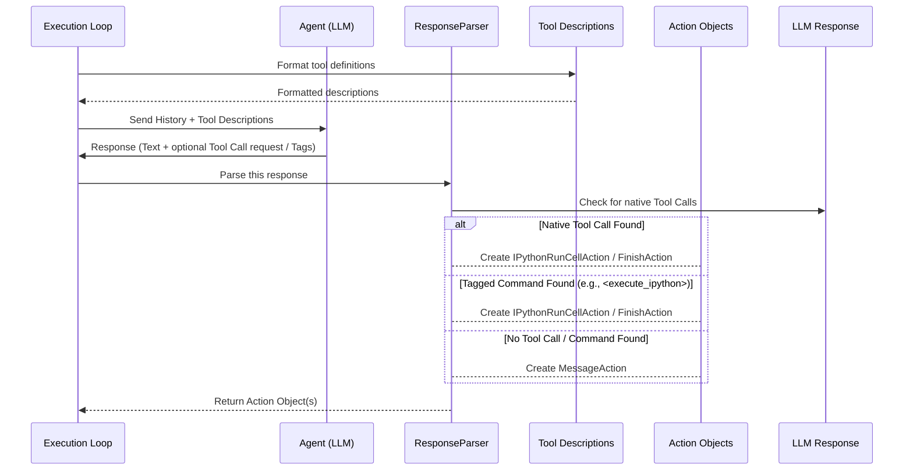

# Chapter 5: Function Calling & Action Parsing

Welcome back! In [Chapter 4: Location Tools (Agent Skills)](04_location_tools__agent_skills_.md), we explored the toolkit available to our LocAgent detective – the various "skills" like searching code (`search_code_snippets`) and exploring the code map (`explore_tree_structure`). We saw *what* the agent can do.

But how does the agent actually *decide* which tool to use, and how does the system understand that decision? Imagine the agent's "brain" (the Large Language Model or LLM) thinks, "Okay, based on the bug report 'Save button broken', I need to search for files containing 'save' and 'profile'." How does this thought turn into the *actual execution* of the `search_code_snippets` tool with the right keywords?

This is where **Function Calling & Action Parsing** comes in. It's the crucial bridge connecting the LLM's reasoning to the concrete execution of the agent's skills. Think of it as the translator and dispatcher in our agent's control room. The LLM gives a high-level command ("Search for these terms!"), and this component translates it into a specific, actionable instruction for the field agent (the [Agent Execution Loop](01_agent_execution_loop_.md)).

## The Communication Challenge

Directly telling an LLM to "just run this Python code" can be risky and unreliable. The LLM might misunderstand, generate incorrect code, or even try to do something harmful if not properly guided. We need a safer, more structured way for the LLM to indicate its intentions.

At the same time, the LLM's response isn't always a command to run a tool. Sometimes it might just be thinking aloud, asking a clarifying question, or deciding that the task is finished. The system needs to understand these different types of responses.

Function Calling and Action Parsing solves these two problems:

1.  **Structured Tool Requests:** It allows the LLM to request a tool using a specific format, almost like filling out a form, rather than just using free-form text.
2.  **Interpreting Intent:** It analyzes the LLM's response to figure out *what* the LLM wants to do – call a specific tool, declare the mission finished, or just provide some text – and translates that into a standard `Action` object the rest of the system can understand.

## Key Concepts

Let's break down the two main parts:

### 1. Function Calling (The LLM's Side)

Modern LLMs have a neat feature often called "Function Calling" or "Tool Use". Instead of just generating text, you can give the LLM a list of "functions" (our [Location Tools](04_location_tools__agent_skills_.md) from Chapter 4) it's allowed to *request*.

**How it works:**

1.  **Define the Tools:** We tell the LLM about the available tools, including:
    *   Their names (e.g., `search_code_snippets`).
    *   A description of what they do (e.g., "Searches the codebase for keywords or line numbers").
    *   The parameters they need (e.g., `search_terms` which is a list of strings, `line_nums` which is a list of numbers).
    *   Which parameters are required or optional.

2.  **LLM Decides:** When the LLM gets a prompt (like the bug report and the conversation history), it also sees this list of available tools. Based on the situation, it can decide that calling one of these tools is the best next step.

3.  **Structured Output:** Instead of just saying "I want to search for 'profile'", the LLM might output a special, structured message that basically says:
    *   "I want to call the function named `search_code_snippets`."
    *   "Here are the arguments: `search_terms` should be `['profile', 'save']`."

This structured output is much easier and safer for the system to understand than trying to guess the LLM's intent from plain text.

**Analogy:** Imagine giving a child a menu at a restaurant (the list of tools). Instead of the child vaguely saying "I want food," they can point to a specific item on the menu ("I want the 'Chicken Nuggets'") and maybe specify options ("with 'ketchup'"). Function calling lets the LLM "order" from the menu of available tools.

*(Note: Not all LLMs support this native "Function Calling" equally well. LocAgent includes a compatibility layer ([discussed later](#under-the-hood-how-it-works)) to translate requests using special text tags for LLMs that prefer that method.)*

### 2. Action Parsing (The System's Side)

The [Agent Execution Loop](01_agent_execution_loop_.md) receives the LLM's response. Now, it needs to figure out what to do with it. This is the job of the **Action Parser**.

**How it works:**

1.  **Receive Response:** The parser gets the raw response from the LLM.
2.  **Interpret:** It checks the response format:
    *   Is it a structured "function call" request? If yes, which function and with what arguments?
    *   Is it a special message indicating the task is finished (e.g., containing `<finish>` tags)?
    *   Is it a request to run code using specific tags (e.g., `<execute_ipython>... </execute_ipython>`)? This is LocAgent's way of handling tool calls when not using the LLM's native function calling.
    *   Is it just plain text (a thought or a message)?
3.  **Create Action Object:** Based on the interpretation, the parser creates a standardized Python object representing the action. LocAgent defines several `Action` types:
    *   `IPythonRunCellAction`: Used when the LLM wants to run a tool. It contains the Python code representing the tool call (e.g., `print(search_code_snippets(search_terms=['profile', 'save']))`).
    *   `FinishAction`: Used when the LLM signals the task is complete. It might contain the final answer or reasoning.
    *   `MessageAction`: Used when the LLM just outputs text without requesting a specific action.

4.  **Pass to Loop:** The parser returns this `Action` object to the Execution Loop. The Loop can then easily check the `action_type` and perform the corresponding step (run the code, stop the process, or just record the message).

**Analogy:** The Action Parser is like the receptionist in the control room. It takes messages from the LLM (which might be in different formats – a structured request form, a special note, or just spoken words) and converts them into a standard work order (`Action` object) that the dispatcher (Execution Loop) can easily understand and assign.

## Solving the Use Case: "Save Button Broken"

Let's see how this works step-by-step for our example:

1.  **Loop sends prompt to LLM:** The Execution Loop sends the current mission ("Find code for broken Save button...") and the descriptions of available tools (like `search_code_snippets`, `explore_tree_structure`) to the LLM.
2.  **LLM thinks and decides:** The LLM reasons, "I should search for 'profile' and 'save'." It decides to use the `search_code_snippets` tool.
3.  **LLM generates response (Function Call):** The LLM generates a structured response indicating it wants to call `search_code_snippets` with `search_terms=['profile', 'save']`.
    *(Alternatively, using tagged text, it might generate: "I need to search for the relevant code. <execute_ipython>print(search_code_snippets(search_terms=['profile', 'save']))</execute_ipython>")*
4.  **Parser receives response:** The `ResponseParser` in LocAgent gets this output.
5.  **Parser interprets:** It recognizes the structured Function Call (or the `<execute_ipython>` tags). It extracts the function name (`search_code_snippets`) and the arguments (`search_terms=['profile', 'save']`).
6.  **Parser creates Action:** It constructs the corresponding Python code `print(search_code_snippets(search_terms=['profile', 'save']))` and packages it into an `IPythonRunCellAction` object.
7.  **Loop receives Action:** The Execution Loop receives the `IPythonRunCellAction`.
8.  **Loop executes Action:** Seeing the action type is `RUN_IPYTHON`, the loop executes the Python code inside, effectively calling the `search_code_snippets` tool (as described in [Chapter 4](04_location_tools__agent_skills_.md)).

This structured process ensures the LLM's intent is clearly understood and translated into the correct tool execution.

## Under the Hood: How it Works

The core logic resides in the interaction between the LLM, the `ResponseParser`, and the definitions of the tools and actions.

### Step-by-Step Walkthrough

1.  **Tool Definition:** Before calling the LLM, LocAgent formats the definitions of available tools (like `search_code_snippets` from `util/runtime/content_tools.py` or `explore_tree_structure` from `util/runtime/structure_tools.py`) into a structure the LLM understands (either native function/tool format or a text description for the tag-based approach).
2.  **LLM Call:** The Execution Loop makes the API call to the LLM, providing the conversation history and the tool definitions.
3.  **LLM Response:** The LLM sends back its response, which might include natural language text and/or a `tool_calls` section (for native function calling) or text with `<execute_ipython>` tags.
4.  **Parsing:** The `ResponseParser` (`util/actions/action_parser.py`) gets this response.
    *   It first checks if the response contains native `tool_calls`. If yes, it uses the `response_to_actions` helper (`util/runtime/function_calling.py`) to directly convert these into `Action` objects (mostly `IPythonRunCellAction` or `FinishAction`).
    *   If there are no native tool calls, it checks the text content for patterns like `<execute_ipython>...</execute_ipython>` or `<finish>...</finish>` using helper classes (`CodeActActionParserIPythonRunCell`, `CodeActActionParserFinish`).
    *   If neither of those patterns match, it assumes the response is just a message and creates a `MessageAction`.
5.  **Return Action(s):** The parser returns a list of `Action` objects to the Execution Loop.

### Visualization


This diagram shows the flow: preparing tool info, asking the LLM, receiving the response, using the `ResponseParser` to interpret the response, and finally getting back standardized `Action` objects.

### Code Glimpse

**1. Action Definitions (`util/actions/action.py`)**

These classes define the standard "work orders" the parser creates.

```python
# --- Simplified from util/actions/action.py ---
from dataclasses import dataclass

# Defines the types of actions
class ActionTypeSchema:
    MESSAGE: str = 'message'
    RUN_IPYTHON: str = 'run_ipython' # To run tools
    FINISH: str = 'finish'

ActionType = ActionTypeSchema()

# Base class (optional)
@dataclass
class Action:
    raw_content: str = '' # Original LLM response part

# Action for sending a message
@dataclass
class MessageAction(Action):
    content: str = ''
    action_type: str = ActionType.MESSAGE

# Action for finishing the task
@dataclass
class FinishAction(Action):
    thought: str = '' # LLM's final reasoning
    action_type: str = ActionType.FINISH

# Action for running a tool via IPython
@dataclass
class IPythonRunCellAction(Action):
    code: str = '' # The Python code to run (e.g., "print(search_code(...))")
    thought: str = '' # LLM's reasoning before the code
    function_name: str = '' # Name of the function being called
    tool_call_id: str = '' # ID if using native tool calls
    action_type: str = ActionType.RUN_IPYTHON
```
This shows the simple data structures used to represent the different intents (message, finish, run tool).

**2. Response Parser (`util/actions/action_parser.py`)**

This class orchestrates the parsing process.

```python
# --- Simplified from util/actions/action_parser.py ---
from util.actions.action import Action, IPythonRunCellAction, FinishAction, MessageAction
from util.runtime.function_calling import response_to_actions as parse_tool_calls_to_actions
import logging
import re # For tag parsing

class ResponseParser:
    def __init__(self):
        # Parsers for specific tag formats (like <execute_ipython>)
        self.action_parsers = [
            CodeActActionParserFinish(), # Checks for <finish>
            CodeActActionParserIPythonRunCell(), # Checks for <execute_ipython>
        ]
        # Default parser if nothing else matches
        self.default_parser = CodeActActionParserMessage()

    def parse(self, response) -> list[Action]:
        # Try native tool call parsing first
        if response.choices[0].message.tool_calls:
            try:
                # Use helper to convert native calls to Actions
                actions = parse_tool_calls_to_actions(response)
                return actions
            except Exception as e:
                logging.info(f"Could not parse native tool calls: {e}")
                # Fall through to tag-based parsing if native fails

        # If no native tool calls, parse the text content for tags
        action_str = response.choices[0].message.content or ""

        # Try each tag-based parser
        for action_parser in self.action_parsers:
            if action_parser.check_condition(action_str):
                return [action_parser.parse(action_str)] # Return list

        # If no tags match, assume it's a simple message
        return [self.default_parser.parse(action_str)] # Return list

# Simplified example of a tag parser
class CodeActActionParserIPythonRunCell:
    def check_condition(self, action_str: str) -> bool:
        # Check if the text contains the <execute_ipython> tags
        return '<execute_ipython>' in action_str and '</execute_ipython>' in action_str

    def parse(self, action_str: str) -> Action:
        # Extract the code between the tags
        match = re.search(r'<execute_ipython>(.*?)</execute_ipython>', action_str, re.DOTALL)
        code_group = match.group(1).strip() if match else ""
        # Extract the text before the tags as 'thought'
        thought = action_str.split('<execute_ipython>')[0].strip()
        # Create the Action object
        return IPythonRunCellAction(code=code_group, thought=thought)

# ... other parsers (Finish, Message) would exist here ...
```
This illustrates the `parse` method checking for native tool calls and then falling back to checking for specific text tags using helper classes.

**3. Tool Description Example (`util/runtime/content_tools.py`)**

This shows how a tool like `search_code_snippets` is described for the LLM.

```python
# --- Simplified from util/runtime/content_tools.py ---
from litellm import ChatCompletionToolParam, ChatCompletionToolParamFunctionChunk

_SEARCHREPO_DESCRIPTION = """Searches the codebase to retrieve relevant code snippets based on given queries(terms or line numbers).
** Note:
- Either `search_terms` or `line_nums` must be provided...

** Example Usage:
# Search for code content contain keyword `order`, `bill`
search_code_snippets(search_terms=["order", "bill"])
# Search around specific lines ...
search_code_snippets(line_nums=[10, 15], file_path_or_pattern='src/example.py')
"""

# This structure is used for native function calling
SearchRepoTool = ChatCompletionToolParam(
    type='function',
    function=ChatCompletionToolParamFunctionChunk(
        name='search_code_snippets', # The function name LLM should request
        description=_SEARCHREPO_DESCRIPTION, # How LLM learns what it does
        parameters={ # Defines the arguments (like fields in a form)
            'type': 'object',
            'properties': {
                'search_terms': {
                    'type': 'array',
                    'items': {'type': 'string'},
                    'description': 'Keywords to search for...'
                },
                'line_nums': {
                    'type': 'array',
                    'items': {'type': 'integer'},
                    'description': 'Specific line numbers...'
                },
                # ... other parameters like file_path_or_pattern
            },
            'required': [] # Specify which arguments are mandatory
        },
    ),
)
```
This clearly defines the tool's name, purpose, and expected arguments, enabling the LLM to request it correctly using the Function Calling mechanism.

**4. Converting Native Tool Calls (`util/runtime/function_calling.py`)**

This helper translates the LLM's native tool call output into our standard `Action` objects.

```python
# --- Simplified from util/runtime/function_calling.py ---
import json
from util.actions.action import Action, FinishAction, IPythonRunCellAction, MessageAction

# List of tool names that are handled via IPython
ALL_FUNCTIONS = ['explore_tree_structure', 'search_code_snippets', 'get_entity_contents']

def response_to_actions(response) -> list[Action]:
    actions: list[Action] = []
    assistant_msg = response.choices[0].message
    thought = assistant_msg.content or "" # Get any text part as thought

    if assistant_msg.tool_calls:
        for i, tool_call in enumerate(assistant_msg.tool_calls):
            action: Action
            try:
                # Arguments are usually JSON strings
                arguments = json.loads(tool_call.function.arguments)
            except json.JSONDecodeError as e:
                print(f"Error parsing arguments: {e}")
                arguments = {} # Handle error case

            func_name = tool_call.function.name

            if func_name == 'finish':
                # Create a FinishAction
                final_thought = list(arguments.values())[0] if arguments else ""
                action = FinishAction(thought=final_thought)

            elif func_name in ALL_FUNCTIONS:
                # Convert tool call into Python code for IPython execution
                code = f'print({func_name}(**{arguments!r}))' # Use !r for proper repr
                action = IPythonRunCellAction(code=code,
                                              function_name=func_name,
                                              tool_call_id=tool_call.id)
            else:
                print(f"Unknown tool call: {func_name}")
                action = MessageAction(content=f"Error: Unknown tool {func_name}")

            # Add the initial thought only to the first action if multiple tools are called
            if i == 0 and hasattr(action, 'thought'):
                action.thought = thought + "\n" + getattr(action, 'thought', '')
            elif i == 0 and hasattr(action, 'raw_content'):
                 action.raw_content = thought


            actions.append(action)
    else:
        # No tool calls, just a message
        actions.append(MessageAction(content=thought, raw_content=thought))

    return actions
```
This demonstrates how a native `tool_call` received from the LLM is parsed, its arguments extracted, and then converted into either a `FinishAction` or an `IPythonRunCellAction` containing the Python code to execute the requested tool.

## Conclusion

Function Calling and Action Parsing form the vital communication link in LocAgent. Function calling provides a structured way for the LLM agent to express its intent to use a specific tool with specific parameters. Action Parsing then reliably interprets the LLM's response, whether it's a function call, a tagged command, or just a message, and translates it into a standardized `Action` object. This ensures the [Agent Execution Loop](01_agent_execution_loop_.md) knows exactly what the agent wants to do next, enabling smooth and effective execution of the agent's skills.

We now understand how the agent decides *what* tool to use ([Chapter 4](04_location_tools__agent_skills_.md)) and *how* it communicates that decision ([Chapter 5](05_function_calling___action_parsing_.md)). But when the agent decides to use a tool like `explore_tree_structure`, how does that tool actually navigate the intricate connections within the Dependency Graph?

Let's explore the techniques used to walk through our codebase map in the next chapter: [Chapter 6: Graph Search & Traversal](06_graph_search___traversal_.md).

---

Generated by [AI Codebase Knowledge Builder](https://github.com/The-Pocket/Tutorial-Codebase-Knowledge)