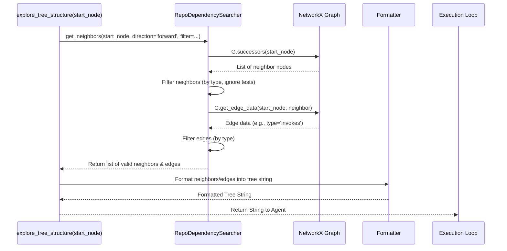

# Chapter 6: Graph Search & Traversal

Welcome back! In [Chapter 5: Function Calling & Action Parsing](05_function_calling___action_parsing_.md), we learned how the LocAgent's LLM brain communicates its intentions – specifically, how it requests to use one of its available [Location Tools (Agent Skills)](04_location_tools__agent_skills__.md). We saw how a thought like "Explore the connections around this function" gets translated into an action for the system to execute.

But what happens next? When the agent asks to explore the connections around a function using a tool like `explore_tree_structure`, how does the system actually *navigate* the complex map of the codebase – the [Dependency Graph Representation](02_dependency_graph_representation_.md) we learned about in Chapter 2?

This is where **Graph Search & Traversal** comes in. Think of it as the GPS navigation system for our codebase map. It provides the mechanisms to:

1.  **Search:** Pinpoint specific locations (like finding a function by its name).
2.  **Traverse:** Follow the roads and pathways (connections like 'calls' or 'imports') between locations.

Without these mechanisms, the agent would have a map but no way to effectively use it to find routes or understand how different parts of the city (codebase) are linked.

## Why Do We Need Graph Search & Traversal?

Imagine our recurring bug report: "The 'Save' button doesn't work on the profile page."

Let's say the agent, using the skills from Chapter 4, has already used `search_code_snippets` and identified a promising function: `user_profile.py:handle_profile_save`.

Now, the agent needs to understand this function in context to figure out the bug. Its internal reasoning might be:

*   "Where does the instruction to save the profile actually come from? What part of the user interface calls `handle_profile_save`?"
*   "What does `handle_profile_save` do next? Does it call another function to interact with the database?"
*   "Is this function defined inside a specific class I should know about?"

Answering these questions requires more than just knowing the function exists. It requires navigating the connections *around* this function in the Dependency Graph. This ability to follow connections allows the agent to perform **multi-hop reasoning** – linking together multiple pieces of information across the codebase to understand the flow of logic or data. Graph Search & Traversal provides the engine for this navigation.

## Key Concepts: Searching vs. Traversing the Map

Our codebase map (the Dependency Graph) consists of locations (**Nodes**) and roads connecting them (**Edges**).

*   **Nodes:** Code entities like Files, Classes, Functions.
*   **Edges:** Relationships like `contains`, `imports`, `invokes` (calls), `inherits`.

Graph Search & Traversal uses two main techniques to interact with this map:

**1. Search (Finding Specific Nodes):**

*   **Analogy:** Using a search bar on a map app to find a specific address or landmark (e.g., "Eiffel Tower" or "123 Main St").
*   **What it does:** Locates specific nodes in the graph based on criteria like their name (e.g., `handle_profile_save`), type (e.g., find all 'class' nodes), or other properties.
*   **LocAgent Component:** This is primarily handled by the `RepoEntitySearcher` class. Given a name or criteria, it looks through the graph's nodes and returns the matching ones.

**2. Traversal (Following Connections / Edges):**

*   **Analogy:** Asking the map app for directions ("Show me the route from my location to the Eiffel Tower") or exploring ("Show me all the restaurants within two blocks of here").
*   **What it does:** Starts at one or more nodes and follows the connecting edges (relationships) to discover neighboring nodes. This can be done:
    *   **Directionally:** Following the flow (`downstream` - what does this function call?) or tracing back (`upstream` - what calls this function?).
    *   **With Filters:** Only following specific types of roads (e.g., only `invokes` edges) or visiting specific types of places (e.g., only 'function' nodes).
    *   **Limited by Hops:** Only traveling a certain number of steps (e.g., only show things directly connected, or things connected within 2 steps/hops).
*   **LocAgent Component:** This is primarily handled by the `RepoDependencySearcher` class. Given starting nodes and traversal rules (direction, filters, hops), it explores the graph and returns the discovered paths or neighboring nodes.

These two concepts work together. You might first *search* to find a starting point, and then *traverse* from there to understand its surroundings.

## Solving the Use Case: Exploring `handle_profile_save`

Let's see how the agent uses skills that rely on graph search and traversal to investigate `user_profile.py:handle_profile_save`.

**Goal 1: Find what calls `handle_profile_save` (Upstream Traversal)**

The agent wants to know where the request originates. It uses the `explore_tree_structure` tool (Chapter 4):

*   **Agent Request:** `explore_tree_structure(start_entities=['user_profile.py:handle_profile_save'], direction='upstream', dependency_type_filter=['invokes'], traversal_depth=1)`
*   **Behind the Scenes:** The `explore_tree_structure` tool uses `RepoDependencySearcher`.
    *   `RepoDependencySearcher` starts at the `handle_profile_save` node.
    *   It looks *backwards* (`upstream`) along edges.
    *   It only considers edges of type `invokes`.
    *   It only goes *one step* (`traversal_depth=1`).
*   **Conceptual Output (formatted by the tool):**
    ```
    user_profile.py:handle_profile_save
    └── invokes-by ── user_interface.py:on_save_button_click
    ```
    *(This tells the agent that `on_save_button_click` calls `handle_profile_save`)*

**Goal 2: Find what `handle_profile_save` calls (Downstream Traversal)**

The agent wants to know the next step in the saving process. It uses `explore_tree_structure` again:

*   **Agent Request:** `explore_tree_structure(start_entities=['user_profile.py:handle_profile_save'], direction='downstream', dependency_type_filter=['invokes'], traversal_depth=1)`
*   **Behind the Scenes:** The `explore_tree_structure` tool uses `RepoDependencySearcher`.
    *   `RepoDependencySearcher` starts at `handle_profile_save`.
    *   It looks *forwards* (`downstream`) along edges.
    *   It only considers `invokes` edges.
    *   It only goes *one step*.
*   **Conceptual Output:**
    ```
    user_profile.py:handle_profile_save
    └── invokes ── database_utils.py:save_to_database
    └── invokes ── logging_utils.py:log_event
    ```
    *(This tells the agent that `handle_profile_save` calls `save_to_database` and `log_event`)*

**Goal 3: Get details about the `handle_profile_save` node itself (Search)**

The agent might want to confirm node details or get its code snippet again. It could use `search_code_snippets` (Chapter 4):

*   **Agent Request:** `search_code_snippets(search_terms=['user_profile.py:handle_profile_save'])`
*   **Behind the Scenes:** The `search_code_snippets` tool uses `RepoEntitySearcher`.
    *   `RepoEntitySearcher` looks for a node with the exact name `user_profile.py:handle_profile_save`.
    *   It retrieves the data associated with that node (like its type, code snippet, line numbers).
*   **Conceptual Output (formatted):**
    ```
    ## Searching for term "user_profile.py:handle_profile_save"...
    ### Search Result:
    Function: `user_profile.py:handle_profile_save` (Complete Code)
        ```python
        # user_profile.py
        L15: def handle_profile_save(user_id, data):
        # ... (code)
        ```
     Source: Exact match found for entity name `user_profile.py:handle_profile_save`.
    ```

By combining Search and Traversal, the agent builds a much richer understanding of the code's structure and flow around points of interest.

## Under the Hood: How Search & Traversal Work

The core logic for navigating the graph resides in `dependency_graph/traverse_graph.py`. This file contains the key helper classes `RepoEntitySearcher` and `RepoDependencySearcher`.

**High-Level Walkthrough:**

When an agent skill like `explore_tree_structure` or `search_code_snippets` needs to interact with the graph:

1.  **Get Graph:** It retrieves the pre-built `networkx.MultiDiGraph` object (the map, created in [Chapter 3](03_graph_building_process_.md)).
2.  **Instantiate Searcher/Traverser:** It creates an instance of `RepoEntitySearcher` (for finding nodes) or `RepoDependencySearcher` (for exploring connections), passing the graph object to it.
3.  **Execute Query:** It calls methods on the searcher/traverser object (e.g., `get_neighbors`, `has_node`, `get_node_data`).
4.  **NetworkX Interaction:** The searcher/traverser methods use functions provided by the `networkx` library to query the graph structure (e.g., `G.nodes()`, `G.edges()`, `G.successors(node)`, `G.predecessors(node)`).
5.  **Filter & Collect:** It filters the results based on the request (node types, edge types, hops).
6.  **Format & Return:** The results (list of nodes, edges, or data) are returned to the agent skill, which then formats them into a text string for the LLM agent to read.

**Sequence Diagram Example (Traversal):**

Let's visualize a simplified `explore_tree_structure` call asking for downstream neighbours:


This shows the tool delegating the graph navigation logic to `RepoDependencySearcher`, which in turn uses the underlying `networkx` graph object to find connections.

**Code Glimpse (`dependency_graph/traverse_graph.py`):**

Let's look at simplified versions of the core classes.

**1. `RepoEntitySearcher` (Finding Nodes):**

This class helps find nodes and get their data.

```python
# --- Simplified from `dependency_graph/traverse_graph.py` ---
import networkx as nx

class RepoEntitySearcher:
    """Retrieve Entity IDs and Code Snippets from Repository Graph"""

    def __init__(self, graph: nx.MultiDiGraph):
        self.G = graph # Stores the graph object

    def has_node(self, node_id: str) -> bool:
        """Checks if a node with the given ID exists in the graph."""
        return node_id in self.G

    def get_node_data(self, node_ids: List[str], return_code_content=False):
        """Retrieves data associated with a list of node IDs."""
        rtn = []
        for nid in node_ids:
            if nid not in self.G: continue

            node_data = self.G.nodes[nid] # Get data from networkx node
            formatted_data = {
                'node_id': nid,
                'type': node_data.get('type', 'unknown'),
                # Optionally add code, line numbers etc.
            }
            if return_code_content and 'code' in node_data:
                formatted_data['code_content'] = node_data['code']
                # ... add formatting for line numbers ...
            rtn.append(formatted_data)
        return rtn
```
**Explanation:** This class takes the `networkx` graph (`self.G`) when created. The `has_node` method simply checks if a key exists in the graph's node dictionary. `get_node_data` iterates through requested IDs, accesses the data stored on each node using `self.G.nodes[nid]`, and formats it into a dictionary.

**2. `RepoDependencySearcher` (Following Edges):**

This class helps explore connections by finding neighbors.

```python
# --- Simplified from `dependency_graph/traverse_graph.py` ---
import networkx as nx

class RepoDependencySearcher:
    """Traverse Repository Graph"""

    def __init__(self, graph: nx.MultiDiGraph):
        self.G = graph

    def get_neighbors(self, node_id: str, direction='forward',
                      ntype_filter=None, etype_filter=None):
        """Finds neighbors connected to node_id based on direction and filters."""
        nodes, edges = [], []
        neighbors_iterator = None

        if direction == 'forward':
            neighbors_iterator = self.G.successors(node_id) # Nodes pointed *to*
        elif direction == 'backward':
            neighbors_iterator = self.G.predecessors(node_id) # Nodes pointing *from*
        else: # Handle 'both' or error case
            return [], []

        for neighbor_node in neighbors_iterator:
            # --- Filtering logic ---
            # Check neighbor node type if ntype_filter is provided
            neighbor_data = self.G.nodes[neighbor_node]
            if ntype_filter and neighbor_data.get('type') not in ntype_filter:
                continue
            # (Simplified: other checks like ignoring test files omitted)

            # --- Check edge type ---
            # Determine edge direction for accessing edge data
            u, v = (node_id, neighbor_node) if direction == 'forward' else (neighbor_node, node_id)
            if not self.G.has_edge(u, v): continue

            edge_data_dict = self.G.get_edge_data(u, v) # Can be multiple edges
            for key, edge_data in edge_data_dict.items():
                 edge_type = edge_data.get('type')
                 # Check edge type if etype_filter is provided
                 if etype_filter and edge_type not in etype_filter:
                     continue

                 # If all filters pass, add the neighbor and edge
                 nodes.append(neighbor_node)
                 edges.append((u, v, {'type': edge_type})) # Store relevant edge info
                 break # Often only need one edge type match per neighbor pair

        return list(set(nodes)), edges # Return unique nodes and found edges
```
**Explanation:** This class also holds the graph (`self.G`). The `get_neighbors` method uses `self.G.successors(node_id)` (for `forward`) or `self.G.predecessors(node_id)` (for `backward`) provided by `networkx` to get potential neighbors. It then iterates through them, applying filters based on node type (`ntype_filter`) and edge type (`etype_filter`) by checking the data stored on the nodes and edges within the graph. It collects and returns the neighbors and edges that pass the filters.

**3. Traversal Function (Conceptual):**

Functions like `traverse_tree_structure` or `traverse_graph_structure` use `RepoDependencySearcher` iteratively. Conceptually:

```python
# --- Conceptual idea of how `traverse_...` functions work ---
def traverse_something(start_node, graph, hops, direction, filter):
    searcher = RepoDependencySearcher(graph)
    visited_nodes = set()
    queue = [(start_node, 0)] # Node and current hop level
    results = [] # Store found nodes/edges

    while queue:
        current_node, current_hop = queue.pop(0) # Use BFS approach

        if current_node in visited_nodes or current_hop >= hops:
            continue
        visited_nodes.add(current_node)
        results.append(current_node) # Or add edge info

        # Find neighbors for the next level
        neighbors, edges = searcher.get_neighbors(current_node, direction, filter)

        for neighbor in neighbors:
            if neighbor not in visited_nodes:
                queue.append((neighbor, current_hop + 1))
                # Optionally store edge info connecting current_node and neighbor

    # Format results (e.g., as a tree string, list of edges, etc.)
    formatted_output = format_results(results)
    return formatted_output
```
**Explanation:** This shows a simplified Breadth-First Search (BFS). It starts with the `start_node` and uses `RepoDependencySearcher.get_neighbors` to find connected nodes. It keeps track of `visited_nodes` and the current `hop` level to avoid infinite loops and respect the `hops` limit. It continues exploring level by level until the queue is empty or the maximum hop count is reached. Finally, it formats the collected information. The actual implementation in `traverse_graph.py` is more complex to handle various formatting options and edge cases.

## Conclusion

Graph Search & Traversal are the fundamental mechanisms that allow LocAgent to navigate and query the Dependency Graph effectively. Using helper classes like `RepoEntitySearcher` to find specific code entities (nodes) and `RepoDependencySearcher` to explore their connections (edges), the agent can perform multi-hop reasoning and build a deep understanding of the codebase structure relevant to its task. These capabilities turn the static map of the Dependency Graph into a dynamic tool for investigation.

While the graph tells us about the structure and connections *between* code entities (files, functions, classes), sometimes the agent needs to find relevant code *inside* these entities based on keywords or semantic meaning, especially when the exact function or class name isn't known. How does LocAgent efficiently search the *content* of the code?

Let's delve into that in the next chapter: [Chapter 7: Code Indexing & Retrieval](07_code_indexing___retrieval_.md).

---

Generated by [AI Codebase Knowledge Builder](https://github.com/The-Pocket/Tutorial-Codebase-Knowledge)