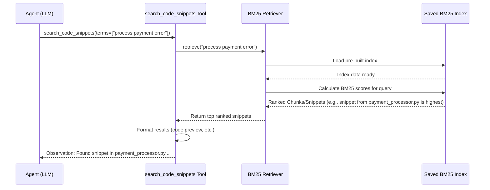

# Chapter 7: Code Indexing & Retrieval

Welcome back! In [Chapter 6: Graph Search & Traversal](06_graph_search___traversal_.md), we learned how LocAgent uses the [Dependency Graph Representation](02_dependency_graph_representation_.md) like a map to navigate the structure of the codebase. It can follow connections like function calls (`invokes`) or imports to understand how different parts relate.

But what if you don't know the exact function name or file path? What if you only remember a specific piece of text *inside* the code, like an error message or a comment? Or what if you want to find code that *sounds* similar to a description, even if the names don't match exactly?

The graph map is great for understanding structure, but it doesn't directly help you search the *content* written inside the buildings (files) and rooms (functions) on the map. For that, LocAgent needs a different kind of tool: **Code Indexing & Retrieval**.

## What's the Problem? Finding Code by Content

Let's imagine a user reports a bug with a very specific error message: "Error: Could not process payment. Please try again later." The user doesn't know which file or function causes this.

Using only the graph map (Chapter 6), how would the agent find this? It could try searching the graph nodes for names like "payment" or "error," but the actual error message string might be hidden deep inside a function's code, not reflected in its name or the graph structure.

This is where searching the *content* becomes essential. We need a way to quickly look through all the text within the code files to find that specific error message string.

## What is Code Indexing & Retrieval?

Think of **Code Indexing & Retrieval** like the **index at the back of a textbook** or a **search engine for your codebase**.

1.  **Indexing (Building the Index):** Before you can quickly search a book's index, someone has to read the book and carefully list all the important keywords and the pages they appear on. Similarly, LocAgent processes the codebase *once* (usually beforehand) to build a special search index.
    *   This index stores information about which keywords appear in which code snippets (files, functions, or even smaller code chunks).
    *   It might keep track of how often keywords appear and where, which helps determine relevance later.

2.  **Retrieval (Using the Index):** When you look up a keyword in the back of the book, you quickly find the page numbers. Similarly, when the agent needs to find code containing specific keywords (like `"Could not process payment"`), it uses the pre-built index.
    *   The index allows for a very fast lookup, much quicker than reading every file from scratch each time.
    *   It returns a list of code snippets that are most relevant to the keywords.

**Key Techniques Used by LocAgent:**

*   **BM25 (Best Matching 25):** This is a popular algorithm for keyword-based search, similar to how search engines work. It looks at:
    *   Which documents (code snippets) contain the search keywords.
    *   How often the keywords appear in each snippet (more occurrences might mean more relevance).
    *   How common or rare the keywords are across the entire codebase (rare keywords are often more important).
    It ranks the code snippets based on these factors to find the "best matches". It's like the book index telling you the *most important* pages for a keyword first.

*   **Fuzzy Matching (Optional/Complementary):** Sometimes you might misspell a keyword or search for something phrased slightly differently than how it appears in the code. Fuzzy matching helps find results that are *similar* but not identical to your search query. It's like the search engine suggesting results even if you have a typo.

## How it Complements Graph Search

Graph Search (Chapter 6) and Code Indexing & Retrieval work together beautifully:

*   **Graph Search:** Excellent for understanding **structure and relationships**. (e.g., "What functions call this one?", "Where is this class defined?")
*   **Code Indexing:** Excellent for searching based on **content and keywords**. (e.g., "Find code containing this error message.", "Where is the comment `# TODO: Refactor this`?")

The LocAgent often uses both. It might start with a keyword search (using the index) to find a few potential code snippets, and *then* use graph traversal to explore the connections around those snippets to understand their context.

## Solving the Use Case: Finding the Error Message

Let's go back to our error message: "Error: Could not process payment. Please try again later."

1.  **Agent Thought:** "I need to find where this exact error message string appears in the code."
2.  **Agent Action Request:** Using the skills from [Chapter 4: Location Tools (Agent Skills)](04_location_tools__agent_skills_.md), the agent requests to use `search_code_snippets`. It's important that the search phrase is specific.
    *   Request: `search_code_snippets(search_terms=["Could not process payment"])` (We use a key part of the phrase)
3.  **Behind the Scenes (Code Indexing & Retrieval):**
    *   The `search_code_snippets` tool receives the request.
    *   It passes the keywords `"Could not process payment"` to the **Code Retriever** component.
    *   The Code Retriever uses its pre-built **BM25 index** to look up these keywords.
    *   The index quickly returns a ranked list of code snippets containing these words.
4.  **Tool Result (Observation for Agent):** The tool formats the top results for the agent.
    ```text
    ## Searching for term "Could not process payment"...
    ### Search Result:
    Function: `payment_processor.py:process_transaction` (Preview)
        ```python
        # payment_processor.py
        L85:     try:
        L86:         # ... attempt payment logic ...
        L87:         if not success:
        L88:             logger.error("Failed to process payment.")
        L89:             raise PaymentError("Error: Could not process payment. Please try again later.") # <-- Found!
        L90:     except Exception as e:
        L91:         # ... handle other exceptions ...
        ```
     Source: Retrieved code content using keyword search (bm25).

    File: `billing_service.py` (Folded)
        Path: billing_service.py
        (Hint: Search `billing_service.py` for full content if needed)
        Source: Retrieved entity using keyword search (bm25). Contains related terms.
    ```
5.  **Agent Thought:** "Great! Line 89 in `payment_processor.py:process_transaction` seems to be the exact place where the error is raised. Now I can investigate this function further using graph traversal tools."

This shows how Code Indexing allowed the agent to jump directly to the relevant code content, even without knowing the function or file name beforehand.

## Under the Hood: Building and Using the Index

How does LocAgent build and use this search index?

**1. Building the Index (Preparation Phase):**

*   **Scanning:** LocAgent reads through the source code files.
*   **Chunking:** It breaks down the code into smaller, manageable pieces (chunks). This could be whole functions, classes, or even smaller logical blocks of code. This is done by the `EpicSplitter` in `repo_index/index/epic_split.py`.
*   **Indexing:** It uses a library (like `llama-index`'s BM25 implementation) to process these chunks. For each chunk, it notes down the keywords present and stores this information efficiently in an index file. This process involves steps like removing common words ("the", "is", "a"), stemming words (reducing "processing" to "process"), and counting term frequencies.
*   **Saving:** This index is saved to disk so it doesn't need to be rebuilt every time. LocAgent uses `plugins/location_tools/retriever/bm25_retriever.py` to manage this process (specifically functions like `build_code_retriever_from_repo` and `build_retriever_from_persist_dir`).

**2. Retrieving from the Index (When `search_code_snippets` is called):**

*   **Tool Receives Query:** The `search_code_snippets` function gets the search terms from the agent.
*   **Load Index:** It loads the pre-built BM25 index from disk using a retriever object (e.g., `BM25Retriever`).
*   **Query Index:** It passes the search terms to the retriever's `retrieve` method.
*   **Ranked Results:** The retriever uses the index to calculate BM25 scores for all the indexed chunks based on the query terms. It returns a ranked list of the most relevant chunk IDs and their content/metadata.
*   **Format Output:** The `search_code_snippets` tool formats these results (code previews, file names) into text for the agent.

**Simplified Sequence Diagram (Retrieval):**


This shows the tool calling the retriever, which interacts with the saved index to find and rank relevant code snippets based on the agent's keywords.

**Code Glimpse (Conceptual):**

Let's look at simplified concepts from `plugins/location_tools/retriever/bm25_retriever.py`.

**1. Building/Loading the Retriever (Conceptual):**

This happens during setup or when needed.

```python
# --- Simplified concept from bm25_retriever.py ---
from llama_index.retrievers.bm25 import BM25Retriever
from llama_index.core.node_parser import SimpleFileNodeParser
from llama_index.core import Document     # Used to represent code chunks
import os

BM25_INDEX_DIR = "path/to/saved/indexes" # Where indexes are stored

def load_or_build_retriever(instance_id: str, repo_path: str, similarity_top_k: int = 10):
    """Loads a BM25 retriever from disk, or builds it if it doesn't exist."""
    persist_path = os.path.join(BM25_INDEX_DIR, instance_id)

    if os.path.exists(persist_path):
        # Load existing index if available
        print(f"Loading BM25 index from: {persist_path}")
        retriever = BM25Retriever.from_persist_dir(persist_path)
        # Update top_k if needed
        retriever._similarity_top_k = similarity_top_k
        return retriever
    else:
        # --- Build Index (Simplified) ---
        print(f"Building BM25 index for {instance_id}...")
        # 1. Read code files (using SimpleDirectoryReader or similar)
        # docs = read_code_files(repo_path) # Returns list of Document objects

        # 2. Split code into chunks (using EpicSplitter or similar)
        # splitter = EpicSplitter(...)
        # nodes = splitter.get_nodes_from_documents(docs) # Returns list of Node objects

        # 3. Create BM25 Retriever from chunks
        retriever = BM25Retriever.from_defaults(
            nodes=nodes,  # Pass the code chunks (nodes)
            similarity_top_k=similarity_top_k
        )

        # 4. Save the index for next time
        retriever.persist(persist_path)
        print(f"Saved BM25 index to: {persist_path}")
        return retriever

# Example internal usage when a tool needs the retriever:
# retriever = load_or_build_retriever("my_project_issue_1", "/path/to/repo")
```
**Explanation:** This conceptual code shows how LocAgent might first check if a pre-built index exists for the specific project/issue (`persist_path`). If it does, it loads it quickly using `BM25Retriever.from_persist_dir`. If not, it goes through the steps of reading code, splitting it into manageable `nodes` (chunks), creating a new `BM25Retriever` from these nodes, and saving (`persist`) the index back to disk.

**2. Retrieving Snippets (Conceptual):**

This happens inside tools like `search_code_snippets`.

```python
# --- Simplified concept from repo_ops.py calling the retriever ---
# Assume 'retriever' is the loaded BM25Retriever object from above

def bm25_content_retrieve(query_info, include_files=None, similarity_top_k=10):
    """Uses the BM25 retriever to find relevant code snippets."""
    query = query_info.term # Get the keyword(s) from the agent's request
    instance_id = get_current_issue_id() # Get ID for loading correct index
    repo_path = get_repo_save_dir() # Get path to code

    # Get the retriever (loads or builds index if needed)
    retriever = load_or_build_retriever(instance_id, repo_path, similarity_top_k)

    try:
        # Use the retriever to find relevant nodes (code chunks)
        retrieved_nodes = retriever.retrieve(query) # The core BM25 search happens here!
    except Exception as e:
        print(f"BM25 retrieval failed for query '{query}': {e}")
        return [] # Return empty list on error

    # Process the results (simplified)
    results = []
    for node_with_score in retrieved_nodes:
        node = node_with_score.node # The actual code chunk node
        score = node_with_score.score
        metadata = node.metadata # Info like file path, line numbers

        # Optional: Filter based on 'include_files' list
        if include_files and metadata.get('file_path') not in include_files:
            continue

        # Package the result (more complex formatting happens in the tool)
        results.append({
            'file': metadata.get('file_path'),
            'start': metadata.get('start_line'),
            'end': metadata.get('end_line'),
            'content_preview': node.get_content()[:100] + "...", # Show a preview
            'score': score
        })
        print(f"Found relevant snippet in {metadata.get('file_path')} (Score: {score:.2f})")

    return results # Return list of found snippets

# Example usage within a tool:
# query = QueryInfo(term="Could not process payment")
# snippets = bm25_content_retrieve(query)
# formatted_output = format_results_for_llm(snippets) # Tool formats this
```
**Explanation:** This function takes the search `query`. It ensures the correct BM25 `retriever` is loaded (or built). The key step is `retriever.retrieve(query)`, which performs the actual BM25 search using the pre-built index and returns a list of `retrieved_nodes` ranked by relevance. The code then iterates through these results, potentially filters them by filename (`include_files`), and gathers the necessary information (file path, line numbers, code preview) to return back to the calling tool (`search_code_snippets`), which will format it nicely for the LLM agent.

## Conclusion

Code Indexing & Retrieval is a vital part of LocAgent's ability to understand a codebase. While the [Dependency Graph Representation](02_dependency_graph_representation_.md) provides the structural map, Code Indexing provides the keyword search capability, like a search engine or a book's index for the *content* within the code. Using techniques like BM25, it allows the agent to quickly find relevant code snippets based on keywords, error messages, or comments, even when the exact location or name is unknown. This complements graph search and enables more flexible and powerful code investigation.

We've now covered how LocAgent represents the code (Graph), builds the graph, uses tools (Skills), communicates intent (Function Calling), navigates the graph (Traversal), and searches code content (Indexing). The final piece of the puzzle is understanding how we measure LocAgent's performance. How do we know if it's actually finding the *correct* code locations?

Let's explore how LocAgent is tested and evaluated in the final chapter: [Chapter 8: Evaluation Framework](08_evaluation_framework_.md).

---

Generated by [AI Codebase Knowledge Builder](https://github.com/The-Pocket/Tutorial-Codebase-Knowledge)