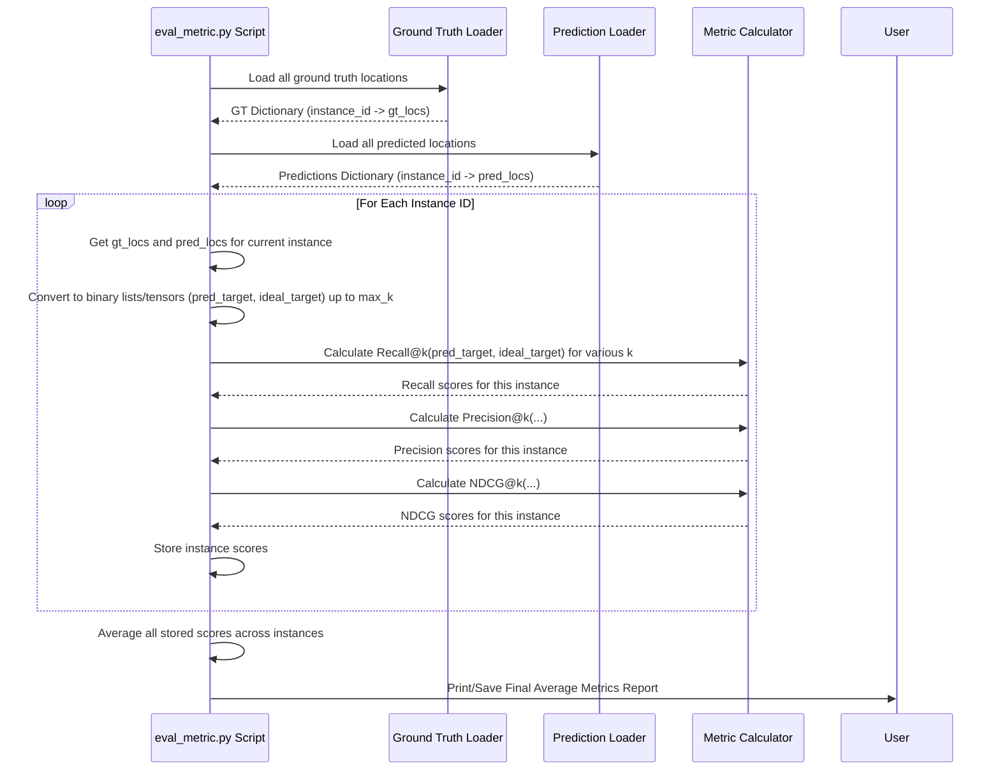

# Chapter 8: Evaluation Framework

Welcome to the final chapter! In [Chapter 7: Code Indexing & Retrieval](07_code_indexing___retrieval_.md), we saw how LocAgent can search through the *content* of the code using techniques like BM25, complementing its ability to navigate the code's structure using the [Dependency Graph Representation](02_dependency_graph_representation_.md).

Now that we understand all the core components of LocAgent – the [Agent Execution Loop](01_agent_execution_loop_.md), the [Graph Building Process](03_graph_building_process_.md), the [Location Tools (Agent Skills)](04_location_tools__agent_skills_.md), [Function Calling & Action Parsing](05_function_calling___action_parsing_.md), [Graph Search & Traversal](06_graph_search___traversal_.md), and Code Indexing – there's one last crucial question: **How do we know if LocAgent is actually doing a good job?**

Imagine LocAgent processes a bug report like "The save button on the profile page is broken" and suggests a list of 10 functions it thinks might be related. Are these good suggestions? Did it find the *correct* functions? How does its performance compare if we change the underlying LLM or modify its tools?

This is where the **Evaluation Framework** comes in. It's like the quality control department for LocAgent. Its job is to rigorously measure how well LocAgent performs its main task: finding the correct code locations related to a given problem description.

## Why Evaluate? The Need for Measurement

Without evaluation, we're flying blind. We wouldn't know if changes we make to LocAgent are making it better or worse. We need objective numbers to:

*   **Assess Performance:** How accurate is LocAgent? Does it find the right needle in the codebase haystack?
*   **Compare Approaches:** Is using GPT-4 better than using Claude? Does adding a new tool improve results?
*   **Identify Weaknesses:** Does LocAgent struggle with certain types of problems or specific codebases?

The Evaluation Framework provides the tools and methods to answer these questions using concrete data.

## Key Concepts: Grading LocAgent's Homework

To evaluate LocAgent, we need a few key ingredients, similar to how a teacher grades homework:

**1. The Problem (The Assignment):**
This is the input given to LocAgent, typically a bug report or feature request (like "Fix the save button"). We usually use standard benchmarks like SWE-bench, which contain many such problems.

**2. Ground Truth (The Answer Key):**
For each problem, we need to know the *actual*, correct answer. In code localization, this means knowing the exact files, functions, or classes that were modified by human developers to fix the bug or implement the feature described in the problem statement. This information often comes from the project's version control history (like Git commits). We call this the **oracle** or **ground truth**.

**3. LocAgent's Prediction (The Student's Answers):**
This is the output produced by LocAgent when given the problem. It's typically a *ranked list* of code locations (files, functions, classes) that LocAgent believes are relevant, ordered from most likely to least likely.

**4. Metrics (The Grading Rubric):**
These are specific mathematical formulas used to compare LocAgent's predictions against the ground truth answer key. They give us quantitative scores to measure performance. LocAgent uses standard information retrieval metrics, often focusing on the top *k* predictions (where *k* is a number like 1, 5, or 10):

*   **Recall@k:** "Out of all the *correct* locations in the ground truth, what fraction did LocAgent find within its top *k* predictions?"
    *   **Analogy:** If the answer key has 3 correct functions, and the student listed 2 of them in their top 5 answers, the Recall@5 is 2/3.
    *   **High Recall@k is good:** It means LocAgent is finding most of the relevant items.

*   **Precision@k:** "Out of the top *k* locations LocAgent suggested, what fraction were actually correct (i.e., present in the ground truth)?"
    *   **Analogy:** If the student listed 5 answers, but only 2 of them were actually correct, the Precision@5 is 2/5.
    *   **High Precision@k is good:** It means the top suggestions made by LocAgent are likely to be useful and not just random guesses.

*   **NDCG@k (Normalized Discounted Cumulative Gain):** This is a slightly more complex metric that considers the *ranking* of the results. Finding a correct answer at rank #1 is better than finding it at rank #5. It gives higher scores if the *most relevant* items appear *higher* in LocAgent's predicted list.
    *   **Analogy:** A student gets more points for putting the most important answer first, rather than burying it later in their list.
    *   **High NDCG@k is good:** It means LocAgent not only finds the correct locations but also ranks them appropriately.

**The 'k' Value:** The 'k' in @k specifies how many of LocAgent's top predictions we look at. We often calculate metrics for several k values (e.g., k=1, k=5, k=10) to get a fuller picture. For example, Recall@1 tells us if the single most confident prediction was correct, while Recall@10 tells us if the correct answers were found anywhere within the top 10 suggestions.

## Using the Framework: An Example

Let's revisit our "Save button broken" example.

*   **Problem:** "Fix the save button on the profile page."
*   **Ground Truth:** Assume the human developer fixed this by modifying only one function: `user_profile.py:handle_save`. So, `GT = ['user_profile.py:handle_save']`.
*   **LocAgent's Prediction (Top 3):** LocAgent runs and predicts the following ranked list:
    1.  `user_profile.py:handle_save`
    2.  `ui_framework.py:render_button`
    3.  `db_utils.py:update_user_record`
    So, `Pred = ['user_profile.py:handle_save', 'ui_framework.py:render_button', 'db_utils.py:update_user_record']`.

Now, let's calculate some metrics:

*   **Recall@1:**
    *   Correct locations in GT: 1 (`handle_save`)
    *   Correct locations found in Pred@1: 1 (`handle_save`)
    *   Recall@1 = 1 / 1 = 1.0 (or 100%)

*   **Precision@1:**
    *   Locations predicted @1: 1 (`handle_save`)
    *   Correct locations in Pred@1: 1 (`handle_save`)
    *   Precision@1 = 1 / 1 = 1.0 (or 100%)

*   **Recall@3:**
    *   Correct locations in GT: 1 (`handle_save`)
    *   Correct locations found in Pred@3: 1 (`handle_save`)
    *   Recall@3 = 1 / 1 = 1.0 (or 100%)

*   **Precision@3:**
    *   Locations predicted @3: 3 (`handle_save`, `render_button`, `update_user_record`)
    *   Correct locations in Pred@3: 1 (`handle_save`)
    *   Precision@3 = 1 / 3 ≈ 0.33 (or 33%)

**Interpretation:**
*   The perfect Recall@1 and Precision@1 tell us LocAgent's top suggestion was spot-on.
*   The perfect Recall@3 means it found all the necessary ground truth locations within its top 3.
*   The lower Precision@3 tells us that while it found the correct one, its other top suggestions weren't relevant for this specific fix.

By running LocAgent on many such problems from a benchmark and averaging these metrics, we get an overall score of its performance.

## Under the Hood: Calculating the Metrics

The evaluation logic is primarily located in the `evaluation/eval_metric.py` script. Here's a simplified walkthrough of what happens when you run an evaluation:

1.  **Load Ground Truth:** The script loads the "answer key" for all the problems in the benchmark. This usually comes from a pre-processed file (like `gt_location.jsonl` generated by scripts in `util/benchmark/`, e.g., `gen_oracle_locations.py`) which lists the correct files/modules/functions for each instance ID (problem).
2.  **Load Predictions:** The script loads LocAgent's results (the "student's answers"). This is typically the output JSONL file generated by running `auto_search_main.py` (covered in [Chapter 1](01_agent_execution_loop_.md)) over the benchmark dataset. This file contains the ranked lists of predicted locations for each instance ID.
3.  **Iterate Through Tasks:** The script goes through each problem (instance ID) one by one.
4.  **Prepare Labels:** For the current problem:
    *   It retrieves the ground truth list (`gt_locs`).
    *   It retrieves LocAgent's predicted list (`pred_locs`), usually truncated to the maximum `k` being considered (e.g., top 100).
    *   It converts these lists into binary vectors (lists of 0s and 1s). For example, if `max_k=5`, `gt_locs=['A', 'C']`, and `pred_locs=['A', 'B', 'D', 'C', 'E']`:
        *   `ideal_target = [1, 0, 1, 0, 0]` (Represents GT: A=1, B=0, C=1, D=0, E=0... up to max_k positions, padding with 0s if GT is shorter)
        *   `pred_target = [1, 0, 0, 1, 0]` (Represents Predictions: A=1, B=0, D=0, C=1, E=0)
    *   These binary lists are often stored in efficient data structures like PyTorch Tensors.
5.  **Calculate Metrics:** Using the binary `pred_target` and `ideal_target` tensors, the script calls functions for each desired metric (Recall@k, Precision@k, NDCG@k) for different values of `k`.
6.  **Aggregate Results:** The metric scores for the current problem are stored. After processing all problems, the script calculates the average score for each metric across the entire benchmark.
7.  **Report:** The final average scores (e.g., average Recall@5, average Precision@10) are reported, often in a table format.

**Simplified Sequence Diagram:**



This diagram illustrates the process of loading data, preparing it for calculation, computing metrics for each task, and finally averaging the results.

**Code Glimpse (`evaluation/eval_metric.py`):**

Let's look at highly simplified snippets to grasp the core concepts.

**1. Loading Data (Conceptual):**

Helper functions load the ground truth and predictions into dictionaries mapping instance IDs to lists of locations.

```python
# --- Simplified concept from evaluation/eval_metric.py ---
from util.utils import load_jsonl
import collections

def load_gt_dict(gt_file, level):
    """Loads ground truth locations for a specific level (file, module, function)."""
    gt_datas = load_jsonl(gt_file)
    gt_dict = {}
    for gt_data in gt_datas:
        # ... logic to extract correct locations based on 'level' ...
        gt_locs = extract_locations_for_level(gt_data, level)
        gt_dict[gt_data['instance_id']] = gt_locs
    return gt_dict

def convert_solutions_dict(pred_file, key):
    """Loads predicted locations from LocAgent's output file."""
    pred_data = load_jsonl(pred_file)
    pred_dict = {}
    for elem in pred_data:
        # 'key' might be 'found_files', 'found_modules', 'found_entities'
        pred_dict[elem['instance_id']] = elem.get(key, [])
    return pred_dict

# --- Usage Example ---
# gt_locations = load_gt_dict("path/to/gt_location.jsonl", level='function')
# predicted_locations = convert_solutions_dict("path/to/loc_outputs.jsonl", key='found_entities')
```
**Explanation:** These functions read the JSONL files containing the ground truth answers and LocAgent's predictions, organizing them into dictionaries for easy lookup by `instance_id`. `load_gt_dict` needs to know the granularity (`level`) being evaluated (file, module, or function).

**2. Calculating Metrics (Conceptual Core):**

The main evaluation function iterates through instances and calls specific metric functions.

```python
# --- Simplified concept from evaluation/eval_metric.py ---
import torch # PyTorch is used for efficient tensor operations

def cal_metrics_w_file(gt_dict, pred_dict, k_values, metrics_to_calc):
    """Calculates metrics by comparing prediction and ground truth dictionaries."""
    _gt_labels = []  # List to store ground truth binary vectors
    _pred_labels = [] # List to store prediction binary vectors
    max_k = max(k_values)

    for instance_id in gt_dict.keys():
        if not gt_dict[instance_id]: continue # Skip if no ground truth

        pred_locs = pred_dict.get(instance_id, [])[:max_k] # Get top-k predictions
        gt_locs = gt_dict[instance_id]

        # Convert lists to binary vectors (0s and 1s) of length max_k
        pred_labels_binary = [0] * max_k
        gt_labels_binary = [0] * max_k
        # Mark positions of correct predictions in pred_labels_binary
        for i, p_loc in enumerate(pred_locs):
            if p_loc in gt_locs:
                pred_labels_binary[i] = 1
        # Mark ground truth positions (simplified for explanation)
        for i in range(min(len(gt_locs), max_k)):
            gt_labels_binary[i] = 1 # Ideal target assumes GT is packed at the start

        _pred_labels.append(pred_labels_binary)
        _gt_labels.append(gt_labels_binary)

    # Convert lists of lists into PyTorch Tensors for efficient calculation
    pred_target_tensor = torch.tensor(_pred_labels)
    ideal_target_tensor = torch.tensor(_gt_labels)

    result = {}
    # Calculate each requested metric for each k
    for metric_name in metrics_to_calc:
        metric_func = METRIC_FUNC[metric_name] # Get the calculation function
        for k in k_values:
            value = metric_func(pred_target_tensor, ideal_target_tensor, k=k)
            result[f'{METRIC_NAME[metric_name]}@{k}'] = round(value.item(), 4)

    return result


# --- Placeholder for metric functions ---
METRIC_FUNC = {'recall': recall_at_k, 'precision': precision_at_k}
METRIC_NAME = {'recall': 'Recall', 'precision': 'P'}

# --- Usage Example ---
# final_scores = cal_metrics_w_file(gt_locations, predicted_locations,
#                                  k_values=[1, 5, 10], metrics_to_calc=['recall', 'precision'])
# print(final_scores)
```
**Explanation:** This function takes the loaded dictionaries. For each instance, it creates binary representations comparing predictions to ground truth up to `max_k`. These binary lists are converted to PyTorch `tensors`. It then calls specific `metric_func` (like `recall_at_k`, `precision_at_k`) for different `k` values using these tensors and aggregates the results.

**3. Example Metric Function (`recall_at_k`):**

Metric functions operate on the binary tensors.

```python
# --- Simplified concept from evaluation/eval_metric.py ---
import torch
from torch import Tensor

def div_no_nan(a: Tensor, b: Tensor) -> Tensor:
    """Helper to divide tensors safely, avoiding division by zero."""
    return (a / b).nan_to_num_(nan=0., posinf=0., neginf=0.)

def recall_at_k(pred_target: Tensor, ideal_target: Tensor, k: int) -> Tensor:
    """Calculates Recall@k."""
    # Consider only the top k predictions
    pred_target_k = pred_target[:, :k]

    # Count relevant items found in top k predictions (sum of 1s per row)
    relevant_found = (pred_target_k == 1).sum(dim=-1)

    # Count total relevant items in ground truth (sum of 1s per row)
    total_relevant = (ideal_target == 1).sum(dim=-1)

    # Calculate recall for each instance: relevant_found / total_relevant
    recall_per_instance = div_no_nan(relevant_found.float(), total_relevant.float())

    # Return the average recall across all instances
    return recall_per_instance.mean()

# --- Usage Example (inside cal_metrics_w_file) ---
# recall_5_score = recall_at_k(pred_target_tensor, ideal_target_tensor, k=5)
```
**Explanation:** This function takes the prediction and ideal target tensors. It first slices them to consider only the first `k` columns (`[:, :k]`). It counts the number of correct predictions (`relevant_found`) and the total number of ground truth items (`total_relevant`) for each row (instance) using `.sum(dim=-1)`. It then calculates the recall for each instance and returns the average recall across all instances using `.mean()`. The `div_no_nan` helper prevents errors if `total_relevant` is zero for an instance.

## Conclusion

The Evaluation Framework is the essential final step in understanding LocAgent's capabilities. By comparing LocAgent's predicted code locations against the known ground truth using standard metrics like Recall@k, Precision@k, and NDCG@k, we can objectively measure its performance. This framework acts as our quality control, enabling us to assess LocAgent's accuracy, compare different configurations, and guide future improvements. Understanding how LocAgent is evaluated gives us confidence in its results and provides a clear path for making it even better at navigating the complexities of large codebases.

Thank you for joining us through this tutorial series on LocAgent! We hope this detailed walkthrough has provided valuable insights into how this intelligent agent tackles the challenge of automated code localization.

---

Generated by [AI Codebase Knowledge Builder](https://github.com/The-Pocket/Tutorial-Codebase-Knowledge)