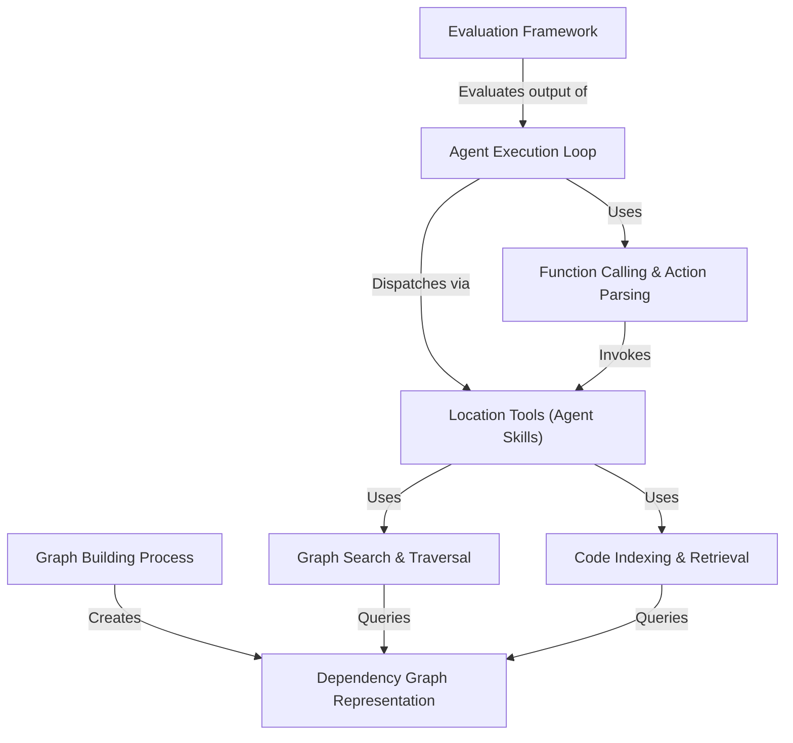

# Tutorial: LocAgent

LocAgent is a system designed for **code localization**, helping users find relevant code locations (files, classes, functions) based on a natural language query or problem description (e.g., a bug report).
It represents the target codebase as a *Dependency Graph* (like a city map of code), allowing an LLM-powered agent to navigate efficiently.
The agent uses specialized *Location Tools* (like searching the map or code content) through a *Function Calling* mechanism, orchestrated by the main *Agent Execution Loop*, until it identifies the most relevant code locations. Performance is measured using an *Evaluation Framework*.

**Source Repository:** [https://github.com/gersteinlab/LocAgent](https://github.com/gersteinlab/LocAgent)

## Chapters

1. [Agent Execution Loop
](01_agent_execution_loop_.md)
2. [Dependency Graph Representation
](02_dependency_graph_representation_.md)
3. [Graph Building Process
](03_graph_building_process_.md)
4. [Location Tools (Agent Skills)
](04_location_tools__agent_skills__.md)
5. [Function Calling & Action Parsing
](05_function_calling___action_parsing_.md)
6. [Graph Search & Traversal
](06_graph_search___traversal_.md)
7. [Code Indexing & Retrieval
](07_code_indexing___retrieval_.md)
8. [Evaluation Framework
](08_evaluation_framework_.md)

---

Generated by [AI Codebase Knowledge Builder](https://github.com/The-Pocket/Tutorial-Codebase-Knowledge)