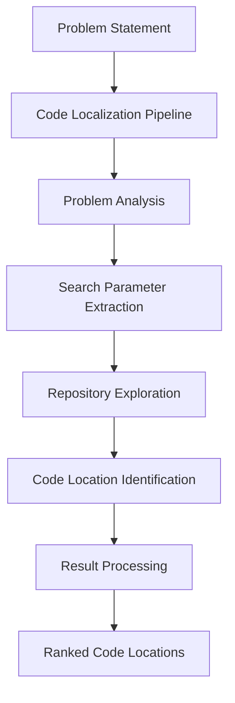
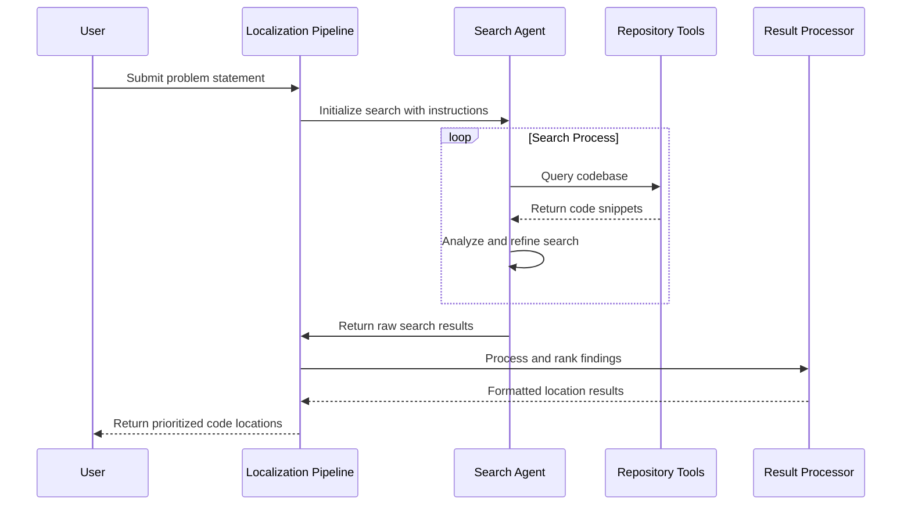

# Chapter 1: Code Localization Pipeline

## Introduction to Code Localization

Imagine you're dropped into a massive foreign city with thousands of streets, buildings, and landmarks. Your task? Find a specific restaurant based only on a vague description: "It's an Italian place near a bridge where the owner's dog often sits in the window." Without help, you could spend days searching.

This is exactly what developers face when trying to locate relevant code in large codebases. A typical problem might be described as: "Users can't upload profile pictures in the mobile app", but where in thousands of files should you start looking?

The **Code Localization Pipeline** solves this problem by acting as your expert tour guide through the codebase. It's the central orchestration engine in LocAgent that:

1. Takes your problem description as input
2. Analyzes what you're looking for
3. Searches through the codebase systematically
4. Points you directly to the relevant files, functions, and code blocks

## Understanding the Pipeline

To understand the Code Localization Pipeline, let's break it down into its key components:



1. **Problem Analysis**: Understanding what the issue is about
2. **Search Parameter Extraction**: Determining keywords and entities to search for
3. **Repository Exploration**: Searching the codebase systematically
4. **Code Location Identification**: Finding specific files, functions, and code lines
5. **Result Processing**: Organizing and ranking the results by relevance

## Basic Usage Example

Let's look at a simple example of how to use the Code Localization Pipeline. Imagine we have a bug report for a package called "photoapp":

```python
# Import necessary modules
import os
import logging
from util.prompts.pipelines import auto_search_prompt
from util.runtime.function_calling import get_tools

# Our bug report
problem_statement = """
Title: Image rotation fails on mobile app

Description: 
Users report that when they try to rotate images in the mobile app,
the app crashes. This only happens with PNG images larger than 5MB.
The feature works fine in the web version.
"""

# Create an instance object
instance = {
    "instance_id": "photoapp_rotation_bug",
    "problem_statement": problem_statement
}
```

Now we can run the pipeline:

```python
# Format the task instruction
task_instruction = auto_search_prompt.TASK_INSTRUECTION.format(
    package_name="photoapp"
)

# Set up search tools
tools = get_tools(
    codeact_enable_search_keyword=True,
    codeact_enable_search_entity=True,
    codeact_enable_tree_structure_traverser=True
)

# Run the localization process
from util.runtime.execute_ipython import auto_search_process

final_output, messages, traj_data = auto_search_process(
    model_name="gpt-4o",
    messages=[{
        "role": "user",
        "content": task_instruction + problem_statement
    }],
    fake_user_msg=auto_search_prompt.FAKE_USER_MSG_FOR_LOC,
    tools=tools
)

# Display the results
print("Localized code areas:")
print(final_output)
```

The output would look something like:

```
Localized code areas:
```
photoapp/mobile/image_processor.py
function: rotate_image
line: 45-67

photoapp/core/file_handler.py
function: process_large_file
line: 120-135

photoapp/utils/image_utils.py
function: validate_image_format
line: 28-36
```
```

These results tell us exactly which files, functions, and lines we should investigate to fix the bug.

## How the Pipeline Works Internally

Let's look under the hood to see how the Code Localization Pipeline works step by step:



The core implementation is in the `auto_search_process` function from the code snippets provided:

```python
def auto_search_process(result_queue, model_name, messages, fake_user_msg, 
                        tools=None, traj_data=None, temp=1.0, 
                        max_iteration_num=20, use_function_calling=True):
    # Initialize parser for handling responses
    parser = ResponseParser()
    
    # Setup trajectory tracking for messages
    if not traj_data:
        traj_msgs = messages.copy()
        prompt_tokens = completion_tokens = 0
    else:
        traj_msgs = traj_data['messages']
        prompt_tokens = traj_data['usage']['prompt_tokens']
        completion_tokens = traj_data['usage']['completion_tokens']
    
    # Begin the iterative search process
    cur_interation_num = 0
    last_message = None
    finish = False
    
    while not finish:
        # Increment iteration counter
        cur_interation_num += 1
        
        # Get response from the model
        response = litellm.completion(
            model=model_name,
            tools=tools,
            messages=messages,
            temperature=temp
        )
        
        # Process the response and take action
        actions = parser.parse(response)
        
        # Handle different action types (simplified)
        for action in actions:
            if action.action_type == ActionType.FINISH:
                # Search complete, return results
                final_output = action.thought
                finish = True
            elif action.action_type == ActionType.RUN_IPYTHON:
                # Execute code search and get results
                function_response = execute_ipython(action.code)
                # Add response to messages for next iteration
                messages.append({
                    "role": "tool",
                    "content": "OBSERVATION:\n" + function_response
                })
            # Other action types...
    
    # Return results
    result_queue.put((final_output, messages, traj_data))
```

This function orchestrates an iterative conversation with an AI model, which:
1. Analyzes the problem statement
2. Generates search queries
3. Executes those queries against the codebase
4. Progressively refines its search until it finds the relevant code locations

## Key Step: Search Parameter Extraction

One of the most important steps is extracting search parameters from the problem description. This is guided by the instructions in `auto_search_prompt.py`:

```python
TASK_INSTRUECTION="""
Given the following GitHub problem description, your objective is to localize 
the specific files, classes or functions, and lines of code that need 
modification or contain key information to resolve the issue.

Follow these steps to localize the issue:
## Step 1: Categorize and Extract Key Problem Information
 - Classify the problem statement into the following categories:
    Problem description, error trace, code to reproduce the bug, 
    and additional context.
 - Identify modules in the '{package_name}' package mentioned in each category.
 - Use extracted keywords and line numbers to search for relevant code 
   references for additional context.
"""
```

The pipeline uses AI to identify key concepts, error messages, function names, and other important details from the problem description.

## Result Processing and Ranking

After exploring the repository, the results need to be processed and ranked by relevance. This is handled by the `merge_sample_locations` function:

```python
def merge_sample_locations(found_files, found_modules, found_entities, 
                          ranking_method='majority'):
    # Rank the locations using the specified method
    ranked_files, file_weights = rank_locs(found_files, ranking_method)
    ranked_modules, module_weights = rank_locs(found_modules, ranking_method)
    ranked_funcs, func_weights = rank_locs(found_entities, ranking_method)
    
    return ranked_files, ranked_modules, ranked_funcs
```

The pipeline supports different ranking methods:
- **Majority voting**: Ranks locations by how frequently they appear in search results
- **MRR (Mean Reciprocal Rank)**: Gives higher weight to locations that appear earlier in search results

## Real-World Analogies

To better understand the Code Localization Pipeline, consider these analogies:

1. **Detective Work**: Like a detective, the pipeline collects clues (keywords) from witness statements (problem descriptions), identifies suspects (potential code locations), follows leads (code dependencies), and narrows down to the most likely culprits.

2. **Medical Diagnosis**: Similar to how a doctor diagnoses illness from symptoms, the pipeline analyzes "symptoms" in the problem statement to identify which parts of the codebase are "sick" and need treatment.

3. **Library Research**: Just as a research librarian helps you find specific books from a vague description, the pipeline helps you find specific code from a vague problem statement.

## Conclusion

The Code Localization Pipeline is the foundation of LocAgent's ability to quickly identify relevant code in large repositories. Instead of spending hours manually searching through files, you can let the pipeline guide you directly to the code that matters.

By automating the search process through a combination of AI analysis, systematic repository exploration, and intelligent result ranking, the pipeline dramatically speeds up the first and often most time-consuming step in solving code issues.

In the next chapter, we'll explore [Code Block Representation](02_code_block_representation_.md), which is crucial for how the pipeline understands and processes code during its search.

---

Generated by [AI Codebase Knowledge Builder](https://github.com/The-Pocket/Tutorial-Codebase-Knowledge)