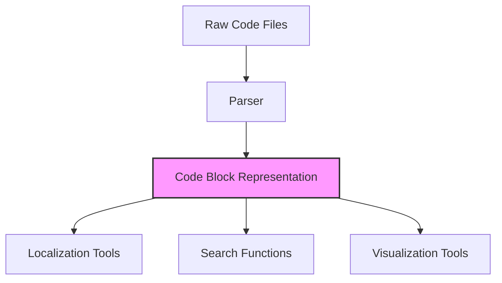
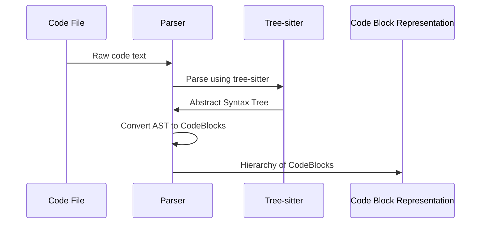

# Chapter 2: Code Block Representation

In the [Code Localization Pipeline](01_code_localization_pipeline_.md), we learned how LocAgent orchestrates the search for relevant code. But how does the system actually understand and model code? That's where Code Block Representation comes in.

## What is Code Block Representation?

Imagine you're an architect trying to understand a massive skyscraper. You wouldn't just wander around randomly - you'd use architectural blueprints that show you:

- All the rooms, hallways, and spaces
- How they connect to each other
- Their names, sizes, and purposes
- The overall hierarchy (which floor contains which rooms)

Code Block Representation serves the same purpose for code. It's a structured model that breaks down code into meaningful pieces (like functions and classes) while preserving their relationships, properties, and hierarchy.



## Understanding the Basic Structure

Let's start with a simple example. Consider this Python function:

```python
def calculate_total(items):
    """Calculate the total price of all items."""
    total = 0
    for item in items:
        total += item.price
    return total
```

In Code Block Representation, this would be modeled as:

```python
function_block = CodeBlock(
    type=CodeBlockType.FUNCTION,
    identifier="calculate_total",
    content="def calculate_total(items):",
    parameters=[Parameter(identifier="items", type=None)],
    children=[
        # Documentation comment
        CodeBlock(type=CodeBlockType.COMMENT, content='"""Calculate the total price of all items."""'),
        # Function body
        CodeBlock(type=CodeBlockType.ASSIGNMENT, content="total = 0"),
        CodeBlock(type=CodeBlockType.COMPOUND, content="for item in items:"),
        CodeBlock(type=CodeBlockType.STATEMENT, content="return total")
    ]
)
```

This representation captures:
- What kind of code block it is (a function)
- Its name ("calculate_total")
- Its parameters (items)
- Its nested components (comment, assignment, loop, return statement)

## Core Components

Let's explore the key components of the Code Block Representation:

### 1. CodeBlockType

`CodeBlockType` defines what kind of code element we're representing:

```python
class CodeBlockType(Enum):
    MODULE = ('Module', CodeBlockTypeGroup.STRUCTURE)
    CLASS = ('Class', CodeBlockTypeGroup.STRUCTURE)
    FUNCTION = ('Function', CodeBlockTypeGroup.STRUCTURE)
    CONSTRUCTOR = ('Constructor', CodeBlockTypeGroup.STRUCTURE)
    IMPORT = ('Import', CodeBlockTypeGroup.IMPORT)
    ASSIGNMENT = ('Assignment', CodeBlockTypeGroup.IMPLEMENTATION)
    CALL = ('Call', CodeBlockTypeGroup.IMPLEMENTATION)
    STATEMENT = ('Statement', CodeBlockTypeGroup.IMPLEMENTATION)
    COMMENT = ('Comment', CodeBlockTypeGroup.COMMENT)
    # ... and others
```

This helps distinguish between structural elements (like classes and functions) and implementation details (like assignments and function calls).

### 2. CodeBlock

The `CodeBlock` class is the heart of this representation. It contains:

```python
class CodeBlock(BaseModel):
    content: str                        # The actual code text
    type: CodeBlockType                 # What kind of code block this is
    identifier: Optional[str] = None    # Name of the block (if applicable)
    parameters: List[Parameter] = []    # Parameters (for functions)
    relationships: List[Relationship] = [] # Connections to other blocks
    children: List['CodeBlock'] = []    # Nested code blocks
    start_line: int = 0                 # Starting line in the file
    end_line: int = 0                   # Ending line in the file
    # ... and other properties
```

### 3. Relationships

Code doesn't exist in isolation. Functions call other functions, classes inherit from other classes, and modules import other modules. The `Relationship` class captures these connections:

```python
class Relationship(BaseModel):
    scope: ReferenceScope      # Where the referenced code exists
    identifier: Optional[str]  # ID of the reference
    type: RelationshipType     # How elements are related (calls, imports, etc.)
    path: List[str]            # Path to the referenced code block
```

## Working with Code Block Representation

Let's see how we might use this representation to solve a real problem. Imagine we want to find all the functions that work with user profile pictures in our codebase.

```python
# First, parse the code files into Code Block Representation
from repo_index.codeblocks.parser.python import PythonParser

# Create a parser
parser = PythonParser()

# Parse a file
with open("user_profile.py", "r") as f:
    code = f.read()
    module = parser.parse(code, file_path="user_profile.py")

# Now we can search through the code blocks
def find_profile_picture_functions(code_block):
    matching_functions = []
    
    # If this is a function and has "profile" and "picture" in its content
    if (code_block.type == CodeBlockType.FUNCTION and
            "profile" in code_block.content.lower() and
            "picture" in code_block.content.lower()):
        matching_functions.append(code_block)
        
    # Recursively check all children
    for child in code_block.children:
        matching_functions.extend(find_profile_picture_functions(child))
        
    return matching_functions

# Find matching functions
profile_picture_functions = find_profile_picture_functions(module)

# Print the results
for func in profile_picture_functions:
    print(f"Found function: {func.identifier} (lines {func.start_line}-{func.end_line})")
```

This example shows how we can traverse the Code Block Representation to find specific code elements. The hierarchical structure makes it easy to navigate and search through code systematically.

## How Code Gets Parsed Into This Representation

Now let's peek under the hood to see how raw code gets transformed into this structured representation.



The process works like this:

1. The code is first parsed using a library called "tree-sitter" which converts code text into an Abstract Syntax Tree (AST)
2. The `CodeParser` class then walks through this tree
3. For each node in the tree, it creates the appropriate `CodeBlock` instances
4. It builds relationships between the blocks based on the code's structure
5. Finally, it returns a complete hierarchy of connected `CodeBlock` objects

Here's a simplified version of the parsing process:

```python
def parse_code(self, content_bytes, node, parent_block=None):
    # Figure out what type of code block this is
    node_match = self.find_in_tree(node)
    
    # Create a new CodeBlock
    code_block = CodeBlock(
        type=node_match.block_type,
        identifier=identifier,
        parent=parent_block,
        content=code,
        # ... other properties
    )
    
    # Process all child nodes recursively
    for child_node in node.children:
        child_block = self.parse_code(content_bytes, child_node, code_block)
        code_block.append_child(child_block)
    
    return code_block
```

This recursive approach mirrors the hierarchical nature of code itself - functions contain statements, classes contain methods, files contain classes and functions, and so on.

## Using Code Block Representation for Code Navigation

One of the most powerful aspects of Code Block Representation is how it enables precise code navigation and understanding. Let's look at a common use case:

```python
# Find a specific function by name
def find_function(module, function_name):
    functions = module.find_blocks_with_type(CodeBlockType.FUNCTION)
    for function in functions:
        if function.identifier == function_name:
            return function
    return None

# Get all functions called by a specific function
def get_called_functions(function_block):
    called_functions = []
    for relationship in function_block.relationships:
        if relationship.type == RelationshipType.CALLS:
            called_function = module.find_by_path(relationship.path)
            if called_function:
                called_functions.append(called_function)
    return called_functions

# Example usage
upload_function = find_function(module, "upload_profile_picture")
if upload_function:
    print(f"Function {upload_function.identifier} calls these functions:")
    for called_func in get_called_functions(upload_function):
        print(f"- {called_func.identifier}")
```

This example shows how we can use relationships between code blocks to understand how different parts of the code interact with each other.

## Visualizing Code Structure

Code Block Representation also makes it easy to visualize code structure:

```python
def print_code_structure(block, indent=0):
    indent_str = "  " * indent
    print(f"{indent_str}{block.type.value}: {block.identifier or ''}")
    
    for child in block.children:
        print_code_structure(child, indent + 1)

# Example usage
print_code_structure(module)
```

This might output something like:

```
Module: user_profile.py
  Import: 
  Class: UserProfile
    Function: __init__
    Function: upload_profile_picture
      Call: resize_image
      Call: save_to_database
    Function: get_profile_picture
  Function: resize_image
  Function: save_to_database
```

Such visualizations help developers quickly grasp the structure of unfamiliar code.

## How It All Connects to the Code Localization Pipeline

Now, let's connect this back to our main mission - helping developers find relevant code.

The [Code Localization Pipeline](01_code_localization_pipeline_.md) uses Code Block Representation to understand the structure of code, which enables it to:

1. Navigate codebases systematically
2. Understand the relationships between different code elements
3. Match search queries against the right parts of the code
4. Return precise locations rather than just files

When you search for "profile picture upload bug," the pipeline uses Code Block Representation to identify exactly which functions, classes, and lines handle profile picture uploads - significantly narrowing down the search space.

## Conclusion

Code Block Representation is a fundamental abstraction in LocAgent that transforms raw code text into a structured, navigable model. Like architectural blueprints for a building, it helps you understand the layout and connections within a codebase without getting lost in the details.

By organizing code into a hierarchy of typed blocks with well-defined relationships, this representation enables powerful search, navigation, and analysis capabilities. These capabilities form the foundation for the [Dependency Graph](03_dependency_graph_.md), which we'll explore in the next chapter.

The Dependency Graph builds on Code Block Representation by focusing specifically on the relationships between code elements, allowing LocAgent to trace the flow of data and control through a codebase - making it even easier to pinpoint the exact code you need.

---

Generated by [AI Codebase Knowledge Builder](https://github.com/The-Pocket/Tutorial-Codebase-Knowledge)