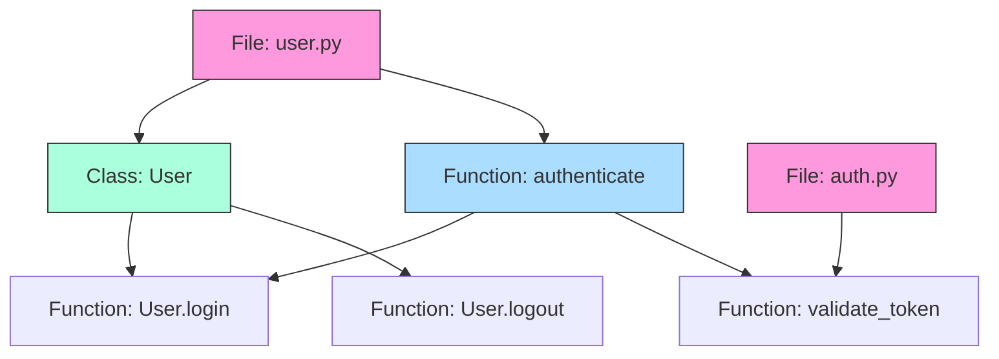
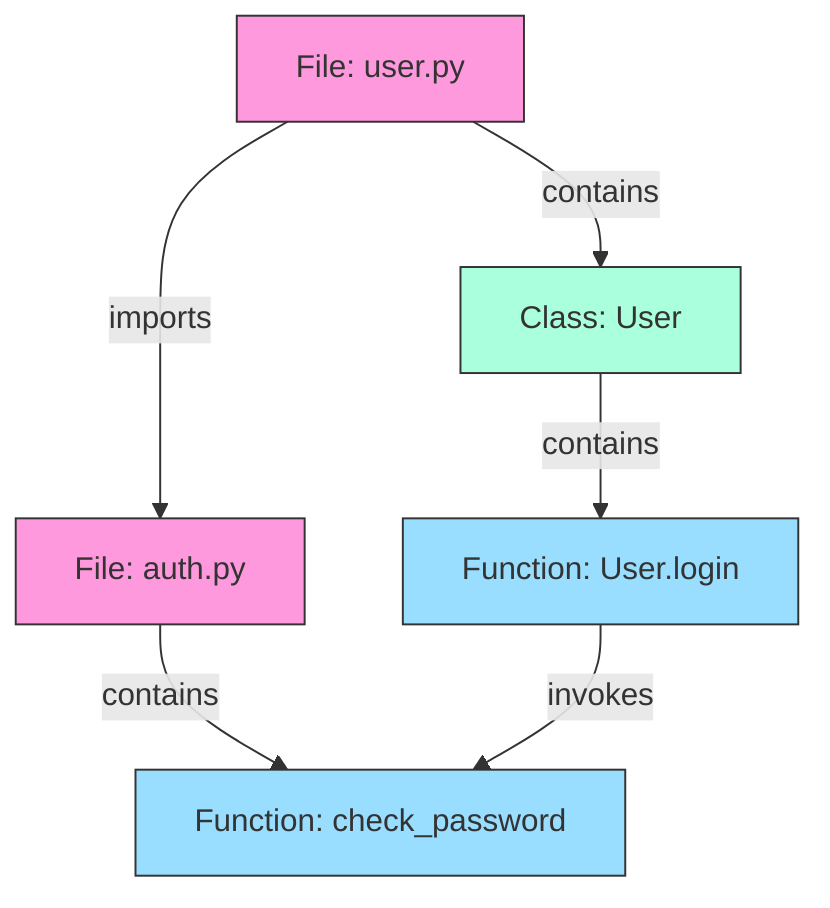
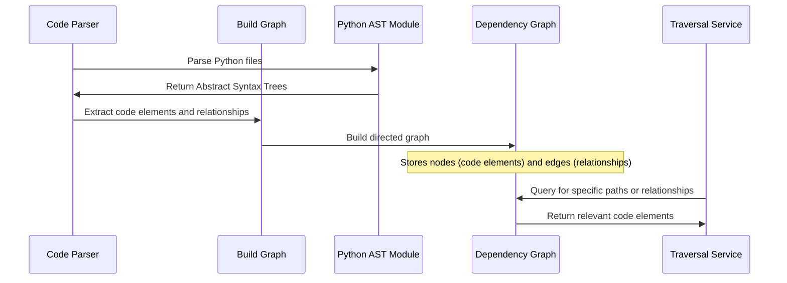

# Chapter 3: Dependency Graph

In [Chapter 2: Code Block Representation](02_code_block_representation_.md), we learned how LocAgent structures individual pieces of code. Now, let's explore how these pieces connect to form the bigger picture through the Dependency Graph.

## What is a Dependency Graph?

Imagine you're exploring a new city. A city map doesn't just show individual buildings - it shows how streets connect them. Without these connections, you'd see a collection of isolated buildings with no way to navigate between them.

The **Dependency Graph** in LocAgent works the same way. It's a structured representation of your codebase that shows not just individual code elements (like files, classes, and functions), but also the relationships between them.



In this diagram, circles represent code elements, and arrows show relationships. For example, the arrow from `authenticate` to `User.login` shows that one function calls the other.

## Why Dependency Graphs Matter

When fixing bugs or adding features, understanding connections is crucial. For example, if you need to modify how user authentication works, you need to know:

1. Which files contain authentication code?
2. What functions are involved?
3. What other parts of the code call these functions?
4. What external libraries does the authentication rely on?

The dependency graph answers all these questions by tracking four key relationships:
- **Contains**: Files contain functions and classes; classes contain methods
- **Imports**: When one file imports code from another file
- **Invokes**: When one function calls another
- **Inherits**: When one class extends another

## Creating a Simple Dependency Graph

Let's look at a simple example. Imagine you have two Python files:

```python
# user.py
from auth import check_password

class User:
    def login(self, password):
        if check_password(self.username, password):
            self.is_logged_in = True
            return True
        return False
```

```python
# auth.py
def check_password(username, password):
    # Password checking logic
    return password == "secure123"  # Simplified!
```

The dependency graph would represent this structure like this:



This graph shows that:
1. `user.py` imports from `auth.py`
2. `User.login` calls the `check_password` function

## Building a Dependency Graph

Now, let's see how to create a dependency graph using LocAgent:

```python
from dependency_graph.build_graph import build_graph

# Initialize a graph from a repository path
repo_path = "path/to/your/code"
graph = build_graph(repo_path)

# Print basic statistics about the graph
print(f"Nodes (code elements): {graph.number_of_nodes()}")
print(f"Edges (relationships): {graph.number_of_edges()}")
```

This code creates a graph by analyzing your codebase. The `build_graph` function scans all Python files, parses them, and extracts relationships between code elements.

## Exploring the Graph

Once you have a graph, you can explore it to understand your code better:

```python
# Find all functions in a specific file
file_node = "user.py"
for node in graph.nodes():
    if node.startswith(file_node + ":") and graph.nodes[node]["type"] == "function":
        print(f"Function found: {node}")

# Find what calls a specific function
function_node = "auth.py:check_password"
for source, target, data in graph.in_edges(function_node, data=True):
    if data["type"] == "invokes":
        print(f"{source} calls {function_node}")
```

This code first finds all functions in `user.py`, then identifies who calls the `check_password` function from `auth.py`.

## Traversing the Graph to Solve Problems

Let's say you're investigating a bug in the login functionality. You can use the graph to trace the code flow:

```python
from dependency_graph.traverse_graph import traverse_tree_structure

# Start from the login function and explore relationships
login_node = "user.py:User.login"
dependencies = traverse_tree_structure(
    graph,
    login_node,
    direction="both",
    hops=2  # How far to explore
)

print(dependencies)
```

This might output:
```
user.py:User.login
├── invokes ── auth.py:check_password
└── invokes-by ── app.py:handle_login_request
```

This shows that `User.login` calls `check_password` and is called by `handle_login_request`. This helps you understand the full context of the login functionality.

## Real-World Example: Finding Security Vulnerabilities

Imagine you discover a security vulnerability in the `check_password` function. You need to find all code that might be affected.

```python
from dependency_graph.traverse_graph import traverse_graph_structure

# Find all code that depends on the vulnerable function
vulnerable_function = "auth.py:check_password"
affected_code = traverse_graph_structure(
    graph, 
    [vulnerable_function],
    direction="upstream",  # Look for code that uses this function
    hops=3,
    edge_type_filter=["invokes", "imports"]
)

print(affected_code)
```

This code traces all paths that lead to the vulnerable function, helping you identify every part of your application that needs to be checked or fixed.

## Under the Hood: How the Dependency Graph Works

Let's look at how LocAgent builds and uses dependency graphs:



The process has these main steps:

1. **Code Parsing**: Python files are parsed using the Abstract Syntax Tree (AST) module
2. **Element Extraction**: Code blocks like functions and classes are identified
3. **Relationship Analysis**: The system analyzes how elements relate to each other
4. **Graph Construction**: A directed graph is built with nodes and typed edges
5. **Graph Traversal**: The graph can be traversed to answer specific questions

Let's look at a simplified version of the code that analyzes function calls:

```python
def analyze_invokes(node, code_tree, graph, repo_path):
    # Find which functions this function calls
    invocations = []
    
    # Parse the function's AST
    for ast_node in ast.walk(code_tree):
        if isinstance(ast_node, ast.Call):
            if isinstance(ast_node.func, ast.Name):
                # Direct function call like: check_password()
                invocations.append(ast_node.func.id)
            elif isinstance(ast_node.func, ast.Attribute):
                # Method call like: user.login()
                invocations.append(ast_node.func.attr)
    
    return invocations
```

This function examines a piece of code to identify what other functions it calls. The complete implementation handles more complex cases, but this shows the core idea.

## Navigating the Graph: Traversal Mechanisms

Once the graph is built, LocAgent provides different ways to navigate it:

```python
from dependency_graph.traverse_graph import RepoEntitySearcher

# Initialize a searcher
searcher = RepoEntitySearcher(graph)

# Find specific entities by name
results = searcher.global_name_dict["login"]
print(f"All entities named 'login': {results}")

# Get detailed information about code elements
node_data = searcher.get_node_data(results, return_code_content=True)
for data in node_data:
    print(f"Type: {data['type']}")
    print(f"Lines: {data.get('start_line', 0)}-{data.get('end_line', 0)}")
    print(f"Code:\n{data.get('code_content', '')}")
```

This code uses the `RepoEntitySearcher` to find all entities named "login" and retrieve their code content. This is essential for understanding how these components work within the codebase.

## Visualizing Dependencies

Sometimes, seeing the dependencies visually makes them easier to understand. LocAgent can export graph information in formats that can be visualized:

```python
from dependency_graph.traverse_graph import traverse_graph_structure

# Get a DOT format representation of a subgraph
dot_string = traverse_graph_structure(
    graph,
    ["user.py:User"],
    direction="both",
    hops=2
)

# This can be visualized with tools like Graphviz
with open("user_dependencies.dot", "w") as f:
    f.write(dot_string)

print("Dependency visualization saved to user_dependencies.dot")
```

This creates a file that can be visualized with tools like Graphviz to see the relationships in a graphical format.

## Practical Applications in LocAgent

In LocAgent, the [Graph Traversal & Search Mechanisms](04_graph_traversal___search_mechanisms_.md) build on the Dependency Graph to help you:

1. **Find Relevant Code**: Quickly locate code related to a specific feature or bug
2. **Understand Impacts**: Identify what code might be affected by a change
3. **Trace Code Flow**: Follow the execution path through a codebase
4. **Discover Dependencies**: See what external libraries your code relies on

For example, when you search for code related to "user authentication", LocAgent uses the dependency graph to find not just functions with those words in their names, but also related code that might be relevant to your search.

## Conclusion

The Dependency Graph is the foundation of LocAgent's ability to navigate and understand code. It transforms a collection of isolated files into a connected network of code elements, making it possible to trace relationships and understand how different parts work together.

By representing code as a structured graph of nodes and relationships, LocAgent can answer complex questions about your codebase that would be difficult or impossible to answer by simply searching for text.

In the next chapter, we'll explore [Graph Traversal & Search Mechanisms](04_graph_traversal___search_mechanisms_.md), which builds on the Dependency Graph to provide powerful ways to locate and understand code.

---

Generated by [AI Codebase Knowledge Builder](https://github.com/The-Pocket/Tutorial-Codebase-Knowledge)