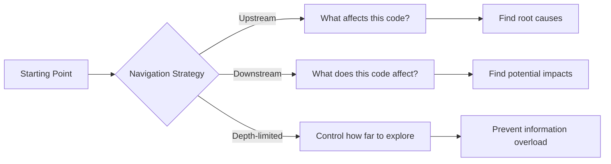
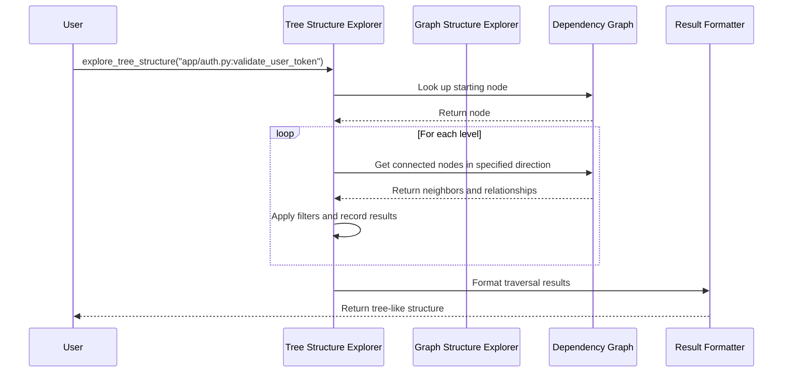

# Chapter 4: Graph Traversal & Search Mechanisms

In [Chapter 3: Dependency Graph](03_dependency_graph_.md), we learned how LocAgent represents the connections between different parts of code. Now, let's explore how we can navigate through this graph to find exactly what we're looking for.

## Introduction: Finding Your Way Through Code

Imagine you're using a GPS navigation app. Depending on your needs, you might want:
- The fastest route (most direct path)
- A scenic route (exploring related areas)
- A route that avoids highways (limiting where you go)

Similarly, when exploring code, there are different ways to navigate the dependency graph:



Graph traversal mechanisms in LocAgent work like your code GPS, offering different "routes" to help you understand code relationships.

## Key Concepts

### 1. Direction of Traversal

When exploring code, there are three primary directions we can go:

- **Downstream Traversal**: Follows dependencies forward. If function A calls functions B and C, downstream traversal from A will lead you to B and C.
  
- **Upstream Traversal**: Follows dependencies backward. If function A calls functions B and C, upstream traversal from B will lead you to A.
  
- **Bidirectional Traversal**: Explores both upstream and downstream at the same time.

### 2. Depth Control

Imagine a function that calls another function, which calls another, and so on. Without limits, you might end up exploring the entire codebase! Depth control lets you specify how many "steps" to take:

- **Single Level**: Only immediate relationships (depth=1)
- **Multi-Level**: Relationships of relationships (depth=2+)
- **Unlimited**: Explore as far as possible (depth=-1)

### 3. Entity and Relationship Filtering

Not all code relationships are equally important for every task. You might want to focus on:

- Specific types of code (only functions, only classes)
- Specific types of relationships (only "calls" relationships, not "imports")

## Basic Usage Examples

Let's see how to use these traversal mechanisms. First, let's explore downstream from a function:

```python
from plugins.location_tools.repo_ops.repo_ops import explore_tree_structure

# Starting from a function, see what it calls
result = explore_tree_structure(
    start_entities=["app/auth.py:validate_user_token"],
    direction="downstream",
    traversal_depth=2  # Go two levels deep
)

print(result)
```

This might output something like:

```
app/auth.py:validate_user_token
├── invokes ── app/database.py:get_user_by_token
│   └── invokes ── app/models.py:User.from_dict
└── invokes ── app/logging.py:log_auth_attempt
```

Now, let's see what calls our function (upstream traversal):

```python
# See what calls our function
result = explore_tree_structure(
    start_entities=["app/auth.py:validate_user_token"],
    direction="upstream",
    traversal_depth=1  # Just immediate callers
)

print(result)
```

Output:

```
app/auth.py:validate_user_token
├── invokes-by ── app/routes.py:login
└── invokes-by ── app/api/endpoints.py:authenticate
```

The `-by` suffix shows that these functions call our function (rather than being called by it).

## Controlling the Search

We can filter to focus only on certain types of code elements or relationships:

```python
# Only look at class relationships
result = explore_tree_structure(
    start_entities=["app/models.py:User"],
    direction="both",
    traversal_depth=1,
    entity_type_filter=["class"],  # Only classes
    dependency_type_filter=["inherits"]  # Only inheritance
)

print(result)
```

Output:

```
app/models.py:User
├── inherits ── app/models.py:BaseModel
└── inherits-by ── app/models.py:AdminUser
```

This shows that `User` inherits from `BaseModel` and is inherited by `AdminUser`.

## Advanced Search with Code Content

Sometimes, you don't know the exact entity name but need to find code based on keywords. For this, LocAgent provides powerful search mechanisms:

```python
from plugins.location_tools.repo_ops.repo_ops import search_code_snippets

# Search for code related to "password reset"
result = search_code_snippets(
    search_terms=["password reset"],
    file_path_or_pattern="app/**/*.py"  # Only search python files in app/
)

print(result)
```

This function combines several search strategies:
1. Exact name matching
2. BM25 keyword search (similar to what search engines use)
3. Fuzzy matching for similar names

The result includes the most relevant code snippets:

```
##Searching for term "password reset"...
### Search Result:
File: app/auth.py
function: reset_password
line: 105-130
```python
def reset_password(user_email, new_password):
    """Reset a user's password after verification.
    
    Args:
        user_email: Email of the user
        new_password: New password to set
        
    Returns:
        bool: True if successful, False otherwise
    """
    user = get_user_by_email(user_email)
    if not user:
        return False
    
    # Hash the new password
    hashed_pw = hash_password(new_password)
    
    # Update in database
    user.password = hashed_pw
    user.save()
    
    # Log the event
    log_password_reset(user_email)
    return True
```
```

## How Traversal Works Under the Hood

The graph traversal process is handled by two main components:



Let's look at the key functions from `traverse_graph.py` that make this happen:

```python
def traverse_tree_structure(G, root, direction='downstream', hops=2,
                           node_type_filter=None, edge_type_filter=None):
    if hops == -1:
        hops = 20  # Default max depth
        
    # Create a list to hold formatted output lines
    result_lines = []
    traversed_nodes = set()  # Track visited nodes
    traversed_edges = set()  # Track visited edges
    
    # This nested function does the actual traversal work
    def traverse(node, prefix, is_last, level, edge_type, edirection):
        if level > hops:
            return
            
        # Format the current node in the output
        if node == root and level == 0:
            result_lines.append(f"{node}")
            new_prefix = ''
            edirection = direction
        else:
            # Create tree-like formatting with branch characters
            connector = '└── ' if is_last else '├── '
            connector += f"{edge_type} ── "
            result_lines.append(f"{prefix}{connector}{node}")
            new_prefix = prefix + (' ' if is_last else '│') + ' ' * (len(connector) - 1)
        
        # Skip if we've already visited this node
        if node in traversed_nodes:
            return
        traversed_nodes.add(node)
        
        # Get neighbors based on direction
        neighbors = []
        # ... (code to collect neighbors in the right direction)
        
        # Process each neighbor
        for i, (neighbor, etype, edir) in enumerate(zip(neighbors, edge_types, directions)):
            is_last_child = (i == len(neighbors) - 1)
            # Mark upstream relationships with "-by" suffix
            if edir == 'upstream':
                etype += '-by'
            # Recursively traverse this neighbor
            traverse(neighbor, new_prefix, is_last_child, level + 1, etype, edir)
    
    # Start traversal from the root
    traverse(root, '', False, 0, None, None)
    return "\n".join(result_lines)
```

The function works recursively, starting from a root node and exploring connected nodes level by level. It carefully formats the output to show a tree-like structure that makes it easy to understand relationships.

## Search Mechanisms: Finding the Needle in the Haystack

What if you don't know the exact function or class name you're looking for? LocAgent provides multiple search strategies:

### 1. Entity Name Search

```python
def search_entity(query_info, include_files=None):
    searcher = get_graph_entity_searcher()
    query_results = []
    
    # Strategy 1: Exact match
    if searcher.has_node(query_info.term):
        # Found the exact entity name!
        query_results.append(QueryResult(
            query_info=query_info, 
            format_mode='complete', 
            nid=query_info.term,
            retrieve_src=f"Exact match found for entity name `{query_info.term}`."
        ))
        
    # Strategy 2: Global name dictionary search
    else:
        found_entities_dict = search_entity_in_global_dict(
            query_info.term, 
            include_files
        )
        # ... process matching entities
    
    # Strategy 3: BM25 search if previous strategies failed
    if continue_search:
        query_results.extend(bm25_module_retrieve(query=query_info.term))
        
    return query_results
```

This function tries increasingly fuzzy search strategies until it finds matches.

### 2. BM25 Search for Content

Sometimes you need to search the actual code content, not just names:

```python
def bm25_content_retrieve(query_info, include_files=None, similarity_top_k=10):
    # Build or load a BM25 retriever
    retriever = build_code_retriever(repo_dir, similarity_top_k=similarity_top_k)
    
    # Use BM25 algorithm to find relevant code
    retrieved_nodes = retriever.retrieve(query_info.term)
    
    # Process and return matches
    query_results = []
    for node in retrieved_nodes:
        # ... create QueryResult objects for each match
        
    return query_results
```

BM25 is a ranking function used by search engines that considers both term frequency and document length to find the most relevant content.

### 3. Fuzzy Search

For cases where the query might have typos or slight variations:

```python
def fuzzy_retrieve_from_graph_nodes(keyword, graph, similarity_top_k=5):
    # Get candidate nodes from the graph
    candidate_nodes = [nid for nid in graph if not is_test_file(nid)]
    
    # Use fuzzy matching to find similar names
    matches = process.extract(
        keyword,
        candidate_nodes,
        scorer=fuzz.token_set_ratio,
        limit=similarity_top_k
    )
    
    return [match[0] for match in matches]
```

This uses the rapidfuzz library to find names that are similar to what you're looking for, even if there are spelling differences.

## Real-World Example: Debugging a Feature

Let's see how we can use graph traversal to debug a real issue. Imagine users report a bug where password reset emails aren't being sent.

```python
# Step 1: Find the reset password functionality
password_reset_code = search_code_snippets(
    search_terms=["password reset", "forgot password"]
)

# Step 2: From the results, we identify the main function
# Step 3: Explore what it calls (downstream)
downstream_calls = explore_tree_structure(
    start_entities=["app/auth.py:reset_password"],
    direction="downstream",
    traversal_depth=2
)

# Step 4: Look at what calls it (upstream)
upstream_calls = explore_tree_structure(
    start_entities=["app/auth.py:reset_password"],
    direction="upstream",
    traversal_depth=1
)
```

By examining both directions, we might discover:
1. The password reset function is supposed to call an email service
2. It's missing an error check when the email service fails
3. We can see exactly which routes and API endpoints call this function

This comprehensive view helps pinpoint the issue quickly.

## Conclusion

Graph Traversal & Search Mechanisms are like having a smart GPS for your code. They let you:

1. Navigate code relationships (upstream, downstream, or both)
2. Control how deeply you explore
3. Find relevant code even when you don't know exact names
4. Understand the full context of a piece of code

With these tools, you can quickly find your way through even the most complex codebases, tracing data flow, understanding dependencies, and locating bugs efficiently.

In the next chapter, we'll explore [Repository Management](05_repository_management_.md), which focuses on how LocAgent handles and organizes the entire codebase for efficient search and navigation.

---

Generated by [AI Codebase Knowledge Builder](https://github.com/The-Pocket/Tutorial-Codebase-Knowledge)