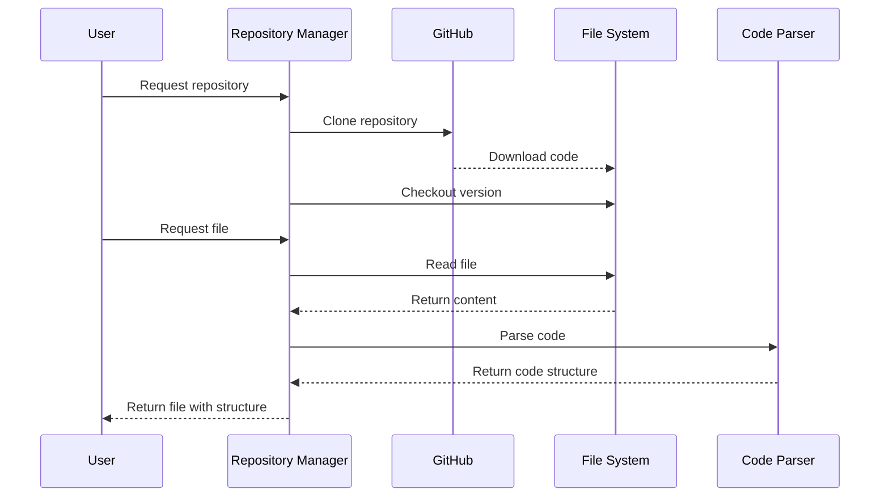

# Chapter 5: Repository Management

In [Chapter 4: Graph Traversal & Search Mechanisms](04_graph_traversal___search_mechanisms_.md), we learned how to navigate through code relationships. Now, let's look at how LocAgent manages the actual code files and repositories that contain all that code.

## Introduction: The Code Librarian

Imagine you're researching a complex topic at a large library. Before you can even start reading, you need someone to:
- Find the right books from thousands of options
- Get the correct editions
- Bring them to your table
- Open them to the relevant pages
- Keep them organized as you work

This is exactly what Repository Management does in LocAgent. It handles all the grunt work of:
- Getting code from source control (like GitHub)
- Checking out the right version
- Loading files into memory
- Organizing code for analysis
- Keeping track of changes

Let's see how this works with a concrete example.

## A Real-World Example

Imagine you're working with a team debugging an issue in a large open-source project:

```
Bug report: The image upload feature is broken in version 2.5.0 of PhotoApp.
It works in version 2.4.0, so something changed that broke it.
```

To investigate this bug, you need to:
1. Get the code repository
2. Check out both versions for comparison
3. Access specific files related to image uploads
4. Analyze changes between versions

LocAgent's Repository Management makes this process easy.

## Key Concepts in Repository Management

### 1. Repository Setup

The first step is getting the code. LocAgent can clone repositories from GitHub and check out specific versions:

```python
from util.benchmark.git_repo_manager import setup_github_repo

# Get a specific version of a repository
repo_path = setup_github_repo(
    repo="photoapp/core",
    base_commit="v2.5.0",  # The version with the bug
    base_dir="/tmp/repos"  # Where to store the code
)

print(f"Repository cloned to: {repo_path}")
```

This code uses Git behind the scenes to clone the repository and check out the specified version.

### 2. File Access

Once we have the repository, we need to access its files:

```python
from repo_index.repository import FileRepository

# Create a file repository manager
repo = FileRepository(repo_path)

# Get a specific file
image_uploader_file = repo.get_file("src/upload/image_uploader.py")

# Print the file content
if image_uploader_file:
    print(f"File content:\n{image_uploader_file.content[:200]}...")  # First 200 chars
else:
    print("File not found")
```

The `FileRepository` gives us easy access to files in the codebase without having to deal with file paths and reading operations directly.

### 3. Finding Relevant Files

Often you don't know exactly which file you need. Repository Management helps you find files matching patterns:

```python
# Find all Python files related to uploading
upload_files = repo.find_files(["**/*upload*.py", "**/*image*.py"])

print(f"Found {len(upload_files)} relevant files:")
for file_path in upload_files:
    print(f"- {file_path}")
```

This search function uses glob patterns to find files matching certain criteria, saving you from manually browsing the repository.

### 4. Working with Code Files

Once you have a file, LocAgent provides tools to analyze and even modify it:

```python
# Get a file with code parsing enabled
file = repo.get_file("src/upload/image_uploader.py")

if file and file.supports_codeblocks:
    # Find all functions in the file
    functions = file.module.find_blocks_with_type("FUNCTION")
    
    print(f"Functions in file:")
    for function in functions:
        print(f"- {function.identifier} (lines {function.start_line}-{function.end_line})")
```

This code not only accesses the file but also parses it to understand its structure, letting you work with high-level code elements rather than just text.

## The Workspace: Your Code Environment

In LocAgent, the `Workspace` class combines repository access with code indexing to create a complete environment for code analysis:

```python
from repo_index.workspace import Workspace

# Create a workspace from a repository directory
workspace = Workspace.from_dirs(
    repo_dir=repo_path,
    index_dir="/tmp/indexes/photoapp",  # Optional: where to store the code index
    max_results=25  # Maximum number of search results to return
)

# Get a file through the workspace
file = workspace.get_file("src/upload/image_uploader.py")

# The workspace can also create a context for code analysis
context = workspace.file_context
```

The workspace is your command center for working with code. It maintains access to files, can build search indexes, and provides context for analysis.

## Comparing Different Code Versions

One powerful feature of Repository Management is the ability to work with different versions of code:

```python
from util.benchmark.git_repo_manager import setup_github_repo

# Get two different versions for comparison
old_repo_path = setup_github_repo(
    repo="photoapp/core",
    base_commit="v2.4.0",  # Working version
    base_dir="/tmp/repos/old"
)

new_repo_path = setup_github_repo(
    repo="photoapp/core",
    base_commit="v2.5.0",  # Broken version
    base_dir="/tmp/repos/new"
)

# Create repositories for both versions
old_repo = FileRepository(old_repo_path)
new_repo = FileRepository(new_repo_path)

# Get the same file from both versions
old_file = old_repo.get_file("src/upload/image_uploader.py")
new_file = new_repo.get_file("src/upload/image_uploader.py")

# Use difflib to see what changed
import difflib
diff = difflib.unified_diff(
    old_file.content.splitlines(),
    new_file.content.splitlines(),
    lineterm=''
)

print("Changes between versions:")
for line in diff:
    print(line)
```

This capability is extremely useful for debugging issues that appeared between versions, like our image upload bug example.

## How Repository Management Works Under the Hood

Let's look at how Repository Management works internally:



The process is straightforward:
1. Repository Manager interacts with GitHub to get code
2. It stores files in the local file system
3. When files are requested, it reads them from disk
4. It parses files to understand their structure
5. It returns structured file objects to the user

## Important Implementation Components

Now, let's look at the key classes that make Repository Management work:

### FileRepository Class

The `FileRepository` class manages access to files in a repository:

```python
class FileRepository:
    def __init__(self, repo_path: str):
        self._repo_path = repo_path
        self._files = {}  # Cache of loaded files

    def get_file(self, file_path: str, refresh: bool = False):
        """Get a file from the repository."""
        file = self._files.get(file_path)
        if not file or refresh:
            # If not in cache or refresh requested, load from disk
            full_path = os.path.join(self._repo_path, file_path)
            if not os.path.exists(full_path):
                return None
                
            # Read and parse the file
            with open(full_path, "r") as f:
                content = f.read()
                parser = get_parser_by_path(file_path)
                if parser:
                    module = parser.parse(content)
                    file = CodeFile(file_path=file_path, content=content, module=module)
                else:
                    file = CodeFile(file_path=file_path, content=content)
                    
            self._files[file_path] = file
        return file
```

This class keeps track of loaded files and parses them when needed. It acts as a cache to avoid reading the same file multiple times.

### CodeFile Class

The `CodeFile` class represents a single file in the repository:

```python
class CodeFile:
    def __init__(self, file_path, content, module=None):
        self.file_path = file_path  # Path within repository
        self.content = content      # File content
        self.module = module        # Parsed structure (if applicable)
        self.dirty = False          # Whether file has been modified

    @property
    def supports_codeblocks(self):
        return self.module is not None
        
    def update_content(self, updated_content):
        # Create a diff between old and new content
        diff = do_diff(self.file_path, self.content, updated_content)
        
        if diff:
            # Parse the updated content
            parser = get_parser_by_path(self.file_path)
            if parser:
                module = parser.parse(updated_content)
                self.module = module
                
            # Mark as changed and update content
            self.dirty = True
            self.content = updated_content
            return True
        return False
```

This class not only stores file content but also knows how to update and parse it, keeping track of changes along the way.

### Git Repository Manager

The Git Repository Manager handles interactions with Git:

```python
def setup_github_repo(repo: str, base_commit: str, base_dir: str = "/tmp/repos"):
    """Clone a GitHub repository and checkout a specific commit."""
    repo_name = get_repo_dir_name(repo)  # Format the repo name for local storage
    repo_url = f"https://github.com/{repo}.git"
    path = f"{base_dir}/{repo_name}"
    
    # Create directory if it doesn't exist
    if not os.path.exists(path):
        os.makedirs(path)
        
    # Clone repo if it doesn't exist locally
    if not os.path.exists(f"{path}/.git"):
        subprocess.run(["git", "clone", repo_url, path], check=True)
        
    # Checkout the specified commit
    subprocess.run(["git", "reset", "--hard", base_commit], 
                  cwd=path, check=True)
                  
    return path
```

This function handles the complexities of working with Git repositories, making it easy to get specific versions of code.

## Practical Application: Debugging a Real Bug

Let's tie all this together with a practical example. Imagine we're debugging that image upload bug:

```python
# Step 1: Get both versions of the code
from util.benchmark.git_repo_manager import setup_github_repo
from repo_index.workspace import Workspace

# Set up repositories
working_path = setup_github_repo("photoapp/core", "v2.4.0", "/tmp/photoapp/working")
broken_path = setup_github_repo("photoapp/core", "v2.5.0", "/tmp/photoapp/broken")

# Step 2: Create workspaces for analysis
working = Workspace.from_dirs(working_path)
broken = Workspace.from_dirs(broken_path)

# Step 3: Find relevant files
upload_files = broken.file_repo.find_files(["**/*upload*.py", "**/*image*.py"])

# Step 4: Compare files between versions
for file_path in upload_files:
    working_file = working.get_file(file_path)
    broken_file = broken.get_file(file_path)
    
    # Skip if file didn't exist in previous version
    if not working_file:
        print(f"New file in v2.5.0: {file_path}")
        continue
        
    # Use the previously shown difflib code to find differences
    # ... (diffing code would go here)
    
    # After analysis, we find the bug is in image_uploader.py
    if file_path == "src/upload/image_uploader.py":
        # Use code structure to find the upload function
        functions = broken_file.module.find_blocks_with_type("FUNCTION")
        for function in functions:
            if "upload" in function.identifier:
                print(f"Found upload function: {function.identifier}")
                print(f"Code:\n{function.to_string()}")
```

This workflow shows how Repository Management makes it easy to:
1. Get specific versions of code
2. Find relevant files across the codebase
3. Compare changes between versions
4. Analyze code structure to identify issues

## Integration with the Localization Pipeline

Repository Management integrates with the [Code Localization Pipeline](01_code_localization_pipeline_.md) to enable searching across repositories:

```python
from util.prompts.pipelines import auto_search_prompt
from util.runtime.function_calling import get_tools

# Set up a repository
repo_path = setup_github_repo("photoapp/core", "v2.5.0")

# Create search tools that use the repository
tools = get_tools(
    codeact_enable_search_keyword=True,
    codeact_repo_path=repo_path  # Point to our repository
)

# Now the search process can find code in our repository
from util.runtime.execute_ipython import auto_search_process

final_output, messages, data = auto_search_process(
    model_name="gpt-4o",
    messages=[{
        "role": "user",
        "content": "Find code related to image uploading"
    }],
    tools=tools
)
```

When the [Code Localization Pipeline](01_code_localization_pipeline_.md) runs, it uses Repository Management behind the scenes to access files, understand their structure, and build relationships for the [Dependency Graph](03_dependency_graph_.md).

## Conclusion

Repository Management is the foundation that makes all other parts of LocAgent possible. Like a skilled librarian, it:
- Gets the right books (code repositories)
- Places them on your table (loads files into memory)
- Organizes them by topic (indexes code)
- Helps you find specific chapters (locates relevant files)
- Shows you differences between editions (compares versions)

Without this layer, the sophisticated code analysis and search tools would have nothing to work with.

In the next chapter, we'll explore [Location Tools](06_location_tools_.md), which use Repository Management to find specific code elements when you only have a vague description of what you're looking for.

---

Generated by [AI Codebase Knowledge Builder](https://github.com/The-Pocket/Tutorial-Codebase-Knowledge)