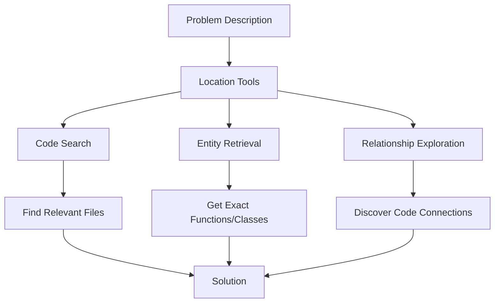
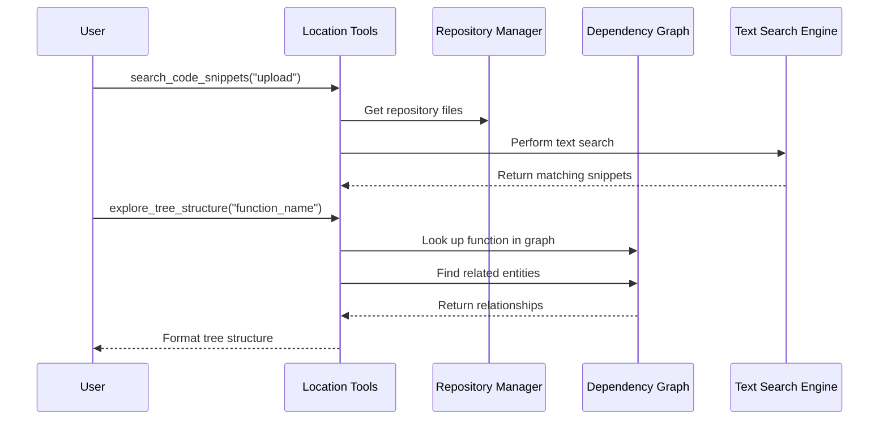

# Chapter 6: Location Tools

In [Chapter 5: Repository Management](05_repository_management_.md), we learned how LocAgent organizes and manages code repositories. Now, let's explore the tools that help us navigate and find specific pieces of code within those repositories.

## Introduction: The Code Detective's Toolkit

Imagine you're a detective investigating a crime scene. You wouldn't just wander around randomly hoping to stumble upon clues. Instead, you'd use specific techniques:

- **Interviews**: Asking witnesses questions to get information
- **Forensics**: Examining physical evidence with scientific tools
- **Background checks**: Looking up information about suspects
- **Crime scene analysis**: Studying the layout and relationships of evidence

This is exactly what Location Tools provide for code investigation. They're a collection of specialized tools that help you find and understand specific parts of code through different search and exploration techniques.



## The Core Problem: Finding Needles in Code Haystacks

When working with large codebases, finding the right piece of code is often the most time-consuming part of fixing bugs or adding features. You might have a vague description like:

> "The user profile picture upload is failing on Safari"

But where in thousands of files should you look? The code could be spread across multiple files and functions, with complex dependencies between them.

Location Tools solve this problem by providing different ways to:

1. **Search code** using keywords and patterns
2. **Retrieve specific entities** like functions and classes
3. **Explore relationships** between different parts of code

Let's see how to use each of these tools.

## Tool #1: Code Search - Finding Relevant Code

The `search_code_snippets` function is like the detective's "interview" technique - asking questions to get information. It lets you search the codebase using keywords to find relevant code snippets.

### Basic Usage

```python
from plugins.location_tools.repo_ops.repo_ops import search_code_snippets

# Search for code related to profile pictures
results = search_code_snippets(
    search_terms=["profile picture", "upload"]
)

print(results)
```

This code searches for any mentions of "profile picture" and "upload" in the codebase. The output might look something like:

```
##Searching for term "profile picture", "upload"...
### Search Result:
File: src/users/profile_manager.py
function: upload_profile_picture
line: 45-67
```python
def upload_profile_picture(user_id, image_data, image_format='jpeg'):
    """Upload a user's profile picture to the server.
    
    Args:
        user_id: The ID of the user
        image_data: The binary image data
        image_format: The format of the image (jpeg, png, etc.)
        
    Returns:
        The URL of the uploaded picture
    """
    # Validate the image data
    if not validate_image(image_data, image_format):
        raise InvalidImageError("Invalid image data")
    
    # Save the image to the file system
    filename = f"user_{user_id}_profile.{image_format}"
    file_path = os.path.join(UPLOAD_DIR, filename)
    
    with open(file_path, 'wb') as f:
        f.write(image_data)
    
    # Update the user record
    user = get_user(user_id)
    user.profile_picture_url = f"/images/profiles/{filename}"
    user.save()
    
    return user.profile_picture_url
```
```

### Advanced Search Options

You can refine your search in several ways:

```python
# Search for specific lines in a file
results = search_code_snippets(
    line_nums=[45, 46, 47],
    file_path_or_pattern="src/users/profile_manager.py"
)

# Limit search to specific file patterns
results = search_code_snippets(
    search_terms=["upload"],
    file_path_or_pattern="src/users/**/*.py"  # Only in users directory
)
```

This flexibility lets you narrow down your search when you have some idea of where the code might be.

## Tool #2: Entity Retrieval - Getting Specific Code Elements

Once you've identified the general area of code, you might want to retrieve specific entities (like a class or function) by name. The `get_entity_contents` function is like a detective's "background check" - looking up specific information about a subject.

```python
from plugins.location_tools.repo_ops.repo_ops import get_entity_contents

# Get a specific function
results = get_entity_contents([
    "src/users/profile_manager.py:upload_profile_picture"
])

# Get a whole file
results = get_entity_contents([
    "src/users/profile_manager.py"
])

print(results)
```

This function is useful when you know exactly which function or class you want to examine. It returns the complete implementation of the specified entity.

## Tool #3: Structure Exploration - Understanding Code Relationships

Perhaps the most powerful tool is `explore_tree_structure`, which is like the detective's "crime scene analysis." It helps you understand how different parts of code relate to each other.

```python
from plugins.location_tools.repo_ops.repo_ops import explore_tree_structure

# See what a function calls (downstream exploration)
results = explore_tree_structure(
    start_entities=["src/users/profile_manager.py:upload_profile_picture"],
    direction="downstream",
    traversal_depth=2
)

print(results)
```

This might produce output like:

```
src/users/profile_manager.py:upload_profile_picture
├── invokes ── src/utils/validators.py:validate_image
├── invokes ── src/models/user.py:get_user
└── invokes ── src/models/user.py:User.save
```

This shows that the `upload_profile_picture` function calls three other functions: `validate_image`, `get_user`, and `User.save`.

You can also explore in the opposite direction to see what calls a function:

```python
# See what calls our function (upstream exploration)
results = explore_tree_structure(
    start_entities=["src/users/profile_manager.py:upload_profile_picture"],
    direction="upstream",
    traversal_depth=1
)
```

Output:

```
src/users/profile_manager.py:upload_profile_picture
├── invokes-by ── src/api/routes.py:profile_upload_endpoint
└── invokes-by ── src/web/views.py:ProfileView.post
```

This reveals that our function is called by both an API endpoint and a web view.

### Controlling Exploration

You can filter what types of relationships and entities to explore:

```python
# Look only at class inheritance relationships
results = explore_tree_structure(
    start_entities=["src/models/user.py:User"],
    direction="both",
    traversal_depth=1,
    entity_type_filter=["class"],
    dependency_type_filter=["inherits"]
)
```

This flexibility lets you focus on specific aspects of the code's structure.

## Putting It All Together: Solving the Bug

Now, let's see how we can use these tools together to solve our original problem: "The user profile picture upload is failing on Safari."

```python
# Step 1: Search for relevant code
upload_code = search_code_snippets(
    search_terms=["profile picture", "upload"]
)

# Step 2: From the results, we identify the main function
# Step 3: Explore what it calls (downstream)
dependencies = explore_tree_structure(
    start_entities=["src/users/profile_manager.py:upload_profile_picture"],
    direction="downstream",
    traversal_depth=2
)

# Step 4: Get the full implementation of a suspicious function
validator_code = get_entity_contents([
    "src/utils/validators.py:validate_image"
])
```

Through this process, we might discover that the `validate_image` function has browser detection code that doesn't properly handle Safari. Now we know exactly where to fix the bug!

## How Location Tools Work Under the Hood

When you use these location tools, a lot happens behind the scenes:



Location Tools work by:

1. **Repository Management**: Accessing files from the repository
2. **Dependency Graph**: Navigating the pre-built graph of code elements and their relationships
3. **Search Engines**: Using specialized algorithms (like BM25 for keyword search)
4. **Traversal Algorithms**: Walking through the graph in specific ways
5. **Result Formatting**: Presenting the findings in a readable format

## Key Components in the Implementation

Let's look at some of the main components that make Location Tools work:

### The QueryResult Class

Results from searches are wrapped in a `QueryResult` class that handles formatting:

```python
class QueryResult:
    def __init__(self, query_info, format_mode, 
                 nid=None, ntype=None, 
                 file_path=None, start_line=None, end_line=None,
                 retrieve_src=None):
        self.format_mode = format_mode  # How to display the result
        self.query_info_list = []        # What was searched for
        self.insert_query_info(query_info)
        self.nid = nid                  # Node ID in the graph
        self.ntype = ntype              # Type of code element
        self.file_path = file_path      # File containing the code
        self.start_line = start_line    # Starting line number
        self.end_line = end_line        # Ending line number
        self.retrieve_src = retrieve_src # How it was found
    
    def format_output(self, searcher):
        # Format the result for display
        # Different formatting based on format_mode
        # ...
```

This class handles how results are presented, with different modes (`complete`, `preview`, `code_snippet`, or `fold`) depending on what's most appropriate.

### Search Implementation

The `search_code_snippets` function uses multiple search strategies:

```python
def search_code_snippets(search_terms=None, line_nums=None, 
                         file_path_or_pattern="**/*.py"):
    # Get all files in the repository
    files, _, _ = get_current_repo_modules()
    all_file_paths = [file['name'] for file in files]
    
    # Filter files based on pattern
    include_files = find_matching_files_from_list(
        all_file_paths, file_path_or_pattern
    )
    
    # Search each term
    all_query_results = []
    for term in search_terms:
        query_info = QueryInfo(term=term)
        
        # Strategy 1: Entity Search (functions, classes)
        query_results, continue_search = search_entity(
            query_info=query_info, 
            include_files=include_files
        )
        all_query_results.extend(query_results)
        
        # Strategy 2: Content Search (code text)
        if continue_search:
            query_results = bm25_content_retrieve(
                query_info=query_info, 
                include_files=include_files
            )
            all_query_results.extend(query_results)
```

The function tries multiple strategies to find the most relevant code:
1. **Entity Search**: Looking for matches in entity names (functions, classes)
2. **Content Search**: Looking for the terms in the actual code text
3. **Line-based Search**: Finding code at specific line numbers

### Graph Traversal

The `explore_tree_structure` function performs graph traversal:

```python
def explore_tree_structure(start_entities, direction='downstream', 
                           traversal_depth=2, entity_type_filter=None, 
                           dependency_type_filter=None):
    # Validate inputs
    valid_entities, hints = _validate_graph_explorer_inputs(
        start_entities, direction, traversal_depth,
        entity_type_filter, dependency_type_filter
    )
    
    # Get the dependency graph
    G = get_graph()
    
    # Traverse from each starting entity
    results = []
    for entity in valid_entities:
        # Perform the actual traversal
        result = traverse_tree_structure(
            G, entity, direction, traversal_depth,
            entity_type_filter, dependency_type_filter
        )
        results.append(result)
    
    # Join results and return
    return "\n\n".join(results) + "\n\n" + hints.strip()
```

This function does the following:
1. Validates the input entities against the graph
2. Gets the dependency graph (built during repository indexing)
3. Traverses the graph from each starting entity
4. Formats the results as a tree structure

## Connection to Other Abstractions

Location Tools integrate closely with other aspects of LocAgent:

1. They use the [Code Block Representation](02_code_block_representation_.md) to understand the structure of code
2. They navigate the [Dependency Graph](03_dependency_graph_.md) to find relationships between code elements
3. They utilize [Graph Traversal & Search Mechanisms](04_graph_traversal___search_mechanisms_.md) to find paths through the code
4. They rely on [Repository Management](05_repository_management_.md) to access the code files

The tools also form the foundation for the [LLM Function Calling Framework](07_llm_function_calling_framework_.md), which allows AI models to programmatically use these tools to solve complex code problems.

## Practical Use Cases

The Location Tools are incredibly versatile for solving real-world development tasks:

1. **Bug Fixing**: Quickly find where errors are occurring and what other code might be affected
2. **Feature Development**: Understand existing code related to the feature you're building
3. **Code Review**: Trace through code execution paths to verify correctness
4. **Refactoring**: Identify all places affected by a planned change
5. **Onboarding**: Help new developers understand how different parts of the codebase connect

## Conclusion

Location Tools are your detective's kit for code investigation. Like a skilled detective who knows which technique to use for each situation, you now have a set of powerful tools to find and understand code in different ways:

- **Search code** when you only have keywords or patterns
- **Retrieve entities** when you know exactly what you're looking for
- **Explore relationships** when you need to understand connections

These tools dramatically reduce the time spent searching for relevant code, allowing you to focus on actual problem-solving and development.

In the next chapter, we'll explore the [LLM Function Calling Framework](07_llm_function_calling_framework_.md), which enables AI models to use these tools automatically to help you navigate and understand code even more efficiently.

---

Generated by [AI Codebase Knowledge Builder](https://github.com/The-Pocket/Tutorial-Codebase-Knowledge)