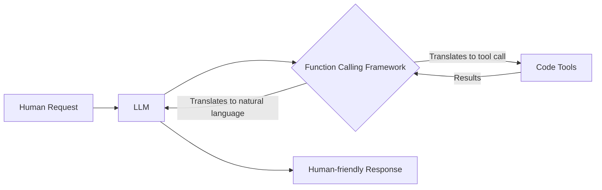
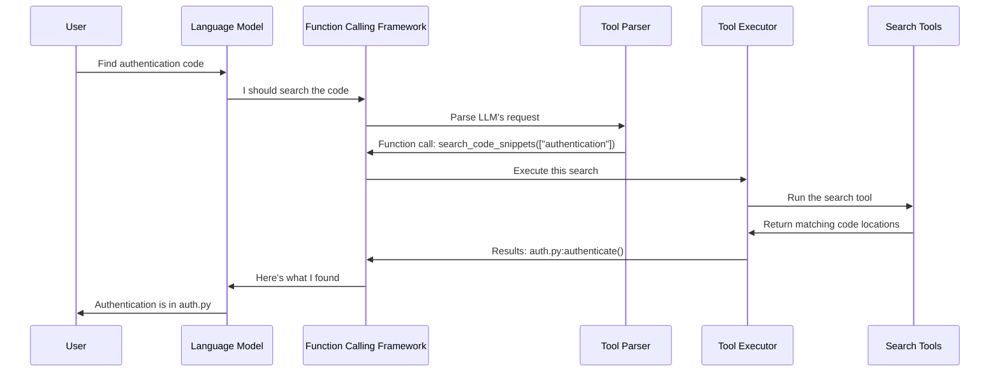

# Chapter 7: LLM Function Calling Framework

In [Chapter 6: Location Tools](06_location_tools_.md), we explored the specific tools that help us find and understand code in repositories. Now, we'll learn how large language models (LLMs) can actually use these tools on their own through the LLM Function Calling Framework.

## Introduction: The Universal Translator

Imagine you (speaking English) need to work with a colleague who only speaks Japanese. You have many powerful tools you could use together, but without a translator, neither of you can effectively collaborate.

The LLM Function Calling Framework serves as this translator, bridging the gap between:
- **Human language** (like "find the authentication code") 
- **Code tools** (like `search_code_snippets(["authentication"])`)



This framework allows the LLM to:
1. **Understand when a tool is needed** (e.g., "I need to search for code")
2. **Structure a proper call to that tool** (with correct arguments)
3. **Process the tool's results** to continue its reasoning

## A Simple Example

Let's see a concrete example of the LLM Function Calling Framework in action. Imagine we want to find code related to user authentication:

```python
from util.runtime.function_calling import get_tools
from util.runtime.execute_ipython import auto_search_process

# Define what tools we want the LLM to access
tools = get_tools(
    codeact_enable_search_keyword=True,
    codeact_enable_tree_structure_traverser=True
)

# Ask the LLM to help us find authentication code
result, messages, data = auto_search_process(
    model_name="gpt-4o",
    messages=[{
        "role": "user", 
        "content": "Find the code that handles user login authentication"
    }],
    tools=tools
)

print(result)
```

Behind the scenes, this leads to a conversation like:

1. **User**: "Find the code that handles user login authentication"

2. **LLM's thought process** (not visible): "I need to search for authentication code. I'll use the search_code_snippets tool."

3. **LLM calls the tool**:
   ```python
   search_code_snippets(search_terms=["login", "authentication", "user"])
   ```

4. **Tool returns results**:
   ```
   Found matches in:
   - src/auth/login.py:authenticate_user (lines 45-67)
   - src/services/user_service.py:validate_credentials (lines 102-120)
   ```

5. **LLM thinks again**: "Let me explore the dependencies of these functions."

6. **LLM calls another tool**:
   ```python
   explore_tree_structure(
       start_entities=["src/auth/login.py:authenticate_user"],
       direction="both",
       traversal_depth=2
   )
   ```

7. **Tool returns results**:
   ```
   src/auth/login.py:authenticate_user
   ├── invokes ── src/utils/password.py:hash_password
   ├── invokes ── src/database/users.py:get_user
   └── invokes-by ── src/routes/auth_routes.py:login_endpoint
   ```

8. **LLM provides final answer**: "The authentication is handled primarily in `src/auth/login.py` by the `authenticate_user` function (lines 45-67), which checks credentials against the database. This function is called by the login endpoint in `src/routes/auth_routes.py` and relies on `hash_password` and `get_user` functions."

## Key Components of the Function Calling Framework

Let's break down the main components that make this "translation" possible:

### 1. Tool Definitions

Tools are defined using a structured format that specifies:
- The tool's name
- What it does (description)
- What parameters it accepts
- What types those parameters should be

```python
from litellm import ChatCompletionToolParam

# Example of a tool definition
SearchRepoTool = ChatCompletionToolParam(
    type="function",
    function={
        "name": "search_code_snippets",
        "description": "Search the repository for code snippets matching keywords",
        "parameters": {
            "type": "object",
            "properties": {
                "search_terms": {
                    "type": "array",
                    "items": {"type": "string"},
                    "description": "Keywords to search for in the code"
                },
                "file_path_or_pattern": {
                    "type": "string", 
                    "description": "Optional file path or glob pattern to limit search"
                }
            },
            "required": ["search_terms"]
        }
    }
)
```

This definition acts like a contract: "If you want to search code, here's exactly what information I need from you."

### 2. Function Call Parser

When the LLM wants to use a tool, it needs to structure its request in a specific format. The parser extracts this structured request:

```python
def response_to_actions(response):
    """Extract function calls from LLM response and convert to actions"""
    actions = []
    
    # Get the message from the LLM
    assistant_msg = response.choices[0].message
    
    # Check if the message contains function calls
    if assistant_msg.tool_calls:
        # Extract the LLM's reasoning
        thought = assistant_msg.content
        
        # Process each tool call
        for tool_call in assistant_msg.tool_calls:
            # Parse the arguments as JSON
            arguments = json.loads(tool_call.function.arguments)
            
            # Create the appropriate action based on function name
            if tool_call.function.name == "search_code_snippets":
                # Create an action to run the search
                code = f'print(search_code_snippets(**{arguments}))'
                action = IPythonRunCellAction(code=code)
                actions.append(action)
    
    return actions
```

This parser identifies when the LLM wants to use a tool and extracts the specific details of that request.

### 3. Tool Executor

Once we know what tool the LLM wants to use, we need to actually run it and get the results:

```python
def execute_ipython(code_to_execute):
    """Run Python code and capture its output"""
    # Set up IPython environment
    ipython_shell = TerminalInteractiveShell.instance()
    
    # Inject our code search tools
    ipython_shell.user_ns['search_code_snippets'] = search_code_snippets
    ipython_shell.user_ns['get_entity_contents'] = get_entity_contents
    ipython_shell.user_ns['explore_tree_structure'] = explore_tree_structure
    
    # Execute the code and capture output
    with capture_output() as captured:
        ipython_shell.run_cell(code_to_execute)
    
    # Return whatever the code printed
    output = ''
    if captured.stdout:
        output += captured.stdout
    if captured.stderr:
        output += captured.stderr
        
    return output
```

This function runs the code generated from the LLM's tool call and captures the results to send back.

## How It All Works Together

Let's see a sequence diagram showing how these components interact when a user asks about authentication code:



The process flows like this:

1. **User request**: You ask about finding specific code
2. **LLM reasoning**: The LLM decides which tool would help answer the question
3. **Function calling**: The framework translates the LLM's intent into a specific tool call
4. **Tool execution**: The system runs the appropriate tool with the provided arguments
5. **Result processing**: The tool's results are sent back to the LLM
6. **Final response**: The LLM interprets the results and responds in natural language

## Behind the Scenes: Implementation Details

Now let's look more closely at how the function calling implementation works under the hood.

### Action Classes

At the core of the framework are "Action" classes that represent different things the LLM might want to do:

```python
@dataclass
class Action:
    raw_content: str = ''  # Original content from LLM

@dataclass
class MessageAction(Action):
    content: str = ''      # Message to user
    action_type: str = ActionType.MESSAGE
    
@dataclass
class IPythonRunCellAction(Action):
    code: str = ''         # Code to execute
    thought: str = ''      # LLM's reasoning
    function_name: str = ''
    tool_call_id: str = '' 
    action_type: str = ActionType.RUN_IPYTHON

@dataclass
class FinishAction(Action):
    thought: str = ''      # Final conclusion
    action_type: str = ActionType.FINISH
```

These classes help structure and track the different actions an LLM might take during problem-solving.

### Response Parser

The `ResponseParser` class analyzes what the LLM outputs and determines what action to take:

```python
class ResponseParser:
    def __init__(self):
        self.action_parsers = [
            CodeActActionParserFinish(),
            CodeActActionParserIPythonRunCell(),
        ]
        self.default_parser = CodeActActionParserMessage()

    def parse(self, response):
        # Check if response contains tool calls
        if response.choices[0].message.tool_calls:
            try:
                # Parse tool calls into actions
                actions = parse_tool_calls_to_actions(response)
                return actions
            except:
                logging.info("Unknown tools")
        
        # Otherwise parse as regular message
        action_str = self.parse_response(response)
        return self.parse_action(action_str)
```

This parser is flexible and can handle both modern function calling (with `tool_calls`) and older text-based function calling.

### The auto_search_process Function

The `auto_search_process` function orchestrates the entire conversation loop:

```python
def auto_search_process(model_name, messages, tools=None, 
                        max_iteration_num=20):
    # Initialize parser for handling responses
    parser = ResponseParser()
    
    # Begin the iterative conversation process
    iteration_num = 0
    finish = False
    
    while not finish and iteration_num < max_iteration_num:
        # Increment iteration counter
        iteration_num += 1
        
        # Get response from the model
        response = litellm.completion(
            model=model_name,
            tools=tools,
            messages=messages
        )
        
        # Process the response into actions
        actions = parser.parse(response)
        
        # Handle each action
        for action in actions:
            if action.action_type == ActionType.FINISH:
                # Search complete, return results
                final_output = action.thought
                finish = True
                
            elif action.action_type == ActionType.RUN_IPYTHON:
                # Execute code search and get results
                function_response = execute_ipython(action.code)
                
                # Add response to messages for next iteration
                messages.append({
                    "role": "tool",
                    "content": function_response,
                    "name": action.function_name
                })
    
    # Return final results
    return final_output, messages
```

This function:
1. Sends a message to the LLM
2. Parses the LLM's response to identify actions
3. Executes the requested tools
4. Sends the results back to the LLM
5. Repeats until the LLM indicates it's finished

## Practical Example: Finding Authentication Bugs

Let's walk through a more detailed example showing how this framework helps solve a real problem:

```python
# User's request
problem_statement = """
Bug report: Users sometimes get "invalid credentials" 
errors even with correct passwords. This started happening 
after we upgraded our encryption library last week.
"""

# Create the conversation
messages = [{
    "role": "user",
    "content": f"Find the code related to this issue: {problem_statement}"
}]

# Set up the tools the LLM can use
tools = get_tools(
    codeact_enable_search_keyword=True,
    codeact_enable_search_entity=True,
    codeact_enable_tree_structure_traverser=True
)

# Start the process
from util.runtime.execute_ipython import auto_search_process

final_output, messages, _ = auto_search_process(
    model_name="gpt-4o",
    messages=messages,
    tools=tools
)
```

Behind the scenes, the LLM might go through steps like:

1. **Search for relevant code**:
   ```python
   search_code_snippets(search_terms=["invalid credentials", "passwords", "encryption"])
   ```

2. **Look at the encryption library upgrade**:
   ```python
   search_code_snippets(search_terms=["encryption library", "upgrade"])
   ```

3. **Get specific function implementations**:
   ```python
   get_entity_contents(["src/auth/password_utils.py:verify_password"])
   ```

4. **Explore function relationships**:
   ```python
   explore_tree_structure(
       start_entities=["src/auth/password_utils.py:verify_password"],
       direction="both"
   )
   ```

5. **Finally provide an explanation**:
   "The bug appears to be in the `verify_password` function in `src/auth/password_utils.py`. After the encryption library upgrade, the function still uses the old encryption method for verification but the passwords are being stored with the new method. This mismatch causes valid passwords to appear invalid."

All of these steps happen automatically through the function calling framework, with each tool call helping the LLM narrow down the problem.

## Connection to Other LocAgent Concepts

The LLM Function Calling Framework connects several other important parts of LocAgent:

1. It uses the [Location Tools](06_location_tools_.md) to perform searches and explore code relationships.

2. It operates on code structured by the [Code Block Representation](02_code_block_representation_.md).

3. It navigates the [Dependency Graph](03_dependency_graph_.md) when exploring relationships.

4. The results it produces are further processed by the [Query Result Processing](08_query_result_processing_.md) system, which we'll explore in the next chapter.

## Setting Up Your Own Function Calling Tools

You can extend LocAgent with your own custom tools. Here's how to define a simple custom tool:

```python
from litellm import ChatCompletionToolParam

# Define a custom tool
MyCustomTool = ChatCompletionToolParam(
    type="function",
    function={
        "name": "find_security_vulnerabilities",
        "description": "Search for security vulnerabilities in the code",
        "parameters": {
            "type": "object",
            "properties": {
                "vulnerability_type": {
                    "type": "string",
                    "description": "Type of vulnerability to search for",
                    "enum": ["XSS", "SQL Injection", "Access Control"]
                }
            },
            "required": ["vulnerability_type"]
        }
    }
)

# Add it to the available tools
tools = get_tools(
    codeact_enable_search_keyword=True
)
tools.append(MyCustomTool)

# Now the LLM can use your custom tool
```

This allows you to extend the framework with specialized tools for your specific needs.

## Conclusion

The LLM Function Calling Framework is the bridge that allows language models to interact with code tools. Like a skilled translator, it converts between human language and specific tool operations, enabling LLMs to search, analyze, and understand code in ways that would be difficult or impossible with text alone.

By connecting human questions to specific code tools, and then translating the results back into human-friendly explanations, this framework makes it much easier to find and understand complex code.

In the next chapter, we'll explore [Query Result Processing](08_query_result_processing_.md), which takes the raw results from these function calls and transforms them into well-organized, helpful information for users.

---

Generated by [AI Codebase Knowledge Builder](https://github.com/The-Pocket/Tutorial-Codebase-Knowledge)