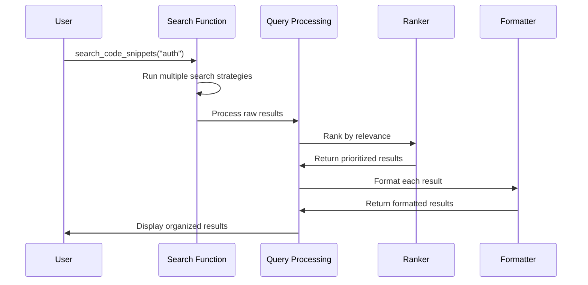

# Chapter 8: Query Result Processing

In [Chapter 7: LLM Function Calling Framework](07_llm_function_calling_framework_.md), we learned how AI models can use tools to search through code. Now, let's explore how LocAgent takes the raw results from these searches and transforms them into something truly useful.

## Introduction: From Chaos to Clarity

Imagine you're using a search engine to find information about "apple pie recipes." If the search engine simply returned a list of all web pages containing the words "apple" and "pie" without any organization, you'd be overwhelmed with thousands of random results.

This is exactly why Query Result Processing is so important in LocAgent. When you search for code related to "user authentication," the raw results might include:
- Functions with the word "authentication" in their name
- Code that imports authentication modules
- Comments mentioning authentication
- Variables storing authentication tokens
- Test files for authentication

The Query Result Processing system acts like a skilled librarian who:
1. Takes all these scattered results
2. Organizes them by relevance
3. Groups related items together
4. Formats them in a consistent, readable way
5. Presents them in a way that helps you solve your problem

## A Real-World Example

Let's start with a concrete example. Imagine you're trying to understand why users sometimes get logged out unexpectedly from your web application:

```python
from plugins.location_tools.repo_ops.repo_ops import search_code_snippets

# Search for code related to the problem
search_results = search_code_snippets(
    search_terms=["user logout", "session expiry"]
)

print(search_results)
```

Without query result processing, you might get back a jumbled mess of code snippets with no organization. But with LocAgent's processing system, you'll instead see something like:

```
##Searching for terms "user logout", "session expiry"...

### Primary Results:
File: src/auth/session_manager.py
function: check_session_validity
line: 34-48
```python
def check_session_validity(user_id, session_token):
    """Check if a user session is still valid or has expired.
    
    Returns:
        bool: True if session is valid, False if expired
    """
    session = get_session(session_token)
    if not session:
        return False
        
    # Check if session belongs to user
    if session.user_id != user_id:
        return False
        
    # Check if session has expired
    current_time = time.time()
    if current_time > session.expiry_time:
        logger.info(f"Session expired for user {user_id}")
        return False
        
    return True
```

### Related Functions:
- src/auth/session_manager.py:get_session (calls)
- src/routes/auth_routes.py:verify_user_logged_in (calls this)
- src/auth/session_manager.py:refresh_session (similar functionality)
```

This processed output doesn't just show you code - it organizes and enriches the information to help you understand the context and relationships.

## How Query Result Processing Works

Let's break down the key components of query result processing:

### 1. Result Collection

First, raw search results are collected from various search strategies:

```python
def search_code_snippets(search_terms, file_path_or_pattern="**/*.py"):
    # Get all files in the repository
    files, _, _ = get_current_repo_modules()
    all_file_paths = [file['name'] for file in files]
    
    # Filter files based on pattern
    include_files = find_matching_files_from_list(
        all_file_paths, file_path_or_pattern
    )
    
    # Search using multiple strategies
    all_query_results = []
    for term in search_terms:
        query_info = QueryInfo(term=term)
        
        # Strategy 1: Entity Search (functions, classes)
        query_results, continue_search = search_entity(
            query_info=query_info, 
            include_files=include_files
        )
        all_query_results.extend(query_results)
        
        # Strategy 2: Content Search (code text)
        if continue_search:
            query_results = bm25_content_retrieve(
                query_info=query_info, 
                include_files=include_files
            )
            all_query_results.extend(query_results)
            
    # Process and format the results
    formatted_results = format_query_results(all_query_results)
    return formatted_results
```

This function collects results using different search strategies but doesn't yet organize or prioritize them.

### 2. Result Structuring

Each search result is wrapped in a `QueryResult` object that captures all relevant information:

```python
class QueryResult:
    def __init__(self, query_info, format_mode, 
                 nid=None, ntype=None, 
                 file_path=None, start_line=None, end_line=None,
                 retrieve_src=None):
        self.format_mode = format_mode      # How to display the result
        self.query_info_list = []           # What was searched for
        self.insert_query_info(query_info)
        self.nid = nid                      # Node ID in the graph
        self.ntype = ntype                  # Type of code element
        self.file_path = file_path          # File containing the code
        self.start_line = start_line        # Starting line number
        self.end_line = end_line            # Ending line number
        self.retrieve_src = retrieve_src    # How it was found
```

This structure captures not just the matched code, but important metadata about:
- What matched (a function, class, or snippet)
- Where it's located (file and line numbers)
- How it was found (exact match, keyword search, etc.)
- How it should be displayed

### 3. Result Ranking

Once we have all results, we need to determine which ones are most relevant. LocAgent uses several ranking methods:

```python
def merge_sample_locations(found_files, found_modules, found_entities, 
                          ranking_method='majority'):
    
    def rank_locs(found_locs, ranking_method="majority"):
        flat_locs = [loc for sublist in found_locs for loc in sublist]
        locs_weights = collections.defaultdict(float)
        
        if ranking_method == "majority":
            # Rank locations by how frequently they appear
            loc_counts = Counter(flat_locs)
            for loc, count in loc_counts.items():
                locs_weights[loc] = count
        
        elif ranking_method == "mrr":
            # Rank based on Mean Reciprocal Rank (MRR)
            for sample_locs in found_locs:
                for rank, loc in enumerate(sample_locs, start=1):
                    locs_weights[loc] += 1 / rank
        
        # Sort by weight (highest first)
        ranked_loc_weights = sorted(
            locs_weights.items(), key=lambda x: x[1], reverse=True
        )
        ranked_locs = [loc for loc, _ in ranked_loc_weights]
        return ranked_locs, ranked_loc_weights

    # Rank files, modules, and functions
    ranked_files, file_weights = rank_locs(found_files, ranking_method)
    ranked_modules, module_weights = rank_locs(found_modules, ranking_method)
    ranked_funcs, func_weights = rank_locs(found_entities, ranking_method)
    
    return ranked_files, ranked_modules, ranked_funcs
```

LocAgent supports two main ranking methods:
- **Majority voting**: Results that appear more frequently are ranked higher
- **MRR (Mean Reciprocal Rank)**: Results that appear earlier in search results get higher weight

This helps ensure that the most relevant code appears at the top of your results.

### 4. Result Formatting

Finally, results are formatted for presentation based on their type and importance:

```python
def format_output(self, searcher):
    cur_result = ''
    
    if self.format_mode == 'complete':
        # Show complete code with context
        node_data = searcher.get_node_data([self.nid], return_code_content=True)[0]
        ntype = node_data['type']
        cur_result += f'Found {ntype} `{self.nid}`.\n'
        cur_result += "Source: " + self.retrieve_src + '\n'
        if 'code_content' in node_data:
            cur_result += node_data['code_content'] + '\n'
        
    elif self.format_mode == 'preview':
        # Show a preview with size-based formatting
        node_data = searcher.get_node_data([self.nid], return_code_content=True)[0]
        ntype = node_data['type']
        cur_result += f'Found {ntype} `{self.nid}`.\n'
        cur_result += "Source: " + self.retrieve_src + '\n'
        
        # For functions, show full code
        if ntype == NODE_TYPE_FUNCTION:
            cur_result += node_data['code_content'] + '\n'
        
        # For larger elements like classes or files, maybe show just structure
        elif ntype in [NODE_TYPE_CLASS, NODE_TYPE_FILE]:
            content_size = node_data['end_line'] - node_data['start_line']
            if content_size <= 100:
                cur_result += node_data['code_content'] + '\n'
            else:
                # For large code, show structure instead of full content
                cur_result += f"Just show the structure due to size:\n"
                code_content = searcher.G.nodes[self.nid].get('code', "")
                structure = get_skeleton(code_content)
                cur_result += '```\n' + structure + '\n```\n'
    
    # Other formatting modes...
    
    return cur_result
```

Different types of results are formatted differently:
- Functions might show their complete code
- Large files might show just their structure
- Code snippets might show a specific range of lines

## The Complete Query Processing Pipeline

Let's see how these components work together:



This pipeline ensures that what started as a simple search query ends as a well-organized, contextually rich set of results.

## Behind the Scenes: The Implementation

Now let's explore the implementation details more deeply.

### QueryInfo: Tracking What Was Searched

The `QueryInfo` class keeps track of what you were searching for:

```python
class QueryInfo:
    def __init__(self, 
                 query_type: str = 'keyword',
                 term: Optional[str] = None,
                 line_nums: Optional[List] = None,
                 file_path_or_pattern: Optional[str] = None):
        self.query_type = query_type
        self.term = term
        self.line_nums = line_nums
        self.file_path_or_pattern = file_path_or_pattern
```

This class captures:
- What type of search was performed (keyword, line number, etc.)
- What term was searched for
- What file patterns were included
- What line numbers were targeted

### QueryResult: Representing a Match

The `QueryResult` class represents one matched result:

```python
class QueryResult:
    def __init__(self, query_info, format_mode, 
                 nid=None, ntype=None, 
                 file_path=None, start_line=None, end_line=None,
                 retrieve_src=None):
        self.format_mode = format_mode
        self.query_info_list = []
        self.insert_query_info(query_info)
        self.nid = nid
        self.ntype = ntype
        self.file_path = file_path
        self.start_line = start_line
        self.end_line = end_line
        self.retrieve_src = retrieve_src
```

Each result knows:
- What it matched (via `nid` and `ntype`)
- Where it's located (via `file_path`, `start_line`, and `end_line`)
- How it was found (via `retrieve_src`)
- How it should be displayed (via `format_mode`)

### Entity Extraction and Resolution

One of the most powerful parts of the processing system is how it extracts and resolves specific code entities:

```python
def get_edit_entities_from_raw_locs(found_edit_locs, searcher, 
                                   include_variable=False):
    found_edit_entities = []
    current_class_name = ""
    prev_file_name = ""
    
    for edit_loc in found_edit_locs:
        pred_file = edit_loc.split(':')[0].strip()
        loc = ':'.join(edit_loc.split(':')[1:]).strip()
        
        # Reset current class when file changes
        if prev_file_name and prev_file_name != pred_file:
            current_class_name = ""
        prev_file_name = pred_file
        
        # Get file content and extract global variables
        if searcher.has_node(pred_file):
            pred_file_content = searcher.G.nodes[pred_file]['code']
            global_vars = parse_global_var_from_code(pred_file_content)
        else:
            continue
        
        # Process different types of location information
        if loc.startswith("line:") or loc.startswith("lines:"):
            # Handle line numbers
            # ...
        elif loc.startswith("class:"):
            # Handle class references
            # ... 
        elif loc.startswith("function:") or loc.startswith("method:"):
            # Handle function/method references
            # ...
            
    # Rank and sort the found entities
    # ...
    
    return res_edit_entities
```

This function takes raw location strings like "function: auth_user" or "line: 45-67" and resolves them to specific code entities in the codebase.

## Practical Applications

Let's see how query result processing helps in real-world scenarios:

### Finding and Fixing Bugs

When tracking down a bug, you need to see both the problematic code and its context:

```python
# Search for code related to a bug
results = search_code_snippets(["session expiry", "unexpected logout"])

# The processed results show:
# 1. The most relevant functions first
# 2. Related functions they call
# 3. Functions that call them
# 4. Code snippets with line numbers
```

This organization helps you quickly understand:
- What code is handling session expiry
- How that code is called
- What context it operates in

### Understanding New Codebases

When joining a new project, you can use query processing to get a high-level overview:

```python
# Find core functionality
results = search_code_snippets(["main", "initialize", "setup"])

# Results are organized to show:
# 1. Entry point functions
# 2. Main classes
# 3. Core initialization routines
```

The processed results help you understand the codebase's structure without having to manually explore files.

## Integration with Other LocAgent Components

Query Result Processing connects with several other LocAgent components:

1. It works with the [Graph Traversal & Search Mechanisms](04_graph_traversal___search_mechanisms_.md) to traverse code relationships.

2. It uses the [Code Block Representation](02_code_block_representation_.md) to understand the structure of code elements.

3. It builds on the [Dependency Graph](03_dependency_graph_.md) to show relationships between different pieces of code.

4. It formats results from the [LLM Function Calling Framework](07_llm_function_calling_framework_.md) to make them human-readable.

## Conclusion

Query Result Processing is the system that transforms raw search results into meaningful, organized information. Like a skilled librarian who doesn't just find books but arranges them in a helpful way, this system ensures that you don't just see matching code, but understand it in context.

By collecting, structuring, ranking, and formatting search results, LocAgent helps you quickly zero in on the most relevant code for your task, understand its relationships, and see it presented in a way that makes sense.

In the next chapter, we'll explore the [Evaluation Framework](09_evaluation_framework_.md), which helps measure how well LocAgent's code localization actually works in practice.

---

Generated by [AI Codebase Knowledge Builder](https://github.com/The-Pocket/Tutorial-Codebase-Knowledge)