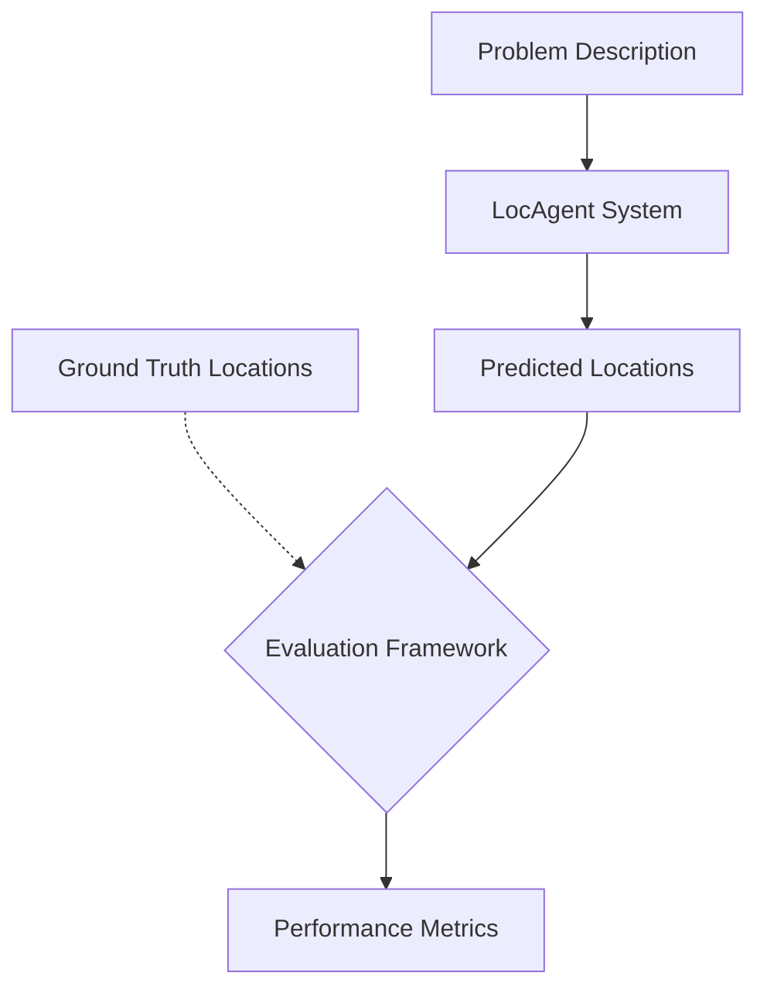
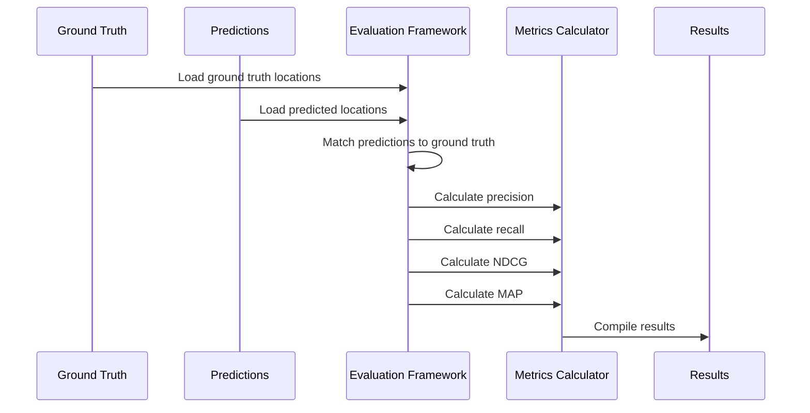

# Chapter 9: Evaluation Framework

In [Chapter 8: Query Result Processing](08_query_result_processing_.md), we learned how search results are organized and presented to users. Now let's explore how we can measure how effective those results actually are.

## Introduction: How Do We Know If It's Working?

Imagine you're a teacher grading a test. You have the answer key (the correct answers) and student responses (the predicted answers). How do you determine how well each student did? You might consider:

- How many questions they got right (accuracy)
- Whether they got the most important questions right (weighted scoring)
- How close their answers were to the correct ones (partial credit)

The **Evaluation Framework** in LocAgent works similarly. When the system tries to find the relevant code for a problem, we need a way to measure how well it performed. Did it find the right files? The right functions? Did it rank the most important code first?



## A Real-World Example

Let's start with a concrete example. Imagine we're fixing a bug in a calculator app:

```
Bug report: The square root function returns incorrect results for negative numbers.
```

After investigating, we know the bug is in these specific locations:
- File: `math_utils.py`
- Function: `math_utils.py:calculate_square_root`

These are our **ground truth** locations - the actual code that needs to be fixed.

When we ask LocAgent to find the code related to this bug, it returns:

1. Function: `math_utils.py:calculate_square_root`
2. Function: `display.py:format_result`
3. Function: `math_utils.py:is_positive`

Now we need to evaluate how well LocAgent performed. Did it find the right code? The Evaluation Framework helps us answer this question with specific metrics.

## Key Evaluation Metrics

The Evaluation Framework uses several metrics to give us a complete picture of performance:

### 1. Precision

**Precision** measures what percentage of the returned results are actually relevant. It answers the question: "Of all the code locations that LocAgent found, how many were actually correct?"

```
Precision = (Number of Correct Locations Found) / (Total Number of Locations Returned)
```

In our calculator example:
- LocAgent returned 3 locations
- Only 1 was correct (`math_utils.py:calculate_square_root`)
- Precision = 1/3 = 0.33 or 33%

### 2. Recall

**Recall** measures what percentage of all relevant results were found. It answers the question: "Of all the locations that should have been found, how many did LocAgent actually find?"

```
Recall = (Number of Correct Locations Found) / (Total Number of Correct Locations)
```

In our calculator example:
- There are 2 correct locations (`math_utils.py` and `math_utils.py:calculate_square_root`)
- LocAgent found 1 of them
- Recall = 1/2 = 0.5 or 50%

### 3. Normalized Discounted Cumulative Gain (NDCG)

**NDCG** measures not just whether relevant results were found, but also whether they were ranked appropriately. It gives more weight to results that appear higher in the list.

This is important because finding the right code but placing it at position #100 isn't as helpful as placing it at position #1.

In our calculator example, LocAgent did well because it placed the most relevant function (`calculate_square_root`) at the top of the list.

### 4. Mean Average Precision (MAP)

**MAP** combines precision and ranking into a single metric. It calculates the average precision at each point where a relevant result is found.

This metric helps us understand the overall quality of the ranked results.

## Using the Evaluation Framework

Now let's see how to use the Evaluation Framework to evaluate LocAgent's performance:

```python
from evaluation.eval_metric import evaluate_results

# Path to your ground truth data
gt_file = "evaluation/gt_location/SWE-bench_Lite/test/gt_location.jsonl"

# Path to LocAgent's prediction output
loc_file = "outputs/localization_results.jsonl"

# What results to evaluate (files, modules, functions)
level2key_dict = {
    'file': 'found_files',
    'module': 'found_modules',
    'function': 'found_entities'
}

# Run the evaluation
results = evaluate_results(
    gt_file=gt_file,
    loc_file=loc_file,
    level2key_dict=level2key_dict
)

# Print the results
print(results)
```

This code evaluates LocAgent's performance at three levels:
1. **File level**: Did it find the right files?
2. **Module level**: Did it find the right modules or classes?
3. **Function level**: Did it find the right functions?

The output might look like:

```
                     file                   module                function
                  P@1    P@3    P@5    P@5    P@10    P@5    P@10
Precision        0.72   0.38   0.26   0.22   0.15   0.18   0.13
Recall           0.65   0.71   0.76   0.58   0.68   0.43   0.53
NDCG             0.72   0.63   0.62   0.48   0.51   0.37   0.41
MAP              0.72   0.54   0.43   0.32   0.27   0.26   0.22
Acc              0.72   0.35   0.24   0.19   0.12   0.16   0.11
```

This report tells us:
- At the file level, the top result (P@1) is correct 72% of the time
- At the function level, the top 5 results (P@5) contain about 43% of all relevant functions

## How to Create Ground Truth Data

But how do we know what the "correct" code locations are? This is where ground truth data comes in.

The Evaluation Framework includes tools to generate ground truth data by analyzing code patches:

```python
from util.benchmark.gen_oracle_locations import generate_oracle_locations_for_dataset

# Generate ground truth data for a dataset
gt_file = generate_oracle_locations_for_dataset(
    dataset="princeton-nlp/SWE-bench_Lite",
    split="test",
    output_dir="evaluation/gt_location",
    repo_base_dir="playground"
)

print(f"Ground truth data generated at: {gt_file}")
```

This function works by:
1. Getting the repository versions before and after a bug fix
2. Analyzing the differences (the patch) to determine what code changed
3. Recording the changed files, modules, and functions as the ground truth

The ground truth data includes exactly what code needed to be modified to fix each bug, which gives us a reliable reference point for evaluation.

## Behind the Scenes: How Evaluation Works

Now let's peek under the hood to see how the evaluation process works:



Let's look at how the evaluation calculation works in code. Here's a simplified version of what happens when we call `cal_metrics_w_file`:

```python
def cal_metrics_w_file(gt_file, loc_file, key, level, k_values):
    # Load ground truth data
    gt_dict = load_gt_dict(gt_file, level)
    
    # Load prediction data
    pred_dict = convert_solutions_dict(load_jsonl(loc_file), key=key)
    
    # Initialize arrays for labels
    _gt_labels = []
    _pred_labels = []
    
    # For each instance in the ground truth
    for instance_id in gt_dict.keys():
        # Get predictions for this instance (up to max_k)
        if instance_id not in pred_dict:
            pred_locs = []
        else:
            pred_locs = pred_dict[instance_id][:max(k_values)]
            
        # Create binary relevance vectors
        gt_labels = [0 for _ in range(max(k_values))]
        pred_labels = [0 for _ in range(max(k_values))]
        
        # Mark ground truth positions as 1
        for i in range(len(gt_dict[instance_id])):
            if i < max(k_values):
                gt_labels[i] = 1
        
        # Mark matching predictions as 1
        for i, loc in enumerate(pred_locs):
            if loc in gt_dict[instance_id]:
                pred_labels[i] = 1
                
        _gt_labels.append(gt_labels)
        _pred_labels.append(pred_labels)
    
    # Convert to tensors for metric calculations
    _pred_target = torch.tensor(_pred_labels)
    _ideal_target = torch.tensor(_gt_labels)
    
    # Calculate metrics for each k value
    result = {}
    for metric in metrics:
        metric_func = METRIC_FUNC[metric]
        name = METRIC_NAME[metric]
        
        for k in k_values:
            value = metric_func(_pred_target, _ideal_target, k=k)
            result[f'{name}@{k}'] = round(value.item(), 4)
            
    return result
```

This function:
1. Loads the ground truth data and predictions
2. For each instance (bug or feature):
   - Creates binary vectors representing relevant/irrelevant items
   - Marks ground truth locations as 1
   - Marks matching predictions as 1
3. Calculates various metrics at different k values
4. Returns the results in a dictionary

## Understanding the Metrics in Detail

Let's dig a bit deeper into how the metrics are calculated:

### Precision@k

```python
def precision_at_k(pred_target, ideal_target, k=None):
    # Only consider the top k predictions
    pred_target = pred_target[:, :k]
    
    # Count how many relevant items were found
    relevant = (pred_target == 1).sum(dim=-1)
    
    # Divide by k to get precision
    precision = relevant / k
    
    # Average across all instances
    return precision.mean(0)
```

This calculates what fraction of the top-k predictions were relevant.

### Recall@k

```python
def recall_at_k(pred_target, ideal_target, k=None):
    # Only consider the top k predictions
    pred_target = pred_target[:, :k]
    
    # Count how many relevant items were found
    relevant = (pred_target == 1).sum(dim=-1)
    
    # Count total number of relevant items
    total_relevant = (ideal_target == 1).sum(dim=-1)
    
    # Divide to get recall
    recall = div_no_nan(relevant, total_relevant)
    
    # Average across all instances
    return recall.mean(0)
```

This calculates what fraction of all relevant items were found in the top-k predictions.

### NDCG@k

```python
def normalized_dcg(pred_target, ideal_target, k=None):
    # Only consider the top k predictions
    pred_target = pred_target[:, :k]
    ideal_target = ideal_target[:, :k]
    
    # Calculate DCG for predictions and ideal ordering
    return div_no_nan(_dcg(pred_target), _dcg(ideal_target)).mean(0)

def _dcg(target):
    # Get dimensions
    batch_size, k = target.shape
    
    # Create position weights (1/log2(i+2))
    rank_positions = torch.arange(1, k + 1, dtype=torch.float32)
    
    # Calculate DCG
    return (target / torch.log2(rank_positions + 1)).sum(dim=-1)
```

This gives more weight to relevant items that appear earlier in the results.

## Real-World Usage: Benchmarking Different Models

One common use case for the Evaluation Framework is to compare different localization models or settings:

```python
# Compare two different models
model1_results = evaluate_results(
    gt_file=gt_file,
    loc_file="outputs/model1_results.jsonl",
    level2key_dict=level2key_dict
)

model2_results = evaluate_results(
    gt_file=gt_file,
    loc_file="outputs/model2_results.jsonl",
    level2key_dict=level2key_dict
)

# Compare the results
print("Model 1 Function-level P@5:", model1_results['function']['P@5'])
print("Model 2 Function-level P@5:", model2_results['function']['P@5'])
```

This helps you determine which model or configuration performs better for your specific needs.

## Generating Ground Truth from Patches

A key part of the Evaluation Framework is generating ground truth data. Let's look at how this works:

```python
def extract_module_from_patch(instance, repo_dir):
    # Get the files changed in the patch
    edit_files = get_oracle_filenames(instance['patch'])
    
    # Filter to just Python files
    filtered_edit_files = [f for f in edit_files if f.endswith('.py')]
    
    # Parse the patch to understand the changes
    file_changes = parse_patch(instance['patch'])
    
    updated_file_changes = []
    for file_change in file_changes:
        file = file_change['file']
        if not file.endswith('.py'):
            continue
            
        target_file_path = os.path.join(repo_dir, file)
        
        # Parse the original file structure
        class_info, function_names, file_lines = parse_python_file(target_file_path)
        old_file_structure = {
            "classes": class_info,
            "functions": function_names,
            "text": file_lines,
        }
        
        # Apply the patch to get the new file
        # (code to apply patch...)
        
        # Parse the new file structure
        class_info, function_names, file_lines = parse_python_file(target_file_path)
        new_file_structure = {
            "classes": class_info,
            "functions": function_names,
            "text": file_lines,
        }
        
        # Determine what changed based on line numbers
        # (code to identify changed modules...)
        
        updated_file_changes.append({
            'file': file,
            'changes': {
                'edited_entities': [...],  # Changed functions/methods
                'added_entities': [...]    # New functions/methods
            }
        })
    
    return updated_file_changes
```

This function:
1. Gets the files changed in a patch
2. Parses the file structures before and after the patch
3. Identifies what specific functions or classes were modified
4. Returns this information as ground truth data

## Using the Framework in Development

The Evaluation Framework isn't just for final assessment - it can help guide development:

1. **Regression Testing**: When you make changes to the localization algorithm, evaluate to ensure performance hasn't decreased

2. **Targeted Improvements**: If metrics show poor performance on certain types of code (like large classes), focus improvements there

3. **Model Selection**: When training different [SFT Models](10_sft_model_training_.md), use evaluation metrics to select the best one

## Connection to Other Parts of LocAgent

The Evaluation Framework connects to several other components in LocAgent:

1. It evaluates the results from the [Code Localization Pipeline](01_code_localization_pipeline_.md), measuring how well the entire system performs.

2. It uses the [Query Result Processing](08_query_result_processing_.md) format to understand and evaluate predicted locations.

3. It provides guidance for [SFT Model Training](10_sft_model_training_.md), helping improve model performance.

## Conclusion

The Evaluation Framework is like a teacher grading the work of LocAgent. By comparing predicted code locations against ground truth, it helps us understand:

- How accurate the localization results are
- Whether important code is ranked highly
- What percentage of relevant code is being found
- Where improvements can be made

With these metrics, we can objectively measure performance, compare different approaches, and continuously improve the system.

In the next chapter, we'll explore [SFT Model Training](10_sft_model_training_.md), which shows how to use the insights from evaluation to train better models for code localization.

---

Generated by [AI Codebase Knowledge Builder](https://github.com/The-Pocket/Tutorial-Codebase-Knowledge)