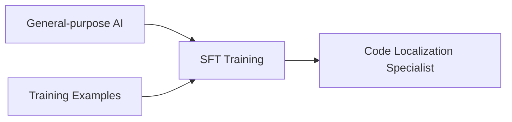
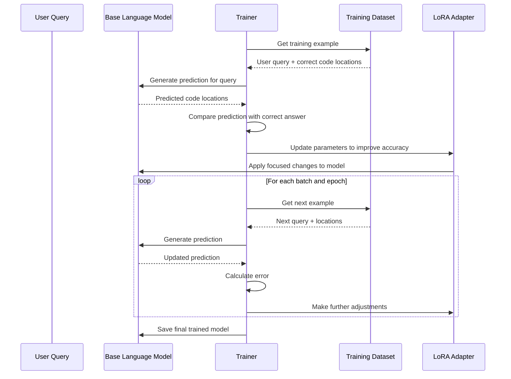

# Chapter 10: SFT Model Training

In [Chapter 9: Evaluation Framework](09_evaluation_framework_.md), we learned how to measure the effectiveness of code localization. Now, let's explore how we can improve those results by training specialized AI models for code localization tasks.

## Introduction: Teaching an AI to Find Code

Imagine you have a new employee who's brilliant at general programming but has never worked with your specific codebase. While they understand programming concepts, they don't know where to find things in your code. You could:

1. Let them learn by trial and error (slow and inefficient)
2. Give them a general manual about code organization (somewhat helpful)
3. **Train them specifically on your codebase by showing examples** (most effective)

Supervised Fine-Tuning (SFT) in LocAgent takes the third approach. We start with a general-purpose AI model that understands programming concepts, then give it specialized training on code localization tasks by showing it many examples of successful localizations.



## A Simple Example

Let's start with a concrete example. Imagine we want to train an AI model to better find authentication-related code:

```python
# Example training instance
training_example = {
    "messages": [
        {
            "role": "user",
            "content": "Find the code responsible for user login failures"
        },
        {
            "role": "assistant",
            "content": "I've analyzed the codebase and found these relevant locations:\n\n"
                       "src/auth/authentication.py:verify_credentials (lines 45-67)\n"
                       "This function checks username and password validity.\n\n"
                       "src/auth/session.py:create_session (lines 28-42)\n"
                       "This handles creating user sessions after successful authentication."
        }
    ]
}
```

When we feed many examples like this to the model, it learns to:
- Recognize important keywords in user requests
- Connect those keywords to relevant code patterns
- Prioritize the most important code locations
- Present results in a clear, helpful format

## Key Components of SFT Training

Let's break down the main components of SFT training:

### 1. Choosing a Base Model

First, we need a solid foundation - a pre-trained model that already understands code:

```python
from unsloth import FastLanguageModel

# Initialize the base model
model, tokenizer = FastLanguageModel.from_pretrained(
    model_name="unsloth/Qwen2.5-Coder-7B-Instruct",  # A model good with code
    max_seq_length=4096,  # How long sequences can be
    load_in_4bit=True     # Use less memory with quantization
)
```

This code loads a pre-trained AI model that already has general knowledge about programming but hasn't been specialized for code localization yet.

### 2. Preparing Training Data

Next, we need examples that show the model what good code localization looks like:

```python
# Load training data from a file
with open("training_data.jsonl") as f:
    dataset = [json.loads(line) for line in f]

# Format conversations for the model
from datasets import Dataset

# Convert to HuggingFace dataset format
dataset = [example["messages"] for example in dataset]
dataset = Dataset.from_dict({"conversations": dataset})
```

The training data consists of conversations where:
- A user asks for help finding specific code
- The assistant responds with the correct code locations

### 3. Configuring the Training Process

Now we set up the training parameters:

```python
# Set up training configuration
training_args = TrainingArguments(
    per_device_train_batch_size=1,   # How many examples to process at once
    gradient_accumulation_steps=4,   # Helps with limited memory
    num_train_epochs=3,              # How many times to go through the data
    learning_rate=2e-4,              # How quickly to learn
    output_dir="outputs/localization_model"  # Where to save results
)
```

These parameters control how the model learns:
- Batch size: How many examples it sees at once
- Epochs: How many times it goes through all examples
- Learning rate: How quickly it adjusts its understanding

### 4. Low-Rank Adaptation (LoRA)

When fine-tuning large models, updating all parameters would require enormous computational resources. LoRA is a smart technique that efficiently updates just a small subset of parameters:

```python
# Configure LoRA for efficient training
model = FastLanguageModel.get_peft_model(
    model,
    r=16,                 # Rank of the update matrices
    target_modules=[      # Which layers to update
        "q_proj", "k_proj", "v_proj", "o_proj",
        "gate_proj", "up_proj", "down_proj",
    ],
    lora_alpha=16,        # Scaling factor for updates
    use_gradient_checkpointing="unsloth"  # Memory optimization
)
```

Think of LoRA like teaching someone to drive your specific car. Instead of re-teaching them all of driving from scratch, you just focus on the unique aspects of your vehicle.

### 5. Training Execution

Finally, we run the training process:

```python
# Set up and start the trainer
trainer = SFTTrainer(
    model=model,
    tokenizer=tokenizer,
    train_dataset=dataset,
    args=training_args
)

# Begin training
training_stats = trainer.train()

# Save the trained model
model.save_pretrained("outputs/localization_model/adapter")
```

During training, the model gradually improves by comparing its predictions to the correct answers and adjusting its parameters accordingly.

## How SFT Training Works Under the Hood

Let's look at what happens during the training process:



During each training step:
1. The model receives a question about finding code
2. It generates a prediction based on its current knowledge
3. The trainer compares this with the correct answer
4. Small adjustments are made to improve future predictions
5. This process repeats thousands of times across all examples

## Implementation Details: Creating a Training Pipeline

Now let's look at how to set up a complete training pipeline. The main script (`sft_train.py`) handles the entire process:

```python
def main():
    # Parse command line arguments
    args = parse_args()
    
    # Create output directory
    os.makedirs(os.path.join(args.output_dir, args.exp_name), exist_ok=True)
    
    # Initialize model and tokenizer
    model, tokenizer = FastLanguageModel.from_pretrained(
        model_name=args.model_name,
        max_seq_length=args.max_seq_length,
        load_in_4bit=args.load_in_4bit
    )
    
    # Set up chat template
    tokenizer = get_chat_template(tokenizer, chat_template="qwen-2.5")
    
    # Load and format training data
    with open(args.data_path) as f:
        dataset = [json.loads(line) for line in f]
    dataset = [D["messages"] for D in dataset]
    dataset = Dataset.from_dict({"conversations": dataset})
    
    # Configure LoRA for efficient training
    model = FastLanguageModel.get_peft_model(
        model,
        r=args.lora_r,
        target_modules=["q_proj", "k_proj", "v_proj", "o_proj",
                        "gate_proj", "up_proj", "down_proj"],
        lora_alpha=args.lora_alpha
    )
    
    # Set up and run trainer
    trainer = SFTTrainer(...)
    trainer_stats = trainer.train()
    
    # Save the model
    model.save_pretrained(os.path.join(args.output_dir, args.exp_name, "adapter"))
```

This script ties together all the components we've discussed:
1. Loading a pre-trained model
2. Preparing training data
3. Configuring LoRA parameters
4. Setting up the trainer
5. Running the training process
6. Saving the fine-tuned model

## Creating Training Data

A critical part of SFT training is having high-quality training data. There are several ways to create it:

### 1. Expert Demonstrations

Have experienced developers solve code localization tasks and record their process:

```python
expert_example = {
    "messages": [
        {
            "role": "user",
            "content": "Find the code that handles image uploads in the mobile app"
        },
        {
            "role": "assistant",
            "content": "After examining the codebase, I found these relevant files:\n\n"
                       "mobile/src/components/ImageUploader.js:uploadImage (lines 34-58)\n"
                       "This is the main function that handles image uploads from the UI.\n\n"
                       "mobile/src/services/api.js:postImage (lines 102-124)\n"
                       "This sends the image data to the server."
        }
    ]
}
```

### 2. Automated Generation

Use the [Evaluation Framework](09_evaluation_framework_.md) to automatically create examples:

```python
def generate_training_example(bug_report, ground_truth_locations):
    # Format the user query from the bug report
    user_content = f"Find the code related to this issue: {bug_report}"
    
    # Format the assistant response with ground truth locations
    assistant_content = "I've analyzed the codebase and found these relevant locations:\n\n"
    for loc in ground_truth_locations:
        assistant_content += f"{loc['file']}:{loc['function']} (lines {loc['start_line']}-{loc['end_line']})\n"
        assistant_content += f"{loc['description']}\n\n"
    
    # Create the training example
    return {
        "messages": [
            {"role": "user", "content": user_content},
            {"role": "assistant", "content": assistant_content}
        ]
    }
```

This function takes bug reports and their known solutions to create training examples automatically.

## Using Your Fine-Tuned Model

After training, you can use your specialized model to find code more effectively:

```python
from transformers import AutoModelForCausalLM, AutoTokenizer

# Load your fine-tuned model
model_path = "outputs/localization_model"
model = AutoModelForCausalLM.from_pretrained(model_path)
tokenizer = AutoTokenizer.from_pretrained(model_path)

# Use it to find code
def find_code(query):
    # Format the input
    messages = [
        {"role": "user", "content": query}
    ]
    input_text = tokenizer.apply_chat_template(messages, tokenize=False)
    
    # Generate a response
    inputs = tokenizer(input_text, return_tensors="pt").to(model.device)
    outputs = model.generate(
        inputs.input_ids,
        max_new_tokens=512,
        temperature=0.7
    )
    
    # Decode the response
    response = tokenizer.decode(outputs[0], skip_special_tokens=True)
    
    # Extract the assistant's message
    return response.split("assistant\n")[-1].strip()

# Example usage
code_locations = find_code("Find code handling user authentication in the mobile app")
print(code_locations)
```

Your fine-tuned model should now be much better at finding relevant code than a general-purpose model.

## Integrating with the Localization Pipeline

The fine-tuned model can be plugged into the [Code Localization Pipeline](01_code_localization_pipeline_.md) to improve its performance:

```python
from util.prompts.pipelines import auto_search_prompt
from util.runtime.function_calling import get_tools
from util.runtime.execute_ipython import auto_search_process

# Set up the localization pipeline with your fine-tuned model
tools = get_tools(
    codeact_enable_search_keyword=True,
    codeact_enable_tree_structure_traverser=True
)

# Use your fine-tuned model in the pipeline
final_output, messages, _ = auto_search_process(
    model_name="outputs/localization_model",  # Your fine-tuned model
    messages=[{
        "role": "user",
        "content": "Find the code that handles password reset"
    }],
    tools=tools
)

print(final_output)
```

The pipeline now uses your specialized model instead of a general-purpose one, leading to more accurate code localization.

## Evaluating Your Fine-Tuned Model

You can use the [Evaluation Framework](09_evaluation_framework_.md) to measure how much your model has improved:

```python
from evaluation.eval_metric import evaluate_results

# Evaluate the base model
base_results = evaluate_results(
    gt_file="evaluation/gt_location/test.jsonl",
    loc_file="outputs/base_model_results.jsonl",
    level2key_dict={
        'file': 'found_files',
        'function': 'found_entities'
    }
)

# Evaluate your fine-tuned model
ft_results = evaluate_results(
    gt_file="evaluation/gt_location/test.jsonl",
    loc_file="outputs/fine_tuned_results.jsonl",
    level2key_dict={
        'file': 'found_files',
        'function': 'found_entities'
    }
)

# Compare the results
print("Base model function P@5:", base_results['function']['P@5'])
print("Fine-tuned model function P@5:", ft_results['function']['P@5'])
```

This comparison helps you understand how much your model has improved at finding the right code.

## Best Practices for SFT Training

To get the best results from your training:

1. **Use diverse examples**: Include different types of code localization tasks (bugs, features, optimizations)

2. **Balance your dataset**: Make sure you have examples covering different parts of your codebase

3. **Start small**: Begin with a smaller dataset and model, then scale up as you learn what works

4. **Monitor for overfitting**: If your model performs well on training data but poorly on new queries, it may be memorizing examples rather than learning general principles

5. **Use evaluation metrics**: Regularly check your model's performance using the [Evaluation Framework](09_evaluation_framework_.md)

## Conclusion

Supervised Fine-Tuning transforms a general-purpose AI model into a specialized code localization expert. By training on examples of successful code localization, the model learns to:

- Better understand code localization queries
- Focus on the most relevant parts of code
- Navigate complex codebases more effectively
- Present results in a clear, helpful way

This specialized training significantly improves the performance of the entire [Code Localization Pipeline](01_code_localization_pipeline_.md), helping developers find relevant code faster and more accurately.

With the completion of this chapter, you now understand the entire LocAgent system - from the basic [Code Localization Pipeline](01_code_localization_pipeline_.md) through the [Dependency Graph](03_dependency_graph_.md) and [Location Tools](06_location_tools_.md), to the advanced [LLM Function Calling Framework](07_llm_function_calling_framework_.md) and finally the specialized training that makes it all work better. You now have the knowledge to use, extend, and improve LocAgent for your own code localization needs.

---

Generated by [AI Codebase Knowledge Builder](https://github.com/The-Pocket/Tutorial-Codebase-Knowledge)