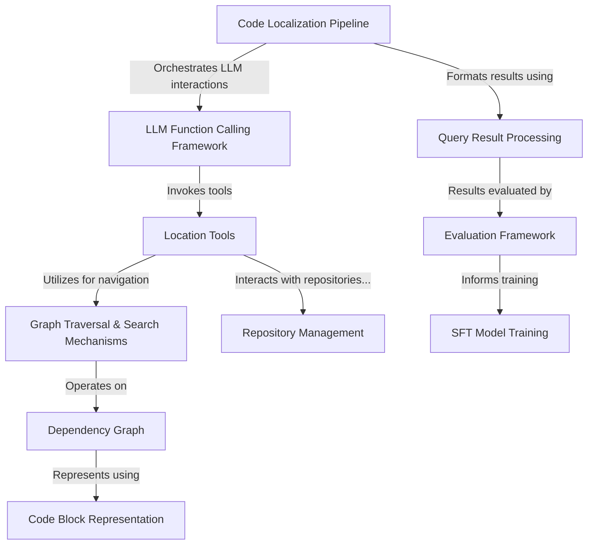

# Tutorial: LocAgent

**LocAgent** is a code localization system that helps developers find relevant code locations in large repositories. It represents the codebase as a **dependency graph** where files, classes and functions are connected by their relationships. When given a problem statement, it uses **language models** to navigate this graph, search for relevant code elements, and rank the results. The system includes tools for code analysis, repository management, and evaluation of localization accuracy, making it a comprehensive solution for code navigation and understanding.

**Source Repository:** [https://github.com/gersteinlab/LocAgent](https://github.com/gersteinlab/LocAgent)

## Chapters

1. [Code Localization Pipeline
](01_code_localization_pipeline_.md)
2. [Code Block Representation
](02_code_block_representation_.md)
3. [Dependency Graph
](03_dependency_graph_.md)
4. [Graph Traversal & Search Mechanisms
](04_graph_traversal___search_mechanisms_.md)
5. [Repository Management
](05_repository_management_.md)
6. [Location Tools
](06_location_tools_.md)
7. [LLM Function Calling Framework
](07_llm_function_calling_framework_.md)
8. [Query Result Processing
](08_query_result_processing_.md)
9. [Evaluation Framework
](09_evaluation_framework_.md)
10. [SFT Model Training
](10_sft_model_training_.md)

---

Generated by [AI Codebase Knowledge Builder](https://github.com/The-Pocket/Tutorial-Codebase-Knowledge)