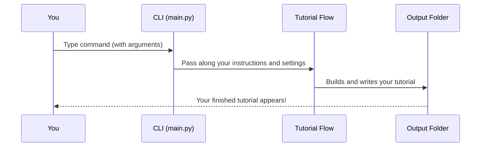

# Chapter 1: Command-Line Interface (CLI)

Welcome to your first step in learning about the `PocketFlow-Tutorial-Codebase-Knowledge` project! 🎉

In this chapter, we'll introduce the **Command-Line Interface (CLI)** – the friendly "control panel" you use to start generating tutorials for your codebase. Even if you're brand new to programming, don't worry! We'll walk through everything step by step, using simple language, helpful analogies, and clear examples.

---

## Why Do We Need a CLI?

Imagine you're baking cookies with a fancy new oven. The **CLI** is like the set of buttons and dials on the oven's front – it's how you tell the oven:

- What kind of cookies you're making (which codebase to use)
- Where your recipe book is (the GitHub repo or folder on your computer)
- Any extra instructions (which files to use, where to save the cookies, etc.)

**Key Use Case:**  
You want to generate a helpful tutorial for your project's codebase. Maybe your project is on GitHub, or it's just some files on your laptop. You use the CLI to tell the tool:

- Where to find the code.
- What to include or skip.
- Where to put the finished tutorial.

And then – magic! The tool does the rest.

---

## What is a CLI? (Plain English)

The CLI is a way to "talk" to a program using text commands typed into a terminal or command prompt window. Instead of clicking buttons, you type what you want, like this:

```bash
python main.py --repo https://github.com/example/project -o my-tutorial
```

Think of it as sending a text message to the tool, telling it what to do.

---

## Key Concepts

1. **Arguments**: Little commands that specify what you want. Examples:  
   - `--repo`: Where the code is on GitHub
   - `--dir`: The code on your computer
   - `-o`: Where to save the tutorial

2. **Include / Exclude Patterns**:  
   - Tell the tool, “only look at files that match these rules.”

3. **Tokens and Language**:  
   - Optional bonus info, like a GitHub token (for bigger repos), or what language to write the tutorial in.

---

## Example: Generating a Tutorial from a GitHub Repo

Let's say you want to create a tutorial for the code at `https://github.com/yourname/rocket`.

Here’s the **minimal** command you’d type:

```bash
python main.py --repo https://github.com/yourname/rocket
```

This tells the tool:

- **Look here:** `https://github.com/yourname/rocket`
- **Use defaults** for everything else (like which files to include and exclude, output folder).

**What happens?**  

- The tutorial tool connects to that repo.
- Downloads the code.
- Figures out which files are important.
- Starts building a tutorial!

You’ll see messages in your terminal showing progress, and finally your tutorial will appear in an `output` folder.

---

### Using More Options

You can add extra options to customize what you want. For example:

```bash
python main.py --dir ./my_project -o my_tutorial --include "*.py" "*.md" --exclude "tests/*"
```

- **`--dir ./my_project`**: Use your local folder
- **`-o my_tutorial`**: Save results in the `my_tutorial` folder
- **`--include "*.py" "*.md"`**: Only use Python and Markdown files
- **`--exclude "tests/*"`**: Skip files in the `tests` folder

Try playing with these options!  
**Tip:** Run `python main.py --help` to see all possibilities.

---

## What's Happening Under the Hood?

Let's peek behind the curtain!  
When you type your command, this is how things flow:



### Walkthrough (No Code)

1. **You type a command** (like `--repo` or `--dir`).
2. **CLI reads your options** and checks what you want.
3. CLI **bundles up all your info** (which repo, include/exclude rules, language, etc.).
4. CLI **starts the flow** that generates the tutorial.
5. The **results are saved** in your output folder.

---

## How Does the CLI Work in Code?

The magic happens in the `main.py` file at the root of the project.

Let’s break it down into smaller, easy pieces.

### 1. Reading Your Inputs

The CLI uses Python's `argparse` to read what you type.

```python
import argparse

parser = argparse.ArgumentParser(description="Generate a tutorial for a GitHub codebase or local directory.")

source_group = parser.add_mutually_exclusive_group(required=True)
source_group.add_argument("--repo", help="URL of the public GitHub repository.")
source_group.add_argument("--dir", help="Path to local directory.")
```

*Explanation*:  
The program checks if you’ve given it a repository or a folder – but not both! You must pick one.

### 2. Gathering Extra Options

More options help you customize what happens:

```python
parser.add_argument("-o", "--output", default="output", help="Base directory for output")
parser.add_argument("--language", default="english", help="Language for the tutorial")
# etc...
args = parser.parse_args()
```

*Explanation*:  
You can now change things like where your tutorial goes, or what language it’s in.

### 3. Packing Your Settings in a Box

All your choices are packed into a dictionary called `shared`, ready to be passed to the next part of the pipeline.

```python
shared = {
    "repo_url": args.repo,
    "local_dir": args.dir,
    "output_dir": args.output,
    "language": args.language,
    # ...and more!
}
```

*Explanation*:  
This is like a big basket of everything you care about for this run.

### 4. Kicking Off the Workflow

This line starts the real tutorial creation engine:

```python
from flow import create_tutorial_flow

tutorial_flow = create_tutorial_flow()
tutorial_flow.run(shared)
```

*Explanation*:  
The CLI hands your basket of settings to the pipeline.
For the details of this process, check out [Tutorial Generation Flow](02_tutorial_generation_flow_.md).

---

## Visual Summary

Here’s an analogy:

> **CLI:** Like ordering pizza by phone. You pick toppings, size, delivery address.
>
> **The rest of the system:** Cooks the pizza and delivers it to your door!

---

## Where Next?

Congratulations! Now you know how the Command-Line Interface acts as the front door to the tutorial generator.  
You can launch tutorial creation, tell it what you want, and sit back as the rest of the system works for you.

In the next chapter, we’ll take a closer look at *what happens inside* once the CLI has launched the process.  
Learn about the **"Tutorial Generation Flow"** in [Tutorial Generation Flow](02_tutorial_generation_flow_.md).

---

*Ready to go deeper? Click next to follow the journey behind the scenes!*

---

Generated by [AI Codebase Knowledge Builder](https://github.com/The-Pocket/Tutorial-Codebase-Knowledge)
