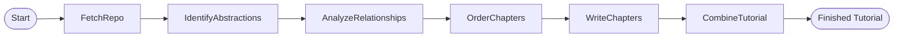
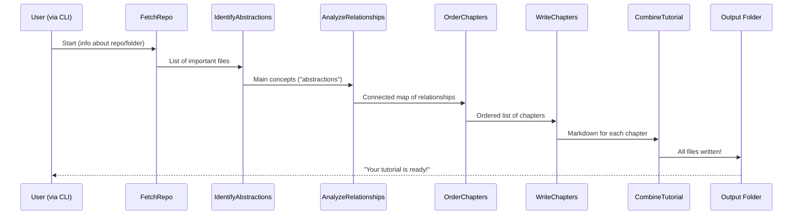

# Chapter 2: Tutorial Generation Flow

*[Transition from previous chapter]*  
Great! In [Chapter 1: Command-Line Interface (CLI)](01_command_line_interface__cli__.md), you learned how to start your tutorial creation journey using commands. Now, let’s step behind the curtain and see **how the whole tutorial generator magically transforms your codebase into a friendly learning guide**. Welcome to the **Tutorial Generation Flow**!

---

## Why Do We Need a Tutorial Generation Flow?

Think of the Tutorial Generation Flow as the **master chef** in a kitchen. When you place your order (via the CLI), the master chef organizes the entire cooking process:

- Collects the right ingredients (code files),
- Breaks them down into manageable pieces (abstractions),
- Figures out how everything connects (relationships),
- Prepares each section in the right order (chapters),
- Cooks each dish (writes content),
- And finally, serves you a delicious, step-by-step tutorial!

This flow ensures *each part of the process happens in the right order*, so your final tutorial is clear, logical, and helpful.

---

## What Does the Flow Actually Do?

At a high level, the Tutorial Generation Flow:

1. **Gathers the code** (from your repo or folder).
2. **Finds the big ideas** in the code (core abstractions).
3. **Connects the dots** (how these pieces relate).
4. **Organizes the story** (chapter order).
5. **Writes each chapter** (super beginner-friendly!).
6. **Combines everything** into a tutorial package you can enjoy.

Let’s break down each step in an easy-to-understand way.

---

## Meet the Main Steps (The “Recipe”)

Here’s a *simple recipe* for turning your codebase into a great tutorial:

1. **FetchRepo** – *Get the Ingredients*  
   Collects all relevant files from your GitHub repo or local folder.

2. **IdentifyAbstractions** – *Spot the “Main Dishes”*  
   Finds the most important pieces (“abstractions”) of your codebase—like major classes, modules, or patterns.

3. **AnalyzeRelationships** – *See How Dishes Compliment Each Other*  
   Figures out how these pieces work together and interact.

4. **OrderChapters** – *Plan the Menu*  
   Decides the best sequence to explain concepts, building from simple to complex.

5. **WriteChapters** – *Cook Up Clear Chapters*  
   Writes beginner-friendly explanations, step by step, for each concept, using code examples, diagrams, and analogies.

6. **CombineTutorial** – *Serve the Meal*  
   Packages all chapters into a complete, navigable tutorial with an index and links between chapters.

### Visual Map: The Flow at a Glance



---

## Example: Walking Through a Simple Tutorial Generation

Let’s look at a practical example. Suppose you type this command:

```bash
python main.py --repo https://github.com/example/project
```

Here’s what happens behind the scenes:

1. **FetchRepo** grabs all `.py`, `.md`, etc., files from your repo.
2. **IdentifyAbstractions** asks: “What are the biggest, most useful parts of this codebase?” (e.g., the main app controller, database handler).
3. **AnalyzeRelationships** answers: “How do these big pieces communicate or depend on each other?”
4. **OrderChapters** thinks: “If a beginner wants to learn this project, what should they learn first, second, third…?”
5. **WriteChapters** creates easy-to-read Markdown for each main concept, adding diagrams and code walk-throughs.
6. **CombineTutorial** brings it all together into an output folder, with an `index.md` showing the whole structure.

**Result:**  
You get a beginner-friendly tutorial, ready to help anyone understand your code, even if they’re new to programming!

---

## How Is the Flow Built in Code?

Let’s take a very beginner-friendly peek at the code (don’t worry if you’ve never programmed!):

**The Pipeline is Assembled Like Building Blocks:**

```python
def create_tutorial_flow():
    fetch_repo = FetchRepo()
    identify_abstractions = IdentifyAbstractions(max_retries=5, wait=20)
    analyze_relationships = AnalyzeRelationships(max_retries=5, wait=20)
    order_chapters = OrderChapters(max_retries=5, wait=20)
    write_chapters = WriteChapters(max_retries=5, wait=20) # Handles multiple chapters at once!
    combine_tutorial = CombineTutorial()

    # Link each step to the next:
    fetch_repo >> identify_abstractions
    identify_abstractions >> analyze_relationships
    analyze_relationships >> order_chapters
    order_chapters >> write_chapters
    write_chapters >> combine_tutorial

    # Start the flow!
    tutorial_flow = Flow(start=fetch_repo)
    return tutorial_flow
```

**What This Means:**  
Each step “hands off” its results to the next, like a relay race. We collect files, find the big pieces, see how they connect, decide the teaching order, write clear chapters, and finally, package it all up.

---

## What Happens At Each Step?

Let’s relate each step to real-life, and peek inside:

### 1. FetchRepo

- **Role:** Collect all the source files you want to explain.
- **Analogy:** The chef gets all the ingredients ready.
- **Result:** A list of all the files that *might* be important.

### 2. IdentifyAbstractions

- **Role:** Detects the key concepts or main building blocks in the code.
- **Analogy:** The chef decides which ingredients are star players in the recipe.
- **Result:** A list like: “DatabaseManager”, “AppRouter”, etc.

### 3. AnalyzeRelationships

- **Role:** Maps out how the big pieces interact.
- **Analogy:** The chef decides which dishes are served together, or which sauce goes with what.
- **Result:** A “network map” of connections.

### 4. OrderChapters

- **Role:** Puts the teaching order together.
- **Analogy:** The chef creates a menu: appetizer, main course, dessert — so each builds on what came before.
- **Result:** The sequence of tutorial chapters.

### 5. WriteChapters

- **Role:** Crafts each chapter for beginners, one concept at a time.
- **Analogy:** The chef assembles each dish, step by step, and describes it.
- **Result:** Markdown files that explain one thing at a time, with code snippets, analogies, and visual diagrams.

### 6. CombineTutorial

- **Role:** Stitches everything together into a single, polished package.
- **Analogy:** The chef places each dish on the table in order, with a menu and helpful guides.
- **Result:** An output folder with an `index.md` and one file per chapter, all connected with links.

---

## What Does the User Need to Do?

Nothing extra!  
**Just run your CLI command — the pipeline does _everything_ else.**

---

## Peek Behind the Scenes: How Steps Connect

Here’s how the pieces *talk* to each other, step by step:



---

## Quick Example: From Start to Finish

Let’s imagine a tiny project:

- `main.py` (runs the app)
- `database.py` (saves user info)
- `router.py` (routes web requests)

**Step-by-step:**

1. **FetchRepo:** Finds all three files.
2. **IdentifyAbstractions:** Names “App Runner”, “Database Manager”, and “Request Router”.
3. **AnalyzeRelationships:** Charts that “App Runner” uses the database and router.
4. **OrderChapters:** Decides to start with “App Runner”, then cover the other two.
5. **WriteChapters:** Makes a super-clear tutorial for each part, linking them.
6. **CombineTutorial:** Creates a table of contents, links everything, and outputs your tutorial folder!

---

## Why Is This Flow So Powerful?

- **Automates** a tedious process — saves you hours!
- **Guarantees** a logical story for the reader.
- **Adapts** to any project, big or small.
- **Uses AI** to write chapters in a way that’s friendly to total newcomers, even adding diagrams and analogies.

---

## What’s Next?

**Congratulations!**  
You now know how the Tutorial Generation Flow turns raw code into a clear, step-by-step learning journey.

**Ready to dig into the *first step* of this recipe?**  
In the next chapter, we’ll explore how the code-finding “crawlers” work to fetch your project files.

➡️ [Go to Chapter 3: Codebase Fetching (Crawlers)](03_codebase_fetching__crawlers__.md)

---

Generated by [AI Codebase Knowledge Builder](https://github.com/The-Pocket/Tutorial-Codebase-Knowledge)