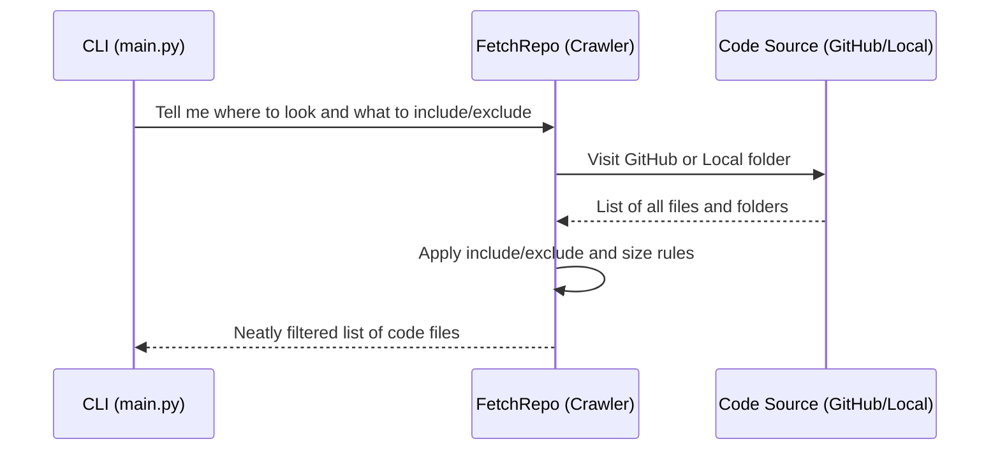
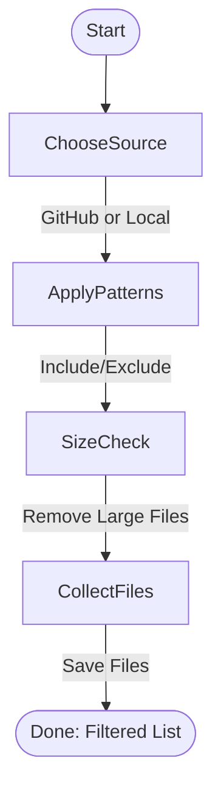

# Chapter 3: Codebase Fetching (Crawlers)

*[Transition from previous chapter]*  
Fantastic progress so far! In [Chapter 2: Tutorial Generation Flow](02_tutorial_generation_flow_.md), you discovered how the tutorial builder turns a codebase into a structured learning journey. Now, let’s explore the crucial *first step* of that process—**how the system finds and organizes the code you want to teach about**.  
Welcome to the world of **Codebase Fetching (Crawlers)**!

---

## Why Do We Need Codebase Crawlers?

Imagine you just started a new job at a library with thousands of books. Your task: make a "Beginner’s Guide" to the most important topics. But first, you need to **find and gather only the relevant books**—not everything on the shelves.

In software, our “books” are code files, and these files might live:

- In a **GitHub repository** (online)
- In a **folder on your own computer** (local directory)

Our crawlers are like smart little robots. Their job: **browse through all those files, filter out anything irrelevant, and bring back just the pieces we want to learn from.**

---

## A Simple Use Case: Building a Tutorial for Your Project

Let’s say you want to generate a tutorial from your project’s code, which is stored on GitHub at  
`https://github.com/myusername/my-app`.

When you run the command:
```bash
python main.py --repo https://github.com/myusername/my-app --include "*.py" --exclude "tests/*"
```
The tutorial tool needs to:

1. **Visit your GitHub repo**
2. **Find all the Python files** (`*.py`), but **ignore the "tests" folder**
3. **Skip files that are too big** (so the tool doesn’t slow down or get stuck)
4. **Download only the good stuff**—ready for analysis!

If your project is on your own laptop, just swap `--repo` for `--dir`:
```bash
python main.py --dir ./my-app --include "*.py" --exclude "tests/*"
```

---

## Key Concepts in Codebase Crawling

Let’s break down the main ideas, just like you’d explain them to a friend:

### 1. **Crawlers: The Cataloging Robots**

- **GitHub Crawler:**  
  “Looks” at your online repo, navigates folders, and collects the right files.
  
- **Local Directory Crawler:**  
  “Walks” through folders on your computer and picks out the files you care about.

### 2. **Filtering: Only Keep What’s Important**

- **Include Patterns:**  
  Like saying, “Bring me only the cookbooks and science books!” (For code: `*.py`, `*.md`, etc.)
  
- **Exclude Patterns:**  
  Like saying, “But skip anything from the dusty ‘old recipes’ shelf.” (For code: `tests/*`, `.git/*`, etc.)

### 3. **File Size Limits**

- We don’t want huge files (they can slow everything down).
- The crawler skips anything larger than a certain size (by default, 1MB).

---

## How to Use the Crawlers (In Practice)

You, the user, **don’t need to write any fancy code**—the CLI does the hard work. But let’s see a simple example:

```bash
python main.py --repo https://github.com/realpython/python-guide --include "*.py" "*.md" --exclude "docs/*" --max-file-size 102400
```
- **What happens?**  
  - The crawler visits your GitHub repo.
  - It includes only `.py` and `.md` files.
  - It skips anything in the `docs/` folder.
  - It ignores any file bigger than 100KB.

You’ll see messages like:
```
Crawling repository: https://github.com/realpython/python-guide...
Added src/main.py (3042 bytes)
Skipping docs/index.md: does not match include/exclude patterns
Fetched 12 files.
```
**Result:**  
A tidy list of files, ready for the rest of the tutorial pipeline!

---

## How Does the Crawler Work Internally?

Let’s peek “under the hood” to demystify these crawlers, step by step.

### Step-by-Step Walkthrough



#### What happens:

1. **CLI passes your preferences** (“repo here, exclude these, only use these patterns…”)
2. **Fetcher (the crawler) starts crawling:**
   - Visits the repo (GitHub or local)
   - Reads through all the files and folders
3. **Applies filters and size limits**
4. **Returns a list of the right files** (with their contents!) for later steps

---

### How Filtering Works (Real Example!)

Imagine your project folder looks like this:

```
my-app/
├── main.py
├── helpers.py
├── README.md
├── tests/
│   └── test_main.py
└── docs/
    └── notes.md
```

You run:
```bash
python main.py --dir ./my-app --include "*.py" --exclude "tests/*" "docs/*"
```

- **What does the crawler do?**
    - **Includes:** `main.py`, `helpers.py`
    - **Excludes:** anything in `tests/` or `docs/`
    - **Ignores:** `README.md`, `notes.md` (they’re not `.py` files)

**Final result:**  
```
Included: main.py
Included: helpers.py
```

---

### Example: Code Snippet — Local File Crawling

Here’s a *super simplified* version of how the local crawler works:

```python
import os
import fnmatch

def crawl_local_files(directory, include_patterns, exclude_patterns, max_file_size):
    files_dict = {}
    for root, _, files in os.walk(directory):
        for filename in files:
            filepath = os.path.join(root, filename)
            relpath = os.path.relpath(filepath, directory)
            # Only include if matches pattern
            if include_patterns and not any(fnmatch.fnmatch(relpath, pat) for pat in include_patterns):
                continue
            if exclude_patterns and any(fnmatch.fnmatch(relpath, pat) for pat in exclude_patterns):
                continue
            if max_file_size and os.path.getsize(filepath) > max_file_size:
                continue
            with open(filepath, 'r', encoding='utf-8') as f:
                files_dict[relpath] = f.read()
    return files_dict
```

*What does this do?*  
- Walks through all folders/files
- Checks each one against your include/exclude wishes
- Skips files that are too big
- Reads and saves the content for only the “good” files

---

### Example: Code Snippet — GitHub Crawling

Crawling GitHub is similar, but it uses the GitHub API to get file lists and download contents. Here’s the “core logic” in plain English:

```python
def crawl_github_files(repo_url, include_patterns, exclude_patterns, max_file_size, token):
    # 1. Connect to GitHub using your info (may need a token)
    # 2. List all files and folders in the repo/branch
    # 3. For each file:
    #     a. Skip if it's too big or in an exclude pattern
    #     b. Include if it matches an include pattern
    #     c. Download file content
    # 4. Return the collected files as a dictionary
```

**You don’t need to worry about the details**—the tutorial builder takes care of it!

---

## A Non-Code, Step-by-Step Example

Imagine you tell the tool:
> "Go to my GitHub repo, and bring me all Python and Markdown files, but ignore test files and anything bigger than 500KB."

Here’s how it works in real life:
- The crawler “walks” through all folders in your repo.
- It picks out each file:
    - “Is this a `.py` or `.md` file?” ✅
    - “Is this in the `tests/` folder?” ❌ (skip)
    - “Is it smaller than 500KB?” ✅
    - If yes, it **downloads** the content!
- When done, it hands back a clean, filtered set of code files.

---

## What’s Under the Hood? (Behind-the-Scenes View)

Let’s peek at the “recipe” the crawler follows (in plain steps):

1. **Figure out where to look**
   - Is it a GitHub repo? A local directory?
2. **Apply include/exclude rules**
   - Like a librarian with a checklist!
3. **Skip files that are too big**
   - No time for encyclopedias when you just want the basics.
4. **Read and store the good files**
   - Each file is saved by name **and** content, ready for analysis.

Here’s a visual summary:



---

## When Would You Change the Patterns?

You might want to:

- **Exclude documentation:**  
  `--exclude "docs/*"`
- **Only analyze code, not config:**  
  `--include "*.py" "*.js"`
- **Ignore everything except notebooks:**  
  `--include "*.ipynb"`

Try out combinations to get *just the files you want to teach about*!

---

## What Happens Next?

Once the crawlers finish, the **next steps** take over—analyzing your code, spotting "big ideas," and building chapters.  
But **none of that can happen** until the right files have been fetched and filtered by these smart robots.

---

## Recap: Why This Matters

- **Crawlers are the library workers**—they decide *what books to bring to the study table.*
- They are **flexible and powerful**: just tell them what you want (via CLI patterns), and they’ll fetch it for you.
- **You save time and effort**—only teaching about the files that matter!


---

## Up Next

Congratulations!  
You now understand how **Codebase Fetching (Crawlers)** are the unsung heroes of the tutorial-building process—quietly delivering just the right code for your learning journey.

In the next chapter, we’ll see how the system starts to **spot the main ideas and building blocks in your codebase**.  
Ready? Continue with [Node and BatchNode Abstractions](04_node_and_batchnode_abstractions_.md) to discover how each step in the pipeline is structured and managed!

---

---

Generated by [AI Codebase Knowledge Builder](https://github.com/The-Pocket/Tutorial-Codebase-Knowledge)