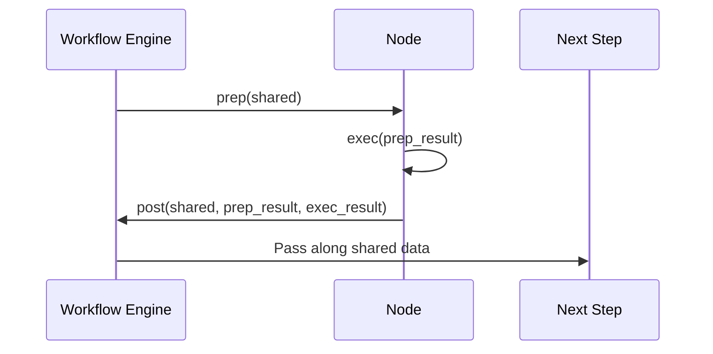
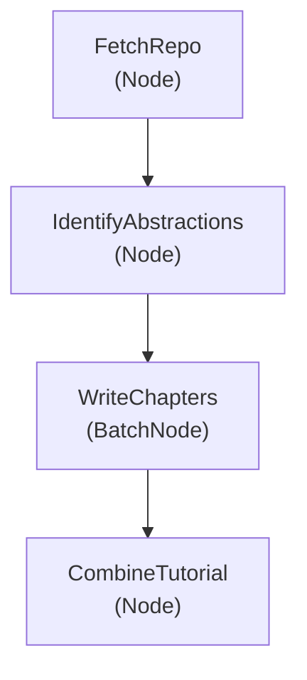

# Chapter 4: Node and BatchNode Abstractions

*[Transition from previous chapter]*  
In [Chapter 3: Codebase Fetching (Crawlers)](03_codebase_fetching__crawlers__.md), you discovered how the "crawlers" collect and organize just the right files from your project. Now, have you ever wondered **how the rest of the system knows how to coordinate** each step—fetching files, analyzing structure, writing chapters, and more?  
This is where **Node** and **BatchNode** come into play!  
Let's meet the clever workers behind the scenes.

---

## Why Do We Need Node and BatchNode?

Imagine you’re at a **toy factory**. There are many stations:  
- One paints the toy pieces,
- One puts them together,
- Another checks the quality,  
- And so on.

Wouldn’t it be confusing if everyone did everything at once, or nobody knew who’s responsible for each task?  
That’s why we need **workers (or stations) that each handle just one step**—efficiently, reliably, and in the right order.

In our tutorial-building tool, **Node** and **BatchNode** are like these workers. Each has a clear job and knows how to talk to the next worker. This keeps the whole assembly line smooth and easy to manage!

---

## What are Node and BatchNode?

Let’s break down these two important concepts:

### 1. Node: The “Single-Task Worker”

A **Node** is a building block for a *single* step in the process.  
Each node:

- **Prepares** what it needs (`prep`): collects its materials.
- **Executes** the main action (`exec`): does its work (like analyzing code structure, or creating a diagram).
- **Posts** results for the next step (`post`): passes along its finished product.

Think: **One Node = One Task** (e.g. “fetch files”, “analyze relationships”)

### 2. BatchNode: The "Bulk Worker"

A **BatchNode** is a special type of Node that works on **many items, one at a time or in groups** (but as a single logical step).

For example, imagine you want to write *all* the tutorial chapters—one for each main concept in your codebase.  
You don’t want to have to write separate code to handle each chapter individually,  
so **BatchNode** elegantly loops over all items, managing them as a batch.

---

## Example Use Case:  
**Building the Tutorial Chapter Files**

Suppose we have to write chapters about 5 different concepts we found in your codebase:

- App Setup
- Data Loader
- Neural Network
- Training Loop
- Results Visualization

Here’s how **BatchNode** makes this easy:

- It prepares **all the concepts** as a list.
- For each one, it runs the same process (creates a beginner-friendly chapter).
- It gathers all the chapters into a neat package.

Without BatchNode, we’d have to write repetitive code for each concept.  
**With BatchNode, it loops through them all—like a machine that stamps out 100 badges one after another!**

---

## Key Parts of a Node (and BatchNode)

Let’s see the main ingredients each Node uses, in super-simple terms:

1. **prep**  
   Prepares the data it needs.  
   (Gathers the ingredients!)

2. **exec**  
   Does the main work.  
   (Cooks the dish!)

3. **post**  
   Shares results with the rest.  
   (Puts the dish on the serving tray!)

**BatchNode** does the same, but its `prep` prepares a **list of items**,  
and its `exec` is called once for each item in that list.

---

## Minimal Example: How a Node Works (In Code)

Below is a simplified view of a Node.  
Don’t worry about the syntax—just look for the *story*:

```python
class ExampleNode(Node):
    def prep(self, shared):
        files = shared["files"]    # Gather input files
        return files               # Pass to next step

    def exec(self, files):
        results = []
        for f in files:
            # Do something, like analyze each file
            results.append(f"Analyzed {f}")
        return results

    def post(self, shared, prep_res, exec_res):
        shared["analysis_results"] = exec_res   # Share with next node
```

**Explanation:**  
- `prep`: Grabs what this Node needs.
- `exec`: Processes (here, analyzes) each file.
- `post`: Saves results for the rest of the system.

---

## Minimal Example: How a BatchNode Works

Here’s a simple BatchNode that writes chapters for a list of concepts:

```python
class WriteChapters(BatchNode):
    def prep(self, shared):
        concepts = shared["concepts"]  # E.g. ["App Setup", "Neural Network"]
        return concepts                # Will process each one

    def exec(self, concept):
        # Write one chapter for the concept
        return f"# {concept}\nNice explanation here!"

    def post(self, shared, prep_res, exec_res_list):
        shared["chapters"] = exec_res_list  # List of all written chapters
```

**Explanation:**  
- `prep`: Prepares a list of jobs.
- `exec`: Runs once for **each** job—here, each concept.
- `post`: Collects all outputs in one list.

---

## What Happens When a Node Runs? (Step-by-Step)

Let’s walk through a Node’s life like an assembly line:



- **prep**: The Node gets what it needs (like tools or ingredients).
- **exec**: The Node does its main work.
- **post**: The Node tells the rest of the system what it accomplished!

---

## Real-Life Example from This Project

One of the key Nodes is `FetchRepo`, which collects all your code files!

**File: nodes.py**

```python
class FetchRepo(Node):
    def prep(self, shared):
        # Figure out which files to get
        return {
            "repo_url": shared.get("repo_url"),
            # ... plus other options
        }

    def exec(self, prep_res):
        # Actually fetch the files (from GitHub or local)
        files = crawl_github_files(...)  # or crawl_local_files(...)
        return list(files.items())

    def post(self, shared, prep_res, exec_res):
        shared["files"] = exec_res  # Now next steps can use these files!
```

**Takeaways:**  
- Each Node is focused & self-contained.
- It doesn’t “know” about the bigger picture—just its own task.
- The main logic (fetching files) is neatly packaged.

---

## Digging Deeper: What Does a BatchNode Look Like Internally?

Let’s look at the crucial `WriteChapters` BatchNode from your project.

**File: nodes.py**  
(Snippet, simplified for readability!)

```python
class WriteChapters(BatchNode):
    def prep(self, shared):
        chapter_order = shared["chapter_order"]  # Which chapters to write
        abstractions = shared["abstractions"]    # List of key concepts
        items_to_process = []
        for i, idx in enumerate(chapter_order):
            concept_name = abstractions[idx]["name"]
            items_to_process.append({
                "chapter_num": i + 1,
                "concept_name": concept_name,
                # ...more context
            })
        return items_to_process  # BatchNode will loop over each

    def exec(self, item):
        # For each item (chapter), write the content
        chapter_num = item["chapter_num"]
        concept_name = item["concept_name"]
        return f"# Chapter {chapter_num}: {concept_name}\n..."

    def post(self, shared, prep_res, exec_res_list):
        shared["chapters"] = exec_res_list  # All chapters are now available
```

**What does this mean?**

- `prep` builds a **list of tasks** (one for each chapter).
- `exec` is called once for each—writing that chapter.
- `post` gathers all the results together.

The system takes care of calling `exec` for each item, all in order!

---

## Why Are Node and BatchNode Useful?

- **Organization:** Each Node/BatchNode handles a single responsibility.  
- **Flexibility:** Easily add, remove, or rearrange steps in your pipeline.
- **Clarity:** Easy to understand, maintain, and debug.  
- **Parallelization:** BatchNode could (in the future) let the system process items faster, since many “workers” can handle separate items at once.

---

## Visual Analogy: The Workflow Assembly Line


- Each block is a worker.
- Some (like `WriteChapters`) can process a *list* of items.

---

## Important Tips

- **Writing New Steps:** To add your own pipeline step, subclass `Node` or `BatchNode`, and fill in your custom `prep`, `exec`, and `post`.
- **Connecting Steps:** Nodes can pass info to the next via the `shared` data dictionary.
- **Error Handling:** Each Node is self-contained; if something fails, you know exactly *where*!

---

## Recap: How Node and BatchNode Power the Pipeline

- **Nodes** are like expert workers—each does *one* specific job in the pipeline.
- **BatchNodes** are special workers that can do the same job for *many items* in a batch.
- Each step (fetching files, analyzing code, writing chapters, etc.) is a Node or BatchNode.
- This keeps the entire tutorial creation system clean, understandable, and easy to extend.

---

## Up Next

Awesome job! Now you know the **building blocks that structure each stage of tutorial creation** in the system. From this foundation, the pipeline can reliably interact with powerful AI models, analyze relationships, and write truly beginner-friendly guides for any codebase.

Ready to see how the system engages with language models to generate explanations and content? Continue your journey in  
[Chapter 5: LLM Interaction and Prompting](05_llm_interaction_and_prompting_.md)!

---

---

Generated by [AI Codebase Knowledge Builder](https://github.com/The-Pocket/Tutorial-Codebase-Knowledge)