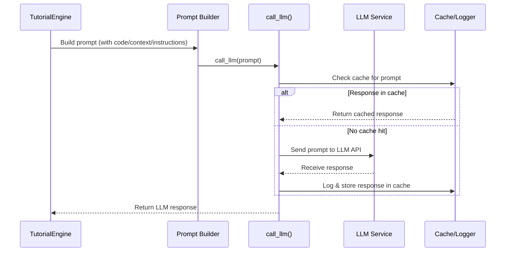

# Chapter 5: LLM Interaction and Prompting

*[Transition from previous chapter]*  
In [Chapter 4: Node and BatchNode Abstractions](04_node_and_batchnode_abstractions_.md), you discovered the "assembly line" system that organizes the entire tutorial-building process. But who does all the *explaining*? Who actually reads your code and writes those clear, human-friendly guides?  
The answer: that job goes to our Large Language Model—a super-smart “intelligent assistant” that works inside your computer’s pocket!  
Let's learn how this LLM interacts with the system, how it gets called, and how it turns code into knowledge using smart prompting.

---

## Why Do We Need LLM Interaction and Prompting?

Imagine you've walked into a library and found a book written in a language you don't fully understand, full of weird symbols and complex ideas.  
Wouldn't it be nice if you had a **knowledgeable assistant** at your side—one who could read it, break down every chapter, and re-explain it all back to you using plain, simple stories and analogies?

That’s exactly what our “LLM Interaction and Prompting” system does:
- It connects the *codebase* to a powerful Large Language Model (LLM), like Google Gemini or OpenAI’s Assistant,
- It asks the LLM specific, structured questions (called **prompts**),
- It manages logging, caching, and model choice behind the scenes,
- And it translates code into truly beginner-friendly guides.

**Key Use Case:**  
You want to convert cryptic code into a friendly, step-by-step guide. The LLM reads your code, thinks like an expert, and writes explanations anyone can understand.

---

## What Is an LLM, and What Is Prompting? (Plain English)

### Large Language Model (LLM):

Think of an LLM as a super-smart robot:
- **Reads and analyzes text/code**
- **Understands context, patterns, and meaning**
- **Writes new explanations, stories, summaries, code, diagrams, and more**
- *Examples:* Google Gemini, OpenAI GPT, Anthropic Claude

### Prompting:

A **prompt** is just a well-crafted instruction or question sent to the LLM.  
- It tells the LLM *what to do*.
- How well you “prompt” determines how good (or not!) the answer will be.
- Prompts can include instructions, code snippets, and formatting rules.

---

## Where Does LLM Interaction Happen in the Tutorial Pipeline?

Let’s walk through a real-life example in the system:

- The system needs to **identify the key concepts** (“abstractions”) in your codebase.
- It creates a prompt like:
  > “Given all this code, list the main ideas and explain each as if teaching a beginner. Use analogies!”
- The LLM responds with:
  > ```
  > - name: Query Processing  
  >   description: Handles incoming questions. It's like a restaurant host.
  >   file_indices: [...]
  > ```
- The system repeats this process to analyze relationships, order chapters, and even write full lesson content!

**In short:** Every explanatory or creative step in the tutorial builder is powered by clever prompting to an LLM.

---

## Key Concepts: LLM Interaction & Prompting Explained

Let’s break it down:

### 1. **Prompt Construction**

- Each big step (like *explaining a concept* or *writing a chapter*) comes with a pre-written prompt template.
- The prompt provides **context**: code files, project name, previous explanations.
- It includes detailed **instructions**: write simply, use analogies, format as YAML or Markdown, etc.

### 2. **Sending the Prompt (call_llm Library)**

- The system uses a helper function, usually called `call_llm()`, which:
  - Sends the prompt text to the chosen LLM service,
  - Waits for the answer,
  - Handles retries, errors, and timeouts as needed.

### 3. **Model Selection**

- You can pick which LLM (Gemini, GPT, etc.) to use by changing a config or environment variable.
- The system will default to a “safe and smart” choice (like Gemini 2.5 Pro).

### 4. **Logging and Caching**

- Every prompt and LLM reply is **logged** for traceability (helpful for debugging or improving prompts).
- LLM responses are **cached** (saved). If a prompt is repeated, the answer can be reused instantly, saving time and costs.

---

## A Simple Use Case: Summarizing a File With LLM

Imagine you want a summary of the file `trainer.py`.  
Here’s how the process would work step by step:

1. **The system builds a prompt:**  
   ```
   Please summarize the file 'trainer.py' for a total beginner. Explain what it does and give a simple analogy.
   ```

2. **The prompt is sent to the LLM** with `call_llm(prompt)`.

3. **The LLM returns a plain-language summary**, e.g.:
   ```
   The 'trainer.py' is like a personal coach for your model. It feeds data to your neural net and tells it how to learn.
   ```

4. **Result gets stored** and may show up in a tutorial chapter.

---

## Using LLM Interaction in the Codebase

**You don’t need to write any LLM code yourself!**  
But here is a super-friendly example to show how it looks in Python:

```python
from utils.call_llm import call_llm

# Build your prompt
prompt = "Explain this code to a 10-year-old."

# Call the intelligent assistant
response = call_llm(prompt)

print(response)
```

**What happens here?**
- The `call_llm` function takes care of model selection, caching, logging, and making the API call for you.
- You just give it the prompt; it brings back the plain-English answer.

---

## Under the Hood: How LLM Interaction Works Step-by-Step

Let’s look behind the scenes at what happens when the tutorial system needs to “think”:



**Step-by-step:**
- System writes a new prompt string
- Checks if there’s a cached answer already
- If not, sends the prompt to the LLM service
- Receives and logs the model’s reply
- Passes the reply back for the next step: explaining code, deciding tutorial order, or writing a new chapter

---

## Example: The actual call_llm Utility (Beginner-Friendly Walkthrough)

Here’s a minimal, readable version of the LLM helper utility:

```python
import os
import json

def call_llm(prompt, use_cache=True):
    # Load the cache from disk, if any
    cache_file = "llm_cache.json"
    if use_cache and os.path.exists(cache_file):
        with open(cache_file, 'r') as f:
            cache = json.load(f)
        if prompt in cache:
            return cache[prompt]
    
    # Otherwise, make the actual API call!
    # Here we pretend by using a placeholder function
    response = send_to_real_llm(prompt)
    
    # Save result to cache
    if use_cache:
        cache[prompt] = response
        with open(cache_file, 'w') as f:
            json.dump(cache, f)
    return response
```

**Explanation:**
- Try to answer from the cache (fast, cheap!).
- If needed, sends the prompt to the LLM.
- Saves future time by storing every new answer.

---

## How Prompts Shape the Tutorial's Quality

Well-crafted prompts are like clear questions to a teacher:
- “Explain this for a beginner, use analogies.”
- “Summarize these files as if teaching a student.”
- “Write a friendly tutorial chapter with code examples and diagrams, following this structure…”

**The more specific and clear the prompt, the better the explanation you’ll get!**  
(And that’s what makes this system build such friendly, effective guides.)

---

## Internal Process: Example Prompt for Writing a Chapter

The prompt sent to the LLM might look like this (shortened for clarity):

```
Write a very beginner-friendly tutorial chapter about the concept "Training Loop".
- Start with a simple analogy.
- Use code samples under 20 lines.
- Add helpful diagrams.
- Always use plain English.
- End with a summary and encourage next steps.
```

**Result?**  
A detailed, friendly Markdown file walking the reader through the idea, step by step!

---

## Visual Analogy: The LLM as Your Expert Explainer

```mermaid
flowchart TD
  A[You/CLI] --> B[Codebase & Data]
  B --> C[Prompt Builder]
  C --> D[LLM Expert (call_llm)]
  D --> E[Beginner-Friendly Explanations]
  E --> F[Your Final Tutorial!]
```
- You point at what you want explained.
- The system crafts just the right question.
- The “LLM Expert” does the heavy lifting, returning the answer you wish you got the first time.

---

## Behind the Scenes: Which Model Is Used?

- The code can use **Google Gemini**, **OpenAI GPT**, **Claude**, or others.
- You can change which one is used by editing a setting or environment variable (e.g., `GEMINI_MODEL`).
- The default (for best results) is often `gemini-2.5-pro-exp-03-25`.

---

## Analogy: LLM as the "Brain" of Your Tutorial Factory

- **Nodes/Batches** are the pipeline workers (set up the tasks).
- **LLM + Prompting** is the expert who actually *thinks*, *explains*, and *teaches*.
- You get to harness world-class teaching without having to become an expert yourself!

---

## What About Logging & Caching?

- *Logging*: All prompts and responses are saved in a log file (helpful for debugging and learning).
- *Caching*: Any previously-asked question gets remembered.  
  *Next time, your answer is nearly instant!*

---

## Summary and What’s Next

**Summary:**  
- The “LLM Interaction and Prompting” system is the *intelligent assistant* powering all beginner explanations.
- Prompts are carefully constructed questions that shape every explanation, chapter, and diagram you see.
- Every step—including logging, caching, and model choice—is managed for you as the user.
- LLMs make your codebase friendly to total newcomers, extracting meaning and writing just like a real teacher would!

Ready to discover how this system **analyzes project structure and maps relationships** with help from the LLM?  
Continue to [Chapter 6: Abstraction & Relationship Analysis](06_abstraction___relationship_analysis_.md)!

---

Generated by [AI Codebase Knowledge Builder](https://github.com/The-Pocket/Tutorial-Codebase-Knowledge)