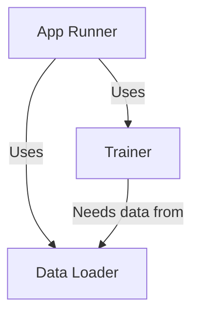
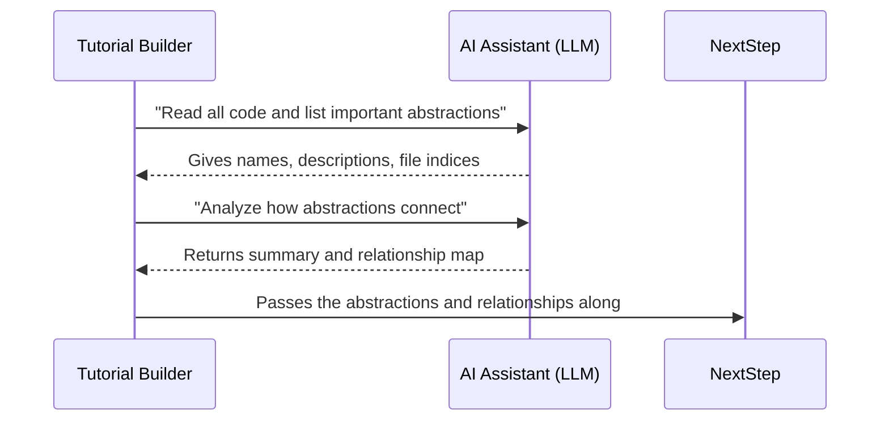

# Chapter 6: Abstraction & Relationship Analysis

*[Transition from previous chapter]*  
In [Chapter 5: LLM Interaction and Prompting](05_llm_interaction_and_prompting_.md), you explored how the system uses "smart questions" to get helpful explanations and chapters from an AI assistant. But before you can teach someone about a codebase, you need to **break it down into bite-sized pieces** and show **how those pieces fit together**.  
That's the job of **Abstraction & Relationship Analysis**—the process that transforms a mountain of code into an easy-to-follow "mind map" for beginners!

---

## Why Do We Need Abstraction & Relationship Analysis?

Imagine you walk into a giant toy store (the codebase). Shelves are packed with every toy you can imagine—robots, puzzles, games, dolls, and models—but there are **no signs telling you what anything is or how it all relates**!

Wouldn’t it be great if someone:
- Groups together the similar toys (“abstractions”),
- Explains what each group is for in simple language,
- Draws a map showing which toys fit together, or depend on each other (“relationships”),
- And tells you which order to explore them as a beginner?

**That’s exactly what this stage of the tutorial builder does!**

---

## What Are "Abstractions" and "Relationships"? (In Plain English)

- **Abstractions:**  
  The *main building blocks* of your codebase. Think of these as:
  - Important classes (like `Trainer`, `DataLoader`)
  - Key modules or objects (like `Query Processing`)
  - Major functions, patterns, or files—essentially, anything a beginner should know by name!

- **Relationships:**  
  The *connections and dependencies* between those blocks.  
  Just like a family tree or a subway map:
  - “The Trainer **uses** the DataLoader.”
  - “The DatabaseManager **is used by** the App Controller.”
  - “Module A **calls** Module B.”

Together, these form an easy-to-understand “diagram” of your codebase’s brain!

---

## Central Use Case: Turning "Code Soup" Into a Friendly Map

Imagine you want to teach someone your project, but all you have is a folder of files.  
**Abstraction & Relationship Analysis** turns this jumble into:

- A **list of key concepts**: What are the main parts?
- For each:  
  - What does it do?  
  - How does it help the project?  
  - Which files is it found in?
- A **visual map**: Which part interacts with which? Who depends on whom?

**Result:**  
A new learner can see the “big picture” before diving into the tiny code details!

---

## How Does Abstraction & Relationship Analysis Work?

Let's walk through the process in beginner-friendly steps:

### 1. **Spotting Abstractions: Identify the Main Ideas**

The system uses an AI assistant (LLM) to **read your code** and answer:
> "What are the 5–10 most important concepts or components in this codebase?  
> Give me a simple name and a beginner-friendly description for each."

The AI returns something like:

```yaml
- name: Trainer
  description: Teaches the model how to learn. Like a personal coach for your neural net.
  files: [0, 2]
- name: DataLoader
  description: Brings in fresh data. Like a delivery service for ingredients!
  files: [1]
```

- Each *abstraction* is linked to the files where it appears (for handy explanations and code samples).

---

### 2. **Analyzing Relationships: Map the Connections**

Then, the system asks the LLM to look at those abstractions, their descriptions, and the relevant code, and answer:
> "Who talks to whom? Which component manages or depends on the others?  
> Give me a list of relationships, like 'Trainer uses DataLoader'."

It produces a summary and a list, for instance:

```yaml
summary: |
  **This project is a beginner-friendly deep learning trainer.**
  *It connects raw data to powerful models, so anyone can teach a computer to learn!*
relationships:
  - from: 0  # Trainer
    to: 1    # DataLoader
    label: "Uses"
  - from: 1  # DataLoader
    to: 0    # Trainer
    label: "Feeds data"
```

This “relationship map” is later turned into a helpful diagram for the tutorial!

---

### 3. **Making a “Big Picture” for Learners**

Once abstractions and relationships are found:
- Newcomers get **clear definitions** for each major concept.
- They can **see** (via a flowchart) how everything fits together.
- The tutorial can **teach each part in a helpful sequence** (from beginner to advanced).

---

## Example: Abstraction & Relationship Analysis in Action

Let’s make it concrete!  
Suppose your project has three files:

```
main.py        # Starts the app
data.py        # Loads and cleans data
train.py       # Trains and saves the model
```

**Step 1:** The AI reads the code and picks out these abstractions:

| Name        | Description                                | Files      |
|-------------|--------------------------------------------|------------|
| App Runner  | Starts and controls the program            | 0 (main.py)|
| Data Loader | Gathers and prepares data                  | 1 (data.py)|
| Trainer     | Teaches the model with the data            | 2 (train.py)|

**Step 2:** It maps out their relationships:

- App Runner **uses** the Data Loader and Trainer
- Trainer **needs** data from Data Loader

**Step 3:** The tutorial shows a diagram:



Suddenly, the whole project is understandable—*even before you look at the code!*

---

## How It Works Internally (Behind the Scenes)

Here’s a step-by-step *plain English* guide—no code required!

### Step 1: Gather Context

- The system collects all the **code snippets** and **file names** for your project.

### Step 2: Send to the AI Assistant

- It builds a special “prompt” asking the AI to:
  - Name and describe the important concepts (“abstractions”)
  - List which files each is found in
  - Output this in a standard YAML format for easy use later

### Step 3: Validate & Store Abstractions

- The system checks the AI’s output—did it give names, descriptions, file lists?
- It fixes any mistakes and stores the results.

### Step 4: Map Relationships

- Using the abstraction info, it sends another prompt to the LLM:
  - “Who interacts with whom?”
  - “Summarize the project’s goal, and list all the relationships.”

### Step 5: Build the Mind Map

- The system assembles the final layer:
  - **Summary** for the index page (“What does this project do?”)
  - **Flowchart** for visual learners
  - **Sequence for chapters** (see [next chapter!](07_structured_tutorial_writing_.md))

---

## Beginner-Friendly Example: Analyzing Simple Code

Suppose we have:

```python
# data.py
def get_data():
    # Loads data from disk
    pass

# train.py
from data import get_data
def train():
    data = get_data()
    # Train model with data
```

**The analysis will spot:**
- “get_data” as a DataLoader
- “train” as a Trainer that depends on DataLoader

**Their relationship:**  
- Trainer *calls* or *uses* DataLoader

---

## Internal Walkthrough: How the Nodes Work Together

Let’s see what happens when you run this step in the pipeline:



---

## How Do You Use This In Practice?

**You don’t have to do anything extra!**  
The analysis happens automatically after your files are collected and summarized.

But if you were to peek into the core flow (as explained in [Chapter 2](02_tutorial_generation_flow_.md)), you’d see stages like:

```python
flow = [
    FetchRepo(),
    IdentifyAbstractions(),   # <--- finds core concepts!
    AnalyzeRelationships(),   # <--- maps connections!
    ...
]
```

Those steps handle all the logic described above for you.

---

## Sample Output: What Will You See in the Tutorial?

After Abstraction & Relationship Analysis, your tutorial will include:
- **An index page** with a “big picture” summary in plain English.
- A **mermaid diagram** showing relationships (like a subway map for your project).
- Each chapter dives deep into an abstraction, always explaining how it connects to others!

---

## Under the Hood: Walkthrough of Key Concepts

Let’s break down the two big concepts for clarity:

### 1. **Abstraction**

- What it is: The main “noun” of the codebase, e.g. `Trainer`, `DataLoader`.
- How it’s found: By asking the LLM, “Summarize the key concepts for a beginner.”
- Stored as:  
  - Name  
  - Beginner-friendly description  
  - List of file indices where it appears

### 2. **Relationship**

- What it is: The “verb” or link between concepts, e.g. `Trainer uses DataLoader`.
- How it’s found: By asking the LLM, “Who works with whom? Why?”
- Stored as:
  - From: index (source abstraction)
  - To: index (target abstraction)
  - Label: short phrase (“uses”, “feeds data”, etc.)

---

## Internal Implementation: Step-by-Step (Non-Code Version)

Let’s imagine how it works inside:

1. **System builds a big “context” string** with all code snippets and file names.
2. **Asks the LLM**: “What are the most important parts? What do they do? Where are they found?”
3. **LLM answers** with a neat list: names, explanations, file numbers.
4. **System double-checks everything**—no missing fields, all indices valid.
5. **System asks the LLM again**: “Now, which pieces talk to each other, and how?”
6. **LLM describes**: “A uses B,” “C manages D,” etc.
7. **A flowchart map is made** for the tutorial homepage.

---

## Simple Diagram: How Information Flows

```mermaid
flowchart LR
    A[Code Files] --> B[Identify Abstractions <br/> (AI finds big ideas)]
    B --> C[Analyze Relationships <br/> (AI maps connections)]
    C --> D[Diagram, Summary, & Teaching Order]
```

---

## Why Is This Stage So Important?

- **Breaks down complexity:**  
  Instead of staring at 100 mysterious files, you now have 5–10 main ideas to focus on.
- **Builds a roadmap:**  
  You always know “where you are” and how parts relate.
- **Shapes the rest of the tutorial:**  
  Every other chapter is built on this foundation!

---

## Analogy: This Process as “Mind Mapping for Code”

Think of it as creating a “mind map”—like when you study for an exam:
- Main ideas go in bubbles,
- Related bubbles are connected by arrows,
- You see how everything fits together at a glance!

**In codebases, this helps every learner orient themselves, no matter their experience.**

---

## Visual Example: Mermaid Diagram for Relationships

Here’s how a typical output might look:


- **Nodes** = Abstractions (main concepts)
- **Arrows** = Relationships (who uses whom, who depends on what)

---

## Key Tip: This Is Automatic and AI-Powered!

You don’t have to manually label your abstractions or draw any diagrams.  
The system’s LLM-powered pipeline does all the interpretation, explanation, and mapping for you!

---

## Wrapping Up: What You've Learned

- **Abstraction & Relationship Analysis** is the core of making any codebase understandable.
- It spots the most important building blocks (abstractions) and paints a map of their connections (relationships).
- Thanks to this stage, new learners see the big picture right away, making every other lesson easier and more fun.

---

## Up Next

Congratulations!  
You now understand how the tutorial system **breaks up the codebase into understandable pieces and weaves them together into a clear, connected story**.

Ready to see **how the actual tutorial pages get written—chapter by chapter**?  
Continue to [Chapter 7: Structured Tutorial Writing](07_structured_tutorial_writing_.md).

---


---

Generated by [AI Codebase Knowledge Builder](https://github.com/The-Pocket/Tutorial-Codebase-Knowledge)