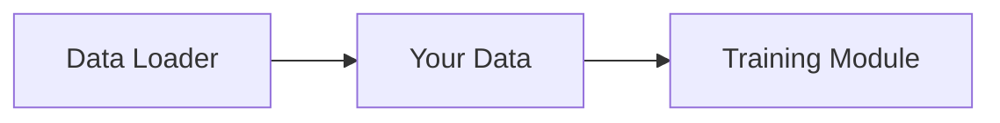
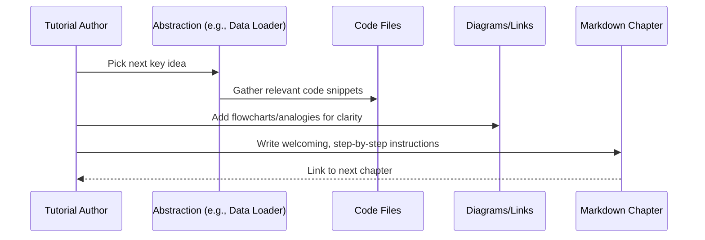
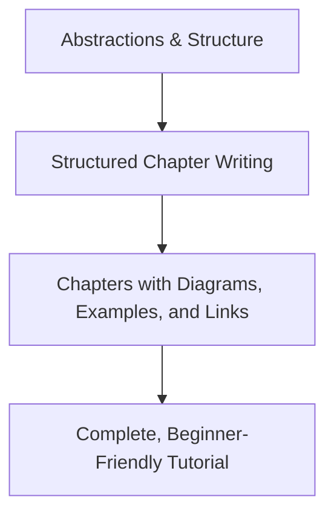

# Chapter 7: Structured Tutorial Writing

*Transition from [Abstraction & Relationship Analysis](06_abstraction___relationship_analysis_.md):*  
In the previous chapter, we saw how the system breaks down your codebase into “big ideas” (abstractions) and reveals how they’re connected (relationships).  
But there’s a big leap between a set of dry technical notes and a warm, beginner-friendly learning experience.  
How does the tool turn all that raw structure into an engaging series of tutorial chapters—complete with diagrams, analogies, and easy links?  
That’s the role of **Structured Tutorial Writing**!

---

## Why Do We Need Structured Tutorial Writing?

Imagine you’re handed a list of ingredients and a flowchart of how they combine,
but it’s your very first time cooking.  
Would a professional chef send you off with just that?  
**Probably not!**

You’d want someone to:
- Take the abstract recipe,
- Lay out step-by-step, friendly instructions,
- Add illustrations and helpful hints,
- Point out potholes and gotchas,
- And, most importantly, *encourage you along the way!*

**Structured Tutorial Writing** is your project’s “friendly chef.”  
It transforms technical blueprints into an *inviting, confidence-boosting learning experience.*

---

## Central Goal and Use Case

- **Goal:**  
  Convert the analyzed code structure (abstractions, relationships, order) into complete, navigable, and beginner-oriented tutorial chapters.

- **When does this happen?**  
  Once your codebase is mapped, the system writes out each chapter—one per concept—while “weaving the story” for new learners.

- **What does the user get?**  
  A logical series of Markdown files:
  - Each file is a chapter on one concept,
  - Chapters are packed with analogies, diagrams, code snippets, and clear language,
  - All chapters are linked together, forming an easy reading journey.

---

## How the System Writes Structured Tutorials

Let’s break it down step-by-step:

### 1. **Planning the Journey**

The system takes the ordered abstractions (concepts) and plans the teaching journey:
- What comes first (usually, the “main door” of the project),
- What concepts build on earlier ideas,
- Which chapters will link forward and backward.

### 2. **Chapter-by-Chapter Creation**

For each main concept:
- The system (powered by an AI assistant!) writes a new Markdown chapter.
- It follows a gentle, recipe-like **template**:
    - Start with a welcoming intro and analogy.
    - Walk through *why* the concept matters.
    - Use a concrete real-world use case.
    - Show simple, commented code (in small pieces).
    - Explain how it fits into the bigger picture.
    - Draw diagrams for tough ideas.
    - Always link to related chapters for extra help.

### 3. **Adding Diagrams, Links, and Analogies**

To make things crystal clear:
- Mermaid flowcharts and sequence diagrams visualize complex flows,
- Cross-links connect chapters so learners never feel lost,
- Every code example is sandwiched between obvious “what/why” explanations,
- Analogies turn jargon into relatable stories (“this function is like a librarian keeping books sorted!”).

### 4. **Building the Complete Tutorial**

All the chapters, plus an index page and diagrams, are bundled up:
- Easy to browse as stand-alone chapters,
- Or follow in order—like progressing through a course.

---

## Example: From Code Structure to Beginner Chapter

Suppose the previous stages found a core abstraction called “Data Loader.”  
How would a structured tutorial chapter be written?

**The template ensures chapters:**
- Start with a clear heading (“# Chapter 2: Data Loader”)
- Briefly remind the reader what the last chapter was about (with a link)
- Introduce the *motivation* (“When you want to feed data into your project, use the Data Loader!”)
- Use a simple analogy (“Think of it like a grocery delivery service for your model.”)
- Give a real use case (“Let’s load some data for training!”)

**Include minimal, beginner-friendly code:**
```python
from data_loader import load_data

data = load_data('my_input.csv')
# Now 'data' can be used for training
```
*This sample is easy to follow and skips distracting details.*

**Use diagrams to reinforce the idea:**


**And always end with a “next steps” transition:**
- “Now that your data is loaded, let’s learn how the [Training Module](03_training_module.md) builds on top of this!”

---

## Visualizing the Author’s Flow

Let’s peek “inside the author’s workshop”:



---

## Sample Internal Implementation

Let’s see a super simple snapshot of this process in code (no need to understand all the Python!):

```python
class WriteChapters(BatchNode):
    def exec(self, item):
        # item includes: abstraction details, code, chapter info, etc.
        prompt = f"""
        Write a beginner-friendly tutorial chapter for "{item['abstraction_details']['name']}".
        - Start with analogy and use case.
        - Use <20 line code samples, with comments and explanations after each.
        - Add diagrams where helpful.
        - Always link to other chapters by title/filename.
        - Close with summary and a next-chapter link.
        """
        chapter_content = call_llm(prompt)
        return chapter_content
```

This code shows that *each chapter* is crafted with careful instructions for clarity, examples, and helpful diagrams.

---

## Key Ingredients of a Structured Chapter

1. **Warm Welcome:**  
   A chapter always invites the reader in, maybe with a gentle analogy or story.

2. **Step-by-Step Learning:**  
   Instructions and code are broken into “baby steps.”  
   *No walls of code, no unexplained jumps!*

3. **Minimal Code Blocks:**  
   Only short code snippets (less than 20 lines), with helpful comments and plain-English explanations right after.

4. **Diagrams for Every Tough Spot:**  
   If something is hard, show it with a Mermaid diagram!

5. **Links That Prevent Getting Lost:**  
   Every time another concept is mentioned, it’s a clickable link—so readers can hop around as needed.

6. **Summaries and Next Steps:**  
   Each chapter ends with a recap and a “coming up next…” transition.

7. **Welcoming Tone:**  
   The language is always friendly—never assumes the reader knows a lot, and always encourages them to keep going.

---

## Analogy: Structured Tutorial Writing as a “Storybook Author” for Code

Think of the **Structured Tutorial Writer** as an author turning a list of building blocks into a beautifully illustrated children’s story.  
Abstract code becomes lively characters, unfamiliar functions become everyday helpers,  
and dry documentation becomes a playful, inviting journey from start to finish.

---

## Example: What You Might See as a Reader

> ---
> # Chapter 3: Training Loop
>
> *(Transition from previous chapter: Now that we know how data is loaded using the [Data Loader](02_data_loader.md), let’s learn how this data becomes a smart model!)*
>
> Imagine being a coach helping a runner improve every day. That’s what the **Training Loop** does: it feeds your data into the model, checks how it’s doing, and helps it get a little better each round.
>
> **Let’s see how it works:**
> ```python
> from training import train_model
> train_model(data)
> # This line starts the learning process!
> ```
> *And just like practicing a sport, it gets better each time.*
>
> ```mermaid
> sequenceDiagram
>     participant User
>     participant Data as Data Loader
>     participant Loop as Training Loop
>     participant Model
>
>     User->>Data: Load up input data
>     Data->>Loop: Pass data for training
>     Loop->>Model: Incrementally improve using the data
>     Model-->>User: Returns smarter each round
> ```
>
> By the end of this chapter, you’ll know how to kick off the training process with one line—and see how the magic happens under the hood.
>
> *Next, we’ll see how to check results and visualize your model’s progress in [Results Visualization](04_results_visualization.md).*
> ---

---

## Customization, Language, and Inclusivity

- Chapters can be auto-generated in any language!
- Chapter titles and cross-links always match your chosen language and order.
- Extra context from earlier chapters is summarized at the top of each new one, so readers don’t lose the thread.

---

## Big Picture: Map of the Tutorial Workflow



---

## The Secret Sauce: Making Technical Content Accessible

- **Convert code and concepts into a friendly story** with analogies and concrete examples.
- **Chunk the information** into bite-size chapters—each with only one main teaching goal.
- **Guide the reader at every step:**  
  With welcoming intros, cross-links, diagrams, and a roadmap for what’s next.

---

## Recap and Where to Next

**In this chapter, you learned how Structured Tutorial Writing transforms dry technical analysis into an engaging, easy-to-navigate series of Markdown guides—full of diagrams, analogies, and supportive links.**

- It’s the “author” part of your codebase’s storybook.
- It ensures *every reader feels at home*, no matter their background.

Ready to see how your tutorial finally gets packaged up and delivered?  
Move on to [Chapter 8: Output & Visualization Generation](08_output___visualization_generation_.md)!

---

---

Generated by [AI Codebase Knowledge Builder](https://github.com/The-Pocket/Tutorial-Codebase-Knowledge)