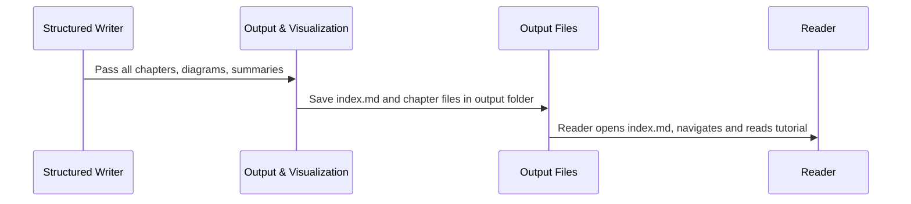
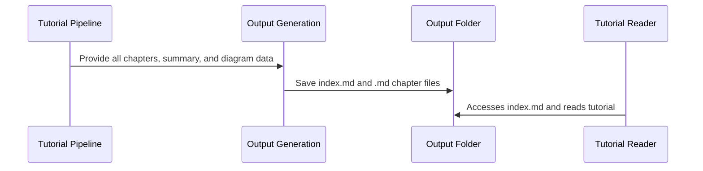

# Chapter 8: Output & Visualization Generation

*(Transition from previous chapter: Now that you’ve seen how beginner-friendly chapters are written using the [Structured Tutorial Writing](07_structured_tutorial_writing_.md) abstraction, it’s time to learn how everything gets published and presented as a complete, organized, and beautiful tutorial!)*

---

## Why Do We Need Output & Visualization Generation?

Imagine a chef has carefully prepared all the delicious dishes for a dinner party—but they’re still in separate pots and pans in the kitchen! Guests need a nice table, menus, and signs to know the meal order and what each dish is.  
**Output & Visualization Generation** is the “publishing house” and the “host” that:

- Arranges the tutorial chapters into clear, organized files and folders,
- Builds a table of contents (index file) so readers can navigate,
- Adds beautiful diagrams (“maps”) showing how everything connects,
- Presents every part of your project’s story in a way that’s easy to browse, share, or publish.

**In other words:**  
This stage takes all the separate “ingredients” and turns them into a finished book, website, or guide that anyone can enjoy—no more wandering between scattered notes!

---

## Use Case: From Raw Chapters to a Navigable Tutorial

Let’s say you just used the tool to write a multi-chapter guide for your project.  
You want to **share it with your team or the world**—and you want folks to:

- Start with a friendly summary,
- See a big-picture diagram,
- Easily browse and read each chapter in order or jump around,
- Download it or host it online.

**Output & Visualization Generation** handles all of this automatically:

- It creates an `index.md` homepage,
- Builds clickable links between chapters,
- Embeds a Mermaid diagram showing the “map” of your project,
- Saves files in a well-structured output folder (easy to upload or publish).

---

## Key Concepts: What Does This Abstraction Do?

Let’s break it down step-by-step:

### 1. **Collecting Chapters and Summaries**

- Gathers all the written Markdown chapters (one per concept).
- Grabs the project summary and list of “big idea” abstractions.
- Collects the relationship map of how different parts fit together.

### 2. **Building the Table of Contents (`index.md`)**

- Writes a friendly, welcoming homepage explaining the project’s overall purpose.
- Lists each chapter in reading order with links, so learners know where to start and what’s coming next.

### 3. **Generating Visual Overviews (Mermaid Diagrams)**

- Uses [Mermaid diagrams](https://mermaid-js.github.io/) to draw a “map” of how your abstractions relate (like a subway or flowchart diagram!).
- Makes it easy for visual learners to see the big picture instantly.

### 4. **Saving Everything to Output Folders**

- Creates an output directory just for your tutorial (for example, `output/MyProject/`).
- Saves the `index.md` (the homepage) and each chapter as `01_introduction.md`, `02_data_loader.md`, etc.
- Every file is correctly named and easy to share, publish as a site, or browse locally.

### 5. **Cross-Linking and Branding**

- Adds consistent links between chapters so readers never get lost.
- Includes a little credit line, so everyone knows how this tutorial was generated!

---

## Example: What Will the Output Look Like?

Your output folder might look like this:

```
output/YourProjectTutorial/
├── index.md
├── 01_introduction.md
├── 02_data_loader.md
├── 03_training_loop.md
├── 04_results_visualization.md
└── ...etc.
```

- **index.md:**  
  - Welcoming summary  
  - Mermaid diagram  
  - Linked list of all chapters

- **Each chapter:**  
  - Friendly intro, code samples, diagrams, and links to other chapters

---

## How to Use This Abstraction

**Good news:**  
You don’t need to run any extra commands or change anything!  
Once you run the tutorial tool and the previous steps complete, Output & Visualization Generation is triggered as the final stage.

Here’s what happens, step-by-step:

```python
tutorial_flow = create_tutorial_flow()
tutorial_flow.run(shared)  # Output & Visualization Generation runs at the end!
```

- All files are printed (with their file paths) at the end.
- You’ll see a message:  
  ```
  Tutorial generation complete! Files are in: output/YourProjectName/
  ```

---

## Internal Walkthrough (How It Works Behind the Scenes)

Here’s a light, beginner-friendly peek at what’s happening inside:

### Step 1: Prepare Output Folder

- Checks if an output folder exists (makes one if not).
- Example: `output/rocket-launcher/`

### Step 2: Format the Index File

- Writes a big heading (e.g., `# Tutorial: Rocket Launcher`).
- Adds the friendly summary from your project.
- Embeds a Mermaid diagram (made from the list of abstractions and relationships).
- Lists all chapters as clickable links:

  ```
  1. [Introduction](01_introduction.md)
  2. [Data Loader](02_data_loader.md)
  ...
  ```

### Step 3: Save Each Chapter

- For every chapter, gives it a filename like `01_data_loader.md` (names are “cleaned up” and simple).
- Double checks the links between chapters are correct (“next,” “previous,” etc.).
- Adds a little badge or credit line at the very bottom (“Generated by AI Codebase Knowledge Builder”).

### Step 4: Wrap Up

- Tells you all files were created, and where to find them!
- Now you can send, publish, or read your tutorial anywhere.

---

## Visualization Example: How “Connecting Everything” Works



- The chapters and diagrams are “passed over” to the output generator,
- Everything is assembled and written neatly,
- A reader gets a ready-to-explore tutorial!

---

## Example Code: (Simplified for Learning)

Here is a minimal version of how the system writes the final output (from `CombineTutorial`):

```python
import os

def save_tutorial(project_name, chapters, index_content, output_dir="output"):
    out_path = os.path.join(output_dir, project_name)
    os.makedirs(out_path, exist_ok=True)

    # Save the index page
    with open(os.path.join(out_path, "index.md"), "w", encoding="utf-8") as f:
        f.write(index_content)

    # Save each chapter
    for chapter in chapters:
        filename = chapter["filename"]
        content = chapter["content"]
        with open(os.path.join(out_path, filename), "w", encoding="utf-8") as f:
            f.write(content)
```

*Explanation:*  
- Makes an output folder,
- Saves the homepage (`index.md`) with summary and diagrams,
- Loops through each chapter and saves them as separate files.

---

## Example: What Does the Homepage Look Like?

> # Tutorial: Rocket Launcher
>
> **Blast off with this beginner-friendly guide to the Rocket Launcher codebase!**
>
> **Source Repository:** [link-to-github](https://github.com/yourname/rocket-launcher)
>
> ```mermaid
> flowchart TD
>   A0["App Controller"] -- "Controls" --> A1["Data Loader"]
>   A1 -- "Feeds" --> A2["Training Loop"]
>   ...
> ```
>
> ## Chapters
>
> 1. [Introduction](01_introduction.md)
> 2. [Data Loader](02_data_loader.md)
> 3. [Training Loop](03_training_loop.md)
> 4. [Results Visualization](04_results_visualization.md)
>
> ---
> Generated by [AI Codebase Knowledge Builder](https://github.com/The-Pocket/Tutorial-Codebase-Knowledge)

---

## Visual Map: From Chapters to Output

```mermaid
flowchart LR
  A[Structured Chapters] --> B[Output & Visualization Generation]
  B --> C[Output Folder (index.md + chapters)]
  C --> D[Your Shareable, Navigable Tutorial!]
```

- The tool does all the “layout and publishing” work for you.

---

## Internal Sequence: What Happens When the Output Step Runs?



---

## Why Are Visualizations So Useful?

- **Diagrams help see the “forest and the trees”:**
    - Maps of how pieces connect,
    - Quickly spot the most important concepts,
    - Reduce overwhelm for new learners.
- **Chapters are always cross-linked:**  
    - Never get lost—always one click away from the next step!
- **Structure makes sharing and publishing easy:**  
    - Ready to put on a website, send to a friend, or use in study groups.

---

## Summary: What You Learned

- **Output & Visualization Generation** is the “finishing touch” that makes your tutorial usable and beautiful.
- It collects all written chapters, summaries, and diagrams.
- Builds a friendly homepage (`index.md`) complete with a diagram (Mermaid) and clickable chapter list.
- Saves everything in a neat output folder—ready for anyone to explore, learn, or share!

*Just run the tool, and your codebase will be transformed into a beginner-friendly, fully linked, and visually mapped tutorial!*

---

## Congratulations!

You now know how the PocketFlow-Tutorial-Codebase-Knowledge project **assembles, publishes, and presents all your beginner-friendly learning materials** in a wonderfully organized way, making it easy for anyone to learn from your code.

Want to review any part of the journey? Browse earlier chapters, or dive into your output files and explore what you just learned!

---

*End of Tutorial: You’re ready to generate and share beautiful tutorials for any codebase! 🚀*

---

Generated by [AI Codebase Knowledge Builder](https://github.com/The-Pocket/Tutorial-Codebase-Knowledge)