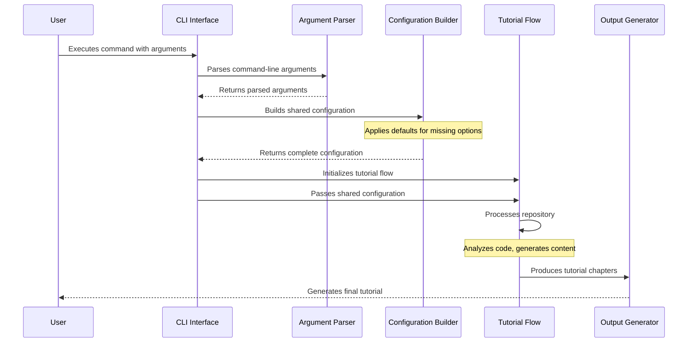

# Chapter 1: CLI Interface

## Introduction: The Command Center of Tutorial Generation

In any complex system designed for code analysis and documentation, the entry point needs to be both powerful and approachable. The CLI (Command Line Interface) in our tutorial generation system serves as this critical junction—the control center that transforms user intent into a structured analysis process.

Imagine you've discovered a fascinating open-source project on GitHub that you want to deeply understand. The codebase has hundreds of files across dozens of directories. You want to create a comprehensive tutorial that explains the architecture, key components, and relationships—but manually analyzing all this would take weeks. This is precisely the problem our CLI interface solves.

## The CLI as a Control Panel

The CLI interface acts like a sophisticated control panel with various knobs and switches, allowing you to specify:

1. **Source selection** - Either a GitHub repository URL or a local directory
2. **Content filtering** - Patterns for including or excluding files
3. **Output configuration** - Where and how the tutorial should be generated
4. **Analysis parameters** - Size limits, language preferences, and more

Let's dive into how this control panel is designed and how it translates user commands into system configuration.

## CLI Options and Their Purpose

Our CLI interface provides a carefully selected set of options to configure the tutorial generation process:

```bash
$ python main.py --help
usage: main.py [-h] (--repo REPO | --dir DIR) [-n NAME] [-t TOKEN] [-o OUTPUT]
               [-i INCLUDE [INCLUDE ...]] [-e EXCLUDE [EXCLUDE ...]]
               [-s MAX_SIZE] [--language LANGUAGE]

Generate a tutorial for a GitHub codebase or local directory.

optional arguments:
  -h, --help            show this help message and exit
  --repo REPO           URL of the public GitHub repository.
  --dir DIR             Path to local directory.
  -n NAME, --name NAME  Project name (optional, derived from repo/directory if omitted).
  -t TOKEN, --token TOKEN
                        GitHub personal access token (optional, reads from GITHUB_TOKEN env var if not provided).
  -o OUTPUT, --output OUTPUT
                        Base directory for output (default: ./output).
  -i INCLUDE [INCLUDE ...], --include INCLUDE [INCLUDE ...]
                        Include file patterns (e.g. '*.py' '*.js'). Defaults to common code files if not specified.
  -e EXCLUDE [EXCLUDE ...], --exclude EXCLUDE [EXCLUDE ...]
                        Exclude file patterns (e.g. 'tests/*' 'docs/*'). Defaults to test/build directories if not specified.
  -s MAX_SIZE, --max-size MAX_SIZE
                        Maximum file size in bytes (default: 100000, about 100KB).
  --language LANGUAGE   Language for the generated tutorial (default: english)
```

Let's explore each option in detail:

### Source Selection (Mutually Exclusive)

- `--repo` - For analyzing a GitHub repository by URL
- `--dir` - For analyzing a local directory on your filesystem

These options are mutually exclusive, meaning you must provide exactly one of them.

### Configuration Options

- `--name` - Custom project name (auto-derived if omitted)
- `--token` - GitHub personal access token for API access
- `--output` - Base directory for the generated tutorial
- `--include` - File patterns to include in analysis
- `--exclude` - File patterns to exclude from analysis
- `--max-size` - Maximum file size to process (prevents analyzing large binary files)
- `--language` - Output language for the tutorial

## Using the CLI Interface: Practical Examples

Let's walk through some common use cases to demonstrate how to use the CLI interface.

### Example 1: Analyzing a GitHub Repository

```bash
python main.py --repo https://github.com/example/project --token ghp_123456abcdef
```

This command will:

1. Clone the GitHub repository at the specified URL
2. Use the provided token for authentication
3. Apply default include/exclude patterns
4. Generate the tutorial in the default `./output` directory

### Example 2: Analyzing a Local Directory with Custom Filtering

```bash
python main.py --dir ./my-project --include "*.py" "*.md" --exclude "venv/*" "docs/*" --output ./tutorials
```

This command will:

1. Scan the local directory `./my-project`
2. Only include Python files (*.py) and Markdown files (*.md)
3. Exclude any files in the `venv` and `docs` directories
4. Save the generated tutorial in the `./tutorials` directory

### Example 3: Advanced Configuration

```bash
python main.py --repo https://github.com/example/project \
  --name "Custom Project Name" \
  --include "*.js" "*.jsx" "*.ts" "*.tsx" \
  --exclude "node_modules/*" "build/*" "tests/*" \
  --max-size 50000 \
  --language spanish \
  --output ./frontend-tutorial
```

This complex example:

1. Clones the specified repository
2. Sets a custom project name
3. Focuses only on JavaScript/TypeScript files
4. Excludes specific directories
5. Limits analysis to files smaller than 50KB
6. Generates the tutorial in Spanish
7. Saves output to a custom directory

## Implementation Deep Dive

Now that we understand how to use the CLI interface, let's explore how it's implemented. The CLI interface is primarily defined in the `main.py` file.

### Argument Parsing with argparse

The Python standard library's `argparse` module provides powerful argument parsing capabilities. Here's how we define our CLI options:

```python
def main():
    parser = argparse.ArgumentParser(description="Generate a tutorial for a GitHub codebase or local directory.")

    # Create mutually exclusive group for source
    source_group = parser.add_mutually_exclusive_group(required=True)
    source_group.add_argument("--repo", help="URL of the public GitHub repository.")
    source_group.add_argument("--dir", help="Path to local directory.")

    # Add remaining arguments
    parser.add_argument("-n", "--name", help="Project name (optional, derived from repo/directory if omitted).")
    parser.add_argument("-t", "--token", help="GitHub personal access token (optional, reads from GITHUB_TOKEN env var if not provided).")
    parser.add_argument("-o", "--output", default="output", help="Base directory for output (default: ./output).")
    parser.add_argument("-i", "--include", nargs="+", help="Include file patterns (e.g. '*.py' '*.js'). Defaults to common code files if not specified.")
    parser.add_argument("-e", "--exclude", nargs="+", help="Exclude file patterns (e.g. 'tests/*' 'docs/*'). Defaults to test/build directories if not specified.")
    parser.add_argument("-s", "--max-size", type=int, default=100000, help="Maximum file size in bytes (default: 100000, about 100KB).")
    parser.add_argument("--language", default="english", help="Language for the generated tutorial (default: english)")

    args = parser.parse_args()
    # ...
```

The most interesting aspects here are:

- **Mutually exclusive group**: Using `add_mutually_exclusive_group` ensures the user provides either `--repo` or `--dir`, but not both
- **Multiple values with `nargs="+"`: The `--include` and `--exclude` options accept multiple values
- **Default values**: Options like `--output`, `--max-size`, and `--language` have sensible defaults

### Default Patterns and Configuration

To make the CLI interface user-friendly, we provide sensible defaults for file filtering:

```python
# Default file patterns
DEFAULT_INCLUDE_PATTERNS = {
    "*.py", "*.js", "*.jsx", "*.ts", "*.tsx", "*.go", "*.java", "*.pyi", "*.pyx",
    "*.c", "*.cc", "*.cpp", "*.h", "*.md", "*.rst", "Dockerfile",
    "Makefile", "*.yaml", "*.yml",
}

DEFAULT_EXCLUDE_PATTERNS = {
    "venv/*", ".venv/*", "*test*", "tests/*", "docs/*", "examples/*", "v1/*",
    "dist/*", "build/*", "experimental/*", "deprecated/*",
    "legacy/*", ".git/*", ".github/*", ".next/*", ".vscode/*", "obj/*", "bin/*", "node_modules/*", "*.log"
}
```

These patterns cover common scenarios:

- Default includes: Common source code and documentation files
- Default excludes: Test directories, build artifacts, version control files, and dependencies

### Converting CLI Arguments to System Configuration

After parsing arguments, we translate them into a structured configuration dictionary:

```python
def main():
    # ... (argument parsing code shown above)
    
    # Get GitHub token from argument or environment variable if using repo
    github_token = None
    if args.repo:
        github_token = args.token or os.environ.get('GITHUB_TOKEN')
        if not github_token:
            print("Warning: No GitHub token provided. You might hit rate limits for public repositories.")

    # Initialize the shared dictionary with inputs
    shared = {
        "repo_url": args.repo,
        "local_dir": args.dir,
        "project_name": args.name,  # Can be None, FetchRepo will derive it
        "github_token": github_token,
        "output_dir": args.output,  # Base directory for CombineTutorial output

        # Add include/exclude patterns and max file size
        "include_patterns": set(args.include) if args.include else DEFAULT_INCLUDE_PATTERNS,
        "exclude_patterns": set(args.exclude) if args.exclude else DEFAULT_EXCLUDE_PATTERNS,
        "max_file_size": args.max_size,

        # Add language for multi-language support
        "language": args.language,

        # Outputs will be populated by the nodes
        "files": [],
        "abstractions": [],
        "relationships": {},
        "chapter_order": [],
        "chapters": [],
        "final_output_dir": None
    }
    
    # ... (rest of main function)
```

This shared dictionary serves as the central configuration and state container for the entire tutorial generation process. It's initialized with user inputs and will be populated with additional data during processing.

### Initializing and Running the Tutorial Flow

Finally, the CLI interface creates and launches the tutorial generation flow:

```python
def main():
    # ... (code shown above)
    
    # Display starting message with repository/directory and language
    print(f"Starting tutorial generation for: {args.repo or args.dir} in {args.language.capitalize()} language")

    # Create the flow instance
    tutorial_flow = create_tutorial_flow()

    # Run the flow
    tutorial_flow.run(shared)
```

The `create_tutorial_flow()` function (imported from `flow.py`) creates the workflow that will process the code repository. The shared dictionary, populated with CLI arguments, is passed to this workflow to control its behavior.

## The Flow of Control: From CLI to Tutorial Generation

To better understand how the CLI interface orchestrates the tutorial generation process, let's examine the sequence of operations:



This diagram illustrates how user input flows through the system:

1. The user provides command-line arguments
2. The CLI interface parses these arguments
3. A shared configuration is built, applying defaults where needed
4. The tutorial flow is initialized and executed with this configuration
5. The final tutorial is generated as output

## Behind the Scenes: Environment Configuration

Note that the CLI interface also handles environment variables for sensitive information:

```python
import dotenv
import os

dotenv.load_dotenv()

# Later in the code:
github_token = args.token or os.environ.get('GITHUB_TOKEN')
```

This allows users to store their GitHub token in a `.env` file or system environment variables, rather than passing it on the command line where it might be visible in shell history.

## Advanced Usage: Filtering with Patterns

The include and exclude patterns deserve special attention, as they provide powerful filtering capabilities. These patterns use the same syntax as the `fnmatch` module in Python, which is similar to shell-style wildcards:

- `*` matches everything
- `?` matches any single character
- `[seq]` matches any character in seq
- `[!seq]` matches any character not in seq

For example:

- `*.py` - All Python files
- `src/*.js` - JavaScript files directly in the src directory
- `**/*.test.js` - All JavaScript test files in any directory
- `[!.]*.py` - Python files that don't start with a dot

These patterns allow for precise control over which files are included in the analysis.

## Conclusion

The CLI Interface serves as the essential starting point for the tutorial generation system, translating user intent into a structured process. By providing a flexible set of options with sensible defaults, it makes the system both powerful and approachable.

In this chapter, we've explored:

- The purpose and design of the CLI interface
- Available command-line options and their meaning
- Practical examples of using the CLI
- Implementation details and the flow of control

With the CLI interface configured, the system proceeds to the actual tutorial generation process, which we'll explore in the next chapter: [Tutorial Generation Flow](02_tutorial_generation_flow_.md).

---

Generated by fork of [AI Codebase Knowledge Builder](https://github.com/vegeta03/PocketFlow-Tutorial-Codebase-Knowledge.git)
