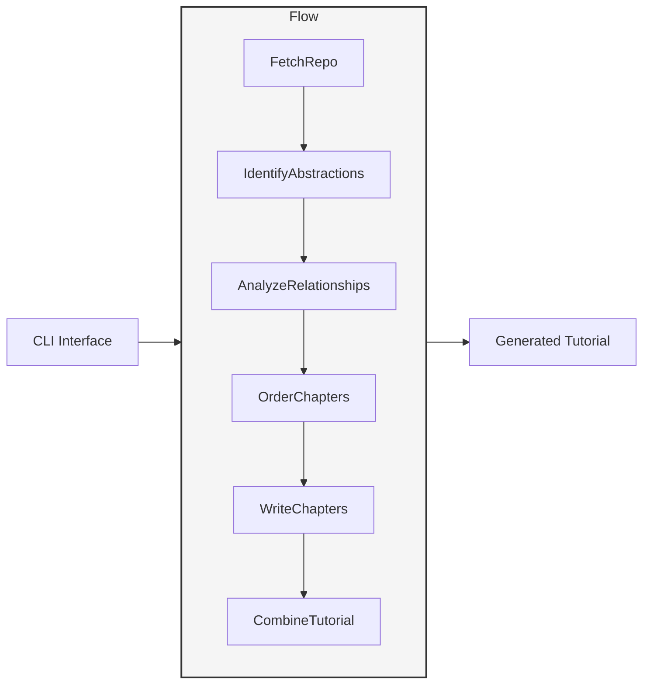
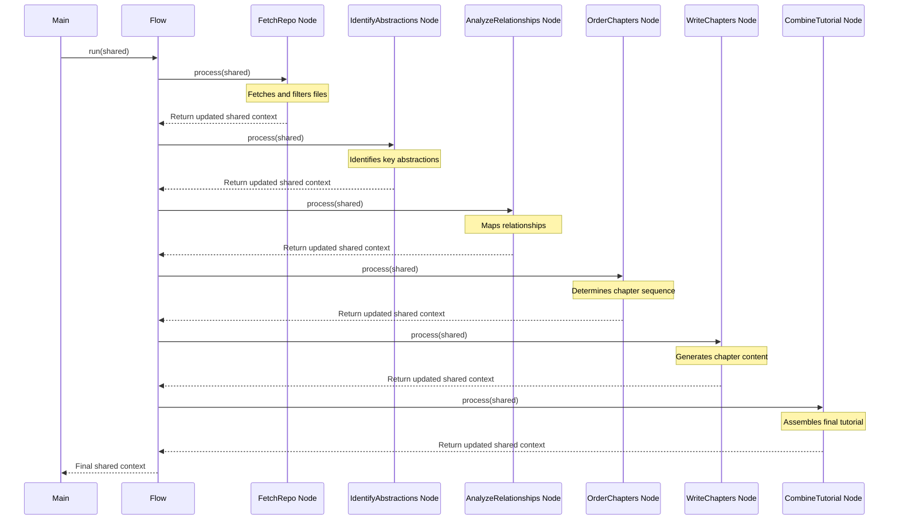

# Chapter 2: Tutorial Generation Flow

In the [CLI Interface](01_cli_interface_.md) chapter, we explored how user inputs are captured and transformed into a configuration that guides our tutorial generation system. Now, we'll examine the orchestration mechanism that drives the entire process: the Tutorial Generation Flow.

## Introduction: The Assembly Line for Knowledge Extraction

Imagine trying to understand a complex codebase with hundreds of files across dozens of modules. The sheer volume of information makes it difficult to know where to start, what's important, and how components relate to each other. The Tutorial Generation Flow solves this problem by providing a systematic, repeatable process that transforms raw code into structured educational content.

Like an assembly line in a factory, our Tutorial Generation Flow defines a sequence of specialized stations, each performing a specific operation on the "raw materials" (code files) until they emerge as a finished product (a comprehensive tutorial).

## Core Principles of the Flow Architecture

The Tutorial Generation Flow is built on several key principles:

1. **Sequential Transformation** - Each step in the flow transforms the data in a specific way, building upon previous transformations
2. **Clear Separation of Concerns** - Each node in the flow has a single, well-defined responsibility
3. **Data Continuity** - Information flows seamlessly between nodes through a shared context
4. **Fault Tolerance** - The flow includes retry mechanisms for operations that might fail (especially LLM-based operations)
5. **Extensibility** - New nodes can be added to the flow to extend functionality

Let's examine how these principles manifest in our implementation.

## The Flow Structure: From Raw Code to Tutorial

Our Tutorial Generation Flow consists of six primary stages, each represented by a specialized node:

1. **Repository Fetching** - Retrieves code files from a source (GitHub or local)
2. **Abstraction Identification** - Recognizes key components and concepts in the code
3. **Relationship Analysis** - Maps connections between the identified abstractions
4. **Chapter Ordering** - Determines the logical sequence for presenting information
5. **Content Generation** - Creates detailed explanations for each chapter
6. **Tutorial Compilation** - Assembles individual chapters into a complete tutorial

Let's visualize this flow:



This linear sequence ensures that each stage has the necessary information from previous stages. Let's now explore how this flow is implemented in code.

## Implementation: Creating and Executing the Flow

The flow is defined in `flow.py`, which uses the [Node System](04_node_system_.md) to connect processing stages. Let's examine the key parts:

```python
from pocketflow import Flow
from nodes import (
    FetchRepo,
    IdentifyAbstractions,
    AnalyzeRelationships,
    OrderChapters,
    WriteChapters,
    CombineTutorial
)

def create_tutorial_flow():
    """Creates and returns the codebase tutorial generation flow."""

    # Instantiate nodes
    fetch_repo = FetchRepo()
    identify_abstractions = IdentifyAbstractions(max_retries=5, wait=20)
    analyze_relationships = AnalyzeRelationships(max_retries=5, wait=20)
    order_chapters = OrderChapters(max_retries=5, wait=20)
    write_chapters = WriteChapters(max_retries=5, wait=20) # This is a BatchNode
    combine_tutorial = CombineTutorial()

    # Connect nodes in sequence
    fetch_repo >> identify_abstractions
    identify_abstractions >> analyze_relationships
    analyze_relationships >> order_chapters
    order_chapters >> write_chapters
    write_chapters >> combine_tutorial

    # Create the flow starting with FetchRepo
    tutorial_flow = Flow(start=fetch_repo)

    return tutorial_flow
```

This code demonstrates several important aspects of our flow architecture:

1. **Node Instantiation**: Each processing stage is represented by a node class with specific parameters (like retry settings).

2. **Node Connection**: The `>>` operator creates a directed connection between nodes, defining the order of execution and data flow.

3. **Flow Creation**: The `Flow` object encapsulates the entire sequence, starting with the first node.

The `create_tutorial_flow()` function is called from `main.py` after the CLI arguments are processed:

```python
def main():
    # ... CLI argument parsing and configuration building ...
    
    # Create the flow instance
    tutorial_flow = create_tutorial_flow()

    # Run the flow with the shared context
    tutorial_flow.run(shared)
```

The `shared` dictionary, initialized with CLI parameters, is passed to the flow as the shared context that will be modified and expanded by each node. Let's discuss how data flows through this pipeline.

## Data Flow: Transformations at Each Stage

As the flow executes, each node transforms the shared context in specific ways. Here's what happens at each stage:

### 1. FetchRepo Node

**Input**: Repository URL or local directory path from CLI
**Processing**: Clones the repository or accesses the local directory, filters files based on patterns
**Output**: List of file paths and their contents in the `shared["files"]` array

```python
# Example shared context after FetchRepo
shared = {
    # ... CLI arguments ...
    "files": [
        {
            "path": "src/main.py",
            "content": "def main():\n    print('Hello, world!')\n\nif __name__ == '__main__':\n    main()",
            "language": "python",
            "size": 78
        },
        # ... more files ...
    ],
    # ... other fields ...
}
```

### 2. IdentifyAbstractions Node

**Input**: Files list from FetchRepo
**Processing**: Analyzes code to identify key abstractions (classes, functions, modules, etc.)
**Output**: List of abstractions in the `shared["abstractions"]` array

```python
# Example shared context after IdentifyAbstractions
shared = {
    # ... previous data ...
    "abstractions": [
        {
            "name": "main function",
            "type": "function",
            "file": "src/main.py",
            "description": "Entry point of the application that prints a greeting message",
            "importance": 8
        },
        # ... more abstractions ...
    ],
    # ... other fields ...
}
```

### 3. AnalyzeRelationships Node

**Input**: Abstractions list from IdentifyAbstractions
**Processing**: Determines connections and dependencies between abstractions
**Output**: Relationship graph in the `shared["relationships"]` dictionary

```python
# Example shared context after AnalyzeRelationships
shared = {
    # ... previous data ...
    "relationships": {
        "main function": ["Logger", "ConfigParser"],
        "Logger": ["FileSystem"],
        # ... more relationships ...
    },
    # ... other fields ...
}
```

### 4. OrderChapters Node

**Input**: Abstractions and relationships from previous nodes
**Processing**: Determines logical order for presenting information
**Output**: Ordered list of chapter topics in the `shared["chapter_order"]` array

```python
# Example shared context after OrderChapters
shared = {
    # ... previous data ...
    "chapter_order": [
        {
            "title": "Introduction to the System",
            "abstractions": ["Application Overview", "Architecture"],
            "level": 1
        },
        {
            "title": "Core Configuration System",
            "abstractions": ["ConfigParser", "SettingsManager"],
            "level": 2
        },
        # ... more chapters ...
    ],
    # ... other fields ...
}
```

### 5. WriteChapters Node

**Input**: Chapter order from OrderChapters
**Processing**: Generates detailed content for each chapter
**Output**: Complete chapter content in the `shared["chapters"]` array

```python
# Example shared context after WriteChapters
shared = {
    # ... previous data ...
    "chapters": [
        {
            "title": "Introduction to the System",
            "content": "# Introduction to the System\n\nThis chapter provides an overview...",
            "filename": "01_introduction_to_the_system.md"
        },
        # ... more chapters ...
    ],
    # ... other fields ...
}
```

### 6. CombineTutorial Node

**Input**: Chapters from WriteChapters
**Processing**: Assembles chapters into a complete tutorial
**Output**: Complete tutorial in the specified output directory, and the path in `shared["final_output_dir"]`

```python
# Example shared context after CombineTutorial
shared = {
    # ... previous data ...
    "final_output_dir": "/path/to/output/project_tutorial",
    # ... other fields ...
}
```

This sequence of transformations ensures that each node has exactly the data it needs from previous stages, with a clear path for information to flow through the system.

## Under the Hood: Execution Flow with the PocketFlow Framework

The Tutorial Generation Flow leverages the PocketFlow framework (which we'll see in more detail in the [Node System](04_node_system_.md) chapter). When `flow.run(shared)` is called, here's what happens:



Each node's `process()` method receives the shared context, modifies it according to the node's responsibility, and passes it to the next node in the sequence. This continues until all nodes have executed.

## Implementing Retry Logic for Resilience

One key aspect of our flow is fault tolerance, especially for nodes that interact with LLMs (which can occasionally fail due to rate limits, connection issues, or other factors). Let's examine how retry logic is implemented in nodes:

```python
class IdentifyAbstractions(Node):
    def __init__(self, max_retries=5, wait=20):
        super().__init__()
        self.max_retries = max_retries
        self.wait = wait
        
    def process(self, shared):
        # ... processing code ...
        
        try:
            # Use LLM to identify abstractions
            abstractions = self._call_llm_with_retry(files_content)
            shared["abstractions"] = abstractions
        except Exception as e:
            print(f"Error in IdentifyAbstractions: {e}")
            # Set empty abstractions as fallback
            shared["abstractions"] = []
            
        return shared
        
    def _call_llm_with_retry(self, content):
        retries = 0
        while retries < self.max_retries:
            try:
                # Call LLM service
                result = llm_service.analyze_code(content)
                return result
            except Exception as e:
                retries += 1
                if retries >= self.max_retries:
                    raise
                print(f"LLM call failed, retrying ({retries}/{self.max_retries})...")
                time.sleep(self.wait)
```

This pattern is used in all LLM-dependent nodes, allowing the system to recover from temporary failures rather than aborting the entire process.

## BatchNode for Parallel Processing

The `WriteChapters` node has a special role in our flow—it's a `BatchNode` that processes multiple chapters in parallel. This is important for efficiency, as chapter generation can be time-consuming:

```python
class WriteChapters(BatchNode):
    def __init__(self, max_retries=5, wait=20):
        super().__init__()
        self.max_retries = max_retries
        self.wait = wait
    
    def process(self, shared):
        # Extract the chapter order
        chapters = shared["chapter_order"]
        
        # Process chapters in parallel
        results = self.process_batch(chapters, shared)
        
        # Store results
        shared["chapters"] = results
        
        return shared
    
    def process_item(self, chapter, shared):
        # Generate content for a single chapter
        # ... chapter generation code ...
        
        return {
            "title": chapter["title"],
            "content": content,
            "filename": filename
        }
```

The `BatchNode` parent class handles the parallelization details, allowing `WriteChapters` to focus on the content generation logic for individual chapters.

## Customizing and Extending the Flow

One of the strengths of our flow architecture is its extensibility. Let's look at how you might modify the flow to add new capabilities:

```python
def create_custom_tutorial_flow():
    """Creates a tutorial flow with additional processing steps."""
    
    # Create standard nodes
    fetch_repo = FetchRepo()
    identify_abstractions = IdentifyAbstractions()
    analyze_relationships = AnalyzeRelationships()
    order_chapters = OrderChapters()
    write_chapters = WriteChapters()
    combine_tutorial = CombineTutorial()
    
    # Add custom nodes
    generate_diagrams = GenerateDiagrams()  # Custom node for creating visualizations
    create_code_examples = CreateCodeExamples()  # Custom node for code snippets
    
    # Connect nodes with custom processing path
    fetch_repo >> identify_abstractions
    identify_abstractions >> analyze_relationships
    analyze_relationships >> order_chapters
    order_chapters >> generate_diagrams  # Add diagram generation before writing
    generate_diagrams >> create_code_examples  # Add code example generation
    create_code_examples >> write_chapters
    write_chapters >> combine_tutorial
    
    # Create the flow
    custom_flow = Flow(start=fetch_repo)
    return custom_flow
```

This example demonstrates how you could insert additional nodes into the flow to enhance the tutorial with automatically generated diagrams and code examples.

## Real-World Example: Processing a Medium-Sized Repository

Let's walk through a concrete example of how the Tutorial Generation Flow processes a medium-sized repository with ~50 Python files. Understanding the end-to-end flow will help illustrate the practical application of this architecture.

### Stage 1: Repository Fetching and Filtering

When processing begins, the CLI has already provided the repository URL and filter patterns. The FetchRepo node:

1. Clones the repository or accesses the local directory
2. Filters files based on include/exclude patterns
3. Reads file contents and determines file types
4. Populates the shared context with file information

For our example repository, this results in 32 Python files being selected for analysis (after filtering out tests, build artifacts, etc.).

### Stage 2: Abstraction Identification

The IdentifyAbstractions node:

1. Analyzes code files to extract meaningful components
2. Identifies classes, functions, modules, and key concepts
3. Assigns importance scores to each abstraction
4. Adds short descriptions explaining each abstraction

For our example, this might identify 40+ abstractions, including:

- Core classes like `DataProcessor`, `ModelManager`
- Key functions like `train_model`, `evaluate_performance`
- Important modules like `data_loading`, `visualization`
- Architectural concepts like "Pipeline Architecture", "Plugin System"

### Stage 3: Relationship Analysis

The AnalyzeRelationships node:

1. Examines code to understand dependencies between abstractions
2. Maps inheritance hierarchies, function calls, and imports
3. Identifies logical groupings and subsystems
4. Creates a relationship graph representing these connections

For our example, this produces a complex network showing how, for instance, the `DataProcessor` depends on `FileReader` and `DataValidator`, or how the "Pipeline Architecture" encompasses multiple classes.

### Stage 4: Chapter Ordering

The OrderChapters node:

1. Uses the abstractions and relationships to determine a logical learning sequence
2. Groups related abstractions into potential chapters
3. Arranges chapters from foundational to advanced topics
4. Assigns titles that reflect chapter content

For our example, this might produce an 8-chapter structure starting with "System Overview" and progressing through increasing complexity to "Advanced Configuration Options".

### Stage 5: Content Generation

The WriteChapters node:

1. Takes each chapter definition and its associated abstractions
2. Generates detailed tutorial content for each chapter
3. Includes code examples, explanations, and usage patterns
4. Creates well-formatted Markdown files

For our example, this produces 8 detailed Markdown files, each focusing on a specific aspect of the codebase.

### Stage 6: Tutorial Compilation

Finally, the CombineTutorial node:

1. Collects all chapter files
2. Creates a table of contents
3. Ensures consistent formatting
4. Creates a complete tutorial package

The end result is a comprehensive tutorial document that systematically explains the codebase, starting from fundamentals and progressing to advanced topics, with the right level of detail at each stage.

## Handling Edge Cases and Error Conditions

While our flow is designed to handle the typical case smoothly, real-world code repositories can present challenges. Here's how our flow handles some common edge cases:

### 1. Very Large Repositories

For repositories with hundreds or thousands of files, the system:

- Uses file filtering to focus on the most relevant parts
- Implements lazy loading to avoid memory issues
- Provides incremental status updates during processing

### 2. LLM Service Failures

If the LLM service (used for code analysis and content generation) fails:

- The retry mechanism attempts to recover automatically
- Exponential backoff reduces API pressure
- The system can proceed with partial results if necessary

### 3. Unusual Code Structures

When encountering non-standard code patterns:

- The abstraction identification includes heuristics for diverse code styles
- The relationship analyzer uses fallback methods when standard approaches fail
- Special handling exists for polyglot repositories (multiple languages)

### 4. Resource Constraints

To handle system resource limitations:

- Batch processing controls memory usage
- Progress is saved at node boundaries for potential resumption
- The flow monitors resource usage and can adjust behavior accordingly

## Conclusion: The Orchestration Engine

The Tutorial Generation Flow serves as the orchestration engine for our entire system, ensuring that each specialized component operates in the right sequence and with the right data. Its well-defined structure and clear separation of concerns make it both powerful and maintainable.

In this chapter, we've explored:

- The sequence of operations that transform code into a tutorial
- How data flows between processing stages
- The implementation of node connections and execution
- Resilience mechanisms for handling failures
- Extensions and customizations of the flow

The Tutorial Generation Flow depends heavily on the [Shared Context Management](03_shared_context_management_.md) system to pass data between nodes, which we'll explore in the next chapter.

---

Generated by fork of [AI Codebase Knowledge Builder](https://github.com/vegeta03/PocketFlow-Tutorial-Codebase-Knowledge.git)
