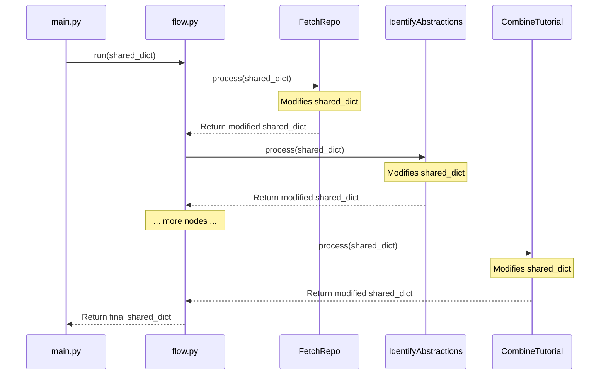

# Chapter 3: Shared Context Management

In the [Tutorial Generation Flow](02_tutorial_generation_flow_.md) chapter, we explored how our system orchestrates the transformation of code into educational content through a sequence of specialized nodes. Now, we'll examine the critical mechanism that binds these nodes together: the Shared Context Management system.

## Introduction: The State Management Problem

In any pipeline-based architecture, one of the most challenging aspects is maintaining state across processing stages. Each stage produces outputs that subsequent stages require as inputs, creating complex data dependencies. Without a systematic approach to state management, you'll likely encounter issues like:

- Inconsistent data formats between stages
- Redundant computations when data is lost between stages
- Tight coupling between components due to direct dependencies
- Difficulty tracking the evolution of data through the pipeline
- Challenges debugging when errors occur

The Shared Context Management system solves these problems by providing a centralized, consistent mechanism for state persistence and communication between nodes in our tutorial generation pipeline.

## Mental Model: The Digital Whiteboard

Think of the shared context as a digital whiteboard that all team members refer to during a complex project. As the project progresses:

1. Initial requirements and resources are written on the whiteboard
2. Each team member adds their contributions and insights
3. Everyone can see the current state and build upon previous work
4. The whiteboard gradually accumulates all information needed for completion
5. The final result incorporates insights from the entire process

In our tutorial generation system, this whiteboard takes the form of a shared dictionary that evolves throughout the processing pipeline, starting with user inputs and eventually containing the complete tutorial.

## Core Principles of Shared Context Management

The shared context in our system follows several key principles:

1. **Single Source of Truth**: All state is maintained in one structure, providing clarity about the current system state.
2. **Progressive Enhancement**: Each node adds its specific contribution to the shared context.
3. **Immutable History**: Previous data is preserved, with new data added rather than overwriting existing information.
4. **Standardized Schema**: Well-defined keys and data structures ensure nodes can rely on expected data formats.
5. **Minimized Dependencies**: Nodes only access the specific data they need from the context.

Let's explore how these principles manifest in the implementation.

## Shared Context Structure and Evolution

### Initial Structure: CLI Inputs

The shared context begins with user inputs from the CLI, as we saw in the [CLI Interface](01_cli_interface_.md) chapter:

```python
# Initialize the shared dictionary with inputs
shared = {
    "repo_url": args.repo,
    "local_dir": args.dir,
    "project_name": args.name,  # Can be None, FetchRepo will derive it
    "github_token": github_token,
    "output_dir": args.output,  # Base directory for output

    # Add include/exclude patterns and max file size
    "include_patterns": set(args.include) if args.include else DEFAULT_INCLUDE_PATTERNS,
    "exclude_patterns": set(args.exclude) if args.exclude else DEFAULT_EXCLUDE_PATTERNS,
    "max_file_size": args.max_size,

    # Add language for multi-language support
    "language": args.language,

    # Outputs will be populated by the nodes
    "files": [],
    "abstractions": [],
    "relationships": {},
    "chapter_order": [],
    "chapters": [],
    "final_output_dir": None
}
```

This initial structure defines both the configuration parameters and empty placeholders for the data that will be generated during processing.

### Evolution Through the Pipeline

As the context passes through each node in the pipeline, it evolves to include more information:

#### After FetchRepo

```python
shared = {
    # ... original inputs ...
    "files": [
        {
            "path": "src/main.py",
            "content": "def main():\n    print('Hello, world!')\n\nif __name__ == '__main__':\n    main()",
            "language": "python",
            "size": 78
        },
        # ... more files ...
    ],
    # ... other unchanged fields ...
}
```

#### After IdentifyAbstractions

```python
shared = {
    # ... previous data ...
    "abstractions": [
        {
            "name": "Main Function",
            "description": "Entry point that initializes the application pipeline",
            "files": [0, 3, 5]  # Indices referencing files in the "files" array
        },
        # ... more abstractions ...
    ],
    # ... other unchanged fields ...
}
```

#### After AnalyzeRelationships

```python
shared = {
    # ... previous data ...
    "relationships": {
        "summary": "This project implements a data processing pipeline...",
        "details": [
            {
                "from": 0,  # Index in abstractions array
                "to": 2,    # Index in abstractions array
                "label": "Initializes"
            },
            # ... more relationships ...
        ]
    },
    # ... other unchanged fields ...
}
```

#### After OrderChapters

```python
shared = {
    # ... previous data ...
    "chapter_order": [2, 0, 1, 3, 4]  # Indices into abstractions array, ordered for presentation
    # ... other unchanged fields ...
}
```

#### After WriteChapters

```python
shared = {
    # ... previous data ...
    "chapters": [
        "# Chapter 1: System Overview\n\nThis chapter provides...",
        "# Chapter 2: Core Configuration\n\nIn this chapter, we'll explore...",
        # ... more chapter content ...
    ],
    # ... other unchanged fields ...
}
```

#### After CombineTutorial

```python
shared = {
    # ... previous data ...
    "final_output_dir": "/path/to/output/project_tutorial",
    # ... other unchanged fields ...
}
```

This evolution demonstrates how the shared context accumulates information progressively, with each node adding its specific contribution while preserving previous data.

## Implementation Details

Let's examine how the Shared Context Management system is implemented in our codebase.

### Basic Structure: Dictionary Passing

At its core, the Shared Context Management system is remarkably simple: it's just a Python dictionary passed by reference between node processing functions. This simplicity is intentional, as it leverages Python's built-in data structures and avoids unnecessary complexity.



This flow illustrates how the shared dictionary is passed from node to node, with each node modifying it according to its responsibility.

### Node Processing Pattern

Each node follows a standard pattern for interacting with the shared context:

```python
class SomeNode(Node):
    def process(self, shared):
        # 1. Extract relevant data from shared context
        input_data = shared.get("some_key", default_value)
        
        # 2. Process the data
        result = self._do_processing(input_data)
        
        # 3. Update shared context with results
        shared["output_key"] = result
        
        # 4. Return the modified shared context
        return shared
```

This pattern ensures that each node has a consistent interface for accessing and modifying the shared context.

### Accessing Specific Data

Nodes typically access only the specific data they need from the shared context:

```python
def prep(self, shared):
    # Access only what's needed for this node
    files_data = shared["files"]
    project_name = shared["project_name"]
    language = shared.get("language", "english")  # With default fallback
    
    # Process and return data needed for execution
    return processed_data
```

This approach follows the principle of minimized dependencies, making nodes less sensitive to changes in the shared context structure.

### Updating the Context

When a node completes its processing, it updates the shared context with its results:

```python
def post(self, shared, prep_res, exec_res):
    # Add node output to shared context
    shared["abstractions"] = exec_res
    
    # Optionally provide progress information
    print(f"Identified {len(exec_res)} abstractions.")
```

The `post` method standardizes how nodes contribute to the shared context, ensuring consistent patterns across the system.

## Advanced Usage Patterns

Beyond the basic implementation, several advanced patterns enhance our Shared Context Management system:

### Schema Evolution

As our system evolves, the shared context structure may need to change. We handle this through careful schema evolution:

```python
def process(self, shared):
    # Check for legacy format and migrate if needed
    if "old_key_format" in shared:
        shared["new_key_format"] = self._migrate_data(shared["old_key_format"])
        # Optionally preserve the old data for backward compatibility
        # Or remove it to keep the context clean
        # del shared["old_key_format"]
    
    # Proceed with processing using new format
    data = shared.get("new_key_format", {})
    # ...
```

This approach allows nodes to work with evolving data formats while maintaining backward compatibility.

### Context Validation

To ensure data integrity, nodes can validate the shared context structure:

```python
def process(self, shared):
    # Validate required fields
    required_keys = ["files", "project_name"]
    missing_keys = [key for key in required_keys if key not in shared]
    
    if missing_keys:
        raise ValueError(f"Missing required keys in shared context: {missing_keys}")
    
    # Validate data types
    if not isinstance(shared["files"], list):
        raise TypeError("Expected 'files' to be a list")
    
    # Proceed with processing
    # ...
```

This validation helps catch issues early and provides clear error messages.

### Namespace Management

For complex systems, namespacing can help organize the shared context:

```python
def process(self, shared):
    # Create namespace if it doesn't exist
    if "llm_service" not in shared:
        shared["llm_service"] = {}
    
    # Access and update namespaced data
    shared["llm_service"]["last_call_timestamp"] = time.time()
    shared["llm_service"]["total_calls"] = shared["llm_service"].get("total_calls", 0) + 1
    
    # ...
```

This approach groups related data together, making the context structure more maintainable.

## Practical Example: Cross-Stage Abstraction Tracking

Let's examine a concrete example of how the Shared Context Management system enables complex functionality across multiple processing stages.

Consider the task of tracking abstractions from identification through relationship analysis to chapter generation:

### Stage 1: Abstraction Identification

```python
class IdentifyAbstractions(Node):
    def process(self, shared):
        # Extract file data from shared context
        files_data = shared["files"]
        
        # Process files to identify abstractions
        abstractions = self._identify_abstractions(files_data)
        
        # Update shared context with identified abstractions
        shared["abstractions"] = abstractions
        
        return shared
        
    def _identify_abstractions(self, files_data):
        # Processing logic (simplified)
        abstractions = []
        
        # Example abstraction structure
        abstraction = {
            "name": "Authentication Manager",
            "description": "Handles user authentication and session management",
            "files": [0, 5, 12]  # Indices into files_data
        }
        
        abstractions.append(abstraction)
        # ... more abstractions ...
        
        return abstractions
```

This node identifies abstractions in the code and adds them to the shared context.

### Stage 2: Relationship Analysis

```python
class AnalyzeRelationships(Node):
    def process(self, shared):
        # Extract abstractions from shared context
        abstractions = shared["abstractions"]
        files_data = shared["files"]
        
        # Analyze relationships between abstractions
        relationships = self._analyze_relationships(abstractions, files_data)
        
        # Update shared context with relationships
        shared["relationships"] = relationships
        
        return shared
        
    def _analyze_relationships(self, abstractions, files_data):
        # Processing logic (simplified)
        # Create graph structure for relationships
        details = []
        
        # Example relationship
        relationship = {
            "from": 0,  # Index of source abstraction
            "to": 2,    # Index of target abstraction
            "label": "Authenticates requests for"
        }
        
        details.append(relationship)
        # ... more relationships ...
        
        return {
            "summary": "This project implements a web application framework...",
            "details": details
        }
```

This node analyzes relationships between abstractions and adds them to the shared context.

### Stage 3: Chapter Writing

```python
class WriteChapters(BatchNode):
    def prep(self, shared):
        # Extract ordered abstractions and relationships from shared context
        chapter_order = shared["chapter_order"]
        abstractions = shared["abstractions"]
        relationships = shared["relationships"]
        files_data = shared["files"]
        
        # Prepare items for batch processing
        items_to_process = []
        for i, abstraction_index in enumerate(chapter_order):
            # Get abstraction details
            abstraction = abstractions[abstraction_index]
            
            # Get relationships involving this abstraction
            related_abstractions = self._get_related_abstractions(
                abstraction_index, relationships["details"], abstractions
            )
            
            # Get file content for the abstraction
            file_content = self._get_file_content(abstraction["files"], files_data)
            
            # Create item for processing
            item = {
                "chapter_num": i + 1,
                "abstraction": abstraction,
                "related_abstractions": related_abstractions,
                "file_content": file_content,
                # ... other context ...
            }
            
            items_to_process.append(item)
        
        return items_to_process
        
    def _get_related_abstractions(self, abstraction_index, relationships, abstractions):
        # Find relationships involving this abstraction
        related = []
        
        for rel in relationships:
            if rel["from"] == abstraction_index:
                # This abstraction relates to another
                related.append({
                    "abstraction": abstractions[rel["to"]],
                    "relationship": rel["label"],
                    "direction": "outgoing"
                })
            elif rel["to"] == abstraction_index:
                # Another abstraction relates to this one
                related.append({
                    "abstraction": abstractions[rel["from"]],
                    "relationship": rel["label"],
                    "direction": "incoming"
                })
        
        return related
        
    def _get_file_content(self, file_indices, files_data):
        # Get content for specific file indices
        content = {}
        
        for idx in file_indices:
            path, file_content = files_data[idx]
            content[path] = file_content
        
        return content
```

This node uses the abstractions and relationships from the shared context to write tutorial chapters.

This example demonstrates how data flows through the system:

1. The `IdentifyAbstractions` node identifies abstractions and adds them to the shared context
2. The `AnalyzeRelationships` node uses these abstractions to analyze relationships
3. The `WriteChapters` node uses both abstractions and relationships to write tutorial chapters

Each node builds upon the work of previous nodes, with the shared context serving as the medium for data exchange.

## Performance and Memory Considerations

While the shared context provides many benefits, it also requires careful management to avoid performance issues:

### Memory Usage

As the shared context accumulates data, memory usage can become a concern, especially for large repositories. To mitigate this, we employ several strategies:

```python
def process(self, shared):
    # Extract only required file indices to avoid processing all files
    abstraction = shared["abstractions"][abstraction_index]
    relevant_file_indices = abstraction["files"]
    
    # Get content only for relevant files
    relevant_content = {}
    for idx in relevant_file_indices:
        path, content = shared["files"][idx]
        relevant_content[path] = content
    
    # Process only relevant content
    # ...
```

This approach minimizes memory usage by processing only the necessary data.

### Deep Copy vs. Reference

When handling complex nested structures in the shared context, we need to be mindful of reference semantics:

```python
import copy

def process(self, shared):
    # Modify a copy to avoid side effects on shared data
    abstractions_copy = copy.deepcopy(shared["abstractions"])
    
    # Process the copy
    self._process_abstractions(abstractions_copy)
    
    # Update the shared context with the modified copy
    shared["processed_abstractions"] = abstractions_copy
    
    # Original data remains unchanged
    assert shared["abstractions"] is not abstractions_copy
```

Using deep copies ensures that nodes don't inadvertently modify data that other nodes depend on.

## Edge Cases and Error Handling

The shared context system must handle various edge cases and errors gracefully:

### Missing or Invalid Data

Nodes should handle missing or invalid data in the shared context:

```python
def process(self, shared):
    # Handle missing data
    if "abstractions" not in shared or not shared["abstractions"]:
        print("Warning: No abstractions found in shared context")
        shared["abstractions"] = []  # Provide default value
    
    # Handle invalid data
    if not isinstance(shared.get("chapter_order", []), list):
        print("Warning: Invalid chapter_order format, resetting to empty list")
        shared["chapter_order"] = []
    
    # Proceed with processing
    # ...
```

This defensive approach ensures that nodes can operate even with incomplete or invalid data.

### Error Recovery

When errors occur, the shared context can facilitate recovery:

```python
def process(self, shared):
    try:
        # Attempt processing
        result = self._process_data(shared["input_data"])
        shared["output_data"] = result
    except Exception as e:
        # Log the error
        print(f"Error in processing: {e}")
        
        # Store error information in shared context for debugging
        if "errors" not in shared:
            shared["errors"] = []
        shared["errors"].append({
            "node": self.__class__.__name__,
            "error": str(e),
            "timestamp": time.time()
        })
        
        # Set fallback value
        shared["output_data"] = self._fallback_value()
    
    return shared
```

This pattern allows the pipeline to continue even when individual nodes encounter errors, with the shared context maintaining a record of issues for later analysis.

## Best Practices for Shared Context Management

Based on our experience with this system, we've developed several best practices:

1. **Define a Clear Schema**: Document the expected structure of the shared context, including key names, data types, and semantics.

2. **Minimize Dependencies**: Each node should depend on as few shared context fields as possible to reduce coupling.

3. **Use Consistent Naming**: Follow a consistent naming convention for keys in the shared context.

4. **Validate Early**: Validate shared context data as early as possible to catch issues before they propagate.

5. **Document Modifications**: Each node should clearly document what fields it adds or modifies in the shared context.

6. **Handle Missing Data**: Always handle the case where expected data might be missing from the shared context.

7. **Consider Version Tagging**: For evolving systems, consider adding version tags to data structures to support backward compatibility.

## Implementation in the Node System

Let's examine how the Shared Context Management system integrates with our [Node System](04_node_system_.md):

```python
class Node:
    def __init__(self):
        # Node initialization
        pass
        
    def process(self, shared):
        """
        Main processing method called by the flow.
        
        Args:
            shared (dict): The shared context dictionary
            
        Returns:
            dict: The updated shared context
        """
        # Standard processing pattern with three phases
        try:
            # 1. Preparation phase: extract and process data from shared context
            prep_result = self.prep(shared)
            
            # 2. Execution phase: perform the main processing
            exec_result = self.exec(prep_result)
            
            # 3. Post-processing phase: update shared context with results
            self.post(shared, prep_result, exec_result)
            
            return shared
        except Exception as e:
            # Error handling
            print(f"Error in {self.__class__.__name__}: {e}")
            raise
    
    def prep(self, shared):
        """Extract and process data from shared context."""
        # Default implementation - override in subclasses
        return shared
    
    def exec(self, prep_result):
        """Execute main processing logic."""
        # Default implementation - override in subclasses
        return prep_result
    
    def post(self, shared, prep_result, exec_result):
        """Update shared context with execution results."""
        # Default implementation - override in subclasses
        return shared
```

This base `Node` class defines the standard interface for interacting with the shared context, which all nodes inherit. The three-phase processing pattern (`prep`, `exec`, `post`) provides a clean separation of concerns:

1. `prep` extracts and processes data from the shared context
2. `exec` performs the main processing logic
3. `post` updates the shared context with the results

This pattern makes it easy to understand how each node interacts with the shared context.

## Real-World Example: Multi-Language Support

Let's examine a real-world example of how the Shared Context Management system enables complex features like multi-language support:

```python
def main():
    # ... (other CLI parsing code) ...
    
    # Add language parameter
    parser.add_argument("--language", default="english", help="Language for the generated tutorial (default: english)")
    
    # ... (process arguments) ...
    
    # Add language to shared context
    shared = {
        # ... (other fields) ...
        "language": args.language,
        # ... (other fields) ...
    }
    
    # Run the flow with the shared context
    tutorial_flow.run(shared)
```

The language preference is added to the shared context at the beginning of the process. Then, in nodes that generate content:

```python
class WriteChapters(BatchNode):
    def exec(self, item):
        # Extract language from the item (derived from shared context)
        language = item.get("language", "english")
        
        # Add language-specific instructions to prompt
        language_instruction = ""
        if language.lower() != "english":
            language_instruction = f"IMPORTANT: Write this ENTIRE tutorial chapter in **{language.capitalize()}**."
        
        prompt = f"""
{language_instruction}Write a beginner-friendly tutorial chapter...
"""
        
        # Generate content with language-aware prompt
        chapter_content = call_llm(prompt)
        
        return chapter_content
```

This example demonstrates how the shared context enables a cross-cutting concern (language preference) to influence the behavior of multiple nodes without requiring direct connections between them.

## Conclusion: The Binding Force of the Pipeline

The Shared Context Management system serves as the binding force of our tutorial generation pipeline, enabling data to flow seamlessly between processing stages while maintaining a clear state throughout the process. By providing a centralized, consistent mechanism for state management, it reduces complexity, increases maintainability, and enables powerful features like cross-stage data tracking and multi-language support.

Key takeaways from this chapter include:

- The shared context acts as a digital whiteboard, accumulating information as processing progresses
- It follows key principles like single source of truth, progressive enhancement, and standardized schema
- The system uses a simple yet powerful pattern of dictionary passing between nodes
- Advanced patterns like schema evolution, validation, and namespacing enhance the basic implementation
- Performance considerations include memory management and reference semantics
- Best practices ensure the system remains maintainable as it evolves

In the next chapter, [Node System](04_node_system_.md), we'll explore how the individual processing components leverage this shared context to perform their specialized tasks in the tutorial generation pipeline.

---

Generated by fork of [AI Codebase Knowledge Builder](https://github.com/vegeta03/PocketFlow-Tutorial-Codebase-Knowledge.git)
