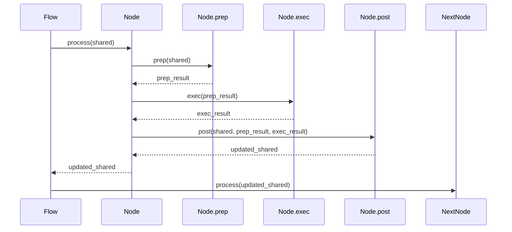
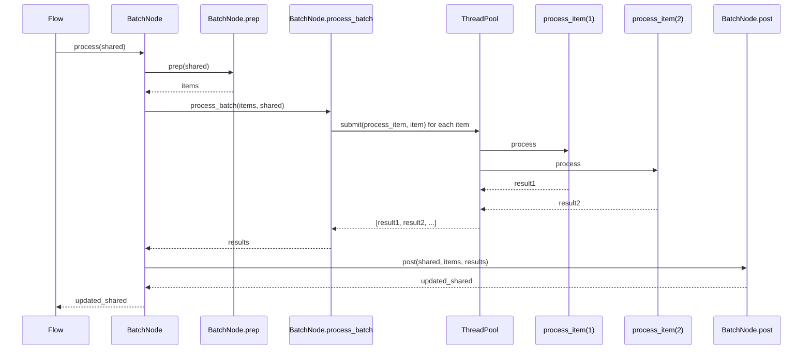

# Chapter 4: Node System

In the [Shared Context Management](03_shared_context_management_.md) chapter, we explored how data flows throughout our system via a centralized data structure. Now, we'll examine the computational units that actually transform this data: the Node System.

## Introduction: Decomposing Complex Workflows into Manageable Units

Complex software systems often face the challenge of breaking down intricate workflows into maintainable, testable, and reusable components. When processing large codebases for tutorial generation, this challenge becomes particularly acute: we need specialized processing units for tasks ranging from repository crawling to content generation, each with its own unique logic but following consistent patterns.

The Node System solves this problem by providing a standardized interface for processing components while ensuring clear separation of concerns and proper data flow. Rather than building a monolithic processor, we create specialized nodes that each perform a single, well-defined operation on the data.

## The Production Line Mental Model

Think of a modern production line manufacturing a complex product like a smartphone. Each station on the line has:

1. **Clear inputs** - Components coming from previous stations
2. **Specific functionality** - A specialized transformation or assembly step
3. **Well-defined outputs** - Modified components passed to the next station
4. **Standard interfaces** - Consistent ways to receive and deliver materials

Our Node System follows the same model. Each node:

1. Extracts and prepares the data it needs from the shared context
2. Executes its specialized processing logic
3. Updates the shared context with its results
4. Follows a standard interface that allows it to connect with other nodes

This model provides several benefits:

- Clear separation of concerns
- Testability of individual components
- Ability to rearrange nodes to create different processing flows
- Consistent patterns across the codebase

## Core Architecture: The Node Interface

At the heart of our system is the `Node` base class, which defines the standard interface all nodes must implement:

```python
class Node:
    def __init__(self):
        pass
        
    def process(self, shared):
        """
        Main entry point called by the flow.
        
        Args:
            shared (dict): The shared context dictionary
            
        Returns:
            dict: The updated shared context
        """
        try:
            # 1. Preparation phase
            prep_result = self.prep(shared)
            
            # 2. Execution phase
            exec_result = self.exec(prep_result)
            
            # 3. Post-processing phase
            self.post(shared, prep_result, exec_result)
            
            return shared
        except Exception as e:
            print(f"Error in {self.__class__.__name__}: {e}")
            raise
    
    def prep(self, shared):
        """Extract and process data from shared context."""
        return shared
    
    def exec(self, prep_result):
        """Execute main processing logic."""
        return prep_result
    
    def post(self, shared, prep_result, exec_result):
        """Update shared context with execution results."""
        return shared
```

This interface establishes the three-phase processing model that all nodes follow:

1. **Preparation (`prep`)**: Extract and format the data needed from the shared context
2. **Execution (`exec`)**: Perform the core processing logic
3. **Post-processing (`post`)**: Update the shared context with the results

Let's examine each phase in detail:

### The Preparation Phase

The `prep` method serves as the data extraction and preparation layer:

```python
def prep(self, shared):
    # Extract only what this node needs from the shared context
    project_name = shared["project_name"]
    files = shared["files"]
    
    # Transform data into the format needed for execution
    # For example, combining files into a single document for analysis
    formatted_data = self._format_for_processing(files, project_name)
    
    return formatted_data
```

Key design principles for the `prep` method:

- Extract only the data needed by this specific node
- Transform data into the optimal format for processing
- Perform any necessary validation
- Return a clean, prepared data structure for the execution phase

### The Execution Phase

The `exec` method contains the core processing logic of the node:

```python
def exec(self, prep_result):
    # Perform the primary functionality of the node
    # For example, analyzing code to identify abstractions
    abstractions = []
    
    for item in prep_result["items"]:
        # Processing logic
        result = self._process_item(item)
        abstractions.append(result)
    
    return abstractions
```

Key design principles for the `exec` method:

- Focus exclusively on the node's specific functionality
- Operate on the prepared data from `prep`, not on the raw shared context
- Return processed results, not the updated shared context
- Be stateless whenever possible

### The Post-Processing Phase

The `post` method handles updating the shared context with the execution results:

```python
def post(self, shared, prep_result, exec_result):
    # Update the shared context with the results
    shared["abstractions"] = exec_result
    
    # Optionally log progress or provide feedback
    print(f"Identified {len(exec_result)} abstractions")
    
    return shared
```

Key design principles for the `post` method:

- Update the shared context in a consistent, predictable way
- Avoid modifying unrelated parts of the shared context
- Provide appropriate logging or progress feedback
- Return the updated shared context

## Node Connection and Flow Construction

Nodes are designed to be connected in sequence to form processing flows. The implementation uses the `>>` operator overload for intuitive flow definition:

```python
class Node:
    # ... other methods ...
    
    def __rshift__(self, other):
        """
        Overload the >> operator to create a directed connection between nodes.
        
        Args:
            other (Node): The next node in the flow
            
        Returns:
            Node: The other node (for chaining)
        """
        self._next = other
        return other
```

This allows for intuitive, readable flow definitions:

```python
# Connect nodes in sequence
fetch_repo = FetchRepo()
identify_abstractions = IdentifyAbstractions()
analyze_relationships = AnalyzeRelationships()

fetch_repo >> identify_abstractions >> analyze_relationships

# Create the flow starting with the first node
tutorial_flow = Flow(start=fetch_repo)
```

The resulting structure forms a linked list of nodes, with each node pointing to the next one in the sequence.

## BatchNode for Parallel Processing

One common pattern in data processing is the need to apply the same operation to multiple items independently. For this, we have the `BatchNode` extension:

```python
class BatchNode(Node):
    def process(self, shared):
        # Standard three-phase processing pattern
        try:
            # 1. Preparation: extract batch items from shared context
            items = self.prep(shared)
            
            # 2. Execution: process items in parallel
            results = self.process_batch(items, shared)
            
            # 3. Post-processing: update shared context with batch results
            self.post(shared, items, results)
            
            return shared
        except Exception as e:
            print(f"Error in {self.__class__.__name__}: {e}")
            raise
    
    def process_batch(self, items, shared):
        """
        Process multiple items in parallel.
        
        Args:
            items (list): Items to process
            shared (dict): The shared context (for reference)
            
        Returns:
            list: Processed results
        """
        results = []
        
        # Parallel processing using ThreadPoolExecutor
        with concurrent.futures.ThreadPoolExecutor() as executor:
            # Create a partial function with the shared context
            process_fn = functools.partial(self._process_item_wrapper, shared=shared)
            
            # Process items in parallel
            futures = [executor.submit(process_fn, item) for item in items]
            
            # Collect results as they complete
            for future in concurrent.futures.as_completed(futures):
                try:
                    result = future.result()
                    results.append(result)
                except Exception as e:
                    print(f"Error processing batch item: {e}")
                    raise
        
        return results
    
    def _process_item_wrapper(self, item, shared):
        """Wrapper to call process_item with consistent error handling."""
        try:
            return self.process_item(item, shared)
        except Exception as e:
            print(f"Error in {self.__class__.__name__} processing item: {e}")
            raise
    
    def process_item(self, item, shared):
        """
        Process a single item from the batch.
        
        Args:
            item: The individual item to process
            shared (dict): The shared context (for reference)
            
        Returns:
            The processed result
        """
        # Default implementation - override in subclasses
        return item
```

The `BatchNode` class extends the base `Node` with parallel processing capabilities:

1. The `prep` method still extracts data from the shared context, but returns a list of items to process
2. The `process_batch` method handles parallel execution using a thread pool
3. Each item is processed by the `process_item` method, which subclasses must implement
4. The `post` method updates the shared context with the collected results

This pattern is particularly valuable for operations that can be parallelized, such as generating content for multiple chapters simultaneously.

## Real-World Implementation: The WriteChapters Node

Let's examine a practical implementation of a `BatchNode` in our system. The `WriteChapters` node generates tutorial content for multiple chapters in parallel:

```python
class WriteChapters(BatchNode):
    def __init__(self, max_retries=5, wait=20):
        super().__init__()
        self.max_retries = max_retries
        self.wait = wait
    
    def prep(self, shared):
        chapter_order = shared["chapter_order"]
        abstractions = shared["abstractions"]
        files_data = shared["files"]
        
        # Store temporary data for cross-item communication
        self.chapters_written_so_far = []
        
        # Create batch items, one per chapter
        items_to_process = []
        for i, abstraction_index in enumerate(chapter_order):
            abstraction_details = abstractions[abstraction_index]
            related_file_indices = abstraction_details.get("files", [])
            related_files_content = self._get_content_for_indices(
                files_data, related_file_indices
            )
            
            items_to_process.append({
                "chapter_num": i + 1,
                "abstraction_index": abstraction_index,
                "abstraction_details": abstraction_details,
                "related_files_content": related_files_content,
                "project_name": shared["project_name"],
                "language": shared.get("language", "english")
            })
        
        return items_to_process
    
    def process_item(self, item, shared):
        abstraction_name = item["abstraction_details"]["name"]
        chapter_num = item["chapter_num"]
        
        # Get summary of previously written chapters
        previous_chapters_summary = "\n---\n".join(self.chapters_written_so_far)
        
        # Generate chapter content using LLM
        chapter_content = self._generate_chapter_with_retry(
            item, previous_chapters_summary
        )
        
        # Add to written chapters for context in next iterations
        self.chapters_written_so_far.append(chapter_content)
        
        return chapter_content
    
    def _generate_chapter_with_retry(self, item, previous_chapters_summary):
        # Implementation with retry logic for LLM calls
        retries = 0
        while retries < self.max_retries:
            try:
                return self._call_llm_for_chapter(item, previous_chapters_summary)
            except Exception as e:
                retries += 1
                if retries >= self.max_retries:
                    raise
                print(f"LLM call failed, retrying ({retries}/{self.max_retries})...")
                time.sleep(self.wait)
    
    def post(self, shared, prep_res, exec_res):
        # Store generated chapters in shared context
        shared["chapters"] = exec_res
        
        # Clean up temporary instance variable
        del self.chapters_written_so_far
        
        print(f"Finished writing {len(exec_res)} chapters.")
```

This implementation demonstrates several advanced patterns:

1. **Stateful processing**: The node maintains temporary state (`chapters_written_so_far`) to provide context between batch items
2. **Retry logic**: The `_generate_chapter_with_retry` method implements resilient LLM interaction
3. **Resource management**: The node cleans up its internal state after processing completes
4. **Parallel execution**: The BatchNode parent class handles threading for parallel content generation

## The Node API: Implementing Custom Nodes

When implementing custom nodes for the system, you generally follow these steps:

### 1. Basic Node Implementation

For a standard node, extend the `Node` class and implement the three-phase methods:

```python
class CustomNode(Node):
    def __init__(self, custom_param=None):
        super().__init__()
        self.custom_param = custom_param
    
    def prep(self, shared):
        # Extract needed data
        data = shared.get("some_key", {})
        
        # Return processed data for execution
        return {
            "prepared_data": self._preprocess(data)
        }
    
    def exec(self, prep_result):
        # Execute core functionality
        result = self._process(prep_result["prepared_data"])
        
        return result
    
    def post(self, shared, prep_result, exec_result):
        # Update shared context
        shared["output_key"] = exec_result
        
        return shared
    
    def _preprocess(self, data):
        # Internal helper method for preprocessing
        return data
    
    def _process(self, data):
        # Internal helper method for core processing
        return data
```

### 2. BatchNode Implementation

For batch processing, extend the `BatchNode` class instead:

```python
class CustomBatchNode(BatchNode):
    def prep(self, shared):
        # Extract data and prepare batch items
        items = []
        for item_id, item_data in shared["items"].items():
            items.append({
                "id": item_id,
                "data": item_data,
                "context": shared.get("context")
            })
        
        return items
    
    def process_item(self, item, shared):
        # Process individual batch item
        result = self._process_individual(item["data"], item["context"])
        
        return {
            "id": item["id"],
            "result": result
        }
    
    def post(self, shared, items, results):
        # Combine batch results
        processed_results = {}
        for result in results:
            processed_results[result["id"]] = result["result"]
        
        # Update shared context
        shared["processed_items"] = processed_results
        
        return shared
```

### 3. Error Handling Node

For nodes that need robust error handling, implement retry logic:

```python
class ResilientNode(Node):
    def __init__(self, max_retries=3, wait_time=5):
        super().__init__()
        self.max_retries = max_retries
        self.wait_time = wait_time
    
    def exec(self, prep_result):
        retries = 0
        last_error = None
        
        while retries < self.max_retries:
            try:
                return self._execute_with_retry(prep_result)
            except Exception as e:
                retries += 1
                last_error = e
                print(f"Error in {self.__class__.__name__}: {e}")
                print(f"Retry {retries}/{self.max_retries} in {self.wait_time} seconds...")
                time.sleep(self.wait_time)
        
        # All retries failed
        print(f"All {self.max_retries} retries failed. Last error: {last_error}")
        raise last_error
    
    def _execute_with_retry(self, prep_result):
        # Implementation of the retry-able operation
        pass
```

## Advanced Patterns in the Node System

Beyond the basic implementation, several advanced patterns emerge in our node system:

### 1. Composition and Delegation

Nodes can delegate specialized processing to helper classes:

```python
class IdentifyAbstractions(Node):
    def __init__(self, max_retries=5, wait=20):
        super().__init__()
        self.max_retries = max_retries
        self.wait = wait
        # Delegation to specialized processors
        self.code_analyzer = CodeAnalyzer()
        self.llm_client = LLMClient(max_retries=max_retries, wait=wait)
    
    def exec(self, prep_result):
        # Use composition to delegate specialized tasks
        parsed_code = self.code_analyzer.parse(prep_result["code"])
        analyzed_abstractions = self.code_analyzer.identify_abstractions(parsed_code)
        
        # Use specialized LLM client for AI-enhanced analysis
        enhanced_abstractions = self.llm_client.enhance_abstractions(
            analyzed_abstractions, 
            context=prep_result["context"]
        )
        
        return enhanced_abstractions
```

This pattern allows for clean separation of concerns while keeping the node interface consistent.

### 2. Resource Management

Nodes that use external resources should properly manage their lifecycle:

```python
class ExternalServiceNode(Node):
    def __init__(self, api_key=None):
        super().__init__()
        self.api_key = api_key or os.environ.get("API_KEY")
        self.client = None
    
    def prep(self, shared):
        # Initialize client if not already done
        if not self.client:
            self.client = ExternalClient(api_key=self.api_key)
        
        return shared
    
    def exec(self, prep_result):
        # Use client for processing
        result = self.client.process(prep_result)
        return result
    
    def post(self, shared, prep_result, exec_result):
        # Update shared with results
        shared["external_results"] = exec_result
        
        # Release resources if no longer needed
        if self.client and some_condition:
            self.client.close()
            self.client = None
        
        return shared
```

This ensures resources are properly initialized and cleaned up during node execution.

### 3. Progressive Enhancement

Nodes can build upon existing data rather than replacing it:

```python
class EnhanceAbstractions(Node):
    def prep(self, shared):
        # Get existing abstractions
        abstractions = shared.get("abstractions", [])
        
        # Return for enhancement
        return {
            "abstractions": abstractions,
            "context": shared.get("relationships", {})
        }
    
    def exec(self, prep_result):
        enhanced = []
        
        # Enhance each abstraction without replacing original data
        for abstr in prep_result["abstractions"]:
            enhanced_abstr = {
                # Preserve all original fields
                **abstr,
                # Add new enhanced fields
                "importance_score": self._calculate_importance(
                    abstr, prep_result["context"]
                ),
                "related_concepts": self._find_related(
                    abstr, prep_result["abstractions"], prep_result["context"]
                )
            }
            enhanced.append(enhanced_abstr)
        
        return enhanced
    
    def post(self, shared, prep_result, exec_result):
        # Update with enhanced abstractions
        shared["enhanced_abstractions"] = exec_result
        
        # Original data remains untouched
        assert shared["abstractions"] is not exec_result
        
        return shared
```

This pattern allows for safer evolution of the data model.

## Real-World Flow Construction

Let's examine how multiple nodes are connected to form a complete processing flow:

```python
def create_tutorial_flow():
    """Creates the tutorial generation flow with all nodes properly connected."""
    # Instantiate nodes with appropriate parameters
    fetch_repo = FetchRepo()
    identify_abstractions = IdentifyAbstractions(max_retries=5, wait=20)
    analyze_relationships = AnalyzeRelationships(max_retries=5, wait=20)
    order_chapters = OrderChapters(max_retries=5, wait=20)
    write_chapters = WriteChapters(max_retries=5, wait=20)
    combine_tutorial = CombineTutorial()
    
    # Connect nodes in sequence
    fetch_repo >> identify_abstractions
    identify_abstractions >> analyze_relationships
    analyze_relationships >> order_chapters
    order_chapters >> write_chapters
    write_chapters >> combine_tutorial
    
    # Create the flow starting with the first node
    tutorial_flow = Flow(start=fetch_repo)
    
    return tutorial_flow
```

This construction creates a clear processing pipeline:

1. `FetchRepo` retrieves code files
2. `IdentifyAbstractions` finds key components
3. `AnalyzeRelationships` maps connections between components
4. `OrderChapters` determines logical presentation sequence
5. `WriteChapters` generates content for each chapter
6. `CombineTutorial` assembles the final output

The flow is executed by passing the shared context to the starting node:

```python
# Create the flow
tutorial_flow = create_tutorial_flow()

# Run the flow with the initial shared context
tutorial_flow.run(shared)
```

The `Flow` class handles traversing the node sequence:

```python
class Flow:
    def __init__(self, start):
        self.start = start
    
    def run(self, shared):
        """
        Execute the flow, starting from the first node.
        
        Args:
            shared (dict): The initial shared context
            
        Returns:
            dict: The final shared context after processing
        """
        current = self.start
        
        while current:
            # Process the current node
            shared = current.process(shared)
            
            # Move to the next node
            current = getattr(current, '_next', None)
        
        return shared
```

This simple traversal mechanism allows for flexible flow composition while maintaining a consistent execution pattern.

## Execution Sequence Diagram

Let's visualize the execution of a node within the flow:



For a `BatchNode`, the execution is slightly more complex:



These execution patterns ensure clean separation of concerns while maintaining efficient data flow through the pipeline.

## Performance Considerations

The Node System design has several performance implications to consider:

### 1. Memory Usage

Nodes should be mindful of memory usage, especially when dealing with large datasets:

```python
def prep(self, shared):
    # Extract only necessary indices to avoid loading all files
    abstraction = shared["abstractions"][abstraction_index]
    relevant_file_indices = abstraction["files"]
    
    # Load only the necessary files
    relevant_content = {}
    for idx in relevant_file_indices:
        file_path, content = shared["files"][idx]
        relevant_content[file_path] = content
    
    # Process only the relevant content
    return relevant_content
```

This approach minimizes memory usage by processing only what's needed.

### 2. Parallelization

The `BatchNode` enables parallelization, but requires careful consideration:

```python
def process_batch(self, items, shared):
    """Process multiple items in parallel with controlled concurrency."""
    results = []
    
    # Use a smaller thread pool to control resource usage
    max_workers = min(len(items), 4)  # Limit to 4 concurrent tasks
    
    with concurrent.futures.ThreadPoolExecutor(max_workers=max_workers) as executor:
        process_fn = functools.partial(self._process_item_wrapper, shared=shared)
        futures = [executor.submit(process_fn, item) for item in items]
        
        for future in concurrent.futures.as_completed(futures):
            try:
                result = future.result()
                results.append(result)
            except Exception as e:
                print(f"Error processing batch item: {e}")
                raise
    
    return results
```

Limiting concurrency prevents resource exhaustion, especially for nodes that interact with external APIs with rate limits.

### 3. Large Data Handling

When working with large datasets, nodes can implement streaming or chunking:

```python
def prep(self, shared):
    # Get file paths, not content, to start
    file_paths = [path for path, _ in shared["files"]]
    
    # Return iterator for batch processing
    return self._chunked_file_reader(file_paths, chunk_size=10)

def _chunked_file_reader(self, file_paths, chunk_size):
    """Read files in chunks to avoid loading all content at once."""
    for i in range(0, len(file_paths), chunk_size):
        chunk = file_paths[i:i+chunk_size]
        
        # Load content for just this chunk
        chunk_data = []
        for path in chunk:
            with open(path, 'r') as f:
                content = f.read()
            chunk_data.append((path, content))
        
        yield chunk_data
```

This approach processes large datasets in manageable chunks, reducing peak memory usage.

## Testing Nodes

One of the advantages of the Node architecture is the ability to test individual components in isolation:

```python
def test_identify_abstractions():
    # Arrange
    node = IdentifyAbstractions(max_retries=1)
    shared = {
        "files": [
            ("main.py", "def main():\n    print('Hello')\n"),
            ("utils.py", "def helper():\n    return 42\n")
        ],
        "project_name": "TestProject"
    }
    
    # Act
    node_input = node.prep(shared)
    node_output = node.exec(node_input)
    node.post(shared, node_input, node_output)
    
    # Assert
    assert "abstractions" in shared
    assert len(shared["abstractions"]) > 0
    assert "name" in shared["abstractions"][0]
    assert "description" in shared["abstractions"][0]
```

This testing pattern allows for:

- Testing each phase in isolation
- Verifying correct shared context updates
- Mocking external dependencies
- Focusing on the specific functionality of each node

## Conclusion: The Power of Specialized Components

The Node System provides a powerful abstraction for breaking down complex workflows into specialized, focused components that communicate through a shared context. By establishing a consistent interface across all processing units, it enables:

1. **Modularity**: Each node handles a specific aspect of the process
2. **Testability**: Components can be tested in isolation
3. **Flexibility**: Nodes can be rearranged or replaced to modify the workflow
4. **Clarity**: The responsibility of each component is clearly defined
5. **Scalability**: Batch processing enables efficient handling of larger workloads

This architecture is particularly well-suited for processing pipelines where data undergoes multiple transformations, and where different processing stages have distinct responsibilities. In our tutorial generation system, it enables us to decompose the complex task of code analysis and content generation into manageable, specialized components.

In the next chapter, [Repository Crawling](05_repository_crawling_.md), we'll explore how the system actually accesses and processes code files from various sources.

---

Generated by fork of [AI Codebase Knowledge Builder](https://github.com/vegeta03/PocketFlow-Tutorial-Codebase-Knowledge.git)
