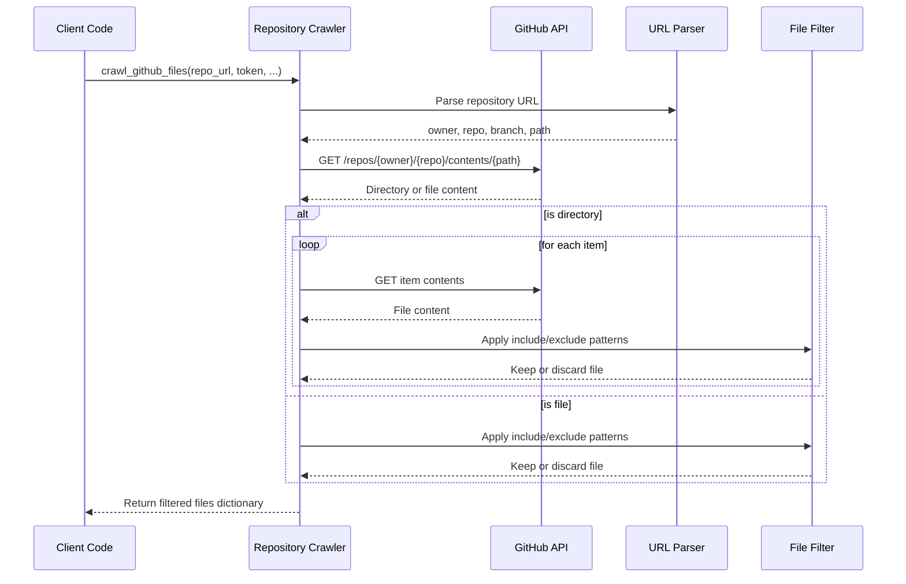
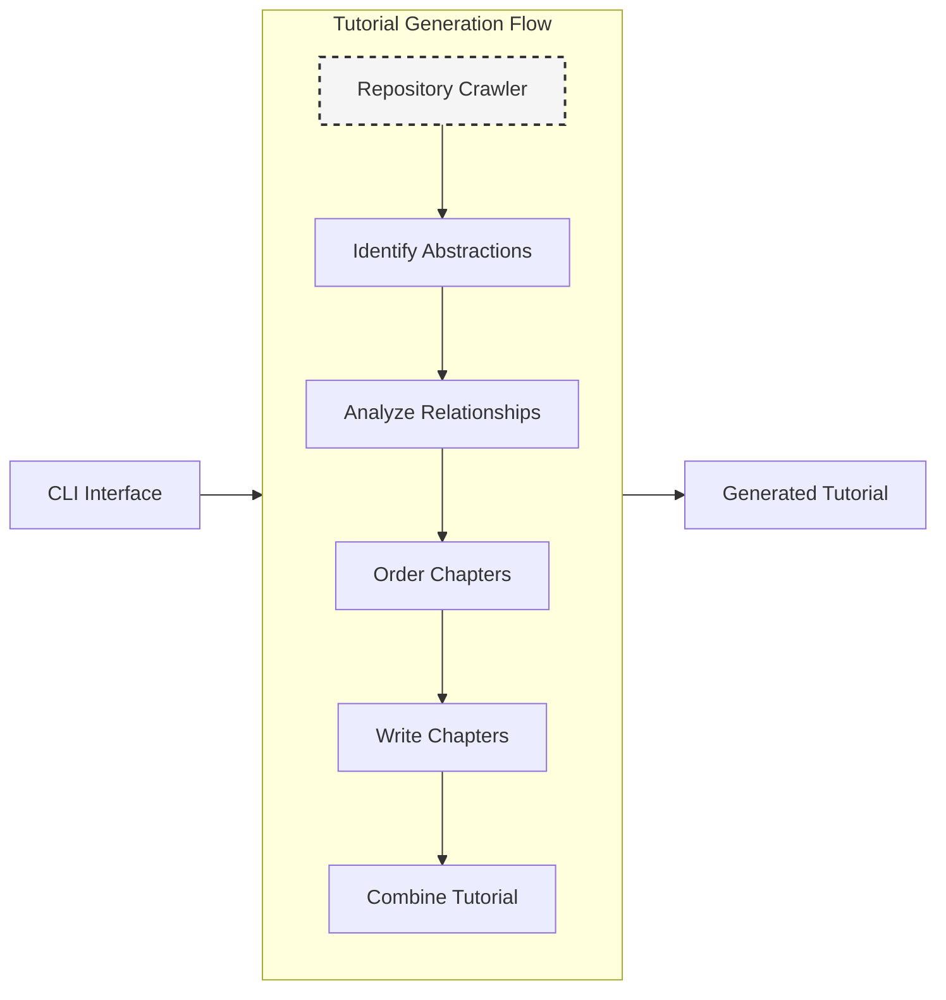

# Chapter 5: Repository Crawling

In the [Node System](04_node_system_.md) chapter, we explored how our tutorial generation system decomposes complex workflows into specialized processing units. Now, we'll examine the component responsible for the very first step in this pipeline: Repository Crawling.

## Introduction: The Gateway to Code Understanding

Before we can analyze, document, or generate tutorials for any codebase, we face a fundamental challenge: how do we efficiently access the source code itself? This seemingly straightforward task becomes complex when dealing with different repositories and varying access methods.

Consider this scenario: you need to generate a tutorial for a project that might exist as:

- A GitHub repository requiring authentication
- A local directory on your machine
- A specific branch or subdirectory within a larger codebase
- A mix of relevant files among build artifacts and test files

The Repository Crawling subsystem addresses this challenge by providing a unified interface for code extraction, regardless of the source location or access method.

## The Abstraction Problem: Normalizing Diverse Code Sources

At its core, repository crawling solves a critical abstraction problem: **how to normalize diverse code sources into a consistent representation that the rest of the system can process**. Let's examine the key challenges it addresses:

### 1. Source Location Variability

Code can reside in various locations:

- Remote GitHub repositories requiring API interaction
- Private repositories requiring authentication
- Local project directories
- Specific subdirectories within larger projects

### 2. Access Method Differences

Each source location requires different access methods:

- GitHub API calls for remote repositories
- Authentication handling for private repositories
- Filesystem operations for local directories
- Pagination handling for large repositories

### 3. Content Filtering Needs

Not all files in a repository are relevant:

- Filtering by file extension (`.py`, `.js`, etc.)
- Excluding test directories and build artifacts
- Limiting file sizes to avoid processing large binary files
- Including only specific subdirectories

### 4. Error Handling Complexity

Different sources present different failure modes:

- API rate limiting for GitHub
- Network connectivity issues
- Permission problems
- Encoding and decoding errors

The Repository Crawling subsystem abstracts away these complexities, presenting a unified interface to the rest of the system.

## Core Components of the Repository Crawler

The Repository Crawler consists of several key components:

1. **Source Adapters** - Specialized handlers for different code sources (GitHub, local)
2. **Filtering Engine** - Pattern-based file inclusion/exclusion logic
3. **Content Normalizer** - Converts varied sources into a standard format
4. **Error Handler** - Manages failures and retries

Let's examine how these components work together to solve our code access problem.

## Implementing the Repository Crawler

The repository crawler is implemented through two main modules:

- `crawl_github_files.py` - Handles remote GitHub repositories
- `crawl_local_files.py` - Manages local directory access

Both implement a similar interface, allowing the rest of the system to interact with them in a consistent way.

### Using the Repository Crawler: Basic Examples

Let's look at how to use the repository crawler in different scenarios:

#### Example 1: Crawling a GitHub Repository

```python
from utils.crawl_github_files import crawl_github_files

# Get files from a GitHub repository
result = crawl_github_files(
    repo_url="https://github.com/example/repo",
    token=os.environ.get("GITHUB_TOKEN"),  # Authentication token
    include_patterns={"*.py", "*.md"},     # Only Python and Markdown files
    exclude_patterns={"tests/*", "docs/*"}, # Exclude tests and docs
    max_file_size=100000                   # Max 100KB files
)

# Access the crawled files
files = result["files"]
for file_path, content in files.items():
    print(f"File: {file_path}, Size: {len(content)} bytes")
```

This code fetches all Python and Markdown files from the specified GitHub repository, excluding test and documentation directories, and limiting to files under 100KB. The `files` dictionary maps file paths to their contents.

#### Example 2: Crawling a Local Directory

```python
from utils.crawl_local_files import crawl_local_files

# Get files from a local directory
result = crawl_local_files(
    directory="./my-project",
    include_patterns={"*.js", "*.ts"},     # Only JavaScript and TypeScript
    exclude_patterns={"node_modules/*"},   # Exclude node_modules
    max_file_size=500000                   # Max 500KB files
)

# Access the crawled files
files = result["files"]
print(f"Found {len(files)} relevant files")
```

This example crawls a local directory, filtering for JavaScript and TypeScript files, excluding the node_modules directory, and limiting to files under 500KB.

#### Example 3: Integration with the Node System

The repository crawler is typically used within the `FetchRepo` node in our [Node System](04_node_system_.md):

```python
class FetchRepo(Node):
    def process(self, shared):
        # Determine which source to use based on shared context
        if shared.get("repo_url"):
            # Fetch from GitHub
            result = self._fetch_from_github(
                shared["repo_url"], 
                shared["github_token"],
                shared["include_patterns"],
                shared["exclude_patterns"],
                shared["max_file_size"]
            )
        elif shared.get("local_dir"):
            # Fetch from local directory
            result = self._fetch_from_local(
                shared["local_dir"],
                shared["include_patterns"],
                shared["exclude_patterns"],
                shared["max_file_size"]
            )
        else:
            raise ValueError("No repository source specified")
            
        # Normalize file information in shared context
        shared["files"] = [
            {
                "path": path,
                "content": content,
                "language": self._detect_language(path),
                "size": len(content)
            }
            for path, content in result["files"].items()
        ]
        
        # Set project name if not provided
        if not shared.get("project_name"):
            shared["project_name"] = self._derive_project_name(shared)
            
        return shared
        
    def _fetch_from_github(self, repo_url, token, include_patterns, exclude_patterns, max_size):
        return crawl_github_files(
            repo_url=repo_url,
            token=token,
            include_patterns=include_patterns,
            exclude_patterns=exclude_patterns,
            max_file_size=max_size
        )
        
    def _fetch_from_local(self, directory, include_patterns, exclude_patterns, max_size):
        return crawl_local_files(
            directory=directory,
            include_patterns=include_patterns,
            exclude_patterns=exclude_patterns,
            max_file_size=max_size
        )
        
    def _detect_language(self, path):
        # Simple extension-based language detection
        ext = os.path.splitext(path)[1].lower()
        language_map = {
            '.py': 'python',
            '.js': 'javascript',
            '.ts': 'typescript',
            '.go': 'go',
            '.java': 'java',
            '.c': 'c',
            '.cpp': 'cpp',
            '.h': 'c',
            '.md': 'markdown',
            '.yml': 'yaml',
            '.yaml': 'yaml'
        }
        return language_map.get(ext, 'text')
        
    def _derive_project_name(self, shared):
        # Extract project name from repository URL or directory
        if shared.get("repo_url"):
            # Extract from GitHub URL
            parts = shared["repo_url"].rstrip('/').split('/')
            return parts[-1]
        elif shared.get("local_dir"):
            # Extract from directory name
            return os.path.basename(os.path.abspath(shared["local_dir"]))
        return "unknown_project"
```

This node serves as the entry point to our tutorial generation system, fetching code from either GitHub or a local directory, and normalizing the file data into a consistent format for downstream processing.

## Deep Dive: GitHub Repository Crawling

Let's examine how the GitHub repository crawler works under the hood. The `crawl_github_files` function handles the complexities of GitHub API interaction.

### Request Flow for GitHub Crawling



The process involves several key steps:

1. **URL Parsing**: The repository URL is parsed to extract owner, repository name, branch, and path information.
2. **API Navigation**: The GitHub API is queried to retrieve the contents at the specified path.
3. **Recursive Traversal**: Directories are traversed recursively to access all files.
4. **Content Retrieval**: File contents are retrieved either via direct download or base64 decoding.
5. **Filtering**: Files are filtered based on the specified inclusion/exclusion patterns and size limits.

### Key Implementation Details

Let's examine some key parts of the implementation:

#### URL Parsing and Repository Information Extraction

```python
def crawl_github_files(repo_url, token=None, ...):
    # Parse GitHub URL to extract owner, repo, commit/branch, and path
    parsed_url = urlparse(repo_url)
    path_parts = parsed_url.path.strip('/').split('/')
    
    if len(path_parts) < 2:
        raise ValueError(f"Invalid GitHub URL: {repo_url}")
    
    # Extract the basic components
    owner = path_parts[0]
    repo = path_parts[1]
    
    # Check if URL contains a specific branch/commit
    if len(path_parts) > 2 and 'tree' == path_parts[2]:
        # Handle branch/commit specification and path
        # ...
```

This code parses the GitHub URL to extract the repository owner, name, branch (or commit), and specific path within the repository. It handles complex URLs like `https://github.com/owner/repo/tree/branch/path/to/dir`.

#### Content Fetching with Authentication

```python
def fetch_contents(path):
    """Fetch contents of the repository at a specific path and commit"""
    url = f"https://api.github.com/repos/{owner}/{repo}/contents/{path}"
    params = {"ref": ref} if ref != None else {}
    
    # Set up authentication headers if token is provided
    headers = {"Accept": "application/vnd.github.v3+json"}
    if token:
        headers["Authorization"] = f"token {token}"
    
    response = requests.get(url, headers=headers, params=params)
    
    # Handle rate limiting and retries
    if response.status_code == 403 and 'rate limit exceeded' in response.text.lower():
        reset_time = int(response.headers.get('X-RateLimit-Reset', 0))
        wait_time = max(reset_time - time.time(), 0) + 1
        print(f"Rate limit exceeded. Waiting for {wait_time:.0f} seconds...")
        time.sleep(wait_time)
        return fetch_contents(path)
        
    # ...rest of function
```

This code handles the GitHub API interaction, including:

- Setting up proper authentication headers
- Handling rate limiting through exponential backoff
- Managing API pagination for large repositories

#### File Filtering Logic

```python
def should_include_file(file_path: str, file_name: str) -> bool:
    """Determine if a file should be included based on patterns"""
    # If no include patterns are specified, include all files
    if not include_patterns:
        include_file = True
    else:
        # Check if file matches any include pattern
        include_file = any(fnmatch.fnmatch(file_name, pattern) for pattern in include_patterns)

    # If exclude patterns are specified, check if file should be excluded
    if exclude_patterns and include_file:
        # Exclude if file matches any exclude pattern
        exclude_file = any(fnmatch.fnmatch(file_path, pattern) for pattern in exclude_patterns)
        return not exclude_file

    return include_file
```

This utility function implements the pattern matching logic using Python's `fnmatch` module, which provides Unix shell-style wildcard pattern matching. It first checks if a file should be included, then applies exclusion patterns if needed.

### Token Management and Authentication

Handling authentication securely is a critical aspect of the GitHub crawler:

```python
# Initialize GitHub API headers
headers = {"Accept": "application/vnd.github.v3+json"}
if token:
    headers["Authorization"] = f"token {token}"
else:
    # Try to get token from environment variable
    env_token = os.environ.get("GITHUB_TOKEN")
    if env_token:
        headers["Authorization"] = f"token {env_token}"
        print("Using GitHub token from environment variable")
    else:
        print("Warning: No GitHub token provided. Public repositories will have stricter rate limits.")
```

This code demonstrates a layered approach to token management:

1. Use an explicitly provided token if available
2. Fall back to the `GITHUB_TOKEN` environment variable
3. Proceed without a token but warn about rate limiting

## Deep Dive: Local Directory Crawling

The local directory crawler is significantly simpler but follows a similar interface pattern:

```python
def crawl_local_files(directory, include_patterns=None, exclude_patterns=None, max_file_size=None, use_relative_paths=True):
    """
    Crawl files in a local directory with similar interface as crawl_github_files.
    """
    if not os.path.isdir(directory):
        raise ValueError(f"Directory does not exist: {directory}")
        
    files_dict = {}
    
    for root, _, files in os.walk(directory):
        for filename in files:
            filepath = os.path.join(root, filename)
            
            # Get path relative to directory if requested
            if use_relative_paths:
                relpath = os.path.relpath(filepath, directory)
            else:
                relpath = filepath
                
            # Apply filtering and size checks
            # ... (filtering logic)
                
            try:
                with open(filepath, 'r', encoding='utf-8') as f:
                    content = f.read()
                files_dict[relpath] = content
            except Exception as e:
                print(f"Warning: Could not read file {filepath}: {e}")
                
    return {"files": files_dict}
```

The local crawler uses Python's `os.walk()` function to recursively traverse the directory structure, applying the same filtering patterns as the GitHub crawler for consistency.

## Pattern Matching and Filtering Logic

A key aspect of the repository crawler is its powerful filtering capability. The system uses Unix shell-style wildcard patterns through Python's `fnmatch` module:

### Pattern Syntax

- `*` - Matches everything
- `?` - Matches any single character
- `[seq]` - Matches any character in seq
- `[!seq]` - Matches any character not in seq

### Common Pattern Examples

```python
# Default include patterns for code files
DEFAULT_INCLUDE_PATTERNS = {
    "*.py",                   # Python files
    "*.js", "*.jsx",          # JavaScript files
    "*.ts", "*.tsx",          # TypeScript files
    "*.go",                   # Go files
    "*.java",                 # Java files
    "*.c", "*.cpp", "*.h",    # C/C++ files
    "*.md", "*.rst",          # Documentation files
    "Dockerfile", "Makefile", # Configuration files
    "*.yaml", "*.yml"         # YAML files
}

# Default exclude patterns for common non-code directories
DEFAULT_EXCLUDE_PATTERNS = {
    "venv/*", ".venv/*",        # Virtual environments
    "*test*", "tests/*",        # Test files and directories
    "docs/*", "examples/*",     # Documentation and examples
    "dist/*", "build/*",        # Build artifacts
    ".git/*", ".github/*",      # Version control
    "node_modules/*",           # Dependencies
    "*.log"                     # Log files
}
```

These patterns provide sensible defaults while allowing users to customize filtering for their specific needs.

## Integration with the Shared Context

The Repository Crawler integrates with the [Shared Context Management](03_shared_context_management_.md) system through the `FetchRepo` node. Let's examine how it updates the shared context:

```python
def post(self, shared, prep_result, exec_result):
    """Update shared context with fetched files."""
    # Extract files from execution result
    files_dict = exec_result["files"]
    
    # Convert to standardized format
    standardized_files = []
    for path, content in files_dict.items():
        file_info = {
            "path": path,
            "content": content,
            "language": self._detect_language(path),
            "size": len(content)
        }
        standardized_files.append(file_info)
    
    # Update shared context
    shared["files"] = standardized_files
    
    # Derive project name if not provided
    if not shared.get("project_name"):
        if shared.get("repo_url"):
            # Extract from GitHub URL
            parts = shared["repo_url"].rstrip('/').split('/')
            shared["project_name"] = parts[-1]
        elif shared.get("local_dir"):
            # Extract from directory name
            shared["project_name"] = os.path.basename(os.path.abspath(shared["local_dir"]))
    
    # Log summary
    print(f"Fetched {len(standardized_files)} files for project '{shared['project_name']}'")
    
    return shared
```

This code transforms the raw file dictionary into a structured format that downstream nodes can process efficiently. It also derives a project name if one was not explicitly provided.

## Error Handling and Resilience

The Repository Crawler implements several strategies for error handling and resilience:

### 1. Rate Limit Handling

For GitHub API requests, the crawler detects rate limit errors and automatically waits for the rate limit to reset:

```python
if response.status_code == 403 and 'rate limit exceeded' in response.text.lower():
    reset_time = int(response.headers.get('X-RateLimit-Reset', 0))
    wait_time = max(reset_time - time.time(), 0) + 1
    print(f"Rate limit exceeded. Waiting for {wait_time:.0f} seconds...")
    time.sleep(wait_time)
    return fetch_contents(path)  # Recursive retry after waiting
```

### 2. Repository Access Problems

The crawler provides clear error messages for common access issues:

```python
if response.status_code == 404:
    if not token:
        print(f"Error 404: Repository not found or is private.\n"
              f"If this is a private repository, please provide a valid GitHub token.")
    elif not path and ref == 'main':
        print(f"Error 404: Repository not found. Check if the default branch is not 'main'.")
    else:
        print(f"Error 404: Path '{path}' not found in repository.")
    return
```

### 3. File Reading Failures

For local files that can't be read, the crawler catches exceptions and continues processing:

```python
try:
    with open(filepath, 'r', encoding='utf-8') as f:
        content = f.read()
    files_dict[relpath] = content
except Exception as e:
    print(f"Warning: Could not read file {filepath}: {e}")
    # Continue with other files
```

### 4. SSH Repository Support

The crawler supports both HTTPS and SSH GitHub URLs:

```python
# Detect SSH URL (git@ or .git suffix)
is_ssh_url = repo_url.startswith("git@") or repo_url.endswith(".git")

if is_ssh_url:
    # Clone repo via SSH to temp dir
    with tempfile.TemporaryDirectory() as tmpdirname:
        print(f"Cloning SSH repo {repo_url} to temp dir {tmpdirname} ...")
        try:
            repo = git.Repo.clone_from(repo_url, tmpdirname)
            # Process files from local clone
            # ...
```

This flexibility allows users to use their preferred authentication method.

## Performance Optimizations

The Repository Crawler implements several optimizations for efficient processing:

### 1. Size Checking Before Content Download

```python
# Check file size if available
file_size = item.get("size", 0)
if file_size > max_file_size:
    skipped_files.append((item_path, file_size))
    print(f"Skipping {rel_path}: File size ({file_size} bytes) exceeds limit")
    continue
```

This code checks file size metadata before downloading content, avoiding unnecessary transfers of large files.

### 2. Concurrent Processing for Local Files

For local directory crawling with many files, a concurrent implementation is available:

```python
def crawl_local_files_concurrent(directory, include_patterns=None, exclude_patterns=None, 
                                max_file_size=None, max_workers=4):
    """Concurrent version of crawl_local_files for faster processing."""
    if not os.path.isdir(directory):
        raise ValueError(f"Directory does not exist: {directory}")
    
    files_dict = {}
    file_paths = []
    
    # First pass: collect all relevant file paths
    for root, _, files in os.walk(directory):
        for filename in files:
            filepath = os.path.join(root, filename)
            relpath = os.path.relpath(filepath, directory)
            
            # Apply filtering logic
            # ... (omitted for brevity)
            
            if included and not excluded and (max_file_size is None or 
                                             os.path.getsize(filepath) <= max_file_size):
                file_paths.append((filepath, relpath))
    
    # Second pass: read files concurrently
    with concurrent.futures.ThreadPoolExecutor(max_workers=max_workers) as executor:
        future_to_file = {
            executor.submit(read_file, path): (path, rel_path) 
            for path, rel_path in file_paths
        }
        
        for future in concurrent.futures.as_completed(future_to_file):
            path, rel_path = future_to_file[future]
            try:
                content = future.result()
                files_dict[rel_path] = content
            except Exception as e:
                print(f"Warning: Could not read file {path}: {e}")
    
    return {"files": files_dict}

def read_file(path):
    """Helper function to read a file's content."""
    with open(path, 'r', encoding='utf-8') as f:
        return f.read()
```

This optimization can significantly speed up processing for repositories with many small files.

## Real-World Challenges and Solutions

Let's examine some real-world challenges that the Repository Crawler addresses:

### Challenge 1: Private Repository Access

Private repositories require authentication, but tokens should be handled securely.

**Solution**: The crawler supports multiple authentication methods:

1. Explicit token parameter
2. Environment variable lookup
3. SSH key-based authentication for git URLs

### Challenge 2: Large Repositories

Very large repositories can cause memory issues and slow processing.

**Solution**: The crawler implements:

1. Size-based filtering to skip large files
2. Pattern-based filtering to focus on relevant files
3. Pagination handling for GitHub API responses

### Challenge 3: Non-Standard Branch Names

Not all repositories use 'main' or 'master' as their default branch.

**Solution**: The crawler:

1. Attempts to detect the branch name from the URL
2. Falls back to the repository's default branch if not specified
3. Provides clear error messages when branch detection fails

### Challenge 4: Binary File Handling

Binary files can cause encoding errors and are often not relevant for code analysis.

**Solution**: The crawler:

1. Checks file sizes before attempting to read
2. Uses appropriate encoding for text files
3. Provides size limits to automatically exclude binary files

## Connection to the Overall System

The Repository Crawler is the first component in the [Tutorial Generation Flow](02_tutorial_generation_flow_.md). It provides the raw material (source code) that subsequent components analyze and transform:



The Repository Crawler:

1. Receives configuration from the [CLI Interface](01_cli_interface_.md)
2. Fetches and filters code files
3. Normalizes the file data for the [Code Analysis Process](07_code_analysis_process_.md)
4. Updates the [Shared Context Management](03_shared_context_management_.md) system with standardized file information

## Conclusion: The Foundation of Code Analysis

The Repository Crawling subsystem serves as the critical foundation for our tutorial generation process. By providing a consistent, unified interface to diverse code sources, it allows the rest of the system to focus on analysis and content generation without worrying about the complexities of code access.

Key takeaways from this chapter:

- Repository crawling abstracts away the differences between GitHub and local code sources
- The system provides powerful filtering capabilities through pattern matching
- Error handling and resilience features ensure robust operation
- Performance optimizations enable efficient processing of large repositories
- The crawler outputs a standardized file representation for downstream processing

With the code now accessible in a consistent format, the next stage is to analyze it. In the next chapter, [LLM Service](06_llm_service_.md), we'll explore how we leverage language models to understand and interpret this code.

---

Generated by fork of [AI Codebase Knowledge Builder](https://github.com/vegeta03/PocketFlow-Tutorial-Codebase-Knowledge.git)
