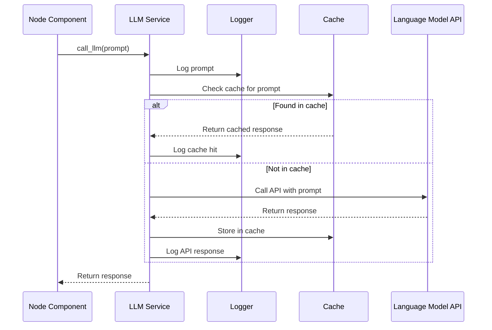

# Chapter 6: LLM Service

In the [Repository Crawling](05_repository_crawling_.md) chapter, we explored how our system accesses and filters code from various sources. Once we have the raw code available, we need to make sense of it - to analyze it intelligently and generate educational content. This is where the LLM Service comes into play.

## Introduction: The Intelligence Layer

Imagine having a brilliant senior programmer with encyclopedic knowledge of programming languages, frameworks, and design patterns sitting next to you as you explore an unfamiliar codebase. This expert can analyze complex code structures, identify key components, explain relationships between modules, and articulate concepts in clear, beginner-friendly language. The LLM Service provides exactly this capability to our tutorial generation system.

At its core, the LLM Service is an abstraction layer that handles all interactions with AI language models, shielding the rest of the system from the complexities of prompt crafting, API communication, error handling, and response processing. It transforms code analysis tasks into natural language prompts, intelligently routes them to appropriate language models, and processes the responses into structured data that the rest of the system can use.

## Core Challenges in LLM Integration

Integrating large language models into a production system presents several unique challenges:

1. **Prompt Engineering**: Crafting effective prompts that elicit the desired analysis and formatting is an art form that requires continuous refinement.

2. **API Management**: Handling authentication, rate limits, timeouts, and various failure modes across different LLM providers.

3. **Cost Optimization**: LLM API calls can be expensive, especially at scale, requiring strategies to minimize token usage.

4. **Model Selection**: Different tasks may benefit from different models, requiring a flexible architecture.

5. **Response Reliability**: Ensuring consistent, parseable responses despite the inherent variability of language models.

6. **Debugging**: Tracking model interactions to understand why particular results were generated.

The LLM Service addresses these challenges through a well-designed abstraction that provides a consistent, reliable interface to the rest of the system.

## The LLM Service API: A Unified Interface

Let's explore the primary interface that other components use to interact with language models:

```python
def call_llm(prompt: str, use_cache: bool = True) -> str:
    """
    Send a prompt to a language model and get its response.
    
    Args:
        prompt: The text prompt to send to the language model
        use_cache: Whether to use cached responses (default: True)
        
    Returns:
        The text response from the language model
    """
    # Log the prompt
    logger.info(f"PROMPT: {prompt}")
    
    # Check cache if enabled
    if use_cache and prompt in cache:
        logger.info(f"CACHE HIT: Using cached response")
        return cache[prompt]
    
    # Call the LLM API
    response_text = _call_language_model_api(prompt)
    
    # Cache the response if enabled
    if use_cache:
        cache[prompt] = response_text
    
    # Log the response
    logger.info(f"RESPONSE: {response_text}")
    
    return response_text
```

Despite its simple interface, this function encapsulates significant complexity:

1. **Prompt logging**: Records all prompts for debugging and improvement
2. **Caching**: Stores responses to avoid redundant API calls
3. **Model selection**: Configures the appropriate LLM based on environment settings
4. **API communication**: Handles all details of the API request
5. **Response processing**: Extracts and formats the model's response
6. **Error handling**: Manages failures gracefully
7. **Response logging**: Records all responses for analysis

This clean abstraction allows the rest of the system to focus on what information they need without worrying about how to get it.

## Using the LLM Service

Let's examine how different parts of the system use the LLM Service. The simplest usage pattern looks like this:

```python
from utils.call_llm import call_llm

# Example: Analyzing a function to extract its purpose
def analyze_function(function_code):
    prompt = f"""
    Analyze this function and explain its purpose in one paragraph:
    
    ```python
    {function_code}
    ```
    """
    
    explanation = call_llm(prompt)
    return explanation
```

This simple example demonstrates the core value proposition of the LLM Service: it transforms complex tasks like code analysis into straightforward function calls.

For more complex tasks, we might need more structured responses:

```python
def identify_key_abstractions(file_contents):
    prompt = f"""
    Analyze the following code and identify the key abstractions (classes, functions, etc.) 
    present in it. For each abstraction, provide:
    1. Name
    2. Type (class, function, module, etc.)
    3. Brief description
    4. Importance score (1-10)
    
    Format your response as a JSON array of objects.
    
    ```python
    {file_contents}
    ```
    """
    
    response = call_llm(prompt)
    
    # Parse the JSON response
    try:
        import json
        abstractions = json.loads(response)
        return abstractions
    except json.JSONDecodeError:
        # Handle parsing errors
        print("Failed to parse LLM response as JSON")
        return []
```

This pattern - crafting a detailed prompt, calling the LLM service, and processing the response - is the foundation of how our system leverages AI for code analysis and content generation.

## Inside the LLM Service: Implementation Details

Now let's look at how the LLM Service is implemented. The core functionality resides in the `call_llm` function in `utils/call_llm.py`, which handles the workflow described above. Here's the sequence of operations when a component calls the LLM Service:



Let's examine the implementation of this function in detail:

```python
def call_llm(prompt: str, use_cache: bool = True) -> str:
    # Log the prompt
    logger.info(f"PROMPT: {prompt}")
    
    # Check cache if enabled
    if use_cache:
        # Load cache from disk
        cache = {}
        if os.path.exists(cache_file):
            try:
                with open(cache_file, 'r') as f:
                    cache = json.load(f)
            except:
                logger.warning(f"Failed to load cache, starting with empty cache")
        
        # Return from cache if exists
        if prompt in cache:
            logger.info(f"RESPONSE: {cache[prompt]}")
            return cache[prompt]
    
    # Call the LLM if not in cache or cache disabled
    client = genai.Client(
        vertexai=True, 
        # Project and location configured via environment variables
        project=os.getenv("GEMINI_PROJECT_ID", "your-project-id"),
        location=os.getenv("GEMINI_LOCATION", "us-central1")
    )
    
    model = os.getenv("GEMINI_MODEL", "gemini-2.5-pro-exp-03-25")
    response = client.models.generate_content(
        model=model,
        contents=[prompt]
    )
    response_text = response.text
    
    # Log the response
    logger.info(f"RESPONSE: {response_text}")
    
    # Update cache if enabled
    if use_cache:
        # Load cache again to avoid overwrites
        cache = {}
        if os.path.exists(cache_file):
            try:
                with open(cache_file, 'r') as f:
                    cache = json.load(f)
            except:
                pass
        
        # Add to cache and save
        cache[prompt] = response_text
        try:
            with open(cache_file, 'w') as f:
                json.dump(cache, f)
        except Exception as e:
            logger.error(f"Failed to save cache: {e}")
    
    return response_text
```

This implementation shows several important design decisions:

1. **Default Caching**: Caching is enabled by default (`use_cache=True`) to optimize costs and performance.
2. **Simple Cache Storage**: The cache is a simple JSON file mapping prompts to responses.
3. **Robust Error Handling**: The function handles potential errors at each step (cache loading, API calls, cache saving).
4. **Configurable Model**: The specific model to use is configurable via environment variables.
5. **Comprehensive Logging**: Both prompts and responses are logged for tracking and debugging.

## Model Flexibility: Supporting Different LLM Providers

One of the key advantages of the LLM Service is its ability to support different LLM providers. The implementation includes examples for three major providers:

1. **Google Gemini** (default implementation)
2. **Anthropic Claude** (commented alternative)
3. **OpenAI** (commented alternative)

This flexibility allows the system to:

- Use the best model for specific tasks
- Accommodate user preferences or existing API access
- Adapt to changing model availability and performance
- Compare results across different models during development

Here's an example of how you could switch to using Claude instead of Gemini:

```python
# Using Anthropic Claude instead of the default Gemini
def call_llm(prompt, use_cache: bool = True):
    from anthropic import Anthropic
    client = Anthropic(api_key=os.environ.get("ANTHROPIC_API_KEY", "your-api-key"))
    
    # Log the prompt
    logger.info(f"PROMPT: {prompt}")
    
    # Check cache (code omitted for brevity)
    
    # Call Claude API
    response = client.messages.create(
        model="claude-3-7-sonnet-20250219",
        max_tokens=21000,
        thinking={
            "type": "enabled",
            "budget_tokens": 20000
        },
        messages=[
            {"role": "user", "content": prompt}
        ]
    )
    response_text = response.content[1].text
    
    # Cache and log (code omitted for brevity)
    
    return response_text
```

Each implementation maintains the same simple interface, shielding the rest of the system from the provider-specific details.

## Logging and Debugging: Understanding LLM Behavior

The LLM Service includes comprehensive logging to help understand, debug, and improve the system's interactions with language models:

```python
# Configure logging
log_directory = os.getenv("LOG_DIR", "logs")
os.makedirs(log_directory, exist_ok=True)
log_file = os.path.join(log_directory, f"llm_calls_{datetime.now().strftime('%Y%m%d')}.log")

# Set up logger
logger = logging.getLogger("llm_logger")
logger.setLevel(logging.INFO)
logger.propagate = False  # Prevent propagation to root logger
file_handler = logging.FileHandler(log_file)
file_handler.setFormatter(logging.Formatter('%(asctime)s - %(levelname)s - %(message)s'))
logger.addHandler(file_handler)
```

This setup creates a dedicated logger with daily log files, allowing developers to:

- Track all prompts and responses over time
- Analyze patterns in successful and unsuccessful interactions
- Debug specific issues by examining the exact prompts and responses
- Identify opportunities for prompt optimization

The logs follow a simple format:

```plaintext
2023-10-15 14:32:45 - INFO - PROMPT: Analyze this function...
2023-10-15 14:32:48 - INFO - RESPONSE: This function implements...
```

This detailed logging is particularly important for LLM-based systems due to:

1. The non-deterministic nature of model responses
2. The significant impact of prompt wording on results
3. The need to track token usage and costs
4. The value of building a dataset of interactions for future improvements

## Caching: Optimizing Cost and Performance

The caching mechanism in the LLM Service is crucial for both performance and cost efficiency:

```python
# Simple cache configuration
cache_file = "llm_cache.json"

# Within call_llm function:
if use_cache:
    # Load cache from disk
    cache = {}
    if os.path.exists(cache_file):
        try:
            with open(cache_file, 'r') as f:
                cache = json.load(f)
        except:
            logger.warning(f"Failed to load cache, starting with empty cache")
    
    # Return from cache if exists
    if prompt in cache:
        logger.info(f"RESPONSE: {cache[prompt]}")
        return cache[prompt]
```

The benefits of caching include:

1. **Cost Reduction**: LLM API calls can be expensive, especially for large-scale processing
2. **Speed Improvement**: Eliminating network calls drastically improves processing time
3. **Consistency**: Ensuring the same prompt always yields the same response
4. **Offline Development**: Allowing development and testing without API access

While this simple implementation works well for development and small-scale use, a production system might use more sophisticated caching strategies like database storage, TTL (Time-To-Live) expiration, or semantic caching to match similar prompts.

## Integration with the Node System

The LLM Service integrates seamlessly with the [Node System](04_node_system_.md) through various analysis and generation nodes. Let's examine how a typical node uses the LLM Service with additional reliability features:

```python
class IdentifyAbstractions(Node):
    def __init__(self, max_retries=5, wait=20):
        super().__init__()
        self.max_retries = max_retries
        self.wait = wait
    
    def exec(self, prep_result):
        combined_code = self._combine_code_files(prep_result["files"])
        project_name = prep_result["project_name"]
        
        prompt = self._create_abstraction_prompt(combined_code, project_name)
        
        # Use LLM service with retry logic
        try:
            abstractions = self._call_llm_with_retry(prompt)
            return self._parse_abstractions(abstractions)
        except Exception as e:
            logger.error(f"Failed to identify abstractions: {e}")
            return []
    
    def _call_llm_with_retry(self, prompt):
        retries = 0
        while retries < self.max_retries:
            try:
                response = call_llm(prompt)
                return response
            except Exception as e:
                retries += 1
                if retries >= self.max_retries:
                    raise
                logger.warning(f"LLM call failed, retrying ({retries}/{self.max_retries})...")
                time.sleep(self.wait)
```

This pattern demonstrates how nodes build on the basic LLM Service by adding their own retry logic and error handling specific to their needs.

## Advanced Techniques: Structured Prompts and Response Parsing

Beyond the basic usage patterns, the LLM Service enables more sophisticated techniques for improving model interactions. One of the most important is structured prompt templates:

```python
def load_prompt_template(template_name):
    """Load a prompt template from the templates directory."""
    template_path = os.path.join("templates", f"{template_name}.txt")
    with open(template_path, 'r') as f:
        return f.read()

def create_prompt(template_name, **kwargs):
    """Create a prompt by filling a template with variables."""
    template = load_prompt_template(template_name)
    return template.format(**kwargs)

# Usage
prompt = create_prompt("identify_abstractions", 
                      code=file_content, 
                      project_name=project_name)
response = call_llm(prompt)
```

This approach separates prompt engineering from code logic, making it easier to refine prompts over time without changing the core application code.

Another advanced technique is structured response parsing with fallbacks:

```python
def extract_structured_data(response, format_type="json"):
    """Extract structured data from LLM response with fallbacks."""
    if format_type == "json":
        try:
            # First attempt: Direct JSON parsing
            return json.loads(response)
        except json.JSONDecodeError:
            # Second attempt: Find JSON block in markdown
            import re
            json_blocks = re.findall(r'```(?:json)?\s*([\s\S]*?)```', response)
            if json_blocks:
                try:
                    return json.loads(json_blocks[0])
                except json.JSONDecodeError:
                    pass
            
            # Third attempt: Use regex to extract structured data
            return extract_with_regex(response)
    
    # Handle other format types...
```

This robust parsing approach handles the reality that LLMs don't always produce perfectly formatted outputs, even when explicitly requested.

## Real-World Example: Complex Code Analysis

Let's examine a complete real-world example of how the LLM Service is used for complex code analysis:

```python
def analyze_module_structure(module_path, module_content):
    """
    Perform a deep analysis of a module's structure and functionality.
    Returns structured information about classes, functions, and relationships.
    """
    # Step 1: Get high-level module overview
    overview_prompt = f"""
    Analyze this Python module and provide a high-level overview of its purpose.
    Limit your response to 2-3 sentences.
    
    ```python
    {module_content}
    ```
    """
    module_overview = call_llm(overview_prompt)
    
    # Step 2: Extract structured class and function information
    structure_prompt = f"""
    Extract all classes and functions from this Python module. For each:
    
    For classes:
    - Class name
    - Base classes (if any)
    - Brief description
    - Public methods (name and purpose)
    
    For functions:
    - Function name
    - Parameters
    - Return type
    - Brief description
    
    Format your response as JSON with two top-level keys: "classes" and "functions".
    
    ```python
    {module_content}
    ```
    """
    
    structure_response = call_llm(structure_prompt)
    
    # Parse the structured response
    try:
        module_structure = json.loads(structure_response)
    except json.JSONDecodeError:
        # Fallback to regex extraction if JSON parsing fails
        module_structure = extract_structure_with_regex(structure_response)
    
    # Step 3: Analyze internal relationships
    if module_structure["classes"]:
        relationships_prompt = f"""
        Analyze the relationships between classes and functions in this module.
        Identify dependencies, inheritance, composition, etc.
        Format as JSON with "source", "target", and "relationship" keys.
        
        Here are the entities to analyze:
        {json.dumps(module_structure, indent=2)}
        
        The original code:
        ```python
        {module_content}
        ```
        """
        
        relationships_response = call_llm(relationships_prompt)
        
        try:
            relationships = json.loads(relationships_response)
        except json.JSONDecodeError:
            relationships = []
    else:
        relationships = []
    
    # Combine all analysis into comprehensive report
    return {
        "path": module_path,
        "overview": module_overview,
        "structure": module_structure,
        "relationships": relationships
    }
```

This example demonstrates several advanced patterns:

1. **Multi-stage analysis**: Breaking down complex analysis into a sequence of focused LLM calls
2. **Context building**: Using results from earlier calls to inform later prompts
3. **Robust parsing**: Handling potential JSON parsing failures gracefully
4. **Structured output**: Building a comprehensive, structured representation of the analysis

## Common Challenges and Solutions

Working with LLMs in a production system presents several challenges. Here are some common issues and their solutions:

### 1. Token Limits

LLMs have context length limits, restricting how much code can be analyzed at once.

**Solution**: Implement chunking strategies to process large codebases in parts:

```python
def analyze_large_codebase(files, chunk_size=5):
    """Analyze a large codebase by processing files in chunks."""
    all_results = []
    
    # Process files in chunks to stay within token limits
    for i in range(0, len(files), chunk_size):
        chunk = files[i:i+chunk_size]
        chunk_result = analyze_code_chunk(chunk)
        all_results.append(chunk_result)
    
    # Consolidate results
    return consolidate_analysis_results(all_results)
```

### 2. Varying Response Quality

LLM response quality can vary even with identical prompts.

**Solution**: Implement quality checks and regeneration when needed:

```python
def get_high_quality_response(prompt, min_quality_score=0.7, max_attempts=3):
    """Get a high-quality response, regenerating if necessary."""
    for attempt in range(max_attempts):
        response = call_llm(prompt, use_cache=False)  # Disable cache for multiple attempts
        
        # Evaluate response quality
        quality_score = evaluate_response_quality(response, prompt)
        
        if quality_score >= min_quality_score:
            return response
        
        logger.warning(f"Low quality response (score={quality_score}), regenerating...")
    
    # Return best response after max attempts
    logger.warning(f"Failed to get high-quality response after {max_attempts} attempts")
    return response  # Return the last response
```

### 3. Handling API Rate Limits

LLM providers often impose rate limits that can disrupt processing.

**Solution**: Implement exponential backoff retry logic:

```python
def call_llm_with_backoff(prompt, max_retries=5, initial_wait=1):
    """Call LLM with exponential backoff for rate limits."""
    for attempt in range(max_retries):
        try:
            return call_llm(prompt)
        except RateLimitError as e:
            wait_time = initial_wait * (2 ** attempt)
            logger.warning(f"Rate limit hit. Waiting {wait_time}s before retry {attempt+1}/{max_retries}")
            time.sleep(wait_time)
    
    # If we get here, all retries failed
    raise Exception(f"Failed after {max_retries} attempts due to rate limiting")
```

## Conclusion: The Intelligence Engine

The LLM Service serves as the "brain" of our tutorial generation system, providing the intelligence needed to analyze code and generate educational content. By abstracting away the complexities of LLM interaction, it allows the rest of the system to focus on the tutorial generation workflow rather than the technical details of AI integration.

Key takeaways from this chapter:

1. The LLM Service provides a unified interface to multiple AI language models
2. Caching and logging are essential for cost efficiency and debugging
3. Structured prompts and multi-stage analysis improve result quality and reliability
4. Error handling and fallback mechanisms ensure resilience in production environments
5. The flexible architecture supports different LLM providers without changing the core system

With the LLM Service handling the intelligence aspects of tutorial generation, the system can now apply this intelligence to the specific task of code analysis. In the next chapter, [Code Analysis Process](07_code_analysis_process_.md), we'll explore how the system systematically examines codebases to extract their key components, relationships, and architectural patterns.

---

Generated by fork of [AI Codebase Knowledge Builder](https://github.com/vegeta03/PocketFlow-Tutorial-Codebase-Knowledge.git)
