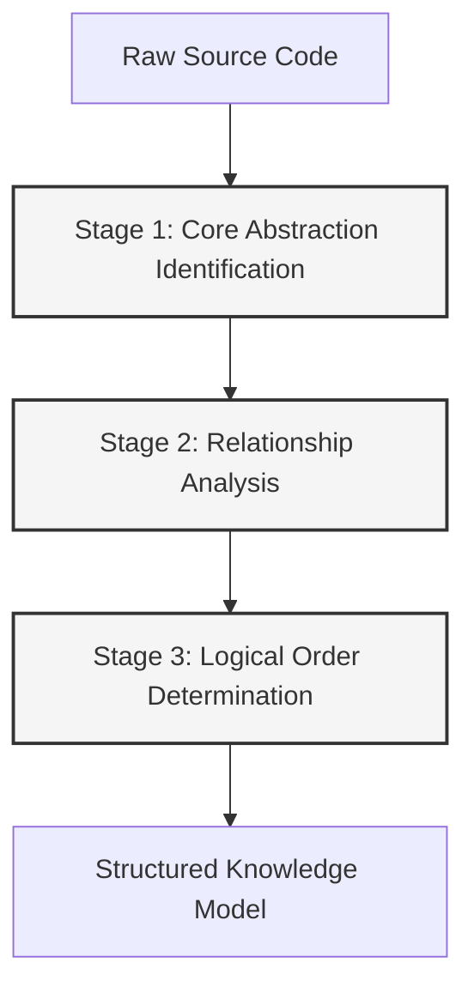
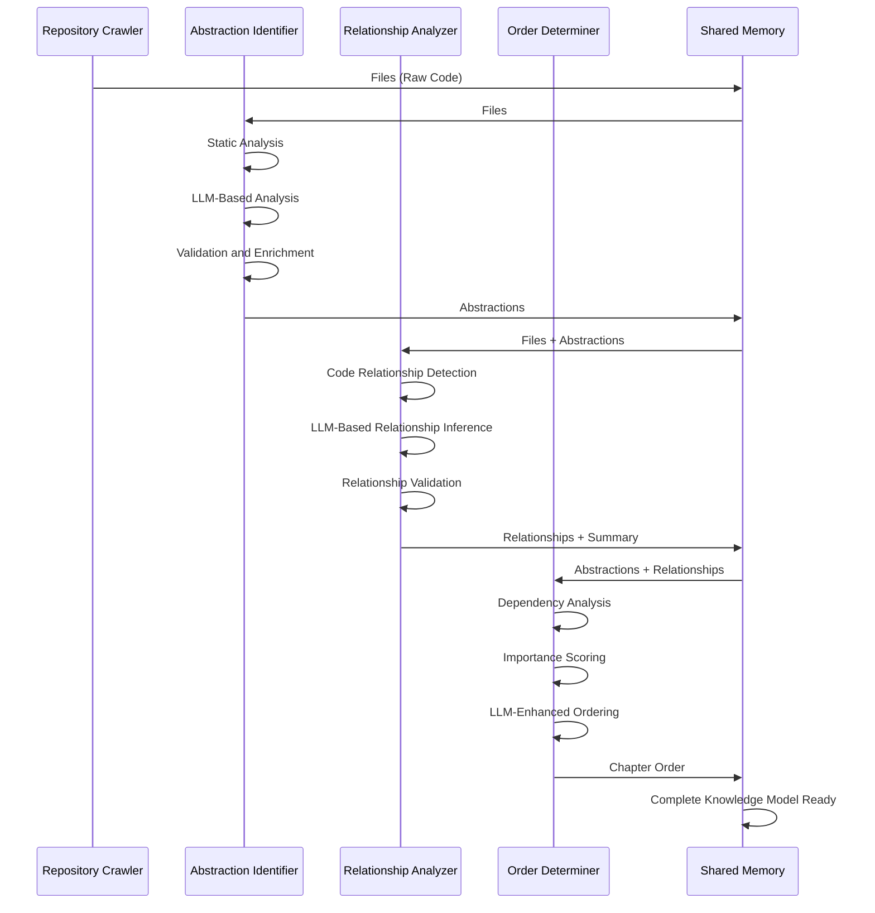
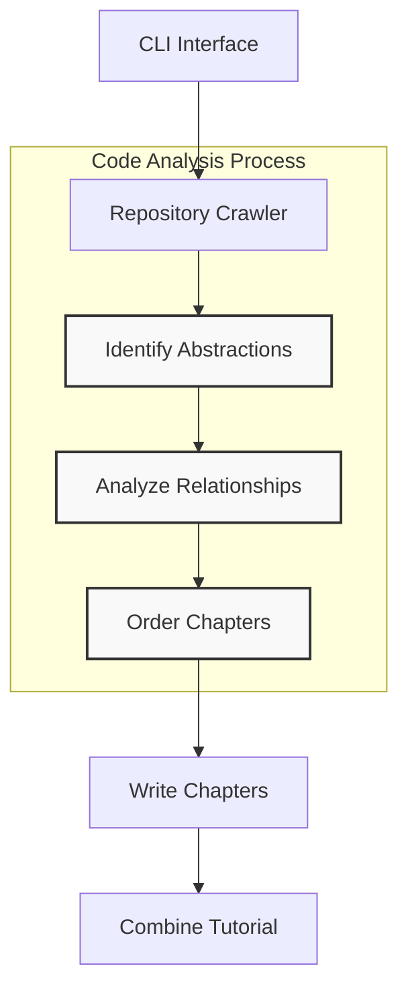

# Chapter 7: Code Analysis Process

In the [LLM Service](06_llm_service_.md) chapter, we explored how our system leverages language models to provide the intelligence layer for our tutorial generation. Now, we'll examine the systematic methodology that transforms raw source code into structured knowledge: the Code Analysis Process.

## Introduction: The Expert Code Reader Problem

Consider being handed a complex, unfamiliar codebase with hundreds of thousands of lines across multiple languages and frameworks. As an experienced engineer, you have a systematic approach to understanding it: you don't read it line-by-line but rather look for patterns, key abstractions, and architectural relationships. You build a mental model of how components fit together, and only then do you dive into specific implementation details.

The Code Analysis Process in our system formalizes and automates this expert approach. It's designed to:

1. Identify what matters in a codebase (and what doesn't)
2. Determine how components relate to each other
3. Structure this knowledge in a logical learning sequence
4. Transform unstructured code into comprehensible knowledge

This process forms the core analytical engine of our tutorial generation system, bridging the gap between raw code and structured educational content.

## The Multi-Stage Analysis Pipeline

The Code Analysis Process consists of three primary stages, each building on the previous:



Each stage has a specific responsibility and transforms the data in a particular way:

1. **Core Abstraction Identification**: Discovers the fundamental building blocks that constitute the codebase's architecture
2. **Relationship Analysis**: Maps the connections, dependencies, and interactions between these abstractions
3. **Logical Order Determination**: Arranges abstractions in a sequence optimized for learning and understanding

Let's explore each stage in detail, focusing on the computational approaches, algorithms, and implementation techniques that make them work.

## Stage 1: Core Abstraction Identification

### The Challenge: Finding What Matters

The first and most critical step in analyzing any codebase is identifying its core abstractions—the fundamental building blocks that define its architecture. This is challenging because:

- Not all code elements are equally important
- The significance of elements varies by context and domain
- Important concepts may be distributed across multiple files
- Some critical abstractions may be implicit rather than explicit

### Abstraction Detection Approaches

Our system employs a hybrid approach combining static code analysis and LLM-powered inference:

#### 1. Static Analysis Pass

First, we perform a basic static analysis to identify explicit code structures:

```python
def identify_explicit_structures(files_data):
    """Extract explicit code structures from files."""
    structures = {
        "classes": [],
        "functions": [],
        "modules": [],
        "interfaces": []
    }
    
    for file_path, content in files_data:
        # Extract language from file extension
        language = detect_language(file_path)
        
        # Apply appropriate parser based on language
        if language == "python":
            structures_in_file = parse_python_structures(content)
        elif language in ["javascript", "typescript"]:
            structures_in_file = parse_js_ts_structures(content)
        # ... other language parsers
        else:
            structures_in_file = parse_generic_structures(content)
            
        # Add file path to each structure for traceability
        for category, items in structures_in_file.items():
            for item in items:
                item["file_path"] = file_path
                structures[category].append(item)
    
    return structures
```

This static analysis provides a baseline inventory of explicit code elements. For Python, this might use the `ast` module; for JavaScript/TypeScript, it might use tools like Esprima or Babel parser.

#### 2. LLM-Based Abstraction Analysis

The static analysis alone doesn't capture the true significance of each element or identify implicit concepts. This is where the [LLM Service](06_llm_service_.md) becomes critical:

```python
def identify_abstractions_with_llm(files_data, project_name):
    """Use LLM to identify core abstractions from code files."""
    # Prepare context for LLM
    context = create_llm_context(files_data)
    
    # Create a structured prompt
    prompt = f"""
    For the project `{project_name}`:
    
    Analyze the provided code and identify the 5-10 most important abstractions that form the core of this codebase.
    An abstraction could be a class, module, function, or even a design pattern that isn't explicitly named.
    
    For each abstraction, provide:
    1. A concise name
    2. A description of what it does
    3. The file indices where it's implemented
    
    Format your response as a structured list.
    
    Codebase Context:
    {context}
    """
    
    # Call LLM service
    response = call_llm(prompt)
    
    # Parse structured response
    abstractions = parse_abstractions_response(response)
    
    return abstractions
```

The LLM analysis captures deeper semantic understanding, including:

- Relative importance of different components
- Implicit concepts and patterns
- Core functionality versus peripheral utilities
- Functional groupings that span multiple files

#### 3. Abstraction Validation and Enrichment

After identifying potential abstractions, the system validates and enriches them:

```python
def validate_and_enrich_abstractions(abstractions, files_data):
    """Validate abstraction file references and enrich with additional metadata."""
    validated_abstractions = []
    
    for abstraction in abstractions:
        # Validate file indices
        valid_indices = []
        for idx in abstraction["file_indices"]:
            if 0 <= idx < len(files_data):
                valid_indices.append(idx)
            else:
                print(f"Warning: Invalid file index {idx} for abstraction '{abstraction['name']}'")
        
        # Skip abstractions with no valid file references
        if not valid_indices:
            print(f"Warning: No valid file references for abstraction '{abstraction['name']}', skipping")
            continue
        
        # Enrich with additional metadata
        enriched = {
            "name": abstraction["name"],
            "description": abstraction["description"],
            "files": valid_indices,
            # Add additional metadata through further analysis
            "importance": estimate_importance(abstraction, files_data)
        }
        
        validated_abstractions.append(enriched)
    
    return validated_abstractions
```

This process ensures that all abstractions have valid file references and adds additional metadata that will be valuable for later stages.

### Implementation in the Node System

This abstraction identification is implemented in the `IdentifyAbstractions` node, which we saw in the [Node System](04_node_system_.md) chapter:

```python
class IdentifyAbstractions(Node):
    def prep(self, shared):
        files_data = shared["files"]
        project_name = shared["project_name"]
        language = shared.get("language", "english")

        # Helper to create context from files, respecting limits
        def create_llm_context(files_data):
            context = ""
            file_info = [] # Store tuples of (index, path)
            for i, (path, content) in enumerate(files_data):
                entry = f"--- File Index {i}: {path} ---\n{content}\n\n"
                context += entry
                file_info.append((i, path))
            return context, file_info

        context, file_info = create_llm_context(files_data)
        file_listing_for_prompt = "\n".join([f"- {idx} # {path}" for idx, path in file_info])
        return context, file_listing_for_prompt, len(files_data), project_name, language

    def exec(self, prep_res):
        context, file_listing_for_prompt, file_count, project_name, language = prep_res
        
        # Create LLM prompt for abstraction identification
        prompt = f"""
        For the project `{project_name}`:
        
        Codebase Context:
        {context}
        
        Analyze the codebase context.
        Identify the top 5-10 core most important abstractions to help those new to the codebase.
        
        For each abstraction, provide:
        1. A concise `name`.
        2. A beginner-friendly `description` explaining what it is with a simple analogy, in around 100 words.
        3. A list of relevant `file_indices` (integers) using the format `idx # path/comment`.
        
        List of file indices and paths present in the context:
        {file_listing_for_prompt}
        
        Format the output as a YAML list of dictionaries.
        """
        
        # Use LLM service to analyze code
        response = call_llm(prompt)
        
        # Parse and validate the response
        yaml_str = response.strip().split("```yaml")[1].split("```")[0].strip()
        abstractions = yaml.safe_load(yaml_str)
        
        # Validate and normalize abstractions
        validated_abstractions = []
        for item in abstractions:
            # Validate structure and indices
            # ...validation code...
            
            # Add to validated list
            validated_abstractions.append({
                "name": item["name"],
                "description": item["description"],
                "files": sorted(list(set(validated_indices)))
            })
        
        return validated_abstractions

    def post(self, shared, prep_res, exec_res):
        shared["abstractions"] = exec_res
```

This implementation demonstrates how the Code Analysis Process leverages both the Node System architecture and the LLM Service to perform intelligent abstraction identification.

## Stage 2: Relationship Analysis

Once we've identified the core abstractions, the next critical step is understanding how they relate to each other. This creates the network of connections that forms the codebase's architectural fabric.

### Types of Relationships

The system analyzes several types of relationships between abstractions:

1. **Dependency**: One abstraction requires another to function
2. **Inheritance**: One abstraction extends or implements another
3. **Composition**: One abstraction contains instances of another
4. **Temporal Sequence**: One abstraction is used before or after another
5. **Functional Grouping**: Abstractions that work together to provide a capability

### Relationship Detection Methodology

The relationship detection combines code-based heuristics with LLM-powered analysis:

```python
def analyze_relationships(abstractions, files_data):
    """Analyze relationships between abstractions based on code analysis."""
    relationships = []
    
    # 1. Extract relevant code snippets for each abstraction
    abstraction_code_map = {}
    for i, abstraction in enumerate(abstractions):
        code_snippets = []
        for file_idx in abstraction["files"]:
            file_path, content = files_data[file_idx]
            code_snippets.append((file_path, content))
        abstraction_code_map[i] = code_snippets
    
    # 2. Analyze each pair of abstractions for potential relationships
    for i, abstraction_i in enumerate(abstractions):
        for j, abstraction_j in enumerate(abstractions):
            if i == j:
                continue  # Skip self-relationships
                
            # Check for code-based relationships
            code_relationship = detect_code_relationship(
                abstraction_i, abstraction_j, 
                abstraction_code_map[i], abstraction_code_map[j]
            )
            
            if code_relationship:
                relationships.append({
                    "from": i,
                    "to": j,
                    "type": code_relationship["type"],
                    "label": code_relationship["description"]
                })
    
    # 3. Use LLM to infer higher-level relationships
    inferred_relationships = infer_relationships_with_llm(abstractions, relationships, files_data)
    
    # 4. Combine and deduplicate relationships
    combined_relationships = deduplicate_relationships(relationships + inferred_relationships)
    
    return combined_relationships
```

#### LLM-Based Relationship Analysis

The most powerful part of the relationship analysis comes from the LLM's ability to understand semantic connections that might not be explicitly coded:

```python
def infer_relationships_with_llm(abstractions, code_relationships, files_data):
    """Use LLM to infer relationships between abstractions."""
    # Build context with abstractions and their descriptions
    abstractions_context = "\n".join([
        f"Abstraction {i}: {a['name']} - {a['description']}"
        for i, a in enumerate(abstractions)
    ])
    
    # Include already detected code relationships
    relationships_context = "\n".join([
        f"Relationship: {abstractions[r['from']]['name']} -> {abstractions[r['to']]['name']} ({r['label']})"
        for r in code_relationships
    ])
    
    # Create a prompt for the LLM
    prompt = f"""
    Analyze these software abstractions and their existing relationships:
    
    Abstractions:
    {abstractions_context}
    
    Known Relationships:
    {relationships_context}
    
    Based on the abstractions' descriptions and known relationships, identify additional important relationships 
    that might exist between them. For each relationship, specify:
    
    1. The source abstraction (by index)
    2. The target abstraction (by index)
    3. A brief description of how they relate
    
    Format your response as a list of relationship objects.
    """
    
    # Call LLM service
    response = call_llm(prompt)
    
    # Parse and validate the inferred relationships
    inferred_relationships = parse_relationships_response(response)
    
    return inferred_relationships
```

This approach allows the system to detect subtle relationships that wouldn't be apparent from code analysis alone, such as architectural patterns, control flow dependencies, or conceptual groupings.

### Implementation in the Node System

The relationship analysis is implemented in the `AnalyzeRelationships` node:

```python
class AnalyzeRelationships(Node):
    def prep(self, shared):
        abstractions = shared["abstractions"]
        files_data = shared["files"]
        project_name = shared["project_name"]
        
        # Create context with abstraction names, indices, descriptions, and relevant file snippets
        context = "Identified Abstractions:\n"
        all_relevant_indices = set()
        abstraction_info_for_prompt = []
        
        for i, abstr in enumerate(abstractions):
            file_indices_str = ", ".join(map(str, abstr['files']))
            info_line = f"- Index {i}: {abstr['name']} (Relevant file indices: [{file_indices_str}])\n  Description: {abstr['description']}"
            context += info_line + "\n"
            abstraction_info_for_prompt.append(f"{i} # {abstr['name']}")
            all_relevant_indices.update(abstr['files'])
        
        # Add relevant file snippets
        context += "\nRelevant File Snippets (Referenced by Index and Path):\n"
        relevant_files_content_map = get_content_for_indices(
            files_data,
            sorted(list(all_relevant_indices))
        )
        file_context_str = "\n\n".join(
            f"--- File: {idx_path} ---\n{content}"
            for idx_path, content in relevant_files_content_map.items()
        )
        context += file_context_str
        
        return context, "\n".join(abstraction_info_for_prompt), project_name

    def exec(self, prep_res):
        context, abstraction_listing, project_name = prep_res
        
        prompt = f"""
        Based on the following abstractions and relevant code snippets from the project `{project_name}`:
        
        List of Abstraction Indices and Names:
        {abstraction_listing}
        
        Context (Abstractions, Descriptions, Code):
        {context}
        
        Please provide:
        1. A high-level `summary` of the project's main purpose and functionality in a few beginner-friendly sentences.
        2. A list (`relationships`) describing the key interactions between these abstractions. For each relationship, specify:
            - `from_abstraction`: Index of the source abstraction
            - `to_abstraction`: Index of the target abstraction
            - `label`: A brief label for the interaction (e.g., "Manages", "Inherits", "Uses")
            
        IMPORTANT: Make sure EVERY abstraction is involved in at least ONE relationship (either as source or target).
        
        Format the output as YAML.
        """
        
        response = call_llm(prompt)
        
        # Parse and validate response
        yaml_str = response.strip().split("```yaml")[1].split("```")[0].strip()
        relationships_data = yaml.safe_load(yaml_str)
        
        # Validate structure and transform to internal format
        validated_relationships = []
        for rel in relationships_data["relationships"]:
            from_idx = int(str(rel["from_abstraction"]).split('#')[0].strip())
            to_idx = int(str(rel["to_abstraction"]).split('#')[0].strip())
            validated_relationships.append({
                "from": from_idx,
                "to": to_idx,
                "label": rel["label"]
            })
        
        return {
            "summary": relationships_data["summary"],
            "details": validated_relationships
        }

    def post(self, shared, prep_res, exec_res):
        shared["relationships"] = exec_res
```

This implementation shows how the relationship analysis builds on the already identified abstractions and extracts both a high-level project summary and a detailed map of relationships between abstractions.

## Stage 3: Logical Order Determination

The final stage of the Code Analysis Process is determining a logical sequence for teaching the identified abstractions. This stage transforms the relationship graph into a linear sequence optimized for learning.

### Ordering Principles

The ordering algorithm follows several key principles:

1. **Foundation First**: Fundamental abstractions that others depend on come earlier
2. **Progressive Complexity**: Simpler concepts precede more complex ones
3. **Conceptual Grouping**: Related abstractions are grouped together
4. **Logical Flow**: Each abstraction builds upon previously introduced concepts

### Ordering Algorithm

The core ordering algorithm combines topological sorting (based on dependencies) with learning-optimized heuristics:

```python
def determine_teaching_order(abstractions, relationships):
    """Determine an optimal teaching order for abstractions."""
    # 1. Build dependency graph
    dependency_graph = {i: [] for i in range(len(abstractions))}
    for rel in relationships["details"]:
        dependency_graph[rel["to"]].append(rel["from"])
    
    # 2. Assign importance scores (1-10)
    importance_scores = {}
    for i, abstraction in enumerate(abstractions):
        # Base importance from relationship count
        in_degree = sum(1 for r in relationships["details"] if r["to"] == i)
        out_degree = sum(1 for r in relationships["details"] if r["from"] == i)
        relationship_score = min(10, (in_degree + out_degree) / 2)
        
        # Adjust for foundation concepts
        foundation_score = 10 if out_degree > 3 and in_degree < 2 else 0
        
        # Adjust for user-facing components
        user_facing_score = 8 if is_user_facing(abstraction) else 0
        
        # Final score is weighted average
        importance_scores[i] = (relationship_score * 0.5 + 
                               foundation_score * 0.3 + 
                               user_facing_score * 0.2)
    
    # 3. Sort based on a combination of dependencies and importance
    visited = set()
    result = []
    
    # Helper function for depth-first topological sort, modified for importance
    def visit(node):
        if node in visited:
            return
        visited.add(node)
        
        # Sort dependencies by importance (highest first)
        deps = sorted(dependency_graph[node], 
                     key=lambda x: importance_scores.get(x, 0),
                     reverse=True)
        
        for dep in deps:
            if dep not in visited:
                visit(dep)
        result.append(node)
    
    # Start with most important nodes
    start_nodes = sorted(range(len(abstractions)), 
                        key=lambda x: importance_scores.get(x, 0),
                        reverse=True)
    
    for node in start_nodes:
        if node not in visited:
            visit(node)
    
    # Return in teaching order (reverse of topological sort)
    return result
```

This algorithm produces an ordering that respects dependencies while prioritizing important foundational concepts.

### LLM-Enhanced Ordering

While algorithmic ordering provides a solid baseline, we enhance it with LLM reasoning to incorporate pedagogical considerations that are difficult to formalize:

```python
def enhance_ordering_with_llm(abstractions, relationships, algorithmic_order):
    """Use LLM to enhance the algorithmic ordering with pedagogical considerations."""
    # Create context with abstractions and their descriptions
    abstractions_context = "\n".join([
        f"Abstraction {i}: {abstractions[i]['name']} - {abstractions[i]['description']}"
        for i in range(len(abstractions))
    ])
    
    # Include relationship information
    relationships_context = "\n".join([
        f"Relationship: {abstractions[r['from']]['name']} -> {abstractions[r['to']]['name']} ({r['label']})"
        for r in relationships["details"]
    ])
    
    # Show algorithmic ordering
    algo_order_context = "\n".join([
        f"{i+1}. {abstractions[idx]['name']}"
        for i, idx in enumerate(algorithmic_order)
    ])
    
    # Create a prompt for the LLM
    prompt = f"""
    You are designing a tutorial to teach someone about a codebase. You have these abstractions and relationships:
    
    Abstractions:
    {abstractions_context}
    
    Relationships:
    {relationships_context}
    
    An algorithm has suggested this teaching order:
    {algo_order_context}
    
    Please evaluate this order from a learning perspective and suggest improvements.
    Consider:
    1. Do foundational concepts come first?
    2. Are related concepts grouped together?
    3. Does each concept build logically on previous ones?
    4. Is there a natural progression from simple to complex?
    
    Provide your optimized ordering as a list of abstraction indices (0-based).
    """
    
    # Call LLM service
    response = call_llm(prompt)
    
    # Parse and validate the suggested ordering
    suggested_order = parse_ordering_response(response, len(abstractions))
    
    # Ensure all abstractions are included
    if set(suggested_order) != set(range(len(abstractions))):
        print("Warning: LLM suggested incomplete ordering, falling back to algorithmic order")
        return algorithmic_order
    
    return suggested_order
```

This LLM enhancement allows the system to incorporate subtle pedagogical considerations that improve the learning experience.

### Implementation in the Node System

The ordering logic is implemented in the `OrderChapters` node:

```python
class OrderChapters(Node):
    def prep(self, shared):
        abstractions = shared["abstractions"]
        relationships = shared["relationships"]
        project_name = shared["project_name"]
        
        # Prepare context for the LLM
        abstraction_info_for_prompt = []
        for i, a in enumerate(abstractions):
            abstraction_info_for_prompt.append(f"- {i} # {a['name']}")
        abstraction_listing = "\n".join(abstraction_info_for_prompt)
        
        context = f"Project Summary:\n{relationships['summary']}\n\n"
        context += "Relationships (Indices refer to abstractions above):\n"
        for rel in relationships['details']:
            from_name = abstractions[rel['from']]['name']
            to_name = abstractions[rel['to']]['name']
            context += f"- From {rel['from']} ({from_name}) to {rel['to']} ({to_name}): {rel['label']}\n"
        
        return abstraction_listing, context, len(abstractions), project_name

    def exec(self, prep_res):
        abstraction_listing, context, num_abstractions, project_name = prep_res
        
        prompt = f"""
        Given the following project abstractions and their relationships for the project `{project_name}`:
        
        Abstractions (Index # Name):
        {abstraction_listing}
        
        Context about relationships and project summary:
        {context}
        
        If you are going to make a tutorial for `{project_name}`, what is the best order to explain these abstractions, from first to last?
        Ideally, first explain those that are the most important or foundational, perhaps user-facing concepts or entry points. 
        Then move to more detailed, lower-level implementation details or supporting concepts.
        
        Output the ordered list of abstraction indices, including the name in a comment for clarity. Use the format `idx # AbstractionName`.
        """
        
        response = call_llm(prompt)
        
        # Parse and validate the ordering
        yaml_str = response.strip().split("```yaml")[1].split("```")[0].strip()
        ordered_indices_raw = yaml.safe_load(yaml_str)
        
        # Validate indices and ensure all abstractions are included
        ordered_indices = []
        seen_indices = set()
        
        for entry in ordered_indices_raw:
            if isinstance(entry, str) and '#' in entry:
                idx = int(entry.split('#')[0].strip())
            else:
                idx = int(str(entry).strip())
                
            if not (0 <= idx < num_abstractions) or idx in seen_indices:
                continue
                
            ordered_indices.append(idx)
            seen_indices.add(idx)
        
        # Ensure all abstractions are included
        if len(ordered_indices) != num_abstractions:
            missing = set(range(num_abstractions)) - seen_indices
            ordered_indices.extend(missing)
        
        return ordered_indices

    def post(self, shared, prep_res, exec_res):
        shared["chapter_order"] = exec_res
```

This implementation demonstrates how the system determines a logical teaching sequence for the abstractions, considering both their relationships and pedagogical principles.

## The Complete Analysis Pipeline

Now that we've explored each stage in detail, let's examine how they fit together into a complete analysis pipeline:



This sequence illustrates how each stage builds on the previous, gradually transforming raw code into a structured knowledge model that represents the essence of the codebase.

## Integration with the Overall System

The Code Analysis Process integrates with the broader tutorial generation system through the [Node System](04_node_system_.md) and [Shared Context Management](03_shared_context_management_.md):



The process sits at the heart of the overall system, providing the structured knowledge that the Content Generation System uses to create the tutorial content.

### Shared Context Evolution

As the Code Analysis Process runs, it progressively enriches the shared context:

1. After `IdentifyAbstractions`:

   ```python
   shared["abstractions"] = [
       {
           "name": "QueryProcessor",
           "description": "Handles parsing and routing of user queries...",
           "files": [0, 3, 5]
       },
       # ... more abstractions ...
   ]
   ```

2. After `AnalyzeRelationships`:

   ```python
   shared["relationships"] = {
       "summary": "This project implements a data processing pipeline...",
       "details": [
           {
               "from": 0,
               "to": 2,
               "label": "Delegates data fetching to"
           },
           # ... more relationships ...
       ]
   }
   ```

3. After `OrderChapters`:

   ```python
   shared["chapter_order"] = [2, 0, 1, 3, 4]  # Indices into abstractions array
   ```

This enriched context contains everything the Content Generation System needs to create a comprehensive, well-structured tutorial.

## Advanced Analysis Techniques

Beyond the basic three-stage pipeline, our Code Analysis Process incorporates several advanced techniques to handle complex, real-world codebases:

### 1. Multi-Language Support

Many modern codebases span multiple programming languages. Our system handles this by:

```python
def detect_language(file_path):
    """Detect programming language from file extension."""
    ext = os.path.splitext(file_path)[1].lower()
    language_map = {
        '.py': 'python',
        '.js': 'javascript',
        '.jsx': 'react',
        '.ts': 'typescript',
        '.tsx': 'react-typescript',
        '.go': 'go',
        '.java': 'java',
        '.c': 'c',
        '.cpp': 'cpp',
        '.cs': 'csharp',
        '.rs': 'rust',
        '.rb': 'ruby',
        '.php': 'php',
        '.swift': 'swift',
        '.kt': 'kotlin'
    }
    return language_map.get(ext, 'unknown')

def parse_multi_language_codebase(files_data):
    """Parse a multi-language codebase by routing to appropriate parsers."""
    language_groups = {}
    
    # Group files by language
    for file_path, content in files_data:
        language = detect_language(file_path)
        if language not in language_groups:
            language_groups[language] = []
        language_groups[language].append((file_path, content))
    
    # Parse each language group with appropriate parser
    parsed_structures = {}
    for language, files in language_groups.items():
        if language == 'python':
            structures = parse_python_structures(files)
        elif language in ['javascript', 'typescript', 'react', 'react-typescript']:
            structures = parse_js_ts_structures(files)
        # ... other language parsers ...
        else:
            structures = parse_generic_structures(files)
            
        parsed_structures[language] = structures
    
    # Combine results, preserving language information
    combined_structures = {
        "classes": [],
        "functions": [],
        "modules": [],
        "interfaces": []
    }
    
    for language, structures in parsed_structures.items():
        for category, items in structures.items():
            for item in items:
                item["language"] = language
                combined_structures[category].append(item)
    
    return combined_structures
```

This approach allows the system to handle polyglot codebases by applying language-specific parsers and then combining the results.

### 2. Cross-File Concept Detection

Important concepts often span multiple files. Our system handles this through clustering and semantic analysis:

```python
def detect_cross_file_concepts(structures, files_data):
    """Identify concepts that span multiple files through clustering."""
    # Extract all named entities (classes, functions, etc.)
    all_entities = []
    for category, items in structures.items():
        all_entities.extend(items)
    
    # Build semantic vectors for each entity using code context
    vectors = []
    for entity in all_entities:
        context = extract_entity_context(entity, files_data)
        vector = compute_semantic_vector(context)  # Using embedding model
        vectors.append(vector)
    
    # Cluster entities based on semantic similarity
    clusters = perform_clustering(vectors, all_entities)
    
    # Extract cross-file concepts from clusters
    cross_file_concepts = []
    for cluster in clusters:
        # Only consider clusters that span multiple files
        files_in_cluster = set(entity["file_path"] for entity in cluster["entities"])
        if len(files_in_cluster) > 1:
            # Create a concept from the cluster
            concept = {
                "name": derive_concept_name(cluster),
                "type": "cross_file_concept",
                "files": [i for i, (path, _) in enumerate(files_data) 
                         if path in files_in_cluster],
                "entities": [entity["name"] for entity in cluster["entities"]]
            }
            cross_file_concepts.append(concept)
    
    return cross_file_concepts
```

This technique allows us to identify conceptual units that aren't explicitly defined in a single class or module.

### 3. Importance Ranking Through PageRank

To determine which abstractions are most important, we use a modified PageRank algorithm on the relationship graph:

```python
def compute_abstraction_importance(abstractions, relationships, damping_factor=0.85):
    """Compute importance scores for abstractions using PageRank-like algorithm."""
    n = len(abstractions)
    
    # Initialize scores
    scores = {i: 1.0 / n for i in range(n)}
    
    # Build adjacency matrix
    outgoing = {i: [] for i in range(n)}
    for rel in relationships["details"]:
        outgoing[rel["from"]].append(rel["to"])
    
    # Run PageRank iterations
    for _ in range(20):  # Fixed number of iterations
        new_scores = {}
        for i in range(n):
            # Random jump probability
            new_score = (1 - damping_factor) / n
            
            # Score from incoming links
            for j in range(n):
                if i in outgoing[j]:
                    out_count = len(outgoing[j])
                    if out_count > 0:
                        new_score += damping_factor * scores[j] / out_count
            
            new_scores[i] = new_score
        
        # Update scores
        scores = new_scores
    
    return scores
```

This PageRank-inspired approach helps identify the most central, influential abstractions in the codebase.

## Handling Edge Cases and Common Challenges

Real-world codebases present numerous challenges that our Code Analysis Process must handle gracefully:

### 1. Very Large Codebases

For repositories with thousands of files, we implement a progressive sampling approach:

```python
def analyze_large_codebase(files_data, max_files_per_stage=100):
    """Handle very large codebases through progressive sampling."""
    # Stage 1: Identify potential core files through heuristics
    potential_core_files = identify_potential_core_files(files_data)
    
    # Stage 2: Perform initial analysis on core sample
    core_sample = potential_core_files[:max_files_per_stage]
    initial_abstractions = identify_abstractions_with_llm(core_sample)
    
    # Stage 3: Expand analysis based on initial findings
    expanded_file_indices = expand_relevant_files(initial_abstractions, files_data)
    expanded_sample = [files_data[i] for i in expanded_file_indices 
                     if i < len(files_data)][:max_files_per_stage]
    
    # Stage 4: Perform comprehensive analysis on expanded sample
    comprehensive_abstractions = identify_abstractions_with_llm(
        core_sample + expanded_sample
    )
    
    return comprehensive_abstractions
```

This progressive approach allows the system to focus on the most relevant files even in very large repositories.

### 2. Complex Architecture Patterns

Some codebases use advanced architectural patterns that are difficult to detect. We handle this with pattern-specific analysis:

```python
def detect_architecture_patterns(abstractions, relationships, files_data):
    """Detect common architecture patterns in the codebase."""
    patterns = []
    
    # Check for MVC pattern
    mvc_score, mvc_components = detect_mvc_pattern(abstractions, relationships)
    if mvc_score > 0.7:  # Confidence threshold
        patterns.append({
            "name": "Model-View-Controller (MVC)",
            "confidence": mvc_score,
            "components": mvc_components
        })
    
    # Check for microservices architecture
    ms_score, ms_components = detect_microservices(abstractions, relationships)
    if ms_score > 0.7:
        patterns.append({
            "name": "Microservices Architecture",
            "confidence": ms_score,
            "components": ms_components
        })
    
    # ... more pattern detectors ...
    
    return patterns
```

This pattern-specific analysis helps identify higher-level architectural concepts that might otherwise be missed.

### 3. Poor Documentation or Code Quality

Some codebases have minimal documentation or poor code quality. We handle this by emphasizing semantic analysis:

```python
def analyze_poorly_documented_code(abstractions, files_data):
    """Enhance abstractions for poorly documented code."""
    for i, abstraction in enumerate(abstractions):
        # Extract code snippets
        code_snippets = []
        for file_idx in abstraction["files"]:
            file_path, content = files_data[file_idx]
            code_snippets.append(content)
        
        combined_code = "\n\n".join(code_snippets)
        
        # Use LLM to generate improved description
        prompt = f"""
        This code has minimal documentation. Based solely on the code itself, explain:
        1. What is the purpose of this component?
        2. How would someone use it?
        3. What are its key capabilities?
        
        Code:
        ```
        {combined_code}
        ```
        """
        
        enhanced_description = call_llm(prompt)
        
        # Update abstraction with enhanced description
        abstractions[i]["description"] = enhanced_description
        abstractions[i]["source"] = "inferred"  # Mark as inferred
    
    return abstractions
```

This approach allows the system to provide valuable guidance even for poorly documented code.

## Conclusion: From Code to Knowledge

The Code Analysis Process is the intellectual core of our tutorial generation system. By systematically identifying abstractions, mapping relationships, and determining logical teaching order, it transforms raw source code into a structured knowledge model that serves as the foundation for effective tutorials.

Key takeaways from this chapter:

1. The Code Analysis Process mimics how expert engineers understand new codebases
2. It follows a three-stage pipeline: abstraction identification, relationship analysis, and order determination
3. Each stage combines algorithmic approaches with LLM-powered analysis
4. The process handles real-world challenges like multi-language codebases, complex architectures, and poor documentation
5. The resulting knowledge model captures the essence of the codebase in a form optimized for learning

With the Code Analysis Process complete, the system has transformed unstructured code into a comprehensive knowledge model. In the next chapter, [Content Generation System](08_content_generation_system_.md), we'll explore how this knowledge model is transformed into engaging, educational tutorial content.

---

Generated by fork of [AI Codebase Knowledge Builder](https://github.com/vegeta03/PocketFlow-Tutorial-Codebase-Knowledge.git)
