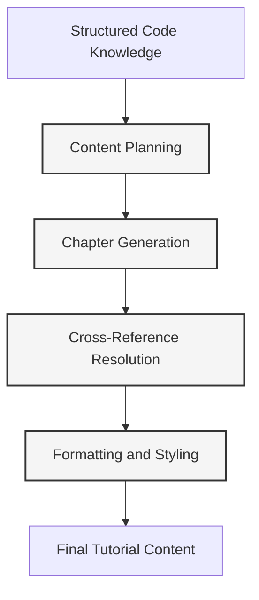
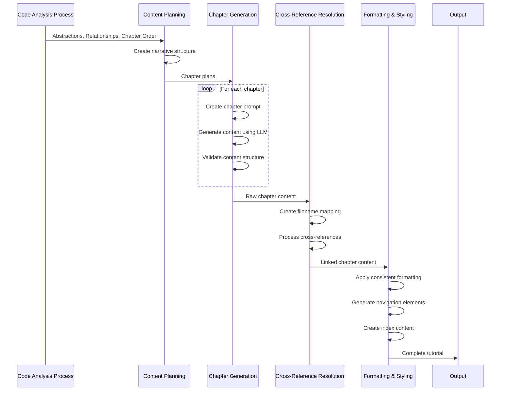

# Chapter 8: Content Generation System

In the [Code Analysis Process](07_code_analysis_process_.md) chapter, we explored how our system systematically extracts structural knowledge from codebases. Now, we'll examine the component that transforms that structured knowledge into compelling educational content: the Content Generation System.

## Introduction: The Knowledge-to-Tutorial Bridge

At its core, software documentation faces a fundamental challenge: how to transform the structural understanding of a codebase (abstractions, relationships, and patterns) into coherent, educational prose that effectively teaches the material to newcomers. The Content Generation System tackles this challenge by serving as a sophisticated bridge between analyzed code knowledge and human-readable tutorial content.

Think of it as the difference between having a detailed architectural blueprint of a building and crafting a guided tour that effectively teaches visitors about that building. The blueprint (our code analysis) provides the accurate structural information, but the guided tour (our content generation) creates a narrative, determines the optimal path through the material, highlights important features, and presents information at the right level of detail for the audience.

The Content Generation System is the component that:

1. Takes structured code knowledge (abstractions, relationships, and chapter organization)
2. Transforms it into educational narrative content with appropriate examples
3. Ensures content integration through proper cross-references
4. Adapts explanation depth based on target audience
5. Supports multiple human languages for broader accessibility

In this chapter, we'll explore the architecture, implementation details, and advanced features of this critical component in our tutorial generation pipeline.

## Core Architecture: Multi-Stage Generation

The Content Generation System follows a multi-stage architecture to progressively transform code knowledge into tutorial content:



Each stage serves a specific purpose:

1. **Content Planning**: Determines the narrative structure and learning progression
2. **Chapter Generation**: Creates detailed content for each tutorial chapter
3. **Cross-Reference Resolution**: Establishes proper links between related concepts
4. **Formatting and Styling**: Applies consistent styling and formatting

Let's examine each stage in detail.

### Stage 1: Content Planning

Content planning determines how to structure the tutorial narratively, building upon the chapter ordering established during the Code Analysis Process.

```python
def plan_content(abstractions, relationships, chapter_order, project_name):
    """
    Plan the narrative structure of the tutorial based on the chapter ordering.
    
    Args:
        abstractions: List of abstraction objects with metadata
        relationships: Map of relationships between abstractions
        chapter_order: Ordered list of abstraction indices
        project_name: Name of the project
    
    Returns:
        List of chapter plans with narrative structure
    """
    # Initialize chapter plans
    chapter_plans = []
    
    # Create a summary of the project
    project_summary = relationships.get("summary", f"Tutorial for {project_name}")
    
    # Create narrative structure for each chapter
    for i, abstraction_index in enumerate(chapter_order):
        # Get the abstraction details
        abstraction = abstractions[abstraction_index]
        
        # Determine chapter position (first, middle, last)
        is_first = i == 0
        is_last = i == len(chapter_order) - 1
        
        # Determine previous and next chapters for transitions
        prev_chapter = None if is_first else abstractions[chapter_order[i-1]]
        next_chapter = None if is_last else abstractions[chapter_order[i+1]]
        
        # Get related abstractions for this chapter
        related_abstractions = []
        for rel in relationships.get("details", []):
            if rel["from"] == abstraction_index:
                related_abstractions.append({
                    "abstraction": abstractions[rel["to"]],
                    "relationship": rel["label"],
                    "direction": "outgoing"
                })
            elif rel["to"] == abstraction_index:
                related_abstractions.append({
                    "abstraction": abstractions[rel["from"]],
                    "relationship": rel["label"],
                    "direction": "incoming"
                })
        
        # Create chapter plan with narrative structure
        chapter_plan = {
            "chapter_num": i + 1,
            "abstraction": abstraction,
            "is_first": is_first,
            "is_last": is_last,
            "prev_chapter": prev_chapter,
            "next_chapter": next_chapter,
            "related_abstractions": related_abstractions,
            "narrative_elements": {
                "introduction": _plan_introduction(abstraction, is_first, project_summary),
                "motivation": _plan_motivation(abstraction, related_abstractions),
                "explanation_sections": _plan_explanation_sections(abstraction, related_abstractions),
                "examples": _plan_examples(abstraction),
                "conclusion": _plan_conclusion(abstraction, is_last, next_chapter)
            }
        }
        
        chapter_plans.append(chapter_plan)
    
    return chapter_plans
```

This function creates a comprehensive plan for each chapter, determining not just what content to include but also how to structure the narrative flow. The helper functions like `_plan_introduction()` and `_plan_examples()` define specific narrative elements for each chapter.

### Stage 2: Chapter Generation

With the content plan in place, the Chapter Generation stage creates the actual content for each chapter:

```python
def generate_chapter_content(chapter_plan, files_data, language="english"):
    """
    Generate detailed content for a tutorial chapter based on the chapter plan.
    
    Args:
        chapter_plan: Structured plan for the chapter
        files_data: Map of file paths to file contents
        language: Target human language for the content
    
    Returns:
        Generated chapter content as Markdown
    """
    abstraction = chapter_plan["abstraction"]
    chapter_num = chapter_plan["chapter_num"]
    narrative = chapter_plan["narrative_elements"]
    
    # Prepare chapter context for the LLM
    context = {
        "abstraction_name": abstraction["name"],
        "abstraction_description": abstraction["description"],
        "file_snippets": _extract_relevant_snippets(abstraction["files"], files_data),
        "related_abstractions": chapter_plan["related_abstractions"],
        "prev_chapter": chapter_plan["prev_chapter"],
        "next_chapter": chapter_plan["next_chapter"],
        "is_first": chapter_plan["is_first"],
        "is_last": chapter_plan["is_last"],
        "narrative": narrative,
        "language": language
    }
    
    # Generate content using LLM
    prompt = _create_chapter_generation_prompt(context)
    chapter_content = call_llm(prompt)
    
    # Ensure chapter has proper heading
    if not chapter_content.strip().startswith(f"# Chapter {chapter_num}"):
        chapter_content = f"# Chapter {chapter_num}: {abstraction['name']}\n\n{chapter_content}"
    
    return chapter_content
```

This function leverages the [LLM Service](06_llm_service_.md) to generate the actual tutorial content, using a sophisticated prompt that incorporates all the context from the chapter plan.

#### Creating Effective Chapter Generation Prompts

The prompt creation is a critical aspect of content generation:

```python
def _create_chapter_generation_prompt(context):
    """Create a detailed prompt for chapter generation."""
    abstraction = context["abstraction_name"]
    description = context["abstraction_description"]
    file_snippets = context["file_snippets"]
    related_abstr = context["related_abstractions"]
    language = context["language"]
    
    # Language-specific instruction
    language_instruction = ""
    if language.lower() != "english":
        language_instruction = f"""
        IMPORTANT: Write this ENTIRE tutorial chapter in **{language.capitalize()}**.
        All explanations, examples, technical terms, and comments should be in {language.capitalize()}.
        Only code syntax and required proper nouns should remain in English.
        """
    
    # Build transitions based on previous and next chapters
    transitions = _build_transition_instructions(context)
    
    # Create related abstractions context
    related_context = "\n".join([
        f"- {rel['abstraction']['name']} ({rel['relationship']})" 
        for rel in related_abstr
    ])
    
    # Create the primary prompt
    prompt = f"""
    {language_instruction}
    Write a tutorial chapter for an abstraction in a software project.
    
    Abstraction details:
    - Name: {abstraction}
    - Description: {description}
    
    Related concepts:
    {related_context if related_context else "No directly related concepts."}
    
    Relevant code snippets:
    ```
    {file_snippets}
    ```
    
    {transitions}
    
    Structure guidelines:
    1. Start with a clear introduction explaining the purpose of this abstraction
    2. Provide motivation for why this abstraction exists
    3. Break down complex concepts into manageable sections
    4. Include simple code examples when appropriate
    5. Use diagrams (```mermaid``` format) for visualizing concepts
    6. Reference related concepts with proper markdown links
    7. End with a conclusion that summarizes key points
    
    Make the content beginner-friendly while maintaining technical accuracy.
    Use analogies and simple examples to explain complex concepts.
    Format the output as Markdown.
    """
    
    return prompt
```

This function creates detailed prompts that guide the LLM to generate high-quality tutorial content, with specific instructions for structure, style, and language.

### Stage 3: Cross-Reference Resolution

After generating the chapter content, the Cross-Reference Resolution stage ensures proper linking between related concepts:

```python
def resolve_cross_references(chapters, abstractions, chapter_order):
    """
    Ensure proper cross-references between chapters.
    
    Args:
        chapters: List of generated chapter contents
        abstractions: List of abstraction objects
        chapter_order: Ordered list of abstraction indices
    
    Returns:
        List of chapters with resolved cross-references
    """
    # Create a mapping of abstraction names to chapter filenames
    name_to_filename = {}
    for i, idx in enumerate(chapter_order):
        abstraction = abstractions[idx]
        safe_name = _create_safe_filename(abstraction["name"])
        filename = f"{i+1:02d}_{safe_name}.md"
        name_to_filename[abstraction["name"]] = filename
    
    # Process each chapter to resolve references
    resolved_chapters = []
    for i, content in enumerate(chapters):
        # Replace abstraction mentions with proper links
        for name, filename in name_to_filename.items():
            # Skip self-references
            if i == chapter_order.index(abstractions.index({"name": name})):
                continue
                
            # Replace mentions with links, being careful about context
            content = _replace_mentions_with_links(content, name, filename)
            
        resolved_chapters.append(content)
    
    return resolved_chapters
```

This function ensures that mentions of other abstractions in the tutorial are properly linked to their respective chapters, creating a well-connected tutorial.

The actual link replacement uses a more sophisticated algorithm than simple string replacement:

```python
def _replace_mentions_with_links(content, name, filename):
    """
    Replace mentions of abstraction name with markdown links.
    Uses regex with word boundaries to avoid partial matches.
    """
    import re
    
    # Pattern matches the name with word boundaries to avoid partial matches
    # Negative lookbehind/lookahead to avoid replacing existing links
    pattern = r'(?<!\[)(?<!\]\()(?<!\]\(.*?)(?<!\]\(.*)(?<!\[.*?)'
    pattern += r'\b' + re.escape(name) + r'\b'
    pattern += r'(?!.*?\))(?!\])(?!.*?\]\()'
    
    # Replace with link, preserving capitalization
    def replacement(match):
        matched = match.group(0)
        return f"[{matched}]({filename})"
    
    return re.sub(pattern, replacement, content)
```

This more sophisticated approach ensures accurate cross-reference replacement without introducing errors.

### Stage 4: Formatting and Styling

The final stage applies consistent formatting and styling to the tutorial content:

```python
def apply_formatting(chapters, project_name, chapter_order, abstractions):
    """
    Apply consistent formatting and styling to the tutorial chapters.
    
    Args:
        chapters: List of chapter contents with resolved cross-references
        project_name: Name of the project
        chapter_order: Ordered list of abstraction indices
        abstractions: List of abstraction objects
    
    Returns:
        List of formatted chapter contents and index content
    """
    formatted_chapters = []
    
    # Create filenames for each chapter
    filenames = []
    for i, idx in enumerate(chapter_order):
        abstraction = abstractions[idx]
        safe_name = _create_safe_filename(abstraction["name"])
        filename = f"{i+1:02d}_{safe_name}.md"
        filenames.append(filename)
    
    # Process each chapter
    for i, content in enumerate(chapters):
        # Add chapter navigation footer
        footer = "\n\n---\n\n"
        
        if i > 0:
            prev_idx = i - 1
            prev_name = abstractions[chapter_order[prev_idx]]["name"]
            footer += f"← Previous: [{prev_name}]({filenames[prev_idx]}) | "
        else:
            footer += "← Previous: None | "
            
        footer += f"[Table of Contents](index.md) | "
        
        if i < len(chapters) - 1:
            next_idx = i + 1
            next_name = abstractions[chapter_order[next_idx]]["name"]
            footer += f"Next: [{next_name}]({filenames[next_idx]}) →"
        else:
            footer += "Next: None →"
            
        # Add attribution footer
        footer += f"\n\nGenerated by PocketFlow Tutorial Generator for project: {project_name}"
        
        # Add to formatted content
        formatted_content = content + footer
        formatted_chapters.append({
            "filename": filenames[i],
            "content": formatted_content
        })
    
    # Generate index.md content
    index_content = _generate_index_content(project_name, abstractions, chapter_order, filenames)
    
    return formatted_chapters, index_content
```

This function enhances the tutorial with consistent navigation elements, attribution footers, and generates the table of contents for the tutorial.

## Implementation in the Node System

In our [Node System](04_node_system_.md), the Content Generation System is implemented primarily through two nodes: `WriteChapters` and `CombineTutorial`. Let's examine the implementation details of each.

### The WriteChapters Node

The `WriteChapters` node is implemented as a `BatchNode` to leverage parallel processing for chapter generation:

```python
class WriteChapters(BatchNode):
    def __init__(self, max_retries=5, wait=20):
        super().__init__()
        self.max_retries = max_retries
        self.wait = wait
    
    def prep(self, shared):
        chapter_order = shared["chapter_order"]
        abstractions = shared["abstractions"]
        files_data = shared["files"]
        language = shared.get("language", "english")
        
        # Store temporary data for cross-item communication
        self.chapters_written_so_far = []
        
        # Create batch items, one per chapter
        items_to_process = []
        for i, abstraction_index in enumerate(chapter_order):
            abstraction_details = abstractions[abstraction_index]
            related_file_indices = abstraction_details.get("files", [])
            related_files_content = self._get_content_for_indices(
                files_data, related_file_indices
            )
            
            items_to_process.append({
                "chapter_num": i + 1,
                "abstraction_index": abstraction_index,
                "abstraction_details": abstraction_details,
                "related_files_content": related_files_content,
                "project_name": shared["project_name"],
                "language": language
            })
        
        return items_to_process
```

The `prep` method extracts relevant data from the shared context and prepares a batch of items, one for each chapter to be generated. It also initializes a temporary list (`self.chapters_written_so_far`) to store generated chapters for context in subsequent chapter generation.

```python
def process_item(self, item, shared):
    abstraction_name = item["abstraction_details"]["name"]
    chapter_num = item["chapter_num"]
    
    # Get summary of previously written chapters
    previous_chapters_summary = "\n---\n".join(self.chapters_written_so_far)
    
    # Generate chapter content using LLM
    chapter_content = self._generate_chapter_with_retry(
        item, previous_chapters_summary
    )
    
    # Add to written chapters for context in next iterations
    self.chapters_written_so_far.append(chapter_content)
    
    return chapter_content
```

The `process_item` method generates content for a single chapter. It includes previously written chapters as context to ensure narrative coherence and proper transitions between chapters.

```python
def _generate_chapter_with_retry(self, item, previous_chapters_summary):
    # Implementation with retry logic for LLM calls
    retries = 0
    while retries < self.max_retries:
        try:
            return self._call_llm_for_chapter(item, previous_chapters_summary)
        except Exception as e:
            retries += 1
            if retries >= self.max_retries:
                raise
            print(f"LLM call failed, retrying ({retries}/{self.max_retries})...")
            time.sleep(self.wait)
```

The `_generate_chapter_with_retry` method implements robust retry logic for LLM calls, which is critical for production reliability given the occasional failures of LLM API calls.

```python
def _call_llm_for_chapter(self, item, previous_chapters_summary):
    # Extract data from item
    abstraction = item["abstraction_details"]
    chapter_num = item["chapter_num"]
    file_content = self._format_file_content(item["related_files_content"])
    project_name = item["project_name"]
    language = item.get("language", "english")
    
    # Create language-specific instruction if needed
    language_instruction = ""
    if language.lower() != "english":
        language_instruction = f"""
        IMPORTANT: Write this ENTIRE tutorial chapter in **{language.capitalize()}**.
        All explanations, examples, technical terms, and comments should be in {language.capitalize()}.
        Only code syntax and required proper nouns should remain in English.
        """
    
    # Construct the chapter generation prompt
    prompt = f"""
    {language_instruction}
    Write a tutorial chapter for the project `{project_name}` about the concept: "{abstraction['name']}".
    This is Chapter {chapter_num}.
    
    Concept Details:
    - Name: {abstraction['name']}
    - Description: {abstraction['description']}
    
    Relevant Code Snippets:
    {file_content}
    
    Context from previous chapters:
    {previous_chapters_summary if previous_chapters_summary else "This is the first chapter."}
    
    Guidelines:
    1. Start with a clear introduction to the concept
    2. Explain why this concept is important
    3. Include relevant code examples, simplified if necessary
    4. Use diagrams (```mermaid```) to visualize relationships
    5. End with a conclusion summarizing key points
    
    Format the output as Markdown, starting with a proper heading.
    """
    
    # Call LLM service
    response = call_llm(prompt)
    
    # Verify and fix heading if needed
    if not response.strip().startswith(f"# Chapter {chapter_num}"):
        response = f"# Chapter {chapter_num}: {abstraction['name']}\n\n{response}"
    
    return response
```

The `_call_llm_for_chapter` method creates a detailed prompt for chapter generation and calls the LLM Service to generate the content.

```python
def post(self, shared, prep_res, exec_res):
    # Store generated chapters in shared context
    shared["chapters"] = exec_res
    
    # Clean up temporary instance variable
    del self.chapters_written_so_far
    
    print(f"Finished writing {len(exec_res)} chapters.")
```

The `post` method updates the shared context with the generated chapters and cleans up the temporary state.

### The CombineTutorial Node

The `CombineTutorial` node assembles the individual chapter content into a complete tutorial:

```python
class CombineTutorial(Node):
    def process(self, shared):
        # Extract needed data
        project_name = shared["project_name"]
        output_dir = shared.get("output_dir", "output")
        final_dir = os.path.join(output_dir, project_name)
        chapters = shared["chapters"]
        abstractions = shared["abstractions"]
        chapter_order = shared["chapter_order"]
        relationships = shared["relationships"]
        
        # Create output directory
        os.makedirs(final_dir, exist_ok=True)
        
        # Generate mermaid diagram
        mermaid_diagram = self._generate_mermaid_diagram(abstractions, relationships)
        
        # Generate index.md
        index_content = self._generate_index_content(
            project_name, abstractions, chapter_order, mermaid_diagram
        )
        
        # Write index.md
        with open(os.path.join(final_dir, "index.md"), "w") as f:
            f.write(index_content)
        
        # Write chapter files
        for i, abstraction_index in enumerate(chapter_order):
            # Create safe filename
            abstraction_name = abstractions[abstraction_index]["name"]
            safe_name = self._create_safe_filename(abstraction_name)
            filename = f"{i+1:02d}_{safe_name}.md"
            
            # Write chapter file
            with open(os.path.join(final_dir, filename), "w") as f:
                f.write(chapters[i])
        
        # Update shared context with final output directory
        shared["final_output_dir"] = final_dir
        
        return shared
```

This method processes the generated chapters, creates a tutorial index page with a project summary and relationship diagram, and writes all the files to the output directory.

```python
def _generate_mermaid_diagram(self, abstractions, relationships):
    """Generate a mermaid diagram visualizing abstraction relationships."""
    mermaid_lines = ["flowchart TD"]
    
    # Add nodes for each abstraction
    for i, abstr in enumerate(abstractions):
        node_id = f"A{i}"
        node_label = abstr['name'].replace('"', '')
        mermaid_lines.append(f'    {node_id}["{node_label}"]')
    
    # Add edges for relationships
    for rel in relationships.get("details", []):
        from_node_id = f"A{rel['from']}"
        to_node_id = f"A{rel['to']}"
        edge_label = rel['label'].replace('"', '').replace('\n', ' ')
        
        # Truncate long labels
        max_label_len = 30
        if len(edge_label) > max_label_len:
            edge_label = edge_label[:max_label_len-3] + "..."
            
        mermaid_lines.append(f'    {from_node_id} -- "{edge_label}" --> {to_node_id}')
    
    return "\n".join(mermaid_lines)
```

The `_generate_mermaid_diagram` method creates a visual representation of the project's abstractions and their relationships, which helps readers understand the overall structure of the codebase.

```python
def _generate_index_content(self, project_name, abstractions, chapter_order, mermaid_diagram):
    """Generate content for the tutorial index page."""
    # Create title and introduction
    content = f"# Tutorial: {project_name}\n\n"
    
    # Add project summary if available
    if hasattr(self, 'relationships') and self.relationships.get("summary"):
        content += f"{self.relationships['summary']}\n\n"
    
    # Add mermaid diagram
    content += "## Project Structure\n\n"
    content += "```mermaid\n"
    content += mermaid_diagram + "\n"
    content += "```\n\n"
    
    # Add chapter list
    content += "## Chapters\n\n"
    for i, idx in enumerate(chapter_order):
        abstraction = abstractions[idx]
        safe_name = self._create_safe_filename(abstraction["name"])
        filename = f"{i+1:02d}_{safe_name}.md"
        content += f"{i+1}. [{abstraction['name']}]({filename})\n"
    
    # Add attribution footer
    content += "\n\n---\n\n"
    content += f"Generated by PocketFlow Tutorial Generator for project: {project_name}"
    
    return content
```

The `_generate_index_content` method creates the tutorial's index page, which serves as a table of contents and provides an overview of the project.

## Multi-Language Support

One of the distinctive features of our Content Generation System is its support for multiple output languages. This enables the same code analysis to produce tutorials in different human languages, making the knowledge accessible to a broader audience.

### Implementation of Language Support

The language support is implemented throughout the system:

1. **CLI Interface**: Captures the user's language preference

   ```python
   parser.add_argument("--language", default="english", 
                      help="Language for the generated tutorial (default: english)")
   ```

2. **Shared Context**: Propagates the language preference to all nodes

   ```python
   shared = {
       # ... other fields ...
       "language": args.language,
       # ... other fields ...
   }
   ```

3. **WriteChapters Node**: Adapts prompts for the target language

   ```python
   language = item.get("language", "english")
       
   # Create language-specific instruction if needed
   language_instruction = ""
   if language.lower() != "english":
       language_instruction = f"""
       IMPORTANT: Write this ENTIRE tutorial chapter in **{language.capitalize()}**.
       All explanations, examples, technical terms, and comments should be in {language.capitalize()}.
       Only code syntax and required proper nouns should remain in English.
       """
   ```

4. **LLM Service**: Processes the language-aware prompts to generate content in the target language

The language-specific instruction in the prompt is critical, as it guides the LLM to generate content in the target language while maintaining technical accuracy.

### Language-Specific Considerations

Different languages present unique challenges for technical content:

1. **Technical Terminology**: Some technical terms might not have established translations in all languages.
2. **Code Comments**: Handling code comments requires special attention to balance readability with authenticity.
3. **Diagrams**: Diagram labels and descriptions need to be in the target language.
4. **Formatting Differences**: Some languages have different punctuation and formatting conventions.

Our system addresses these challenges through careful prompt engineering:

```python
def create_language_aware_prompt(base_prompt, language):
    """
    Enhance a base prompt with language-specific instructions.
    
    Args:
        base_prompt: The core prompt for content generation
        language: Target human language code (e.g., "english", "spanish")
    
    Returns:
        Language-enhanced prompt
    """
    if language.lower() == "english":
        return base_prompt
    
    language_display = language.capitalize()
    
    language_instruction = f"""
    IMPORTANT: Write all content in {language_display}. 
    
    This includes:
    - All explanations and descriptions
    - Comments in code examples
    - Text in diagrams
    - Section headings and transitions
    
    Only preserve English in:
    - Programming language keywords
    - Function and variable names from the original code
    - Standard library names and technical terms that don't have established {language_display} translations
    
    Ensure the content sounds natural in {language_display}, not like a direct translation from English.
    """
    
    # Insert language instruction at the beginning of the prompt
    return language_instruction + "\n\n" + base_prompt
```

This approach ensures that the generated content is not only in the target language but also feels natural and authentic to native speakers.

## Adaptive Explanation Depth

Another key feature of the Content Generation System is its ability to adapt explanation depth based on the target audience, which is essential for creating tutorials that are accessible to beginners while remaining valuable for experts.

### Implementation of Adaptive Depth

The adaptation is implemented through prompt engineering:

```python
def adapt_explanation_style(abstraction, audience_level="beginner"):
    """
    Adapt explanation style and depth based on target audience.
    
    Args:
        abstraction: The abstraction to explain
        audience_level: Target audience expertise level
    
    Returns:
        Guidelines for explanation style
    """
    if audience_level == "beginner":
        return {
            "explanation_depth": "high",
            "use_analogies": True,
            "code_example_complexity": "low",
            "technical_term_handling": "define_all",
            "assume_knowledge": ["basic programming concepts"]
        }
    elif audience_level == "intermediate":
        return {
            "explanation_depth": "medium",
            "use_analogies": True,
            "code_example_complexity": "medium",
            "technical_term_handling": "define_some",
            "assume_knowledge": ["programming fundamentals", "basic design patterns"]
        }
    elif audience_level == "expert":
        return {
            "explanation_depth": "low",
            "use_analogies": False,
            "code_example_complexity": "high",
            "technical_term_handling": "use_freely",
            "assume_knowledge": ["advanced programming concepts", "design patterns", "software architecture"]
        }
    else:
        # Default to beginner
        return adapt_explanation_style(abstraction, "beginner")
```

These style guidelines are incorporated into the chapter generation prompt to guide the LLM in producing content at the appropriate level:

```python
def create_content_with_appropriate_detail(abstraction, audience_level):
    """Create content with an appropriate level of detail."""
    # Get style adaptation guidelines
    style = adapt_explanation_style(abstraction, audience_level)
    
    # Create prompt with style guidance
    prompt = f"""
    ... (other prompt parts) ...
    
    Explanation Style:
    - Explanation depth: {style['explanation_depth']}
    - Use analogies: {"Yes" if style['use_analogies'] else "Minimal"}
    - Code example complexity: {style['code_example_complexity']}
    - Technical term handling: {style['technical_term_handling']}
    - Assumed knowledge: {', '.join(style['assume_knowledge'])}
    
    ... (other prompt parts) ...
    """
    
    return prompt
```

This approach allows the system to generate content that is tailored to the specific audience, ensuring that beginners receive detailed explanations with analogies and simple examples, while experts get more concise content with advanced examples.

## Cross-Reference Management

Proper cross-references between related concepts are essential for creating a cohesive tutorial. The Content Generation System ensures that mentions of concepts covered in other chapters are properly linked, creating a network of connections that helps readers navigate the tutorial.

### Implementation of Cross-Reference Management

Cross-reference management is implemented in both the generation and post-processing stages:

1. **Generation Stage**: Prompt instructs the LLM to reference related concepts

   ```python
   def _create_chapter_generation_prompt(context):
       # ... (other parts of the prompt) ...
       
       prompt += """
       ... (other guidelines) ...
       
       1. Reference related concepts with proper markdown links
       ... (other guidelines) ...
       """
       
       return prompt
   ```

2. **Post-Processing Stage**: Ensures all references are properly linked

   ```python
   def resolve_cross_references(chapters, abstractions, chapter_order):
       # Create a mapping of abstraction names to chapter filenames
       name_to_filename = {}
       for i, idx in enumerate(chapter_order):
           abstraction = abstractions[idx]
           safe_name = _create_safe_filename(abstraction["name"])
           filename = f"{i+1:02d}_{safe_name}.md"
           name_to_filename[abstraction["name"]] = filename
       
       # Process each chapter to resolve references
       resolved_chapters = []
       for i, content in enumerate(chapters):
           # Replace abstraction mentions with proper links
           for name, filename in name_to_filename.items():
               # Skip self-references
               if i == chapter_order.index(abstractions.index({"name": name})):
                   continue
                   
               # Replace mentions with links, using regex with word boundaries
               content = _replace_mentions_with_links(content, name, filename)
               
           resolved_chapters.append(content)
       
       return resolved_chapters
   ```

This two-stage approach ensures comprehensive cross-referencing, making it easy for readers to explore related concepts throughout the tutorial.

## Case Study: End-to-End Content Generation

Let's walk through a complete example of content generation to illustrate the process:

1. **Input Data**: The system receives structured data from the Code Analysis Process:

   ```python
   # Structured code knowledge
   abstractions = [
       {
           "name": "QueryProcessor",
           "description": "Responsible for parsing, optimizing, and executing user queries against the database.",
           "files": [0, 3, 5]  # Indices referencing files in the "files" array
       },
       # ... more abstractions ...
   ]

   relationships = {
       "summary": "This project implements a data processing pipeline that transforms raw data into structured insights.",
       "details": [
           {
               "from": 0,  # Index in abstractions array (QueryProcessor)
               "to": 2,    # Index in abstractions array (DatabaseConnector)
               "label": "Uses for data retrieval"
           },
           # ... more relationships ...
       ]
   }

   chapter_order = [2, 0, 1, 3, 4]  # Indices into abstractions array, ordered for presentation
   ```

2. **Content Planning**: The system creates narrative plans for each chapter:

   ```python
   chapter_plans = plan_content(abstractions, relationships, chapter_order, "DataQueryEngine")
   ```

3. **Chapter Generation**: The system generates content for each chapter:

   ```python
   chapters = []
   for plan in chapter_plans:
       content = generate_chapter_content(plan, files_data, "english")
       chapters.append(content)
   ```

4. **Cross-Reference Resolution**: The system ensures proper linking between chapters:

   ```python
   resolved_chapters = resolve_cross_references(chapters, abstractions, chapter_order)
   ```

5. **Formatting and Assembly**: The system applies consistent formatting and assembles the tutorial:

   ```python
   formatted_chapters, index_content = apply_formatting(
       resolved_chapters, "DataQueryEngine", chapter_order, abstractions
   )

   # Write the tutorial to disk
   for chapter in formatted_chapters:
       with open(chapter["filename"], "w") as f:
           f.write(chapter["content"])

   with open("index.md", "w") as f:
       f.write(index_content)
   ```

The result is a comprehensive tutorial that effectively teaches the codebase to newcomers, with proper structure, cross-references, and appropriate explanation depth.

## Content Generation Sequence Diagram

The following sequence diagram illustrates the flow of data through the Content Generation System:



This diagram shows how the system progressively transforms the structured code knowledge into a complete tutorial through multiple specialized stages.

## Integration with Other System Components

The Content Generation System integrates with several other components in the tutorial generation pipeline:

1. **Code Analysis Process** ([Code Analysis Process](07_code_analysis_process_.md)): Consumes the structured knowledge produced by the code analysis.

2. **LLM Service** ([LLM Service](06_llm_service_.md)): Uses language models to transform structured knowledge into human-readable content.

3. **Shared Context Management** ([Shared Context Management](03_shared_context_management_.md)): Uses the shared context to access code knowledge and store generated content.

4. **Node System** ([Node System](04_node_system_.md)): Implements the generation process through specialized nodes (WriteChapters, CombineTutorial).

## Challenges and Solutions in Content Generation

Content generation presents several unique challenges that our system addresses:

### Challenge 1: Maintaining Consistency Across Chapters

When generating chapters independently (especially in parallel), ensuring consistency in terminology, style, and technical depth can be difficult.

**Solution**: We provide context from previously generated chapters:

```python
def process_item(self, item, shared):
    # Get summary of previously written chapters
    previous_chapters_summary = "\n---\n".join(self.chapters_written_so_far)
    
    # Generate chapter content using LLM
    chapter_content = self._generate_chapter_with_retry(
        item, previous_chapters_summary
    )
    
    # Add to written chapters for context in next iterations
    self.chapters_written_so_far.append(chapter_content)
    
    return chapter_content
```

By maintaining a running list of previously generated chapters and including this context in subsequent generation prompts, we ensure that each chapter builds coherently upon previous ones.

### Challenge 2: Balancing Technical Accuracy and Accessibility

Creating content that is both technically accurate and accessible to learners is a delicate balance.

**Solution**: We use structured prompts with explicit guidance on both accuracy and accessibility:

```python
def create_balanced_content_prompt(abstraction, audience_level):
    """Create a prompt that balances technical accuracy with accessibility."""
    # Get style adaptation guidelines
    style = adapt_explanation_style(abstraction, audience_level)
    
    # Technical accuracy instructions
    accuracy_instructions = """
    - Ensure all technical details are accurate
    - Don't oversimplify to the point of incorrectness
    - Clearly distinguish between fundamentals and implementation details
    - When simplifying, note what's being omitted for clarity
    """
    
    # Accessibility instructions
    accessibility_instructions = """
    - Start with concrete examples before abstract concepts
    - Use visual aids (diagrams) for complex relationships
    - Break down complex processes into smaller steps
    - Provide conceptual models for understanding the abstraction
    """
    
    # Combine into balanced prompt
    prompt = f"""
    ... (other prompt parts) ...
    
    Technical Accuracy:
    {accuracy_instructions}
    
    Accessibility:
    {accessibility_instructions}
    
    ... (other prompt parts) ...
    """
    
    return prompt
```

This approach explicitly instructs the LLM to maintain the balance between accuracy and accessibility, ensuring that the content is valuable for learners at all levels.

### Challenge 3: Generating Accurate Diagrams

Creating accurate, valuable diagrams to illustrate concepts is challenging for LLMs.

**Solution**: We provide specific guidance on diagram creation:

```python
def _add_diagram_guidance(prompt, abstraction_type):
    """Add specific guidance for diagram creation based on abstraction type."""
    if abstraction_type == "class":
        guidance = """
        Create a class diagram showing the class structure:
        ```mermaid
        classDiagram
            class ClassName {
                +attributes
                +methods()
            }
            ClassName --> RelatedClass
        ```
        """
    elif abstraction_type == "process":
        guidance = """
        Create a sequence diagram showing the process flow:
        ```mermaid
        sequenceDiagram
            participant A as ComponentA
            participant B as ComponentB
            A->>B: Action()
            B-->>A: Response
        ```
        """
    elif abstraction_type == "architecture":
        guidance = """
        Create a component diagram showing the architecture:
        ```mermaid
        flowchart TD
            A[ComponentA] --> B[ComponentB]
            B --> C[ComponentC]
        ```
        """
    else:
        guidance = """
        Include a diagram that best illustrates this concept:
        ```mermaid
        # Choose an appropriate diagram type
        # Keep it simple and focused on the key relationships
        ```
        """
    
    return prompt + "\n\nDiagram Guidance:\n" + guidance
```

By providing specific guidance and examples for different types of abstractions, we help the LLM create more accurate and valuable diagrams.

## Conclusion: Transforming Knowledge into Learning

The Content Generation System serves as the crucial final stage in our tutorial generation pipeline, transforming structured code knowledge into engaging, educational content that effectively teaches codebases to newcomers. By combining sophisticated prompt engineering, language model capabilities, and careful post-processing, it produces tutorials that balance technical accuracy with accessibility.

Key takeaways from this chapter:

1. The Content Generation System bridges the gap between code analysis and human-readable tutorials
2. It follows a multi-stage process for content planning, generation, cross-referencing, and formatting
3. It supports multiple languages through language-aware prompt engineering
4. It adapts explanation depth and style based on the target audience
5. It ensures proper cross-references between related concepts
6. It handles challenges like maintaining consistency and balancing accuracy with accessibility

The result is a comprehensive tutorial that effectively guides readers through the codebase, helping them understand not just the individual components but also how they fit together to form a coherent whole.

---

Generated by fork of [AI Codebase Knowledge Builder](https://github.com/vegeta03/PocketFlow-Tutorial-Codebase-Knowledge.git)
