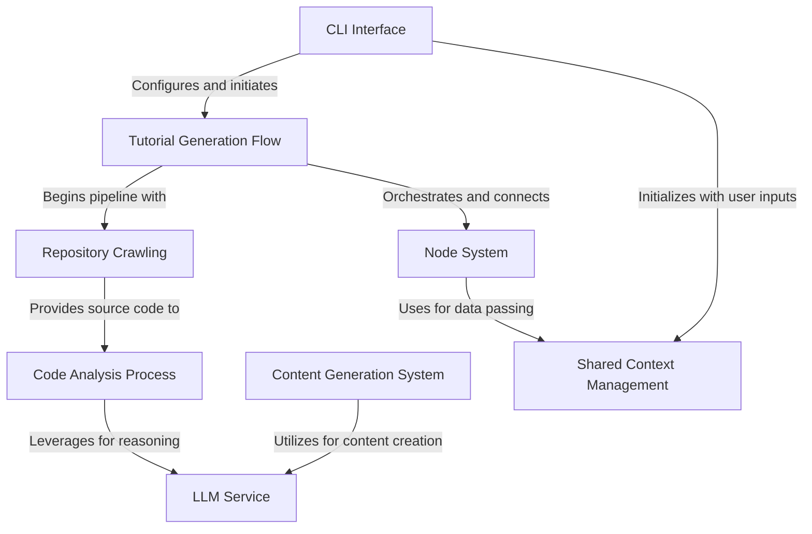

# Tutorial: PocketFlow-Tutorial-Codebase-Knowledge

This project is an **automated tutorial generation system** that transforms codebases into educational tutorials. It uses a *pipeline architecture* with specialized nodes to process code in stages: crawling repositories, identifying abstractions, analyzing relationships, ordering concepts logically, and generating beginner-friendly explanations with **AI language models**. The system is designed to make complex codebases accessible to newcomers through structured, contextual learning materials.

**Source Repository:** [https://github.com/The-Pocket/PocketFlow-Tutorial-Codebase-Knowledge](https://github.com/The-Pocket/PocketFlow-Tutorial-Codebase-Knowledge)

## Chapters

1. [CLI Interface](01_cli_interface_.md)
2. [Tutorial Generation Flow](02_tutorial_generation_flow_.md)
3. [Shared Context Management](03_shared_context_management_.md)
4. [Node System](04_node_system_.md)
5. [Repository Crawling](05_repository_crawling_.md)
6. [LLM Service](06_llm_service_.md)
7. [Code Analysis Process](07_code_analysis_process_.md)
8. [Content Generation System](08_content_generation_system_.md)

---

Generated by fork of [AI Codebase Knowledge Builder](https://github.com/vegeta03/PocketFlow-Tutorial-Codebase-Knowledge.git)
