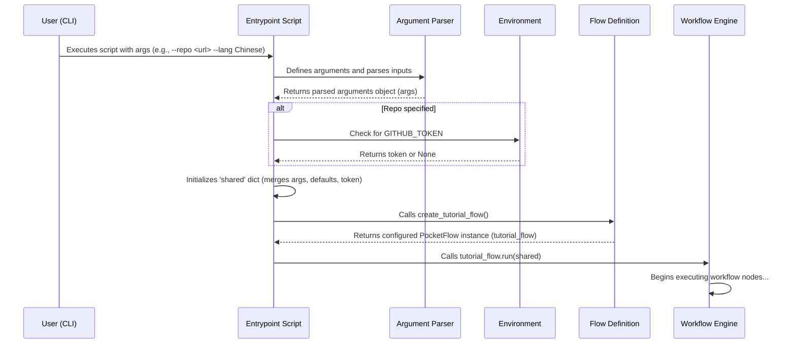

# Chapter 1: Configuration and Execution Entrypoint

Welcome to the PocketFlow Codebase Knowledge Tutorial! This series will dissect the AI-powered system that transforms code repositories into comprehensive, human-readable tutorials. In this first chapter, we delve into the system's command center: the configuration and execution entrypoint.

## Motivation: Controlling the Analysis Engine

Imagine you need to understand a complex system, perhaps a sprawling microservice architecture or a dense numerical library. The `PocketFlow-Tutorial-Codebase-Knowledge` tool provides automated analysis, but real-world codebases vary immensely. You might need to:

* Analyze a specific public GitHub repository or a private codebase on your local machine.
* Focus only on Python and Markdown files, ignoring test suites and temporary build artifacts.
* Exclude exceptionally large auto-generated files that offer little insight.
* Generate the tutorial documentation in a specific language, like Chinese instead of English.
* Provide authentication for accessing private repositories or avoiding rate limits.

Without a flexible control mechanism, tailoring the analysis process to these specific needs would require direct code modification, hindering usability. The primary use case addressed by this chapter is **providing users with a robust command-line interface (CLI) to precisely configure and initiate the codebase analysis and tutorial generation workflow.**

This control layer is primarily implemented in the `main.py` script. It acts like the cockpit of an aircraft: the user (pilot) inputs parameters (destination, flight path constraints) via controls (command-line arguments), the system prepares the mission parameters (flight plan, stored in the `shared` dictionary), and then initiates the automated flight sequence (runs the `PocketFlow` workflow).

## Key Concepts

1. **Command-Line Interface (CLI):** The mechanism (`argparse` library in Python) through which users interact with the script, providing specific instructions and parameters.
2. **Configuration State (`shared` dictionary):** An in-memory Python dictionary initialized by `main.py`. It aggregates user-provided arguments, environment variables (like `GITHUB_TOKEN`), and sensible defaults (like standard include/exclude patterns). This dictionary serves as the central state object, passed sequentially through the nodes of the processing workflow.
3. **Workflow Instantiation & Execution:** The final step within `main.py` involves creating an instance of the core processing pipeline, defined using the [PocketFlow](https://github.com/The-Pocket/PocketFlow) framework (details in [Chapter 5: Workflow Orchestration (PocketFlow)](05_workflow_orchestration__pocketflow__.md)), and triggering its execution with the prepared `shared` state.

## Using the Entrypoint

The primary way to interact with the system is by executing `main.py` from your terminal, providing arguments to customize its behavior.

**Core Arguments:**

* `--repo <URL>` or `--dir <PATH>`: Specifies the target codebase. These are mutually exclusive and one is required.
* `--include <PATTERN...>`: Glob patterns for files to *include* (e.g., `*.py`, `*.md`). Uses defaults if omitted.
* `--exclude <PATTERN...>`: Glob patterns for files/directories to *exclude* (e.g., `tests/*`, `*test*`, `.git/*`). Uses defaults if omitted.
* `--max-size <BYTES>`: Sets a maximum size limit for individual files to be processed (default: 100KB).
* `--language <LANG>`: Specifies the target language for the generated tutorial (default: "english").
* `--output <DIR>`: Defines the base directory where output files will be saved (default: `./output`).
* `--name <NAME>`: Optionally sets a specific project name; otherwise, it's derived from the repo/directory name.
* `--token <TOKEN>`: Provides a GitHub Personal Access Token (PAT) directly. Alternatively, the script checks the `GITHUB_TOKEN` environment variable.

**Example Usage:**

1. **Analyze a Public GitHub Repository (Default Settings):**

    ```bash
    python main.py --repo https://github.com/pallets/flask
    ```

    *Output (Console):*

    ```plaintext
    Starting tutorial generation for: https://github.com/pallets/flask in English language
    # ... subsequent logs from the workflow execution ...
    ```

    *Result:* The script will clone the Flask repository, apply default include/exclude patterns and size limits, analyze the code, and generate an English tutorial in the `./output/Flask` directory.

2. **Analyze a Local Directory with Custom Filtering and Language:**

    ```bash
    python main.py --dir /path/to/my-project --include "*.py" "*.md" --exclude "build/*" "docs/*" --language "Chinese" --output ./my-tutorials
    ```

    *Output (Console):*

    ```plaintext
    Starting tutorial generation for: /path/to/my-project in Chinese language
    # ... subsequent logs from the workflow execution ...
    ```

    *Result:* The script will scan the local directory `/path/to/my-project`, focusing only on `.py` and `.md` files while ignoring `build/` and `docs/`. It will generate a Chinese tutorial in the `./my-tutorials/my-project` directory.

3. **Analyze a Private Repository using a Token:**

    ```bash
    # Option 1: Using environment variable (Recommended)
    export GITHUB_TOKEN="ghp_YourTokenHere"
    python main.py --repo https://github.com/your-org/private-repo

    # Option 2: Using command-line argument (Less secure)
    python main.py --repo https://github.com/your-org/private-repo --token "ghp_YourTokenHere"
    ```

    *Output:* Similar to the public repo example, but uses the provided token for authentication.

Executing any of these commands initiates the multi-stage process defined in `flow.py`, starting with [Chapter 2: Codebase Data Acquisition](02_codebase_data_acquisition_.md).

## Internal Implementation: Under the Hood

When `python main.py ...` is executed, several steps orchestrate the setup before the main analysis begins:

1. **Argument Parsing:** The script uses Python's `argparse` module to define the expected command-line arguments, their types, default values, and help messages. It parses the arguments provided by the user.
2. **Configuration Aggregation:** The parsed arguments are combined with default values (for include/exclude patterns if not specified) and environment variables (like `GITHUB_TOKEN`).
3. **State Initialization:** All these configuration parameters are collected into the `shared` dictionary. This dictionary acts as the central context object passed between different processing steps ([Processing Nodes](06_processing_nodes_.md)) in the workflow.
4. **Workflow Setup:** The `create_tutorial_flow()` function (imported from `flow.py`) is called. This function constructs the `PocketFlow` object, which represents the directed acyclic graph (DAG) of processing nodes. (See [Chapter 5: Workflow Orchestration (PocketFlow)](05_workflow_orchestration__pocketflow__.md)).
5. **Execution Trigger:** The `run()` method of the `PocketFlow` instance is invoked, passing the initialized `shared` dictionary as the starting input. This kicks off the execution of the first node in the workflow graph.

Here's a simplified sequence diagram illustrating this initialization process:



### Code Deep Dive (`main.py`)

Let's examine key snippets from `main.py`:

**1. Argument Parsing Setup:**

```python
# File: main.py
import argparse
import os
import dotenv
from flow import create_tutorial_flow # Import the workflow factory

dotenv.load_dotenv() # Load environment variables from .env file if present

# Define default patterns outside the function for clarity
DEFAULT_INCLUDE_PATTERNS = { "*.py", "*.js", "*.jsx", "*.ts", "*.tsx", "*.go", "*.java", "*.pyi", "*.pyx", "*.c", "*.cc", "*.cpp", "*.h", "*.md", "*.rst", "Dockerfile", "Makefile", "*.yaml", "*.yml" }
DEFAULT_EXCLUDE_PATTERNS = { "venv/*", ".venv/*", "*test*", "tests/*", "docs/*", "examples/*", "v1/*", "dist/*", "build/*", "experimental/*", "deprecated/*", "legacy/*", ".git/*", ".github/*", ".next/*", ".vscode/*", "obj/*", "bin/*", "node_modules/*", "*.log" }

def main():
    parser = argparse.ArgumentParser(description="Generate a tutorial for a GitHub codebase or local directory.")

    # --- Source Specification (Mutually Exclusive) ---
    # Ensures the user provides either --repo or --dir, but not both.
    source_group = parser.add_mutually_exclusive_group(required=True)
    source_group.add_argument("--repo", help="URL of the public GitHub repository.")
    source_group.add_argument("--dir", help="Path to local directory.")

    # --- Optional Configuration Arguments ---
    parser.add_argument("-n", "--name", help="Project name (optional, derived from repo/directory if omitted).")
    parser.add_argument("-t", "--token", help="GitHub personal access token (optional, reads from GITHUB_TOKEN env var if not provided).")
    parser.add_argument("-o", "--output", default="output", help="Base directory for output (default: ./output).")
    parser.add_argument("-i", "--include", nargs="+", help="Include file patterns (e.g. '*.py' '*.js'). Defaults to common code files if not specified.")
    parser.add_argument("-e", "--exclude", nargs="+", help="Exclude file patterns (e.g. 'tests/*' 'docs/*'). Defaults to test/build directories if not specified.")
    parser.add_argument("-s", "--max-size", type=int, default=100000, help="Maximum file size in bytes (default: 100000, about 100KB).")
    parser.add_argument("--language", default="english", help="Language for the generated tutorial (default: english)")

    # Parse the arguments provided by the user via the command line
    args = parser.parse_args()
    # ... remainder of main function ...
```

This section leverages `argparse` to create a user-friendly CLI. The `add_mutually_exclusive_group` ensures logical consistency for the input source, while `nargs='+'` allows multiple include/exclude patterns. Defaults are specified for optional arguments like `output` and `language`.

**2. GitHub Token Handling:**

```python
# File: main.py (inside main function)
    # ... after args = parser.parse_args() ...
    github_token = None
    if args.repo: # Only relevant if analyzing a GitHub repository
        github_token = args.token or os.environ.get('GITHUB_TOKEN')
        if not github_token:
            print("Warning: No GitHub token provided. You might hit rate limits for public repositories or be unable to access private ones.")
    # ... continue to initialize shared dictionary ...
```

This logic prioritizes the `--token` argument if provided; otherwise, it attempts to fetch the token from the `GITHUB_TOKEN` environment variable. A warning is issued if analyzing a repository without a token.

**3. Initializing the `shared` State Dictionary:**

```python
# File: main.py (inside main function)
    # ... after token handling ...
    # Initialize the shared dictionary with inputs
    shared = {
        # Core inputs from arguments
        "repo_url": args.repo,
        "local_dir": args.dir,
        "project_name": args.name, # Can be None, will be derived later if needed
        "github_token": github_token,
        "output_dir": args.output,
        "language": args.language,

        # Configuration for file fetching/filtering
        # Use provided patterns if given, otherwise use defaults. Convert to set for efficient lookup.
        "include_patterns": set(args.include) if args.include else DEFAULT_INCLUDE_PATTERNS,
        "exclude_patterns": set(args.exclude) if args.exclude else DEFAULT_EXCLUDE_PATTERNS,
        "max_file_size": args.max_size,

        # Placeholders for data populated by workflow nodes
        "files": [],           # Output of Codebase Data Acquisition node
        "abstractions": [],    # Output of analysis nodes
        "relationships": {},   # Output of analysis nodes
        "chapter_order": [],   # Output of structuring nodes
        "chapters": [],        # Output of generation nodes
        "final_output_dir": None # Output of final combination node
    }

    # Display starting message for user feedback
    source_display = args.repo or args.dir
    print(f"Starting tutorial generation for: {source_display} in {args.language.capitalize()} language")
    # ... continue to workflow instantiation ...
```

This dictionary serves as the central data bus for the entire process. It's initialized with all the configuration parameters derived from user input and defaults. Crucially, it also includes placeholder keys (like `"files"`, `"abstractions"`) that will be populated by subsequent nodes in the workflow as they process the data. This state propagation is fundamental to how [PocketFlow](https://github.com/The-Pocket/PocketFlow) operates.

**4. Workflow Instantiation and Execution:**

```python
# File: main.py (inside main function)
    # ... after initializing 'shared' ...

    # Create the flow instance by calling the factory function from flow.py
    # This function encapsulates the definition of the workflow graph (nodes and connections).
    tutorial_flow = create_tutorial_flow()

    # Run the flow, passing the initial configuration and state
    # The PocketFlow engine takes over from here, executing nodes sequentially.
    tutorial_flow.run(shared)

if __name__ == "__main__":
    main()
```

Here, `create_tutorial_flow()` returns the fully defined `PocketFlow` object. The call to `tutorial_flow.run(shared)` is the ignition key – it injects the initial `shared` state into the workflow and starts executing the first node defined in `flow.py` (typically the node responsible for [Chapter 2: Codebase Data Acquisition](02_codebase_data_acquisition_.md)).

## Conclusion

Chapter 1 established the critical role of `main.py` as the user-facing control layer and execution entrypoint for the codebase analysis system. We explored how command-line arguments allow fine-grained configuration of the analysis target, file filtering, language, and output. We saw how these configurations initialize a central `shared` state dictionary, which acts as the input payload for the `PocketFlow` workflow. Finally, we observed how `main.py` instantiates and triggers this workflow, effectively launching the automated tutorial generation process.

You now understand how to command the system and tailor its operation to specific needs. With the configuration set and the workflow initiated, the next logical step is to acquire the source code itself.

**Next:** [Chapter 2: Codebase Data Acquisition](02_codebase_data_acquisition_.md) will detail how the system fetches repository contents or reads local directories based on the parameters set in this initial configuration phase.

---

Generated by fork of [AI Codebase Knowledge Builder](https://github.com/vegeta03/PocketFlow-Tutorial-Codebase-Knowledge.git)
