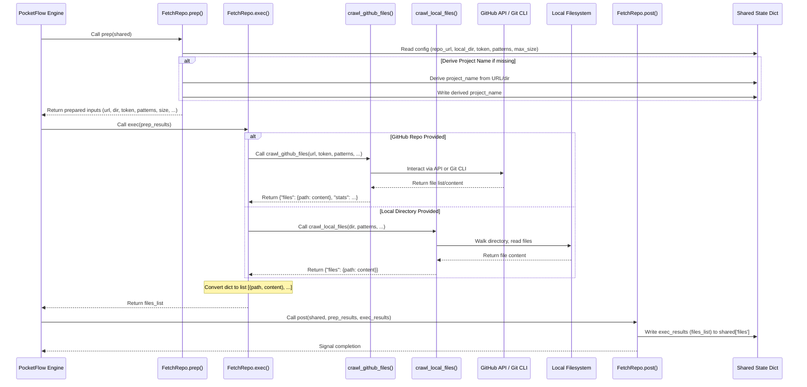

# Chapter 2: Codebase Data Acquisition

## Introduction: The Foundation of Analysis

Welcome to Chapter 2. In [Chapter 1: Configuration and Execution Entrypoint](01_configuration_and_execution_entrypoint_.md), we established how the `PocketFlow-Tutorial-Codebase-Knowledge` system is configured and initiated via the `main.py` script. We saw how command-line arguments specify the target codebase (GitHub URL or local directory), filtering criteria, authentication tokens, and other parameters, which are then consolidated into the `shared` state dictionary that drives the workflow.

Now that the system has its instructions, the first operational task is to obtain the actual source code. This chapter delves into the **Codebase Data Acquisition** stage, implemented primarily by the `FetchRepo` node within our [PocketFlow](https://github.com/The-Pocket/PocketFlow) workflow (more on PocketFlow in [Chapter 5: Workflow Orchestration (PocketFlow)](05_workflow_orchestration__pocketflow__.md)). This component acts as the system's data ingestion pipeline, responsible for retrieving the specified codebase, applying filters, and preparing a clean, structured list of relevant files for downstream analysis.

## Motivation: Sourcing and Filtering the Codebase

Modern software development involves diverse code hosting scenarios and organizational structures. A tool designed to analyze codebases must accommodate this heterogeneity. The primary use case for the Codebase Data Acquisition subsystem is **to reliably fetch source code from either remote Git repositories (specifically GitHub, via HTTP API or SSH) or local file system directories, while intelligently filtering the content based on user-defined criteria.**

Consider these requirements, common in a senior engineering context:

1. **Source Flexibility:** Analyze a public library on GitHub, a private microservice repository requiring authentication, or a locally checked-out development branch.
2. **Targeted Analysis:** Focus analysis on specific file types (`*.py`, `*.java`) or directories (`src/`, `pkg/`), excluding others like test suites (`tests/*`), build artifacts (`dist/`, `node_modules/`), documentation (`docs/`), or configuration (`.*rc`).
3. **Large File Handling:** Avoid processing excessively large files (e.g., generated code, data dumps, model weights accidentally committed) that can overwhelm analysis tools or LLMs and often provide low informational value density.
4. **Specific Subtree/Branch:** Analyze only a particular subdirectory or branch within a large monorepo.
5. **Standardized Output:** Regardless of the source, present the acquired code to subsequent stages in a consistent format: a list of `(path, content)` tuples.

This subsystem abstracts away the complexities of interacting with different sources and ensures that the analysis pipeline receives curated, relevant input. It's analogous to setting up a data pipeline's initial ETL stage, where raw data is extracted, transformed (filtered), and loaded into a standardized format for processing.

## Key Concepts

1. **Source Abstraction:** The system provides a unified interface regardless of whether the source is a `repo_url` (GitHub HTTPS/SSH) or a `local_dir`. The `FetchRepo` node dynamically selects the appropriate fetching mechanism.
2. **GitHub Interaction:**
    * **API Access (HTTPS):** Uses the GitHub REST API (`v3`) to fetch repository contents. Requires a Personal Access Token (PAT) for private repositories or to avoid strict rate limits on public ones. Can parse URLs to identify specific branches/tags/commits (`tree/ref`) and subdirectories.
    * **SSH Cloning:** Handles `git@github.com:...` URLs or URLs ending in `.git` by performing a shallow clone using the system's `git` command-line tool. Requires appropriate SSH key configuration on the user's machine. Less granular control over subdirectories/branches directly via URL parsing compared to the API method but necessary when SSH access is the only option.
3. **Local Directory Scanning:** Uses standard file system operations (`os.walk`) to traverse a specified local directory.
4. **Filtering Engine:** Applies filtering logic based on:
    * `include_patterns`: Glob patterns (e.g., `*.py`, `src/**/*.go`) defining files to include.
    * `exclude_patterns`: Glob patterns defining files/directories to exclude (applied *after* include patterns).
    * `max_file_size`: A threshold in bytes to skip oversized files.
5. **Path Normalization:** Ensures file paths are consistent (typically relative to the repository root or specified subdirectory) for easier processing downstream.
6. **Output Format:** The standard output of this stage is a Python list where each element is a tuple: `(relative_file_path: str, file_content: str)`. This list is stored in the `shared['files']` key.

## How it Works: The `FetchRepo` Node

The `FetchRepo` node, defined in `nodes.py`, orchestrates the data acquisition process. Its execution follows the standard PocketFlow node lifecycle: `prep`, `exec`, `post`.



1. **`prep(self, shared)`:**
    * Retrieves necessary configuration from the `shared` dictionary: `repo_url`, `local_dir`, `github_token`, `include_patterns`, `exclude_patterns`, `max_file_size`.
    * Derives a `project_name` from the URL or directory path if not explicitly provided by the user. This is crucial for naming output directories later. Stores the determined `project_name` back into `shared`.
    * Packages these parameters into a dictionary to be passed to the `exec` method.

2. **`exec(self, prep_res)`:**
    * Receives the prepared parameters from `prep`.
    * Checks if `repo_url` is present.
        * If yes, calls the utility function `crawl_github_files(**prep_res)` from `utils.crawl_github_files.py`. This function handles the logic for interacting with GitHub (API or SSH clone) and applies filtering.
        * If no (meaning `local_dir` must be present), calls `crawl_local_files(**prep_res)` from `utils.crawl_local_files.py`. This function walks the local directory and applies filtering.
    * Both utility functions return a dictionary, typically `{"files": {path: content}, "stats": {...}}`.
    * Crucially, the `exec` method converts the `files` dictionary `{path: content}` into the standard list-of-tuples format `[(path, content), ...]`. This list is the direct result of the `exec` phase. It raises a `ValueError` if no files are fetched, halting the workflow early.

3. **`post(self, shared, prep_res, exec_res)`:**
    * Takes the list of `(path, content)` tuples returned by `exec` (`exec_res`).
    * Updates the `shared` dictionary by assigning this list to the `shared['files']` key. This makes the acquired codebase data available to all subsequent nodes in the workflow.

## Code Deep Dive

Let's examine the key implementation details within the relevant files.

### `nodes.py`: The `FetchRepo` Node

```python
# File: nodes.py
import os
from pocketflow import Node
from utils.crawl_github_files import crawl_github_files # GitHub fetcher
from utils.crawl_local_files import crawl_local_files   # Local fetcher

class FetchRepo(Node):
    """
    PocketFlow Node to fetch source code from GitHub repo or local directory.
    It uses configuration from the 'shared' state, applies filters,
    and stores the result as a list of (path, content) tuples in shared['files'].
    """
    def prep(self, shared):
        """Prepare inputs for fetching, including deriving project name if needed."""
        repo_url = shared.get("repo_url")
        local_dir = shared.get("local_dir")
        project_name = shared.get("project_name")

        # --- Project Name Derivation ---
        # Essential for naming outputs consistently later.
        if not project_name:
            if repo_url:
                # Basic parsing: assumes 'owner/repo' or 'owner/repo.git' at the end
                project_name = repo_url.split('/')[-1].replace('.git', '')
            elif local_dir:
                project_name = os.path.basename(os.path.abspath(local_dir))
            else:
                # Should not happen due to argparse mutual exclusion, but defensive check
                 project_name = "unknown_project"
            shared["project_name"] = project_name # Store back into shared state

        # --- Retrieve Filtering Configuration ---
        include_patterns = shared["include_patterns"] # Expected to be set by main.py
        exclude_patterns = shared["exclude_patterns"] # Expected to be set by main.py
        max_file_size = shared["max_file_size"]       # Expected to be set by main.py

        # Return necessary parameters for the exec step
        return {
            "repo_url": repo_url,
            "local_dir": local_dir,
            "token": shared.get("github_token"), # Pass token if available
            "include_patterns": include_patterns,
            "exclude_patterns": exclude_patterns,
            "max_file_size": max_file_size,
            "use_relative_paths": True # Standardize on relative paths for consistency
        }

    def exec(self, prep_res):
        """Execute the fetching based on prepared parameters."""
        files_result = {}
        if prep_res["repo_url"]:
            print(f"Crawling repository: {prep_res['repo_url']}...")
            # Delegate to GitHub crawler utility
            result_dict = crawl_github_files(
                repo_url=prep_res["repo_url"],
                token=prep_res["token"],
                include_patterns=prep_res["include_patterns"],
                exclude_patterns=prep_res["exclude_patterns"],
                max_file_size=prep_res["max_file_size"],
                use_relative_paths=prep_res["use_relative_paths"]
            )
            files_result = result_dict.get("files", {}) # Extract the files dictionary
        elif prep_res["local_dir"]:
            print(f"Crawling directory: {prep_res['local_dir']}...")
            # Delegate to local crawler utility
            result_dict = crawl_local_files(
                directory=prep_res["local_dir"],
                include_patterns=prep_res["include_patterns"],
                exclude_patterns=prep_res["exclude_patterns"],
                max_file_size=prep_res["max_file_size"],
                use_relative_paths=prep_res["use_relative_paths"]
            )
            files_result = result_dict.get("files", {}) # Extract the files dictionary
        else:
             # This case should be prevented by main.py's argparse setup
             raise ValueError("No repository URL or local directory specified.")

        # --- Standardize Output Format ---
        # Convert the {path: content} dict returned by helpers
        # into the canonical [(path, content), ...] list format.
        files_list = list(files_result.items())

        if not files_list:
             # Fail fast if no relevant files were found after filtering
             # This prevents running expensive LLM analysis on empty input.
             raise ValueError(f"No files matching the criteria were found in {prep_res['repo_url'] or prep_res['local_dir']}.")

        print(f"Fetched {len(files_list)} files matching criteria.")
        return files_list # Return the list of tuples

    def post(self, shared, prep_res, exec_res):
        """Update the shared state with the fetched files."""
        # exec_res is the list [(path, content), ...] from the exec step
        shared["files"] = exec_res
        # 'project_name' was potentially added/updated in prep()
        print(f"Stored {len(exec_res)} file entries in shared state for project '{shared['project_name']}'.")
```

### `utils/crawl_github_files.py`: GitHub Interaction Logic

This utility encapsulates the complexity of dealing with GitHub.

**Key Aspects:**

* **URL Parsing:** It intelligently parses the input `repo_url` to identify the owner, repository name, an optional branch/commit reference (`tree/<ref>`), and any subdirectory path. This allows users to target specific parts of a repository (e.g., `https://github.com/owner/repo/tree/main/src/app`).
* **Authentication:** Uses the provided `token` (or one from the `GITHUB_TOKEN` environment variable) in the `Authorization` header for API requests. Crucial for private repos and avoiding rate limits.
* **API vs. SSH:** Detects SSH-style URLs (`git@...` or ending in `.git`). If detected, it uses `git.Repo.clone_from` (from the `GitPython` library) to perform a shallow clone into a temporary directory and then reads files from there. Otherwise, it defaults to using the GitHub REST API (`/repos/{owner}/{repo}/contents/{path}`).
* **Recursive Fetching (API):** When using the API, if it encounters a directory, it recursively calls itself to fetch the contents of that subdirectory.
* **Filtering Integration:** It incorporates the `should_include_file` helper function, applying `include_patterns`, `exclude_patterns`, and `max_file_size` checks *during* the crawl process to avoid downloading and processing unnecessary files.
* **Rate Limit Handling:** Includes basic retry logic with exponential backoff if a 403 rate limit error is encountered during API calls.
* **Error Handling:** Provides informative error messages for common issues like 404 (not found/private repo without token), 403 (rate limit), and cloning errors.

```python
# File: utils/crawl_github_files.py (Simplified Key Sections)
import requests
import base64
import os
import tempfile
import git # For SSH cloning
import time
import fnmatch
from urllib.parse import urlparse

# Helper function for pattern matching (shared between github/local crawlers)
def _should_include(filepath, filename, include_patterns, exclude_patterns):
    """Checks if a file should be included based on glob patterns."""
    # Default include if no include patterns specified
    included = not include_patterns or any(fnmatch.fnmatch(filepath, p) or fnmatch.fnmatch(filename, p) for p in include_patterns)
    if not included: return False
    # Default exclude if no exclude patterns specified (or already excluded by include)
    excluded = exclude_patterns and any(fnmatch.fnmatch(filepath, p) for p in exclude_patterns)
    return not excluded

def crawl_github_files(repo_url, token=None, max_file_size=1024*1024, use_relative_paths=True, include_patterns=None, exclude_patterns=None):
    files_dict = {}
    skipped_files = []
    stats = { # Initialize basic stats
        "downloaded_count": 0, "skipped_count": 0, "skipped_files": [],
        "base_path": None, "include_patterns": include_patterns, "exclude_patterns": exclude_patterns,
        "source": "unknown"
    }

    # --- Detect SSH URL ---
    is_ssh_url = repo_url.startswith("git@") or repo_url.endswith(".git")

    if is_ssh_url:
        stats["source"] = "ssh_clone"
        with tempfile.TemporaryDirectory() as tmpdir:
            try:
                print(f"Cloning SSH repo {repo_url} to {tmpdir}...")
                # Consider adding --depth 1 for shallow clone if full history isn't needed
                git.Repo.clone_from(repo_url, tmpdir, depth=1)
                print("Clone successful.")
            except git.GitCommandError as e:
                raise RuntimeError(f"Failed to clone SSH repository: {e}") from e

            # Walk the cloned directory
            for root, dirs, filenames in os.walk(tmpdir):
                 # Apply exclude patterns to directories early to prune walk
                 dirs[:] = [d for d in dirs if not any(fnmatch.fnmatch(os.path.join(os.path.relpath(root, tmpdir), d) + '/', p) for p in (exclude_patterns or set()))]

                 for filename in filenames:
                    abs_path = os.path.join(root, filename)
                    rel_path = os.path.relpath(abs_path, tmpdir)

                    if not _should_include(rel_path, filename, include_patterns, exclude_patterns):
                        # print(f"Skipping {rel_path} (pattern mismatch)") # Verbose logging
                        continue

                    try:
                        file_size = os.path.getsize(abs_path)
                        if file_size > max_file_size:
                            skipped_files.append((rel_path, file_size))
                            stats["skipped_count"] += 1
                            # print(f"Skipping {rel_path} (size limit)") # Verbose logging
                            continue

                        with open(abs_path, "r", encoding="utf-8", errors='ignore') as f:
                            content = f.read()
                        files_dict[rel_path] = content
                        stats["downloaded_count"] += 1
                    except OSError as e:
                        print(f"Warning: Could not read file {rel_path}: {e}")
                        skipped_files.append((rel_path, -1)) # Indicate error processing
                        stats["skipped_count"] += 1
                    except Exception as e: # Catch potential decoding errors etc.
                         print(f"Warning: Error processing file {rel_path}: {e}")
                         skipped_files.append((rel_path, -1))
                         stats["skipped_count"] += 1
            stats["skipped_files"] = skipped_files
        return {"files": files_dict, "stats": stats}
    else:
        # --- Handle HTTPS URL via API ---
        stats["source"] = "github_api"
        # (URL Parsing logic as shown in the provided context code to find owner, repo, ref, specific_path)
        # ... assumes owner, repo, ref, specific_path are derived ...
        parsed_url = urlparse(repo_url)
        path_parts = parsed_url.path.strip('/').split('/')
        owner, repo_name = path_parts[0], path_parts[1]
        ref, specific_path = _parse_github_url_details(path_parts, owner, repo_name, token) # Placeholder for parsing logic
        stats["base_path"] = specific_path if use_relative_paths else None

        headers = {"Accept": "application/vnd.github.v3+json"}
        if token: headers["Authorization"] = f"token {token}"

        # Recursive function to fetch contents via API
        def fetch_api_contents(current_api_path):
            api_url = f"https://api.github.com/repos/{owner}/{repo_name}/contents/{current_api_path}"
            params = {"ref": ref} if ref else {}
            try:
                response = requests.get(api_url, headers=headers, params=params, timeout=30)
                # (Rate limit handling logic as shown in the context code)
                # ... handle 403 rate limit ...
                response.raise_for_status() # Raise HTTPError for bad responses (4xx or 5xx)
            except requests.exceptions.RequestException as e:
                print(f"Error fetching API path '{current_api_path}': {e}")
                # Decide if this should be fatal or just skip this part
                return # Stop recursion for this path on error

            contents = response.json()
            if not isinstance(contents, list): contents = [contents] # Handle single file response

            for item in contents:
                item_full_path = item["path"]
                # Determine relative path based on original specific_path target
                if use_relative_paths and specific_path and item_full_path.startswith(specific_path):
                     rel_path = item_full_path[len(specific_path):].lstrip('/')
                else:
                     rel_path = item_full_path # Use full path if not starting from specific_path

                if item["type"] == "dir":
                    # Check exclude patterns for directories before recursing
                    should_recurse = True
                    if exclude_patterns:
                       dir_path_for_match = rel_path + '/' # Add trailing slash for directory match
                       if any(fnmatch.fnmatch(dir_path_for_match, p) for p in exclude_patterns):
                           should_recurse = False
                           # print(f"Skipping directory recursion into {rel_path} (excluded)") # Verbose

                    if should_recurse:
                         fetch_api_contents(item_full_path) # Recurse into subdirectory

                elif item["type"] == "file":
                    if not _should_include(rel_path, item["name"], include_patterns, exclude_patterns):
                        # print(f"Skipping {rel_path} (pattern mismatch)") # Verbose
                        continue

                    file_size = item.get("size", 0)
                    if file_size > max_file_size:
                        skipped_files.append((rel_path, file_size))
                        stats["skipped_count"] += 1
                        # print(f"Skipping {rel_path} (size limit)") # Verbose
                        continue

                    # Fetch file content (handle potential base64 encoding)
                    try:
                        content_url = item["url"] # Use the blob API URL
                        content_response = requests.get(content_url, headers=headers, timeout=20)
                        content_response.raise_for_status()
                        content_data = content_response.json()

                        if content_data.get("encoding") == "base64" and "content" in content_data:
                             # Final size check on encoded content (approximate check)
                             if len(content_data["content"]) * 0.75 > max_file_size:
                                 estimated_size = int(len(content_data["content"]) * 0.75)
                                 skipped_files.append((rel_path, estimated_size))
                                 stats["skipped_count"] += 1
                                 # print(f"Skipping {rel_path} (encoded size limit)") # Verbose
                                 continue
                             file_content = base64.b64decode(content_data["content"]).decode('utf-8', errors='ignore')
                             files_dict[rel_path] = file_content
                             stats["downloaded_count"] += 1
                             # print(f"Fetched {rel_path}") # Verbose
                        else:
                             print(f"Warning: Unexpected content format for {rel_path}, skipping.")
                             skipped_files.append((rel_path, file_size))
                             stats["skipped_count"] += 1

                    except requests.exceptions.RequestException as e:
                        print(f"Warning: Failed to download content for {rel_path}: {e}")
                        skipped_files.append((rel_path, file_size))
                        stats["skipped_count"] += 1
                    except Exception as e: # Catch decoding errors etc.
                         print(f"Warning: Error processing content for {rel_path}: {e}")
                         skipped_files.append((rel_path, file_size))
                         stats["skipped_count"] += 1


        # Start the recursive fetch from the target path
        fetch_api_contents(specific_path)
        stats["skipped_files"] = skipped_files
        return {"files": files_dict, "stats": stats}

# Placeholder for the complex URL parsing logic shown in the original context
def _parse_github_url_details(path_parts, owner, repo, token):
    # ... Logic to check for 'tree', fetch branches, check trees, determine ref and specific_path ...
    # This is non-trivial and involves API calls as shown in the original context code
    print("Note: GitHub URL parsing logic is complex and omitted for brevity here.")
    # For simplicity in this snippet, assume default branch and root path if not explicit
    ref = None
    specific_path = ""
    if len(path_parts) > 3 and path_parts[2] == 'tree':
         ref = path_parts[3] # Simplistic assumption, real logic is complex
         specific_path = '/'.join(path_parts[4:])
    elif len(path_parts) > 2:
         # Assume it's path from root on default branch
         specific_path = '/'.join(path_parts[2:])

    return ref, specific_path
```

### `utils/crawl_local_files.py`: Local Directory Scanning

This utility is much simpler, leveraging Python's built-in `os.walk`.

```python
# File: utils/crawl_local_files.py
import os
import fnmatch

# Re-use the same pattern matching helper if desired, or implement inline
def _should_include(filepath, filename, include_patterns, exclude_patterns):
    # ...(same logic as in crawl_github_files)...
    included = not include_patterns or any(fnmatch.fnmatch(filepath, p) or fnmatch.fnmatch(filename, p) for p in include_patterns)
    if not included: return False
    excluded = exclude_patterns and any(fnmatch.fnmatch(filepath, p) for p in exclude_patterns)
    return not excluded


def crawl_local_files(directory, include_patterns=None, exclude_patterns=None, max_file_size=None, use_relative_paths=True):
    """Crawls local directory, applying filters and returning {path: content}."""
    if not os.path.isdir(directory):
        raise ValueError(f"Directory does not exist: {directory}")

    files_dict = {}
    print(f"Scanning local directory: {os.path.abspath(directory)}")
    print(f"Include patterns: {include_patterns}")
    print(f"Exclude patterns: {exclude_patterns}")
    print(f"Max file size: {max_file_size} bytes")

    abs_directory_path = os.path.abspath(directory)

    for root, dirs, filenames in os.walk(abs_directory_path, topdown=True):
        # --- Pruning Excluded Directories ---
        # Modify dirs in-place to prevent os.walk from descending into them
        # Requires topdown=True in os.walk
        original_dirs_count = len(dirs)
        dirs[:] = [d for d in dirs if
                   not (exclude_patterns and
                        any(fnmatch.fnmatch(os.path.join(os.path.relpath(root, abs_directory_path), d) + '/', p)
                            for p in exclude_patterns))]
        pruned_count = original_dirs_count - len(dirs)
        # if pruned_count > 0: # Verbose logging
        #     print(f"Pruned {pruned_count} subdirectories in {os.path.relpath(root, abs_directory_path)}")

        for filename in filenames:
            filepath_abs = os.path.join(root, filename)

            # Determine the path key for the dictionary (relative or absolute)
            if use_relative_paths:
                filepath_key = os.path.relpath(filepath_abs, abs_directory_path)
            else:
                filepath_key = filepath_abs

            # --- Apply Filters ---
            if not _should_include(filepath_key, filename, include_patterns, exclude_patterns):
                # print(f"Skipping {filepath_key} (pattern mismatch)") # Verbose
                continue

            try:
                file_size = os.path.getsize(filepath_abs)
                if max_file_size is not None and file_size > max_file_size:
                    # print(f"Skipping {filepath_key} (size {file_size} > {max_file_size})") # Verbose
                    continue

                # --- Read File Content ---
                with open(filepath_abs, 'r', encoding='utf-8', errors='ignore') as f:
                    content = f.read()
                files_dict[filepath_key] = content
                # print(f"Added {filepath_key} ({file_size} bytes)") # Verbose

            except OSError as e:
                print(f"Warning: Could not access file {filepath_key}: {e}")
            except Exception as e: # Catch potential decoding errors etc.
                 print(f"Warning: Error reading file {filepath_key}: {e}")

    print(f"Found {len(files_dict)} files matching criteria in local directory.")
    # Structure matches the GitHub variant for consistency upstream
    # The 'stats' part is less elaborate for local files currently.
    return {"files": files_dict, "stats": {"downloaded_count": len(files_dict)}}

```

## Conclusion

The Codebase Data Acquisition stage, primarily embodied by the `FetchRepo` node and its helper utilities (`crawl_github_files`, `crawl_local_files`), serves as the critical initial data ingestion point for the tutorial generation workflow. It effectively bridges the gap between diverse source code locations (GitHub API/SSH, local disk) and the standardized input required by downstream analysis nodes.

By leveraging configuration provided via the command line (as discussed in [Chapter 1](01_configuration_and_execution_entrypoint_.md)), this stage robustly handles authentication, parses repository specifics (branches, subdirectories), and applies essential filtering based on file patterns and size limits. The result is a clean, curated list of relevant source files (`[(path, content)]`) stored in the `shared['files']` state variable, ensuring that subsequent analysis focuses only on the code that matters.

With the codebase now acquired and pre-processed, the system is ready to begin the core analysis and generation tasks.

**Next:** [Chapter 3: Tutorial Generation and Output](03_tutorial_generation_and_output_.md) will explore the later stages of the workflow, focusing on how the analyzed abstractions and relationships are transformed into the final Markdown tutorial files. (Note: While Chapter 3 is the next step in the overall tutorial *structure*, the logical *processing* step immediately following data acquisition involves the LLM analysis nodes, detailed in [Chapter 4: LLM Analysis Engine](04_llm_analysis_engine_.md)).

---

Generated by fork of [AI Codebase Knowledge Builder](https://github.com/vegeta03/PocketFlow-Tutorial-Codebase-Knowledge.git)
