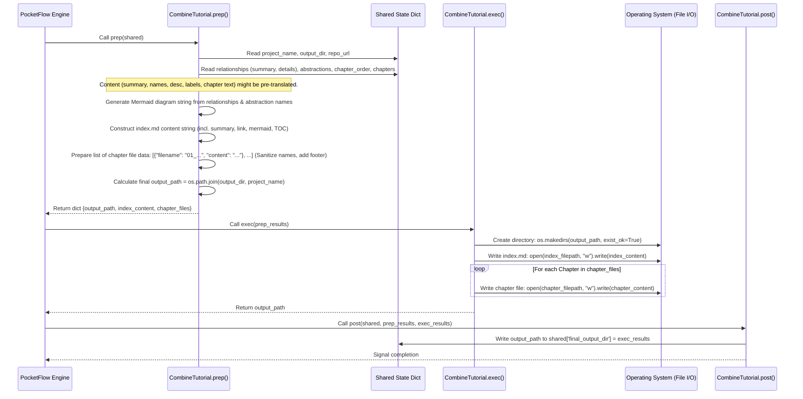

# Chapter 3: Tutorial Generation and Output

## Introduction: From Analysis to Artifact

Welcome to Chapter 3. In the preceding chapters, we explored the system's entry point and configuration ([Chapter 1: Configuration and Execution Entrypoint](01_configuration_and_execution_entrypoint_.md)) and the initial step of acquiring the target codebase ([Chapter 2: Codebase Data Acquisition](02_codebase_data_acquisition_.md)). The outcome of Chapter 2 is a curated list of relevant source files, stored within the `shared['files']` state variable, ready for analysis.

Subsequent stages, which we will explore in detail later ([Chapter 4: LLM Analysis Engine](04_llm_analysis_engine_.md) and [Chapter 6: Processing Nodes](06_processing_nodes_.md)), leverage Large Language Models (LLMs) to dissect this codebase. This analysis yields several critical intermediate data structures: identified core abstractions with descriptions, detected relationships between them, a logically ordered sequence for presenting these abstractions, and finally, the generated Markdown content for each conceptual chapter.

However, these intermediate outputs – residing in memory within the `shared` dictionary – are disparate pieces. They represent the raw manuscript drafts, editor's notes, and structural outlines. This chapter focuses on the crucial final stage: **Tutorial Generation and Output**. We will examine how the system transforms this structured data into a cohesive, navigable, and persistent tutorial artifact, ready for human consumption. This process is orchestrated primarily by the `CombineTutorial` node.

## Motivation: The Publisher's Role - Assembling the Final Product

Imagine having multiple authors contribute chapters for a book, an editor provide a summary and table of contents structure, and a graphic designer create diagrams. Simply having these components doesn't result in a finished book. A publisher is needed to assemble everything, format it consistently, ensure cross-references work, generate the final table of contents, and produce the physical or digital artifact.

The **Tutorial Generation and Output** stage, embodied by the `CombineTutorial` node, serves precisely this "publisher" role within our system. The core use case is: **To systematically assemble the project summary, relationship visualizations, ordered chapter content, and abstraction metadata into a structured set of linked Markdown files and persist them to the file system.**

Without this dedicated stage, the output of the analysis would be ephemeral data structures in memory or, at best, a collection of disconnected text files. The `CombineTutorial` node addresses the need for:

1. **Structure and Cohesion:** Creating a central `index.md` that serves as an entry point, providing context (summary, source link) and an overview (relationship diagram, table of contents).
2. **Navigability:** Automatically generating hyperlinks between the index page and individual chapter files, as well as facilitating cross-chapter references inserted during chapter generation ([Chapter 6: Processing Nodes](06_processing_nodes_.md)).
3. **Visualization:** Integrating the conceptual relationship diagram (generated as a Mermaid flowchart) directly into the main index file for a quick structural overview.
4. **Persistence:** Writing the complete, structured tutorial to a designated output directory on the file system.
5. **Formatting and Standardization:** Ensuring consistent naming conventions for chapter files and applying final touches like attribution footers.
6. **Multi-lingual Support:** Handling potentially pre-translated content (names, summaries, chapter text) transparently during assembly.

This stage transforms the intermediate analytical results into a tangible, usable documentation artifact.

## Key Concepts

1. **`CombineTutorial` Node:** The final processing node in the standard workflow, responsible for orchestrating the assembly and output process. It acts as a consumer of various data points populated in the `shared` state by upstream nodes.
2. **Input Data (`shared` State):** The `CombineTutorial` node relies on the following keys within the `shared` dictionary:
    * `project_name`: The name of the project, used for the output directory and tutorial title.
    * `output_dir`: The base directory specified by the user where the final tutorial will be created.
    * `repo_url` / `local_dir`: The source of the codebase, used for linking in the index.
    * `relationships`: A dictionary containing the AI-generated `summary` (potentially translated) and `details` (a list of `{"from": int, "to": int, "label": str}` relationships, with labels potentially translated).
    * `abstractions`: A list of dictionaries, each describing an abstraction (`{"name": str, "description": str, "files": [int]}`). Names and descriptions might be translated.
    * `chapter_order`: A list of integers representing the order in which abstraction indices should appear as chapters.
    * `chapters`: A list of strings, where each string is the fully generated Markdown content for a chapter (potentially translated).
3. **Output Artifacts:** The node produces a specific directory structure and set of files:
    * `output_dir/project_name/`: The main directory for the generated tutorial.
    * `output_dir/project_name/index.md`: The central landing page containing the title, summary, source link, Mermaid relationship diagram, and a hyperlinked table of contents.
    * `output_dir/project_name/NN_safe_chapter_name.md`: Individual chapter files, where `NN` is the zero-padded chapter number and `safe_chapter_name` is derived from the (potentially translated) abstraction name.
4. **Mermaid Diagram Generation:** The list of relationships (`shared['relationships']['details']`) and abstraction names (`shared['abstractions'][index]['name']`) are dynamically converted into Mermaid flowchart syntax (`flowchart TD ...`) within the `prep` phase of the node. Potentially translated names and labels are used directly.
5. **Automated Linking:** The node iterates through the `chapter_order` and `abstractions` to generate filenames (by sanitizing abstraction names) and create linked entries in the `index.md` table of contents. This ensures the TOC reflects the LLM-determined optimal learning path.
6. **Filename Sanitization:** Abstraction names (which might be translated and contain spaces or special characters) are converted into safe filenames (e.g., replacing non-alphanumeric characters with underscores, lowercasing) to ensure compatibility with file systems. The format is `NN_sanitized_name.md`.
7. **File System Persistence:** Standard Python file I/O operations (`os.makedirs`, `open`/`write`) are used to create the directory structure and write the generated Markdown content to disk.

## How it Works: The `CombineTutorial` Node Lifecycle

The `CombineTutorial` node executes within the [PocketFlow](https://github.com/The-Pocket/PocketFlow) framework, following the standard `prep -> exec -> post` sequence.



1. **`prep(self, shared)`:** This phase gathers all necessary data from the `shared` state. It performs the core assembly logic *in memory*:
    * Retrieves project metadata, relationship details, abstraction info, chapter order, and generated chapter content.
    * Constructs the Mermaid flowchart string using the potentially translated abstraction names and relationship labels.
    * Builds the `index.md` content as a single string, embedding the project summary, source link, the generated Mermaid diagram, and iterating through `chapter_order` to create the linked table of contents using sanitized, numbered filenames and potentially translated chapter titles.
    * Processes the list of chapter Markdown strings (`shared['chapters']`), pairing each with its calculated, sanitized filename and appending a standard attribution footer.
    * Determines the final output directory path.
    * Returns a dictionary containing the `output_path`, the complete `index_content` string, and the list of `chapter_files` data (`[{"filename": ..., "content": ...}, ...]`).

2. **`exec(self, prep_res)`:** This phase performs the actual file system operations based on the data prepared by `prep`.
    * Receives the dictionary containing `output_path`, `index_content`, and `chapter_files`.
    * Ensures the target output directory exists using `os.makedirs(output_path, exist_ok=True)`.
    * Writes the prepared `index_content` string to `index.md` within the output directory.
    * Iterates through the `chapter_files` list, writing the content of each chapter to its corresponding filename (e.g., `01_core_concept.md`) within the output directory.
    * Returns the `output_path` upon successful completion.

3. **`post(self, shared, prep_res, exec_res)`:** This final, simple step updates the shared state.
    * Takes the `output_path` returned by `exec`.
    * Stores this path in `shared['final_output_dir']` for potential verification or downstream use (though it's typically the end of the main workflow).
    * Logs a confirmation message indicating completion and the location of the generated tutorial.

## Code Deep Dive (`nodes.py`: `CombineTutorial`)

Let's examine the implementation within the `nodes.py` file.

```python
# File: nodes.py
import os
import yaml  # Used by other nodes, not CombineTutorial directly
from pocketflow import Node, BatchNode # Base classes
# ... other imports for other nodes ...

class CombineTutorial(Node):
    """
    PocketFlow Node to combine generated chapter content, summary,
    and relationships into a final tutorial structure with an index.md,
    Mermaid diagram, and individual chapter files. Handles potentially
    pre-translated content gracefully.
    """
    def prep(self, shared):
        """Prepare all content and structure for writing to disk."""
        project_name = shared["project_name"]
        output_base_dir = shared.get("output_dir", "output") # Default output dir
        output_path = os.path.join(output_base_dir, project_name)
        repo_url = shared.get("repo_url") or shared.get("local_dir", "N/A") # Get source path/URL

        # Retrieve potentially translated data structures from shared state
        relationships_data = shared["relationships"] # {"summary": potentially-translated-str, "details": [{"from": int, "to": int, "label": potentially-translated-str}]}
        chapter_order = shared["chapter_order"] # List of indices
        abstractions = shared["abstractions"]   # List of dicts -> name/description potentially translated
        chapters_content = shared["chapters"]   # List of strings -> chapter markdown potentially translated

        # --- Generate Mermaid Diagram ---
        mermaid_lines = ["flowchart TD"]
        # Add nodes using potentially translated abstraction names
        for i, abstr in enumerate(abstractions):
            node_id = f"A{i}"
            # Sanitize name for Mermaid ID and label (basic sanitization)
            sanitized_name = abstr['name'].replace('"', '').replace('\n', ' ')
            node_label = sanitized_name # Using sanitized, potentially translated name
            mermaid_lines.append(f'    {node_id}["{node_label}"]')

        # Add edges using potentially translated relationship labels
        for rel in relationships_data.get('details', []): # Use .get for safety
            from_node_id = f"A{rel['from']}"
            to_node_id = f"A{rel['to']}"
            # Sanitize potentially translated label
            edge_label = rel.get('label', 'related to').replace('"', '').replace('\n', ' ') # Basic sanitization
            max_label_len = 30 # Keep labels concise for readability
            if len(edge_label) > max_label_len:
                edge_label = edge_label[:max_label_len-3] + "..."
            mermaid_lines.append(f'    {from_node_id} -- "{edge_label}" --> {to_node_id}')

        mermaid_diagram = "\n".join(mermaid_lines)
        # --- End Mermaid ---

        # --- Prepare index.md content ---
        index_content = f"# Tutorial: {project_name}\n\n"
        # Use the potentially translated summary directly
        index_content += f"{relationships_data.get('summary', 'No project summary generated.')}\n\n"
        # Use English for fixed structural elements
        index_content += f"**Source:** `{repo_url}`\n\n" # Display source path/URL

        index_content += "## Project Structure Overview\n\n"
        index_content += "```mermaid\n"
        index_content += mermaid_diagram + "\n"
        index_content += "```\n\n"

        index_content += f"## Chapters\n\n"

        chapter_files_data = [] # List to store {"filename": ..., "content": ...}
        # Generate chapter links based on order, using potentially translated names
        for i, abstraction_index in enumerate(chapter_order):
            # Validate indices and content availability
            if 0 <= abstraction_index < len(abstractions) and i < len(chapters_content):
                abstraction = abstractions[abstraction_index]
                abstraction_name = abstraction["name"] # Potentially translated name

                # Sanitize potentially translated name for filename
                safe_name = "".join(c if c.isalnum() else '_' for c in abstraction_name).lower().strip('_')
                if not safe_name: # Handle cases where name is purely non-alphanum
                    safe_name = f"chapter_{abstraction_index}"
                filename = f"{i+1:02d}_{safe_name}.md"

                # Add entry to index.md TOC (uses potentially translated name)
                index_content += f"{i+1}. [{abstraction_name}]({filename})\n"

                # Prepare chapter content with attribution footer (using English fixed string)
                chapter_content = chapters_content[i] # Potentially translated content
                # Ensure consistent newlines before adding footer
                chapter_content = chapter_content.rstrip() + "\n\n"
                chapter_content += f"---\n\n*Generated by [PocketFlow Tutorial Codebase Knowledge](https://github.com/The-Pocket/PocketFlow-Tutorial-Codebase-Knowledge)*\n"

                # Store filename and corresponding content for exec phase
                chapter_files_data.append({"filename": filename, "content": chapter_content})
            else:
                 # Log a warning if inconsistency is detected
                 print(f"Warning: Mismatch or invalid index encountered processing chapter {i} (abstraction index {abstraction_index}). Skipping file generation for this entry.")

        # Add attribution to index content (using English fixed string)
        index_content += f"\n\n---\n\n*Generated by [PocketFlow Tutorial Codebase Knowledge](https://github.com/The-Pocket/PocketFlow-Tutorial-Codebase-Knowledge)*\n"

        # Return prepared data for the exec phase
        return {
            "output_path": output_path,
            "index_content": index_content,
            "chapter_files": chapter_files_data # List of {"filename": str, "content": str}
        }

    def exec(self, prep_res):
        """Execute the file writing operations."""
        output_path = prep_res["output_path"]
        index_content = prep_res["index_content"]
        chapter_files = prep_res["chapter_files"]

        print(f"Combining tutorial and writing files to directory: {output_path}")
        try:
            # Ensure the output directory exists; handles concurrent runs safely
            os.makedirs(output_path, exist_ok=True)

            # Write index.md
            index_filepath = os.path.join(output_path, "index.md")
            with open(index_filepath, "w", encoding="utf-8") as f:
                f.write(index_content)
            print(f"  - Wrote index file: {index_filepath}")

            # Write chapter files
            for chapter_info in chapter_files:
                chapter_filepath = os.path.join(output_path, chapter_info["filename"])
                with open(chapter_filepath, "w", encoding="utf-8") as f:
                    f.write(chapter_info["content"])
                print(f"  - Wrote chapter file: {chapter_filepath}")

            return output_path # Return the final path on success
        except OSError as e:
            print(f"Error writing tutorial files to {output_path}: {e}")
            # Allow PocketFlow's retry/fallback mechanism to handle OS errors if configured
            raise # Re-raise the exception

    def post(self, shared, prep_res, exec_res):
        """Update shared state with the final output directory path."""
        # exec_res is the output_path returned by exec on success
        shared["final_output_dir"] = exec_res
        print(f"\n✅ Tutorial generation complete! Files are available in: {exec_res}")

# --- Other Node definitions (FetchRepo, IdentifyAbstractions, etc.) follow ---
```

**Key Observations from the Code:**

* **Data Flow:** The node clearly demonstrates reading multiple complex data structures (`relationships`, `abstractions`, `chapters`, `chapter_order`) from the `shared` dictionary in `prep`.
* **In-Memory Assembly:** The `prep` method performs all the formatting and string construction (Mermaid, `index.md`, chapter content preparation) in memory *before* any file I/O.
* **Language Agnosticism:** Notice that `CombineTutorial` itself contains no specific logic for handling different languages. It directly uses the string values provided in the `shared` state for names, descriptions, summaries, labels, and chapter content. The responsibility for translation lies with the upstream LLM-powered nodes (like `IdentifyAbstractions`, `AnalyzeRelationships`, `WriteChapters`). This node simply assembles and formats the pre-translated pieces alongside fixed English structural text (like `## Chapters`, source links, footers).
* **Error Handling:** Basic error handling is present (e.g., `try...except OSError` in `exec`, `.get` usage when accessing dictionary keys), and it relies on PocketFlow's infrastructure for potential retries. Index validation during TOC/chapter file generation adds robustness against inconsistent upstream data.
* **Modularity:** The node encapsulates the specific task of final assembly and output, separating it cleanly from the concerns of data acquisition (Chapter 2) and LLM analysis/generation (Chapters 4 & 6).

## Analogy: The Document Compiler

Think of `CombineTutorial` as the final stage of a document compilation process, akin to using `pdflatex` or a static site generator like Hugo or Jekyll.

* `shared` state (`relationships`, `abstractions`, `chapters`): Contains the raw content files (like `.tex` or `.md` source files) and configuration data (like a `_config.yml` or preamble).
* `CombineTutorial.prep()`: Corresponds to parsing the inputs, resolving cross-references, building the table of contents structure, processing configuration, and generating intermediate representations (like the Mermaid string).
* `CombineTutorial.exec()`: Corresponds to the final linking and rendering stage, taking the processed content and actually writing the output files (`.pdf`, HTML files) to the target directory (`_site` or `public`).

This stage doesn't create the *content* but rather orchestrates its *assembly* into the final, structured output format.

## Conclusion

Chapter 3 illuminated the critical role of the **Tutorial Generation and Output** stage, executed by the `CombineTutorial` node. This node acts as the system's publisher, taking the structured, potentially multi-lingual outputs from preceding analysis and generation phases – the project summary, abstraction details, relationship map, ordered chapter list, and chapter Markdown content – and assembling them into a cohesive, hyperlinked, and persistent tutorial. We examined how it generates the `index.md` with a Mermaid diagram and table of contents, creates sanitized filenames for chapters, and writes the final directory structure to the file system.

This final assembly step transforms the complex, in-memory data representation produced by the AI analysis into a readily usable documentation artifact for software engineers.

Having seen how the final tutorial is assembled, our focus now shifts back to the core engine responsible for generating the insights and content that `CombineTutorial` uses. The next chapter delves into the heart of the AI analysis process.

**Next:** [Chapter 4: LLM Analysis Engine](04_llm_analysis_engine_.md) will explore how Large Language Models are prompted and utilized to understand the codebase, identify key abstractions, and determine their relationships – the foundational steps that produce the inputs for chapter writing and final assembly.

---

Generated by fork of [AI Codebase Knowledge Builder](https://github.com/vegeta03/PocketFlow-Tutorial-Codebase-Knowledge.git)
