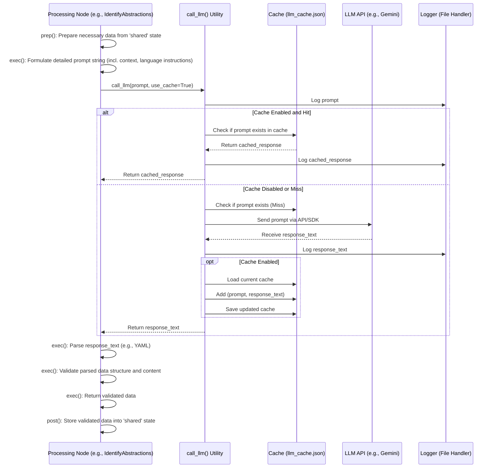

# Chapter 4: LLM Analysis Engine

## Introduction: The Intelligence Hub

Welcome to Chapter 4. In the previous chapters, we've configured our analysis ([Chapter 1](01_configuration_and_execution_entrypoint_.md)), acquired the target codebase ([Chapter 2](02_codebase_data_acquisition_.md)), and understood how the final tutorial artifact is assembled and presented ([Chapter 3](03_tutorial_generation_and_output_.md)). Chapter 3 relied on intermediate data products – identified abstractions, their relationships, a logical chapter order, and generated chapter content – stored in the `shared` state. But where does this crucial analytical insight originate?

This chapter dives into the core intelligence of the `PocketFlow-Tutorial-Codebase-Knowledge` system: the **LLM Analysis Engine**. This isn't a single monolithic component but rather a conceptual layer responsible for leveraging the power of Large Language Models (LLMs) to dissect the codebase and generate the narrative content. We'll explore how specific processing nodes collaborate with a central utility function to interact with LLMs, manage operational concerns like caching and logging, and transform raw code into structured knowledge and human-readable text.

## Motivation: Centralizing and Abstracting LLM Interaction

Generating meaningful tutorials from code requires sophisticated reasoning and natural language generation capabilities, tasks perfectly suited for modern LLMs like Google Gemini, Anthropic Claude, or OpenAI's models. However, directly embedding LLM API calls within each specific analysis task (identifying abstractions, analyzing relationships, writing chapters) would lead to significant challenges familiar to senior engineers:

1. **Code Duplication:** Logic for API authentication, request formatting, response handling, error management, and potentially retry mechanisms would be scattered across multiple nodes.
2. **Provider Lock-in:** Switching LLM providers (due to cost, performance, or feature changes) would necessitate modifying numerous locations in the codebase.
3. **Configuration Management:** API keys and model configurations would need to be managed independently by each node.
4. **Cross-Cutting Concerns:** Implementing essential features like caching (to control cost and latency) and logging (for debugging and auditing) would require redundant implementations in each node.
5. **Inconsistent Interaction:** Different nodes might implement interaction patterns, error handling, or prompt structures slightly differently, leading to maintenance difficulties.
6. **Complexity within Nodes:** Nodes focused on specific analytical tasks (e.g., `IdentifyAbstractions`) would become bloated with LLM interaction infrastructure details, obscuring their core analytical purpose.

The primary use case addressed by the LLM Analysis Engine abstraction is **to provide a centralized, robust, and flexible interface for interacting with LLMs, encapsulating common concerns like API communication, credential management, caching, and logging, thereby simplifying the implementation of individual analysis nodes.** Think of it as establishing a standardized protocol and gateway for consulting an external "expert oracle" (the LLM).

## Architecture and Key Concepts

The LLM Analysis Engine isn't a single class but a design pattern implemented through the collaboration of specific *Processing Nodes* and the `call_llm` *Utility Function*.

```mermaid
graph TD
    subgraph LLM Analysis Engine (Conceptual Layer)
        direction LR
        PN[Processing Nodes (e.g., IdentifyAbstractions, WriteChapters)] -- Formulate Prompt & Call --> UTL
        UTL(call_llm Utility) -- Manage Interaction --> EXT
    end

    subgraph External Services
        direction RL
        EXT(LLM API - Gemini/Claude/OpenAI)
        CACHE[Cache (llm_cache.json)]
        LOG[Logger (logs/llm_calls_*.log)]
    end

    UTL -- Read/Write --> CACHE
    UTL -- Write --> LOG
    UTL -- API Call --> EXT

    style PN fill:#ccf,stroke:#333,stroke-width:2px
    style UTL fill:#f9f,stroke:#333,stroke-width:2px
```

1. **Processing Nodes (The Clients):** Nodes like `IdentifyAbstractions`, `AnalyzeRelationships`, `OrderChapters`, and `WriteChapters` (detailed further in [Chapter 6: Processing Nodes](06_processing_nodes_.md)) act as clients of the analysis engine. Their primary responsibility within this context is **prompt formulation**. They gather the necessary data (code snippets, previous analysis results from the `shared` state, language preference) and craft detailed, specific prompts tailored to their analytical goal (e.g., "Identify the core abstractions given this code...", "Write a tutorial chapter about this concept..."). Once the prompt is ready, they delegate the actual LLM interaction to the `call_llm` utility.

2. **`call_llm` Utility (The Gateway/Protocol Handler):** This function, located in `utils/call_llm.py`, serves as the single point of entry for all LLM interactions. It abstracts away the complexities of direct API communication and handles several critical cross-cutting concerns:
    * **API Communication:** It contains the logic to instantiate the appropriate LLM client (configured for Google Gemini by default, with commented examples for Anthropic and OpenAI) and execute the API call using the provider's SDK. It standardizes the input (prompt string) and expected output (response text string). Adapting to different LLMs primarily involves modifying the API call section within this function.
    * **Credential Management:** It retrieves API keys and other necessary parameters (like GCP project ID/location for Vertex AI) from environment variables (`GEMINI_API_KEY`, `GEMINI_PROJECT_ID`, etc.). This avoids hardcoding sensitive information and adheres to standard security practices.
    * **Caching:** Implements a simple, effective file-based caching mechanism (`llm_cache.json`). Before making an API call, it checks if the exact prompt already exists as a key in the cache file.
        * *Cache Hit:* Returns the cached response directly, significantly reducing latency and API costs, especially during development or for repeated analyses with identical inputs. It also ensures deterministic outputs for cached prompts.
        * *Cache Miss:* Proceeds with the API call, stores the `prompt -> response` mapping in the cache file upon successful completion, and then returns the response.
        * *Considerations:* This simple cache assumes prompts are deterministic inputs mapping to desired outputs. Cache invalidation is manual (delete `llm_cache.json`). For more complex scenarios, more sophisticated caching strategies (e.g., based on content hashes, TTL) might be warranted.
    * **Logging:** Records every prompt sent to the LLM and the corresponding response received in a timestamped log file (`logs/llm_calls_YYYYMMDD.log`). This is invaluable for:
        * *Debugging:* Tracing the exact interaction flow and identifying issues in prompts or responses.
        * *Auditing:* Keeping a record of API usage and costs.
        * *Prompt Refinement:* Analyzing past interactions to improve prompt effectiveness.

3. **Prompt Engineering (Node Responsibility):** The intelligence of the system heavily relies on the quality of the prompts constructed within the Nodes. These prompts typically include:
    * **Task Instruction:** Clearly defining what the LLM should do.
    * **Context:** Providing relevant code snippets (`shared['files']`), previously identified abstractions (`shared['abstractions']`), relationships (`shared['relationships']`), or chapter summaries. Context is crucial for grounding the LLM's analysis in the specific codebase.
    * **Formatting Instructions:** Specifying the desired output format, often YAML, to ensure structured and parseable responses. Examples are frequently included in the prompt (few-shot learning).
    * **Constraints:** Defining limitations or preferences (e.g., "top 5-10 abstractions," "beginner-friendly," "explain using an analogy").
    * **Multi-Language Instructions:** Dynamically adding instructions based on the `shared['language']` setting (e.g., "Generate the `name` and `description` in **Chinese**.").

4. **Response Parsing & Validation (Node Responsibility):** Since LLM outputs can vary or occasionally fail to adhere perfectly to formatting instructions, the *calling Node* is responsible for parsing and validating the response received from `call_llm`. This typically involves:
    * Extracting the relevant content (e.g., stripping markdown fences around YAML).
    * Using libraries like `PyYAML` (`yaml.safe_load`) to parse structured data.
    * Performing schema validation (checking for expected keys, data types, and value constraints, like valid file indices).
    * Raising errors or handling inconsistencies gracefully if validation fails. This ensures data integrity before updating the `shared` state.

5. **Multi-Language Support (Node-Driven Prompting):** The system achieves multi-language output primarily through dynamic prompt adjustments within the *Nodes*. Based on the `language` setting in `shared`, Nodes modify their prompts to explicitly instruct the LLM to generate specific fields (names, descriptions, summaries, labels, chapter text) in the target language. The `call_llm` function itself remains language-agnostic; it simply transmits the prompt and returns the response as text.

## Workflow Interaction

The interaction between a Processing Node and the `call_llm` utility follows a standard pattern within the PocketFlow framework:



This diagram illustrates the flow: the Node orchestrates the analysis task, crafting the query (prompt), while `call_llm` handles the mechanics of delivering the query and retrieving the answer, optimizing via caching and recording the transaction via logging.

## Code Deep Dive

Let's examine the implementations of the core components.

### `utils/call_llm.py`

This utility encapsulates the interaction logic.

```python
# File: utils/call_llm.py
from google import genai  # Example using Google Gemini client
import os
import logging
import json
from datetime import datetime

# --- Logging Setup ---
log_directory = os.getenv("LOG_DIR", "logs")
os.makedirs(log_directory, exist_ok=True)
log_file = os.path.join(log_directory, f"llm_calls_{datetime.now().strftime('%Y%m%d')}.log")
logger = logging.getLogger("llm_logger")
if not logger.handlers: # Avoid adding multiple handlers on re-import
    logger.setLevel(logging.INFO)
    logger.propagate = False
    file_handler = logging.FileHandler(log_file)
    file_handler.setFormatter(logging.Formatter('%(asctime)s - %(levelname)s - %(message)s'))
    logger.addHandler(file_handler)
# --- End Logging Setup ---

# --- Cache Configuration ---
cache_file = "llm_cache.json"
# --- End Cache Configuration ---

# Default implementation uses Google Gemini via Vertex AI
def call_llm(prompt: str, use_cache: bool = True) -> str:
    """
    Calls the configured LLM with the given prompt, handling caching and logging.

    Args:
        prompt: The text prompt to send to the LLM.
        use_cache: Whether to use the file-based cache.

    Returns:
        The text response from the LLM or cache.

    Raises:
        Various exceptions from the underlying LLM client library on API errors.
    """
    # 1. Log the prompt
    logger.info(f"PROMPT HASH (Prefix): {hash(prompt)}...") # Log hash prefix for identification without logging potentially huge prompts fully every time
    logger.debug(f"FULL PROMPT:\n{prompt}") # Log full prompt at DEBUG level

    # 2. Check cache if enabled
    cache = {}
    if use_cache:
        if os.path.exists(cache_file):
            try:
                with open(cache_file, 'r', encoding='utf-8') as f:
                    cache = json.load(f)
            except (json.JSONDecodeError, OSError) as e:
                logger.warning(f"Failed to load cache file '{cache_file}': {e}. Starting empty.")
                cache = {} # Reset cache on load failure

        if prompt in cache:
            cached_response = cache[prompt]
            logger.info(f"CACHE HIT - Prompt Hash: {hash(prompt)}")
            logger.debug(f"CACHED RESPONSE:\n{cached_response}")
            return cached_response
        else:
            logger.info(f"CACHE MISS - Prompt Hash: {hash(prompt)}")

    # 3. Call the LLM API (if not cached or cache disabled)
    response_text = ""
    try:
        # --- Gemini Vertex AI Client Configuration ---
        # Assumes GOOGLE_APPLICATION_CREDENTIALS env var is set for authentication
        # or user is logged in via gcloud auth application-default login
        client = genai.Client(
            vertexai=True,
            project=os.getenv("GEMINI_PROJECT_ID"), # Required
            location=os.getenv("GEMINI_LOCATION")  # Required
        )
        model_name = os.getenv("GEMINI_MODEL", "gemini-1.5-pro-latest") # Use a potent model
        logger.info(f"Calling LLM API: Model={model_name}, Project={client.project}, Location={client.location}")

        # --- API Call ---
        # Note: Error handling (timeouts, API errors) might need enhancement
        # depending on the specific client library and desired robustness.
        # Consider adding retry logic for transient errors.
        response = client.models.generate_content(
            model=model_name,
            contents=[prompt]
            # Add generation_config for temperature, max tokens etc. if needed
            # generation_config=genai.GenerationConfig(...)
        )
        response_text = response.text # Extract text response
        logger.info(f"LLM API Call Successful - Prompt Hash: {hash(prompt)}")

    except Exception as e:
        logger.error(f"LLM API Call FAILED - Prompt Hash: {hash(prompt)}: {e}", exc_info=True)
        # Re-raise the exception to be handled by the calling Node or PocketFlow
        raise

    # 4. Log the response from API
    logger.debug(f"API RESPONSE:\n{response_text}")

    # 5. Update cache if enabled and API call was successful
    if use_cache and response_text:
        # Load cache again to minimize race conditions if multiple processes run
        # (though typically PocketFlow runs nodes sequentially in a single process)
        if os.path.exists(cache_file):
            try:
                with open(cache_file, 'r', encoding='utf-8') as f:
                    cache = json.load(f)
            except (json.JSONDecodeError, OSError):
                cache = {} # Start fresh if reload fails

        cache[prompt] = response_text
        try:
            with open(cache_file, 'w', encoding='utf-8') as f:
                # Use ensure_ascii=False for broader character support, indent for readability
                json.dump(cache, f, ensure_ascii=False, indent=2)
            logger.info(f"CACHE UPDATED - Prompt Hash: {hash(prompt)}")
        except OSError as e:
            logger.error(f"Failed to save cache file '{cache_file}': {e}")

    return response_text

# --- Commented examples for other providers ---
# def call_llm_anthropic(prompt, use_cache=True): ...
# def call_llm_openai(prompt, use_cache=True): ...
```

*Key Takeaways:* The function clearly separates logging, caching logic, and the actual API call. It relies on environment variables for configuration and provides basic file-based caching and detailed logging. Error handling is present but could be enhanced with retries for production systems.

### Node Example (`IdentifyAbstractions.exec`)

This snippet shows how a Node utilizes `call_llm` and handles the response.

```python
# File: nodes.py (within IdentifyAbstractions class)
import yaml # For parsing YAML response

# (Inside the IdentifyAbstractions Node class)
    def exec(self, prep_res):
        """
        Executes the abstraction identification task by formulating a prompt,
        calling the LLM via call_llm, parsing, and validating the response.
        """
        context, file_listing_for_prompt, file_count, project_name, language = prep_res
        print(f"Identifying abstractions for '{project_name}' using LLM (Language: {language})...")

        # --- 1. Prompt Formulation ---
        # Dynamically adjust prompt based on language
        language_instruction = ""
        name_lang_hint = ""
        desc_lang_hint = ""
        if language.lower() != "english":
            lang_cap = language.capitalize()
            language_instruction = f"IMPORTANT: Generate the `name` and `description` fields **only** in {lang_cap} language.\n\n"
            name_lang_hint = f" (in {lang_cap})"
            desc_lang_hint = f" (in {lang_cap})"

        # Construct the detailed prompt
        prompt = f"""
Analyze the codebase context for the project `{project_name}` provided below.
Identify the top 5-10 most critical conceptual abstractions for a developer new to this project.

Codebase Context:
{context}

List of file indices and paths present in the context:
{file_listing_for_prompt}

{language_instruction}For each abstraction, provide:
1. A concise `name`{name_lang_hint}.
2. A beginner-friendly `description` explaining its purpose, potentially with a simple analogy, in approx. 100 words{desc_lang_hint}.
3. A list of relevant `file_indices` (integers only, corresponding to the list above) where this abstraction is primarily defined or implemented.

Format the output STRICTLY as a YAML list of dictionaries:

```yaml
- name: Query Parser{name_lang_hint}
  description: Breaks down user queries into an internal representation. Like translating English to computer code.{desc_lang_hint}
  file_indices:
    - 0
    - 3
- name: Data Storage Interface{name_lang_hint}
  description: Provides a standard way to interact with different database backends. Think of it as a universal adapter.{desc_lang_hint}
  file_indices:
    - 5
# ... up to 10 abstractions
```"""

        # --- 2. Call LLM via Utility ---
        # Set use_cache=True typically, can be False for debugging prompts
        response_text = call_llm(prompt, use_cache=True)

        # --- 3. Response Parsing ---
        try:
            # Extract YAML block (handle potential variations in fences)
            if "```yaml" in response_text:
                yaml_str = response_text.split("```yaml")[1].split("```")[0].strip()
            elif "```" in response_text: # Handle case with just ```
                 yaml_str = response_text.split("```")[1].split("```")[0].strip()
            else: # Assume raw YAML if no fences
                yaml_str = response_text.strip()

            if not yaml_str:
                 raise ValueError("LLM response contained no YAML content after stripping fences.")

            parsed_abstractions = yaml.safe_load(yaml_str)

        except (IndexError, yaml.YAMLError) as e:
            error_msg = f"Failed to parse YAML from LLM response. Error: {e}\nResponse Text:\n{response_text}"
            logger.error(error_msg)
            raise ValueError(error_msg) from e
        except Exception as e: # Catch other unexpected errors during parsing
             error_msg = f"Unexpected error parsing LLM response. Error: {e}\nResponse Text:\n{response_text}"
             logger.error(error_msg)
             raise ValueError(error_msg) from e


        # --- 4. Validation ---
        if not isinstance(parsed_abstractions, list):
            raise ValueError(f"LLM Output is not a list. Parsed: {parsed_abstractions}")

        validated_abstractions = []
        required_keys = {"name", "description", "file_indices"}
        for i, item in enumerate(parsed_abstractions):
            if not isinstance(item, dict):
                 raise ValueError(f"Item {i} in LLM output is not a dictionary: {item}")
            if not required_keys.issubset(item.keys()):
                raise ValueError(f"Item {i} is missing required keys ({required_keys - set(item.keys())}): {item}")
            if not isinstance(item["name"], str) or not item["name"].strip():
                 raise ValueError(f"Item {i} 'name' is not a non-empty string: {item}")
            if not isinstance(item["description"], str) or not item["description"].strip():
                 raise ValueError(f"Item {i} 'description' is not a non-empty string: {item}")
            if not isinstance(item["file_indices"], list):
                 raise ValueError(f"Item {i} 'file_indices' is not a list: {item}")

            # Specific validation for file indices
            validated_indices = []
            for idx_entry in item["file_indices"]:
                 try:
                     # Tolerate indices coming as strings (e.g., "2 # comment", "2", 2)
                     if isinstance(idx_entry, str) and '#' in idx_entry:
                          idx_str = idx_entry.split('#')[0].strip()
                     else:
                          idx_str = str(idx_entry).strip() # Handle int or string number

                     idx = int(idx_str)
                     if not (0 <= idx < file_count):
                         raise ValueError(f"Index {idx} out of range (0-{file_count - 1})")
                     validated_indices.append(idx)
                 except (ValueError, TypeError) as e:
                      raise ValueError(f"Invalid file index entry '{idx_entry}' in item {i} ('{item['name']}'): {e}") from e

            # Deduplicate and sort indices
            unique_indices = sorted(list(set(validated_indices)))

            # Append validated structure (renaming file_indices to 'files' for consistency)
            validated_abstractions.append({
                "name": item["name"].strip(), # Store potentially translated name
                "description": item["description"].strip(), # Store potentially translated description
                "files": unique_indices # Store validated indices
            })

        if not validated_abstractions:
             raise ValueError("LLM analysis returned no valid abstractions after parsing and validation.")

        print(f"LLM identified {len(validated_abstractions)} abstractions.")
        return validated_abstractions # Return the validated list of dicts
```

*Key Takeaways:* The Node focuses on preparing the context and prompt, including language-specific instructions. It delegates the actual call to `call_llm`. Crucially, it performs robust parsing and validation on the returned text, ensuring data quality before it's used downstream or stored in the `shared` state.

## Analogy Revisited: The Expert Consultation Protocol

Returning to our analogy, the **LLM Analysis Engine** acts as a sophisticated system for consulting an "Expert Oracle" (the LLM):

* **Processing Nodes** are the *Researchers* or *Domain Experts* who know what specific knowledge they need. They meticulously gather background material (code context, prior findings) and formulate precise questions (prompts) in a format the Oracle understands.
* The **`call_llm` Utility** acts as the strict *Communication Protocol* and the *Librarian/Gateway*. It handles the logistics: authenticating the researcher, checking the library's cache for pre-existing answers to identical questions, transmitting the question using the correct communication channel (API), recording the entire transaction (logging), receiving the answer, and delivering it back to the researcher. It ensures the interaction is efficient (caching) and auditable (logging).
* **Response Parsing & Validation** is the researcher's final step: carefully interpreting the Oracle's potentially cryptic or verbose answer, verifying its structure and plausibility against known facts (codebase structure), and extracting the core insights into a usable format.

## Conclusion

The LLM Analysis Engine is the conceptual heart of the tutorial generation system, providing the crucial intelligence derived from Large Language Models. By abstracting LLM interaction behind the `call_llm` utility, the system achieves modularity, maintainability, and flexibility. `call_llm` centralizes critical concerns like API communication, credential management, cost/latency optimization via caching, and debugging/auditing through logging.

The Processing Nodes act as intelligent clients, leveraging this engine by formulating domain-specific prompts, injecting necessary context (including language preferences), and rigorously validating the LLM's responses. This separation of concerns allows Nodes to focus on *what* analysis to perform, while the engine handles *how* to interact with the LLM reliably and efficiently.

With the codebase acquired ([Chapter 2](02_codebase_data_acquisition_.md)) and the mechanism for analyzing it via LLMs now understood, we need a way to reliably orchestrate these steps. How does the system ensure that data acquisition happens before analysis, and analysis happens before final tutorial generation?

**Next:** [Chapter 5: Workflow Orchestration (PocketFlow)](05_workflow_orchestration__pocketflow__.md) will introduce the PocketFlow framework, explaining how it defines and executes the sequence of operations (Nodes), manages data flow via the `shared` state, and provides resiliency features like retries – the backbone that connects all these components into a functioning pipeline.

---

Generated by fork of [AI Codebase Knowledge Builder](https://github.com/vegeta03/PocketFlow-Tutorial-Codebase-Knowledge.git)
