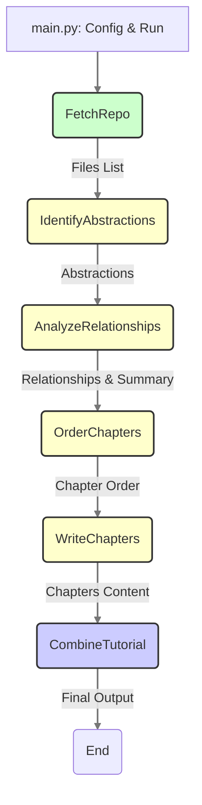
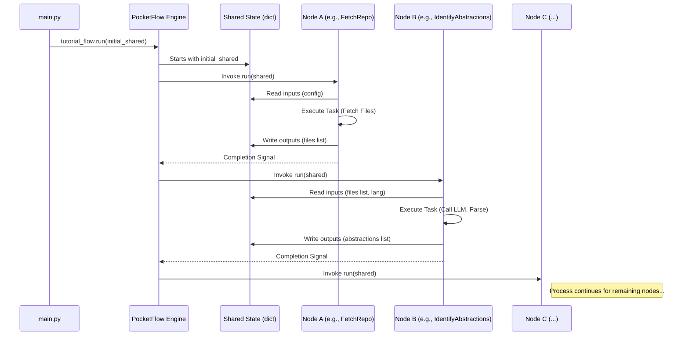

# Chapter 5: Workflow Orchestration (PocketFlow)

## Introduction: Directing the Tutorial Symphony

Welcome to Chapter 5. In our journey so far, we've explored how the `PocketFlow-Tutorial-Codebase-Knowledge` system is configured and launched ([Chapter 1](01_configuration_and_execution_entrypoint_.md)), how it acquires the target source code ([Chapter 2](02_codebase_data_acquisition_.md)), how the final tutorial artifact is assembled ([Chapter 3](03_tutorial_generation_and_output_.md)), and the core mechanisms for leveraging Large Language Models for analysis ([Chapter 4](04_llm_analysis_engine_.md)). We've seen individual components performing specific tasks, but a crucial question remains: how are these disparate operations connected and executed in the correct sequence? How does the data produced by one stage reliably flow to the next?

This chapter delves into the **Workflow Orchestration** layer, the system's backbone, implemented using the [PocketFlow](https://github.com/The-Pocket/PocketFlow) framework. PocketFlow acts as the director of our tutorial generation symphony, ensuring each instrument (Processing Node) plays its part at the right time and contributes its output (data in the `shared` state) to the overall composition. It defines the precise sequence of tasks – fetching code, identifying abstractions, analyzing relationships, ordering chapters, writing content, and combining the results – vital for transforming raw code into a coherent tutorial.

## Motivation: Taming Complexity in Sequential Processing

Building any non-trivial data processing pipeline involves managing inherent complexities. Consider the tutorial generation process:

1. **Task Dependencies:** Identifying abstractions requires the code files to be fetched first. Writing chapters depends on having identified abstractions, analyzed their relationships, and determined the optimal order.
2. **Data Handoff:** The list of files fetched by one component needs to be accessible to the analysis components. The identified abstractions need to be passed to the relationship analyzer, the chapter orderer, and the chapter writer.
3. **Error Handling & Resilience:** What happens if the LLM call to identify abstractions fails intermittently? Should the entire process crash, or should there be retry mechanisms?
4. **Maintainability & Modularity:** If we want to add a new analysis step (e.g., code linting analysis) or swap out the LLM provider for chapter writing, how can we do so without rewriting large portions of the application logic? A monolithic script executing all steps sequentially becomes brittle and difficult to modify.

The core use case addressed by workflow orchestration is **to provide a structured, declarative, and robust mechanism for defining, executing, and managing complex, multi-stage computational processes, especially those involving distinct tasks with clear dependencies and data flow requirements.** Without such a system, we risk creating tightly coupled, fragile code that's hard to understand, maintain, and extend.

## Key Concepts of PocketFlow Orchestration

The `PocketFlow` framework provides a lightweight yet effective way to implement workflow orchestration based on a few core concepts:

1. **Flow:** Represents the entire end-to-end process as a Directed Acyclic Graph (DAG). It holds the definition of all the steps and their execution order. In our project, this is instantiated in `flow.py` as `tutorial_flow`.
2. **Node:** An atomic unit of work within the Flow. Each Node encapsulates the logic for a specific task (e.g., fetching data, calling an API, transforming data). Nodes are typically designed to be idempotent where possible. Nodes have distinct phases:
    * `prep`: Prepare inputs, often retrieving data from the `shared` state.
    * `exec`: Perform the core computation using the prepared inputs.
    * `post`: Store the results of the computation back into the `shared` state.
    We will explore specific Node implementations in detail in [Chapter 6: Processing Nodes](06_processing_nodes_.md).
3. **PocketFlow Framework:** The library itself (`pocketflow` package) provides the base classes (`Flow`, `Node`, `BatchNode`) and the execution engine that interprets the DAG definition and runs the Nodes.
4. **Shared State (`shared` Dictionary):** The central mechanism for inter-node communication. As introduced in [Chapter 1](01_configuration_and_execution_entrypoint_.md), this dictionary is initialized at the start and passed through the workflow. Each Node reads its required inputs from `shared` (placed there by previous Nodes or initialization) and writes its outputs back into `shared` for subsequent Nodes to consume. This explicit state passing promotes loose coupling between Nodes.
5. **DAG Definition (`>>` Operator):** PocketFlow uses Python's right-shift operator (`>>`) as syntactic sugar to define the dependencies and sequence between Nodes within the `flow.py` script. `node_A >> node_B` means `node_B` executes after `node_A` completes successfully.
6. **Execution Engine (`Flow.run()`):** The primary method invoked (in `main.py`) to start the workflow. The engine traverses the DAG defined by the `>>` connections, executing each Node's `prep`, `exec`, and `post` methods in sequence, passing the `shared` state along. It also handles features like retries if configured on the Nodes.

## The Tutorial Generation Workflow (`flow.py`)

The heart of the orchestration logic resides in `flow.py`. This file defines how the individual processing nodes are wired together to form the complete tutorial generation pipeline.

```python
# File: flow.py
from pocketflow import Flow
# Import all node classes from nodes.py
from nodes import (
    FetchRepo,
    IdentifyAbstractions,
    AnalyzeRelationships,
    OrderChapters,
    WriteChapters,  # Note potential use of BatchNode for parallelization/efficiency
    CombineTutorial
)

def create_tutorial_flow():
    """
    Creates and returns the codebase tutorial generation flow, defining the
    sequence and dependencies of processing nodes.
    """

    # 1. Instantiate each Node (configuring retries for robustness)
    # Retries are useful for Nodes involving external API calls (LLMs)
    fetch_repo = FetchRepo()
    identify_abstractions = IdentifyAbstractions(max_retries=3, wait=10) # 3 retries, 10s wait
    analyze_relationships = AnalyzeRelationships(max_retries=3, wait=10)
    order_chapters = OrderChapters(max_retries=3, wait=10)
    # WriteChapters might be a BatchNode, handling multiple chapters.
    # Retries might apply differently (e.g., per chapter or for the whole batch).
    write_chapters = WriteChapters(max_retries=3, wait=10)
    combine_tutorial = CombineTutorial()

    # 2. Define the Workflow DAG using the '>>' operator
    # This establishes the strict execution order.
    fetch_repo >> identify_abstractions
    identify_abstractions >> analyze_relationships
    analyze_relationships >> order_chapters
    order_chapters >> write_chapters
    write_chapters >> combine_tutorial

    # 3. Create the Flow object, specifying the starting Node
    # The execution begins here when .run() is called.
    tutorial_flow = Flow(start=fetch_repo)

    return tutorial_flow
```

**Explanation:**

1. **Node Instantiation:** Each class imported from `nodes.py` (representing a specific task like `FetchRepo` or `IdentifyAbstractions`) is instantiated. Note the configuration of `max_retries` and `wait` for nodes that interact with the LLM ([Chapter 4](04_llm_analysis_engine_.md)). This leverages PocketFlow's built-in retry capability for enhanced resilience against transient network or API issues.
2. **DAG Definition:** The `>>` operator chains the nodes together, defining the exact sequence. `FetchRepo` runs first. Upon its successful completion, `IdentifyAbstractions` runs, followed by `AnalyzeRelationships`, and so on, until `CombineTutorial` runs last. This declaratively defines the workflow structure.
3. **Flow Creation:** A `Flow` object is created, with `fetch_repo` designated as the starting point (`start=fetch_repo`).

This `tutorial_flow` object encapsulates the entire workflow plan. As seen in [Chapter 1](01_configuration_and_execution_entrypoint_.md), `main.py` calls this `create_tutorial_flow()` function and then triggers the execution:

```python
# File: main.py (Snippet)
# ... argument parsing and shared dict initialization ...

# Create the flow instance by calling the factory function from flow.py
tutorial_flow = create_tutorial_flow()

# Run the flow, passing the initial configuration and state dictionary
# The PocketFlow engine takes over from here.
tutorial_flow.run(shared)
```

This `run(shared)` call injects the initial state and kicks off the execution engine, which follows the defined DAG.

**Visualizing the Flow:**



*This diagram shows the linear flow defined in `flow.py`. Nodes involving LLM calls are highlighted (yellow), data acquisition (green), final combination (blue).*

## Data Flow via Shared State in the Workflow

The `shared` dictionary is the lifeblood of the workflow, carrying data between the Nodes. Let's trace its evolution:

1. **Initialization (`main.py`):** `shared` starts with configuration data (`repo_url`, `local_dir`, `include_patterns`, `language`, etc.) and placeholders for outputs (`files: []`, `abstractions: []`, etc.).
2. **`FetchRepo` (`prep`->`exec`->`post`):** Reads config, fetches code, writes `shared['files'] = [(path, content), ...]`.
3. **`IdentifyAbstractions`:** Reads `shared['files']`, `shared['language']`. Calls LLM ([Chapter 4](04_llm_analysis_engine_.md)). Writes `shared['abstractions'] = [{"name":..., "description":..., "files":...}, ...]`.
4. **`AnalyzeRelationships`:** Reads `shared['files']`, `shared['abstractions']`, `shared['language']`. Calls LLM. Writes `shared['relationships'] = {"summary":..., "details": [{"from":..., "to":..., "label":...}, ...]}`.
5. **`OrderChapters`:** Reads `shared['abstractions']`, `shared['relationships']`, `shared['language']`. Calls LLM. Writes `shared['chapter_order'] = [idx1, idx2, ...]`.
6. **`WriteChapters` (BatchNode):** Reads `shared['chapter_order']`, `shared['abstractions']`, `shared['files']`, `shared['language']`. Calls LLM for each chapter. Aggregates results and writes `shared['chapters'] = ["markdown_content_1", "markdown_content_2", ...]`.
7. **`CombineTutorial`:** Reads `shared['project_name']`, `shared['output_dir']`, `shared['relationships']`, `shared['abstractions']`, `shared['chapter_order']`, `shared['chapters']`. Assembles the final tutorial files ([Chapter 3](03_tutorial_generation_and_output_.md)). Writes `shared['final_output_dir']` with the path to the generated tutorial.

**Simplified Interaction Diagram:**



This illustrates the sequential execution managed by the engine and the central role of the `shared` dictionary for data propagation.

## Benefits for Senior Engineers

Adopting an orchestration framework like PocketFlow offers significant advantages over manual scripting, particularly relevant in complex projects:

* **Modularity & Testability:** Each Node isolates a specific concern. You can test `IdentifyAbstractions` independently by providing a sample `shared` state with `files` data, without running the full `FetchRepo` process.
* **Maintainability:** The workflow structure is explicitly defined in `flow.py`. Modifying the order or adding/removing steps requires localized changes in this file, rather than deep refactoring of a monolithic script.
* **Readability & Understandability:** The DAG provides a clear, high-level map of the entire process, making it easier for new team members (or your future self) to grasp the system's architecture.
* **Extensibility:** Adding new functionality (e.g., a step to generate code metrics before LLM analysis) involves creating a new `Node` subclass and simply inserting it into the chain in `flow.py` using the `>>` operator.
* **Resilience:** Framework features like automatic retries (`max_retries`, `wait`) for Nodes dealing with potentially flaky external services (like LLM APIs) improve the robustness of the overall process without cluttering the core logic of each Node.

## Analogy: The Automated Assembly Line

Think of the PocketFlow orchestration as managing an automated assembly line for building tutorials:

* **The `Flow` (`tutorial_flow`):** This is the blueprint and control system for the entire assembly line, defining the sequence of workstations and the path the product takes.
* **`Nodes` (`FetchRepo`, `IdentifyAbstractions`, etc.):** These are the specialized robotic workstations on the line. Each performs a specific task: loading raw materials (fetching code), performing analysis (identifying abstractions), adding components (writing chapters), or final packaging (combining the tutorial).
* **`shared` State:** This is the conveyor belt carrying the product (the tutorial-in-progress) from one workstation to the next. Each workstation takes the product from the belt, performs its operation (adding data to the `shared` dict), and places the modified product back onto the belt for the next station.
* **`Flow.run()`:** This is the "Start" button that powers up the assembly line and begins sending the initial chassis (the initial `shared` dict with configuration) down the line.
* **`>>` Operator:** Defines the physical connections and sequence between the workstations on the conveyor belt.

This automated approach ensures consistency, efficiency, and makes it easier to monitor, modify, or upgrade individual workstations (Nodes) without disrupting the entire factory (Flow).

## Conclusion

Workflow orchestration, facilitated by the PocketFlow framework, provides the essential structure and control mechanism for the `PocketFlow-Tutorial-Codebase-Knowledge` system. It transforms a complex sequence of tasks into a manageable, declarative DAG defined in `flow.py`. By connecting modular `Nodes` and managing data flow via the central `shared` state dictionary, PocketFlow ensures that operations occur in the correct order and that data produced by one stage is reliably available to the next. This approach significantly enhances modularity, maintainability, extensibility, and resilience, crucial attributes for any sophisticated software system.

Understanding this orchestration layer provides the high-level map of the entire process. We've seen the blueprint; now it's time to examine the workers themselves.

**Next:** [Chapter 6: Processing Nodes](06_processing_nodes_.md) will dive deeper into the specific implementations of key Nodes like `IdentifyAbstractions`, `AnalyzeRelationships`, `WriteChapters`, and `CombineTutorial`, showcasing how they leverage the `shared` state and the LLM Analysis Engine ([Chapter 4](04_llm_analysis_engine_.md)) to perform their specialized tasks within the orchestrated workflow.

---

Generated by fork of [AI Codebase Knowledge Builder](https://github.com/vegeta03/PocketFlow-Tutorial-Codebase-Knowledge.git)
