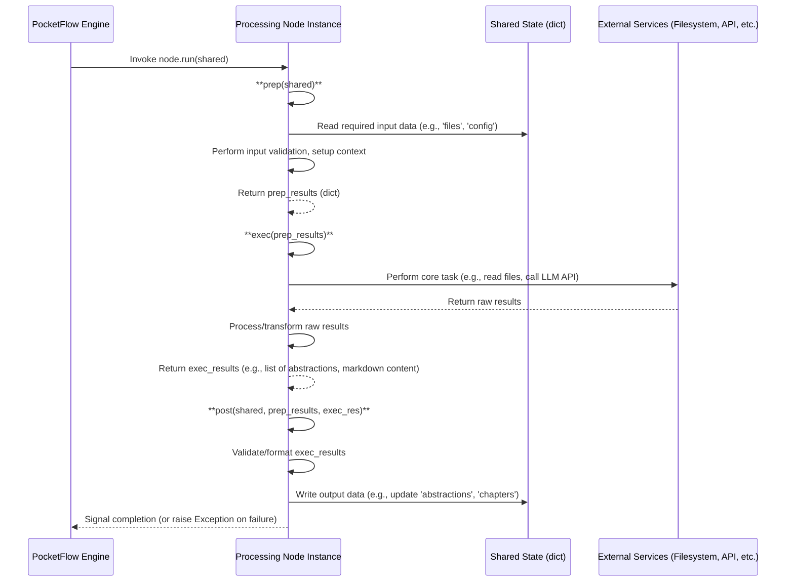

# Chapter 6: Processing Nodes

## Introduction: The Engines of the Workflow

Welcome to the final chapter of the PocketFlow Codebase Knowledge Tutorial. In [Chapter 5: Workflow Orchestration (PocketFlow)](05_workflow_orchestration__pocketflow__.md), we examined how the PocketFlow framework orchestrates the entire tutorial generation process, defining a Directed Acyclic Graph (DAG) of tasks and managing the flow of data through a central `shared` state dictionary. While Chapter 5 provided the blueprint for the assembly line, this chapter focuses on the specialized machines — the **Processing Nodes** — that perform the actual work at each station.

Processing Nodes are the fundamental units of computation within the PocketFlow paradigm. Each Node is a self-contained, specialized component designed to execute a specific, well-defined task within the larger workflow. Think of them as microservices within the workflow application, each responsible for a distinct operation like fetching repository files (`FetchRepo`), identifying code abstractions (`IdentifyAbstractions`), analyzing their relationships (`AnalyzeRelationships`), determining the teaching order (`OrderChapters`), generating the textual content (`WriteChapters`), or assembling the final output (`CombineTutorial`). This modular design is key to the system's robustness and extensibility.

## Motivation: Achieving Modularity and Specialization in Complex Pipelines

Building sophisticated data processing pipelines, especially those involving external APIs (like LLMs) and complex state transformations, necessitates a structured approach to manage complexity. A monolithic script executing all steps sequentially quickly becomes unmanageable, untestable, and difficult to maintain. The core motivation behind adopting a Node-based architecture is to enforce **modularity, separation of concerns, and testability**.

Consider the challenges:

* **Interwoven Logic:** Without clearly defined boundaries, the logic for fetching data, analyzing it, and formatting output can become tightly coupled, making modifications risky.
* **State Management:** Managing the flow of intermediate data products (file lists, abstraction lists, relationship maps) requires a disciplined approach.
* **Testability:** How do you test the chapter writing logic without first running the entire data fetching and analysis pipeline?
* **Extensibility:** Adding a new analysis step (e.g., generating code complexity metrics) should not require rewriting the entire workflow.
* **Error Handling:** Isolating failures and implementing targeted retry strategies (e.g., for flaky API calls) is difficult in monolithic code.

Processing Nodes directly address these challenges by encapsulating each distinct step. Each Node acts as a specialized function that:

1. Receives specific inputs (typically from the `shared` state).
2. Performs its defined task.
3. Produces specific outputs (typically updating the `shared` state).

This paradigm promotes a clean separation of concerns, making the system behave like a well-organized assembly line where each station (`Node`) performs its specialized task before passing the partially assembled product (`shared` state) to the next station.

## Key Concepts & Node Lifecycle: The `prep -> exec -> post` Pattern

At the heart of every PocketFlow Node lies a standardized execution lifecycle defined by three key methods: `prep`, `exec`, and `post`. This pattern provides a consistent structure for all computational units within the workflow.



1. **`prep(self, shared)`:**
    * **Purpose:** Prepare the necessary inputs and context for the Node's core execution logic. It acts as the data marshalling and setup phase.
    * **Actions:** Typically involves reading required data keys from the `shared` dictionary (populated by previous Nodes or initial configuration). It might perform basic validation on these inputs, derive necessary parameters (like the project name in `FetchRepo`), and structure the data into a format suitable for the `exec` method.
    * **Output:** Returns a dictionary (`prep_results`) containing all the data the `exec` method needs. The `shared` state should generally *not* be modified directly within `prep` (except for potentially idempotent operations like deriving the project name if missing).

2. **`exec(self, prep_res)`:**
    * **Purpose:** Execute the Node's primary function or core computation. This is where the main work happens.
    * **Actions:** Receives the `prep_results` dictionary. Performs the specific task the Node is designed for – this could involve file system operations (`FetchRepo`, `CombineTutorial`), complex calculations, or interacting with external services like the LLM Analysis Engine via `call_llm` ([Chapter 4](04_llm_analysis_engine_.md)) (`IdentifyAbstractions`, `WriteChapters`). This method should focus *solely* on the execution logic, keeping setup and result handling separate.
    * **Output:** Returns the result(s) of the computation (`exec_results`). This output should be in a raw or intermediate format, ready for final processing in `post`.

3. **`post(self, shared, prep_res, exec_res)`:**
    * **Purpose:** Process the results from `exec` and update the central `shared` state, making the Node's output available to subsequent Nodes. This acts as the result marshalling and state update phase.
    * **Actions:** Receives the original `shared` dictionary, the `prep_results`, and the `exec_results`. It might perform final validation, transformation, or cleanup on the `exec_results`. Its crucial role is to update the `shared` dictionary with the Node's output, using appropriate keys (e.g., `shared['abstractions'] = validated_abstractions`). Logging completion or key results is also common here.
    * **Output:** Typically returns `None`. Its primary side effect is modifying the `shared` dictionary.

This separation ensures that data fetching/preparation (`prep`), core logic (`exec`), and state update (`post`) are distinct, enhancing clarity, testability, and maintainability.

## Node Implementation Deep Dive

Let's examine the implementation of several key nodes provided in `nodes.py` to see this pattern in action.

### 1. `FetchRepo`: The Data Ingress Point

* **Role:** Fetches source code from GitHub or a local directory based on configuration, applies filters, and populates `shared['files']`.
* **Interaction:** Reads configuration (`repo_url`, `local_dir`, patterns, token) from `shared`. Writes the list of fetched files (`[(path, content), ...]`) to `shared['files']`.

```python
# File: nodes.py (FetchRepo Snippet)
class FetchRepo(Node):
    def prep(self, shared):
        # Reads source (URL/dir), filtering patterns, token from shared.
        repo_url = shared.get("repo_url")
        local_dir = shared.get("local_dir")
        project_name = shared.get("project_name")

        # Derives project_name if not provided - an idempotent setup operation.
        if not project_name:
            if repo_url:
                project_name = repo_url.split('/')[-1].replace('.git', '')
            else: # Assumes local_dir is present due to main.py validation
                project_name = os.path.basename(os.path.abspath(local_dir))
            shared["project_name"] = project_name # Updates shared state (acceptable for initialization)

        # Package required config for exec.
        return {
            "repo_url": repo_url,
            "local_dir": local_dir,
            "token": shared.get("github_token"),
            "include_patterns": shared["include_patterns"],
            "exclude_patterns": shared["exclude_patterns"],
            "max_file_size": shared["max_file_size"],
            "use_relative_paths": True # Internal config for consistency
        }

    def exec(self, prep_res):
        # Core Logic: Delegate to appropriate crawling utility based on presence of repo_url.
        if prep_res["repo_url"]:
            print(f"Crawling repository: {prep_res['repo_url']}...")
            # Calls utils.crawl_github_files with prepared parameters
            result = crawl_github_files(**prep_res)
        else: # Assumes local_dir is present
            print(f"Crawling directory: {prep_res['local_dir']}...")
            # Calls utils.crawl_local_files with prepared parameters
            result = crawl_local_files(directory=prep_res["local_dir"], **prep_res)

        # Basic result transformation: Convert helper's {path: content} dict to list of tuples.
        files_list = list(result.get("files", {}).items())

        # Early exit validation: Ensure files were actually fetched.
        if len(files_list) == 0:
            raise ValueError("Failed to fetch any files matching criteria.")

        print(f"Fetched {len(files_list)} files.")
        return files_list # Return the list [(path, content), ...]

    def post(self, shared, prep_res, exec_res):
        # Simple state update: Store the list returned by exec into shared['files'].
        shared["files"] = exec_res
        print(f"Stored {len(exec_res)} file entries in shared state for project '{shared['project_name']}'.")

```

* **Analysis:** `prep` cleanly separates configuration reading and project name derivation. `exec` focuses purely on calling the correct utility function (`crawl_github_files` or `crawl_local_files`) and performing a minimal transformation on the result. `post` handles the crucial step of placing the fetched data (`exec_res`) into the `shared` state under the `files` key.

### 2. `IdentifyAbstractions`: LLM Interaction and Validation

* **Role:** Uses the LLM Analysis Engine ([Chapter 4](04_llm_analysis_engine_.md)) to analyze the fetched code (`shared['files']`) and identify key conceptual abstractions.
* **Interaction:** Reads `shared['files']`, `shared['project_name']`, `shared['language']`. Writes the list of identified abstractions (`[{"name":..., "description":..., "files":...}, ...]`) to `shared['abstractions']`.

```python
# File: nodes.py (IdentifyAbstractions Snippet)
class IdentifyAbstractions(Node):
    def prep(self, shared):
        # Reads required data: file content, project name, target language.
        files_data = shared["files"]
        project_name = shared["project_name"]
        language = shared.get("language", "english")

        # Prepare context for the LLM prompt (concatenating files, generating index list).
        def create_llm_context(files_data):
            # (Implementation as shown in context)
            context = ""
            file_info = []
            for i, (path, content) in enumerate(files_data):
                entry = f"--- File Index {i}: {path} ---\n{content}\n\n"
                context += entry
                file_info.append((i, path))
            return context, file_info

        context, file_info = create_llm_context(files_data)
        file_listing_for_prompt = "\n".join([f"- {idx} # {path}" for idx, path in file_info])

        # Return prepared prompt components.
        return context, file_listing_for_prompt, len(files_data), project_name, language

    def exec(self, prep_res):
        context, file_listing_for_prompt, file_count, project_name, language = prep_res
        print(f"Identifying abstractions for '{project_name}' using LLM (Language: {language})...")

        # --- Prompt Engineering ---
        # Dynamically add language instructions based on 'language'.
        language_instruction = ""
        name_lang_hint = ""
        desc_lang_hint = ""
        if language.lower() != "english":
             lang_cap = language.capitalize()
             language_instruction = f"IMPORTANT: Generate the `name` and `description` fields **only** in {lang_cap} language.\n\n"
             name_lang_hint = f" (in {lang_cap})"
             desc_lang_hint = f" (in {lang_cap})"
        # Construct the detailed prompt (using f-strings for clarity)
        prompt = f"""
Analyze the codebase context for the project `{project_name}` provided below.
Identify the top 5-10 most critical conceptual abstractions...

Codebase Context:
{context}

List of file indices and paths present in the context:
{file_listing_for_prompt}

{language_instruction}For each abstraction, provide...

Format the output STRICTLY as a YAML list...
```yaml
- name: Query Parser{name_lang_hint}
  ...
```"""

        # --- Call LLM Engine ---
        # Delegate interaction (including caching, logging) to the utility function.
        response_text = call_llm(prompt) # use_cache=True is default

        # --- Initial Response Parsing ---
        try:
            # Extract YAML block, handling potential variations.
            if "```yaml" in response_text: yaml_str = response_text.split("```yaml")[1].split("```")[0].strip()
            elif "```" in response_text: yaml_str = response_text.split("```")[1].split("```")[0].strip()
            else: yaml_str = response_text.strip()
            if not yaml_str: raise ValueError("LLM response contained no YAML content.")
            parsed_abstractions = yaml.safe_load(yaml_str)
        except (IndexError, yaml.YAMLError, ValueError) as e:
            # Handle parsing errors robustly.
            error_msg = f"Failed to parse YAML from LLM response. Error: {e}\nResponse Text:\n{response_text}"
            # Consider logging the full response for debugging.
            raise ValueError(error_msg) from e

        # --- Detailed Validation (Crucial!) ---
        if not isinstance(parsed_abstractions, list):
            raise ValueError(f"LLM Output is not a list. Parsed: {parsed_abstractions}")
        # (Detailed validation logic as shown in context: checking keys, types, file index validity/range)
        validated_abstractions = []
        required_keys = {"name", "description", "file_indices"}
        for i, item in enumerate(parsed_abstractions):
            # ... null checks, type checks ...
            # ... file index parsing (tolerant to strings/comments) ...
            # ... index range checks (0 <= idx < file_count) ...
            # ... deduplicate/sort indices ...
            if valid_item: # Simplified representation of validation block
                unique_indices = sorted(list(set(validated_indices)))
                validated_abstractions.append({
                    "name": item["name"].strip(),
                    "description": item["description"].strip(),
                    "files": unique_indices # Standardized key 'files'
                })

        if not validated_abstractions:
             raise ValueError("LLM analysis returned no valid abstractions after parsing and validation.")

        print(f"LLM identified {len(validated_abstractions)} abstractions.")
        return validated_abstractions # Return the *validated* list

    def post(self, shared, prep_res, exec_res):
        # Store the rigorously validated list from exec into shared['abstractions'].
        shared["abstractions"] = exec_res
        print(f"Stored {len(exec_res)} validated abstractions in shared state.")

```

* **Analysis:** `prep` focuses on preparing the extensive context required for the LLM prompt. `exec` is heavily involved in complex prompt engineering (including dynamic language instructions), calling the `call_llm` utility, and performing crucial *parsing and validation* of the LLM's YAML output. This validation step is critical for ensuring data integrity before the `post` phase places the validated structures into `shared['abstractions']`. The `post` method itself becomes simpler, trusting the validation performed in `exec`.

### 3. `WriteChapters`: Batch Processing and Contextual Generation

* **Role:** Generates Markdown content for each chapter based on the ordered abstractions, leveraging file snippets and context from previously written chapters. Implemented as a `BatchNode` for potentially more efficient processing of multiple items.
* **Interaction:** Reads `shared['chapter_order']`, `shared['abstractions']`, `shared['files']`, `shared['project_name']`, `shared['language']`. Writes the list of generated Markdown strings (`["chapter1_md", "chapter2_md", ...]`) to `shared['chapters']`.

```python
# File: nodes.py (WriteChapters Snippet)
class WriteChapters(BatchNode): # Inherits from BatchNode
    def prep(self, shared):
        # Reads order, abstractions, files, language.
        chapter_order = shared["chapter_order"]
        abstractions = shared["abstractions"]
        files_data = shared["files"]
        language = shared.get("language", "english")

        # Prepare context needed across all chapter generations (e.g., full chapter list).
        # (Code to generate full_chapter_listing and chapter_filenames mapping)
        all_chapters = []
        chapter_filenames = {}
        # ... loop through chapter_order to build all_chapters list and chapter_filenames dict ...
        full_chapter_listing = "\n".join(all_chapters)

        # Initialize temporary storage for context accumulation across batches.
        # This state is specific to the lifetime of this Node's run.
        self.chapters_written_so_far = []

        # Prepare the list of items for BatchNode processing. Each item is one chapter's context.
        items_to_process = []
        for i, abstraction_index in enumerate(chapter_order):
             if 0 <= abstraction_index < len(abstractions):
                 # Get abstraction details, related file content, prev/next chapter info.
                 # (Code as shown in context to gather these details for each item)
                 items_to_process.append({
                     "chapter_num": i + 1,
                     "abstraction_index": abstraction_index,
                     "abstraction_details": abstractions[abstraction_index],
                     "related_files_content_map": get_content_for_indices(files_data, ...),
                     "project_name": shared["project_name"],
                     "full_chapter_listing": full_chapter_listing,
                     "chapter_filenames": chapter_filenames,
                     "prev_chapter": ..., # Get previous chapter info
                     "next_chapter": ..., # Get next chapter info
                     "language": language,
                 })
        print(f"Preparing to write {len(items_to_process)} chapters...")
        return items_to_process # Return iterable for BatchNode

    def exec(self, item): # Executed *per item* in the list returned by prep
        abstraction_name = item["abstraction_details"]["name"]
        chapter_num = item["chapter_num"]
        language = item["language"]
        print(f"Writing chapter {chapter_num} for: {abstraction_name} using LLM...")

        # --- Contextual Prompt Engineering ---
        # Get summary of dynamically accumulated previous chapters' content.
        previous_chapters_summary = "\n---\n".join(self.chapters_written_so_far)
        # Prepare file context string.
        file_context_str = "\n\n".join(...)
        # Add detailed language instructions if necessary.
        language_instruction = ""
        # ... other language hints ...
        if language.lower() != "english":
             # ... define language_instruction and hints ...

        # Construct the detailed prompt for *this specific chapter*.
        prompt = f"""
{language_instruction}Write a very beginner-friendly tutorial chapter... for concept: "{abstraction_name}". This is Chapter {chapter_num}.

Concept Details...
Complete Tutorial Structure...
Context from previous chapters...:
{previous_chapters_summary if previous_chapters_summary else "This is the first chapter."}
Relevant Code Snippets...:
{file_context_str if file_context_str else "..."}

Instructions for the chapter (Generate content in {language.capitalize()}...):
- Start with heading...
- Transition from previous chapter...
- High-level motivation...
- Break down concepts...
- Code block rules (< 20 lines, simplified, comments)...
- Internal implementation (walkthrough, sequenceDiagram)...
- Deeper code dive...
- Link to other chapters correctly...
- Mermaid diagrams...
- Analogies and examples...
- Conclusion and transition...
- Tone...
- Output only Markdown...
"""
        # Call LLM for this single chapter.
        chapter_content = call_llm(prompt)

        # --- Basic Validation/Cleanup ---
        # Ensure heading is present and correct.
        actual_heading = f"# Chapter {chapter_num}: {abstraction_name}"
        if not chapter_content.strip().startswith(f"# Chapter {chapter_num}"):
            # Add/Replace heading logic
            # ... (as shown in context) ...

        # --- Accumulate Context ---
        # Add generated content to temporary storage for subsequent chapter prompts.
        self.chapters_written_so_far.append(chapter_content)

        return chapter_content # Return the generated Markdown string

    def post(self, shared, prep_res, exec_res_list):
        # exec_res_list is the list of results from each exec call (one per chapter).
        shared["chapters"] = exec_res_list # Store the complete list of chapter markdown.
        # Clean up temporary state.
        del self.chapters_written_so_far
        print(f"Finished writing {len(exec_res_list)} chapters.")
```

* **Analysis:** As a `BatchNode`, `prep` prepares an *iterable* where each element contains the context for one chapter. The `exec` method runs *multiple times*, once for each item yielded by `prep`. Crucially, `exec` uses an instance variable (`self.chapters_written_so_far`) to accumulate context (summaries of previously generated chapters) across its multiple invocations within a single Node run. This allows later chapters to reference earlier ones accurately. The `post` method receives a *list* of results (`exec_res_list`) corresponding to each `exec` call and stores this aggregated list in `shared['chapters']`.

## Extensibility and Modularity: The Power of Nodes

This Node-based architecture, orchestrated by PocketFlow ([Chapter 5](05_workflow_orchestration__pocketflow__.md)), is inherently extensible and modular:

* **Adding New Features:** Want to add a step that calculates code complexity metrics after fetching files?
    1. Create a new class `CalculateComplexity(Node)` inheriting from `pocketflow.Node`.
    2. Implement its `prep` (read `shared['files']`), `exec` (perform calculation), and `post` (write results to `shared['complexity_metrics']`).
    3. In `flow.py`, instantiate it (`calculate_complexity = CalculateComplexity()`) and insert it into the DAG: `fetch_repo >> calculate_complexity >> identify_abstractions`. The rest of the workflow remains unchanged, and downstream nodes can optionally consume the new `complexity_metrics` data from `shared`.
* **Replacing Implementations:** Decide to use a different LLM provider for relationship analysis? You only need to modify the `exec` method of the `AnalyzeRelationships` node (potentially adjusting the prompt structure and response parsing) and update the `call_llm` utility ([Chapter 4](04_llm_analysis_engine_.md)) if necessary. The overall workflow structure and other nodes are unaffected.
* **Modifying Behavior:** Need `IdentifyAbstractions` to find more (or fewer) concepts? Adjust the prompt constraints within its `exec` method.

This plug-and-play nature significantly reduces the friction of evolving the system over time.

## Analogy Revisited: Specialized Stations on the Assembly Line

The assembly line analogy holds well for a senior audience. Each **Processing Node** is a highly specialized robotic workstation:

* `FetchRepo`: The initial station that loads raw materials (source code) onto the conveyor belt (`shared` state).
* `IdentifyAbstractions`, `AnalyzeRelationships`, `OrderChapters`, `WriteChapters`: Specialized analysis and fabrication stations that use advanced tools (the LLM Engine) to process the materials, add components (analysis results, chapter text), and refine the product based on precise instructions (prompts). The `shared` state conveyor belt ensures each station receives the product in the state left by the previous one.
* `CombineTutorial`: The final packaging and quality assurance station that assembles all components according to the final specification ([Chapter 3](03_tutorial_generation_and_output_.md)) and outputs the finished product.

The **`prep -> exec -> post` lifecycle** is the standardized operating procedure for each workstation: `prep` receives the product and prepares tools, `exec` performs the core operation, and `post` places the modified product back on the belt. The **PocketFlow framework** is the master control system that manages the conveyor belt speed, sequence, and handles workstation errors (retries). This design ensures efficiency, specialization, and allows individual stations to be upgraded or replaced without halting the entire production line.

## Conclusion

Processing Nodes are the cornerstone of the `PocketFlow-Tutorial-Codebase-Knowledge` system's execution logic. By encapsulating specific tasks within a standardized `prep`, `exec`, `post` lifecycle and interacting via the central `shared` state dictionary, they provide the modularity, testability, and extensibility required for building and maintaining complex workflows. We've seen how different nodes specialize in tasks ranging from data ingestion (`FetchRepo`) and complex analysis using external services (`IdentifyAbstractions`, `WriteChapters`) to final assembly (`CombineTutorial`).

This Node-based architecture, combined with the orchestration capabilities of PocketFlow ([Chapter 5](05_workflow_orchestration__pocketflow__.md)) and the centralized intelligence of the LLM Analysis Engine ([Chapter 4](04_llm_analysis_engine_.md)), forms a powerful and flexible platform for automatically generating valuable technical documentation from source code.

This concludes our deep dive into the PocketFlow Tutorial Codebase Knowledge project. We hope this detailed exploration has provided valuable insights into its architecture, design patterns, and implementation details, empowering you to understand, utilize, and potentially extend this AI-powered documentation generation system.

---

Generated by fork of [AI Codebase Knowledge Builder](https://github.com/vegeta03/PocketFlow-Tutorial-Codebase-Knowledge.git)
