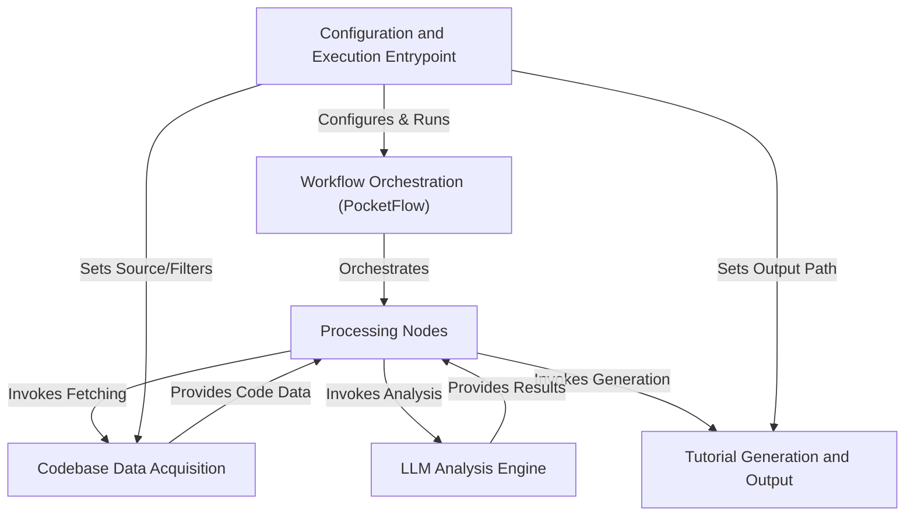

# Tutorial: PocketFlow-Tutorial-Codebase-Knowledge

This project leverages the **PocketFlow** micro-framework (*Abstraction 0*) to orchestrate a series of *Processing Nodes* (*Abstraction 1*).
It automatically analyzes source codebases, acquired via *Codebase Data Acquisition* (*Abstraction 2*), using an *LLM Analysis Engine* (*Abstraction 3*).
The workflow, initiated by the *Configuration and Execution Entrypoint* (*Abstraction 4*), identifies abstractions, analyzes relationships, determines chapter order, writes content, and finally generates a structured tutorial via *Tutorial Generation and Output* (*Abstraction 5*).

**Source Repository:** [https://github.com/The-Pocket/PocketFlow-Tutorial-Codebase-Knowledge](https://github.com/The-Pocket/PocketFlow-Tutorial-Codebase-Knowledge)

## Chapters

1. [Configuration and Execution Entrypoint](01_configuration_and_execution_entrypoint_.md)
2. [Codebase Data Acquisition](02_codebase_data_acquisition_.md)
3. [Tutorial Generation and Output](03_tutorial_generation_and_output_.md)
4. [LLM Analysis Engine](04_llm_analysis_engine_.md)
5. [Workflow Orchestration (PocketFlow)](05_workflow_orchestration__pocketflow__.md)
6. [Processing Nodes](06_processing_nodes_.md)

---

Generated by fork of [AI Codebase Knowledge Builder](https://github.com/vegeta03/PocketFlow-Tutorial-Codebase-Knowledge.git)
