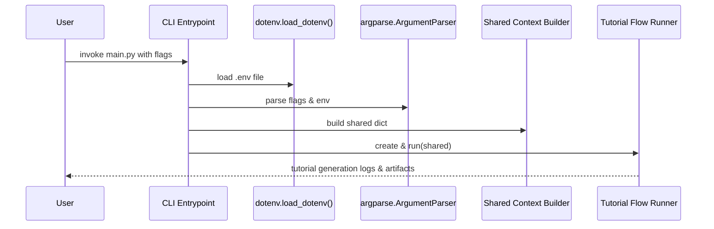

# Chapter 1: Command-Line Interface (CLI) Entrypoint

In this chapter we introduce the user-facing gateway to our tutorial-generation pipeline: the Command-Line Interface (CLI) Entrypoint. Think of it as the “compiler front-end” that lexes and parses raw flags, loads environment variables, validates inputs, and produces a clean, structured context for the rest of the system. By the end of this chapter you’ll know how to invoke `main.py`, how arguments flow through `argparse` and `dotenv`, and how a shared context dictionary is born—ready to be consumed by downstream nodes like those in [Shared Execution Context](02_shared_execution_context_.md) or [Tutorial Flow Orchestrator](03_tutorial_flow_orchestrator_.md).

---

## 1.1 Motivation: Why a CLI Entrypoint?

### Central Use Case

A developer wants to generate a guided tutorial for a codebase—either on GitHub or on the local filesystem—without touching Python code. They need:

- A single command they can paste into CI/CD or a shell script.
- Flexibility to choose include/exclude patterns or maximum file size.
- Support for environment-based secrets (GitHub tokens).
- Clear error messages for missing or conflicting options.

**Problem**  
Without a dedicated CLI abstraction, every script modification or new flag would require edits deep in pipeline code. Tests would break, automation would be flaky, and onboarding new users would become painful.

**Solution**  
Isolate argument parsing, validation, and context initialization in `main.py`. Export a clean dictionary. Keep core logic in the flow and nodes—untouched by CLI concerns.

---

## 1.2 Key Concepts

1. **Flag Parsing (`argparse`)**  
   Define required and optional flags, mutually-exclusive groups, default values, and help strings.

2. **Environment Loading (`dotenv`)**  
   Read `.env` files to hydrate environment variables before flag resolution.

3. **Validation & Warnings**  
   Ensure either `--repo` or `--dir` is provided, warn if GitHub tokens may be missing.

4. **Shared Context Dictionary**  
   Consolidate all inputs—flags, patterns, token, language—into one `shared` dict. Downstream nodes read and augment this dictionary.

5. **Flow Invocation**  
   Instantiate and run the tutorial flow pipeline using the sanitized `shared` context.

---

## 1.3 Using the CLI Entrypoint

### 1.3.1 Invoking `main.py`

```bash
# Generate a tutorial from a GitHub repo, custom output directory, Spanish language
python main.py \
  --repo https://github.com/example/my-project.git \
  --output tutorial_output \
  --language spanish
```

**What happens?**  

1. `.env` is loaded.  
2. Flags are parsed: `repo_url`, `output_dir`, `language`.  
3. No `--token`? It falls back to `GITHUB_TOKEN` from the environment and prints a warning if missing.  
4. A `shared` dict is built and passed into `tutorial_flow.run(shared)`.  
5. You’ll see:

   ```plaintext
   Warning: No GitHub token provided. You might hit rate limits for public repositories.
   Starting tutorial generation for: https://github.com/example/my-project.git in Spanish language
   ```

### 1.3.2 Local Directory Example

```bash
python main.py --dir ./local-code --name "MyLocalProj"
```

- The script will skip GitHub-token logic.  
- `project_name` defaults to `"MyLocalProj"`.  
- It uses default include/exclude patterns and max size.

---

## 1.4 Internal Workflow Walkthrough

Below is a simplified, non-code sequence of events when you run `python main.py --repo ...`.



---

## 1.5 Implementation Deep Dive

All code lives in `main.py`. We break it down into four parts.

### 1.5.1 Loading Environment Variables

```python
# main.py (top)
import dotenv
dotenv.load_dotenv()  # Reads .env and populates os.environ
import os
```

> Explanation: Before any flags are parsed, `dotenv.load_dotenv()` ensures environment variables (e.g. `GITHUB_TOKEN`) are available for fallback.

---

### 1.5.2 Parsing Flags with argparse

```python
import argparse

def build_parser():
    parser = argparse.ArgumentParser(
        description="Generate a tutorial for a GitHub codebase or local directory."
    )

    # Mutually exclusive source: repo vs. dir
    source_group = parser.add_mutually_exclusive_group(required=True)
    source_group.add_argument(
        "--repo", help="URL of the public GitHub repository."
    )
    source_group.add_argument(
        "--dir", help="Path to local directory."
    )

    parser.add_argument("-n", "--name", help="Project name (optional).")
    parser.add_argument(
        "-t", "--token",
        help="GitHub personal access token (optional)."
    )
    parser.add_argument(
        "-o", "--output",
        default="output",
        help="Base directory for output (default: ./output)."
    )
    parser.add_argument(
        "-i", "--include",
        nargs="+",
        help="Include file patterns. Defaults to common code files."
    )
    parser.add_argument(
        "-e", "--exclude",
        nargs="+",
        help="Exclude patterns. Defaults to tests/build dirs."
    )
    parser.add_argument(
        "-s", "--max-size",
        type=int,
        default=100000,
        help="Maximum file size in bytes (default: 100000)."
    )
    parser.add_argument(
        "--language",
        default="english",
        help="Language for the generated tutorial (default: english)."
    )
    return parser
```

> Explanation:  
>
> - A required, mutually-exclusive group enforces exactly one of `--repo` or `--dir`.  
> - Default patterns and max size help users avoid verbose flag lists.  
> - The `--language` flag allows future i18n support.

---

### 1.5.3 Context Initialization & Validation

```python
def build_context(args):
    # Determine GitHub token if repo source is used
    github_token = None
    if args.repo:
        github_token = args.token or os.environ.get("GITHUB_TOKEN")
        if not github_token:
            print("Warning: No GitHub token provided. You might hit rate limits.")

    # Consolidate everything into a shared dictionary
    shared = {
        "repo_url": args.repo,
        "local_dir": args.dir,
        "project_name": args.name,
        "github_token": github_token,
        "output_dir": args.output,
        "include_patterns": set(args.include) if args.include else DEFAULT_INCLUDE_PATTERNS,
        "exclude_patterns": set(args.exclude) if args.exclude else DEFAULT_EXCLUDE_PATTERNS,
        "max_file_size": args.max_size,
        "language": args.language,
        # placeholders for pipeline outputs
        "files": [], "abstractions": [], "relationships": {},
        "chapter_order": [], "chapters": [], "final_output_dir": None,
    }
    print(f"Starting tutorial generation for: {args.repo or args.dir} in {args.language.capitalize()} language")
    return shared
```

> Explanation:  
>
> - We merge flags, defaults, and environment variables.  
> - The shared dict will be mutated by downstream nodes (e.g. [File Fetcher Abstraction](04_file_fetcher_abstraction_.md), [LLM Interface](05_llm_interface_.md)).

---

### 1.5.4 Invoking the Tutorial Flow

```python
from flow import create_tutorial_flow

def main():
    parser = build_parser()
    args = parser.parse_args()
    shared = build_context(args)

    tutorial_flow = create_tutorial_flow()
    tutorial_flow.run(shared)

if __name__ == "__main__":
    main()
```

> Explanation:  
>
> - We separate parser construction, context building, and flow execution for clarity and testability.  
> - `create_tutorial_flow()` is defined in [Tutorial Flow Orchestrator](03_tutorial_flow_orchestrator_.md).

---

## 1.6 Conclusion & Next Steps

In this chapter we’ve:

- Motivated the need for a robust CLI entrypoint.  
- Explored how `argparse` and `dotenv` combine to parse, validate, and warn.  
- Walked through building the `shared` context dictionary.  
- Seen how the CLI spins up and hands off control to the tutorial flow.

Next, we’ll examine how that `shared` dictionary is consumed and enriched by the [Shared Execution Context](02_shared_execution_context_.md) abstraction—setting the stage for a fully orchestrated pipeline. Enjoy!

---

Generated by fork of [AI Codebase Knowledge Builder](https://github.com/vegeta03/PocketFlow-Tutorial-Codebase-Knowledge.git)
