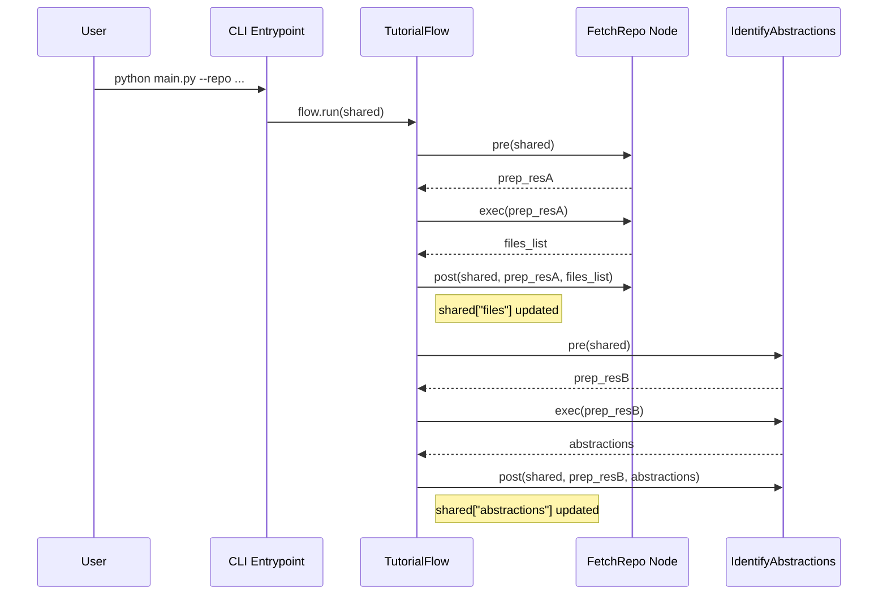

# Chapter 2: Shared Execution Context

In [Chapter 1: Command-Line Interface (CLI) Entrypoint](01_command_line_interface__cli__entrypoint_.md) we saw how flags, environment variables, and defaults are parsed into a single `shared` dictionary. In this chapter, we’ll dive into how that mutable dictionary—our **Shared Execution Context**—travels through every Node in the pipeline, decoupling components, simplifying data flow, and enabling robust error tracing.

---

## 2.1 Motivation: Why a Shared Execution Context?

Imagine a blackboard in a researcher’s lab. Each specialist adds notes, sketches intermediate results, or reads what others have posted. In our pipeline:

- **Config data** (repo URL, include/exclude filters, tokens)  
- **Intermediate artifacts** (file lists, abstractions, relationship graphs, chapter order)  
- **Final outputs** (generated Markdown, output paths)  

all live in one in‐memory store. This solves:

1. **Loose coupling**  
   Nodes neither import nor depend on each other directly—they only read/write keys in `shared`.  
2. **Transparent data flow**  
   You can snapshot or log `shared` at any point to inspect pipeline state.  
3. **Error tracing**  
   When a Node fails, its inputs are a slice of `shared`—replayable for debugging.

---

## 2.2 Core Concepts

1. **Dictionary as Blackboard**  
   A `MutableMapping[str, Any]` where keys represent named pieces of information.
2. **Key‐Value Contracts**  
   Each Node documents which input keys it consumes and which output keys it writes.
3. **Lifecycle: pre → exec → post**  
   - **pre(shared)**: read config, decide parameters  
   - **exec(pre_res)**: perform the work  
   - **post(shared, pre_res, exec_res)**: write results back to `shared`  

---

## 2.3 Sequence Diagram: Context in Flight



---

## 2.4 Usage Example: Two Simple Nodes

```python
# nodes/shared_example.py

class NodeA:
    def pre(self, shared):
        # Read config keys
        return {
            "repo": shared["repo_url"],
            "patterns": shared["include_patterns"]
        }

    def exec(self, params):
        # Fetch files per patterns... returns list of (path, content)
        return fetch_files(params["repo"], params["patterns"])

    def post(self, shared, prep, files):
        # Write into shared context
        shared["files"] = files


class NodeB:
    def pre(self, shared):
        # Read the files list written by NodeA
        return {"files": shared["files"]}

    def exec(self, prep):
        # Analyze files, extract simple stats
        return {"file_count": len(prep["files"])}

    def post(self, shared, prep, stats):
        shared["stats"] = stats
```

After running NodeA and NodeB in sequence, `shared` contains at least these keys:

```python
{
  "repo_url": "...",
  "include_patterns": {...},
  "files": [(path1, content1), ...],
  "stats": {"file_count": 42},
  # ... other keys
}
```

---

## 2.5 Implementation Walkthrough

### 2.5.1 The Flow Runner (flow.py)

```python
# flow.py

from typing import MutableMapping, Any, List
from pocketflow import Node

class TutorialFlow:
    def __init__(self, nodes: List[Node]):
        self.nodes = nodes

    def run(self, shared: MutableMapping[str, Any]):
        for node in self.nodes:
            # 1. Prepare parameters from shared context
            prep_res = node.pre(shared)

            # 2. Execute main logic
            exec_res = node.exec(prep_res)

            # 3. Write results back into shared context
            node.post(shared, prep_res, exec_res)
```

- `shared` is a plain Python dict passed by reference.
- Each Node documents its input and output keys, but never mutates the dict except in `post`.

### 2.5.2 Node Base Class (pocketflow)

```python
# pocketflow/node.py

from abc import ABC, abstractmethod
from typing import Any, MutableMapping

class Node(ABC):
    @abstractmethod
    def pre(self, shared: MutableMapping[str, Any]) -> Any:
        pass

    @abstractmethod
    def exec(self, prep_res: Any) -> Any:
        pass

    @abstractmethod
    def post(self, shared: MutableMapping[str, Any],
             prep_res: Any, exec_res: Any) -> None:
        pass
```

---

## 2.6 Internal Mechanics & Error Tracing

- **Snapshotting**  
  Insert `logger.debug(json.dumps(shared, indent=2))` at any point in `run()` to capture full pipeline state.
- **Loose‐Coupled Testing**  
  You can unit‐test a Node in isolation by providing a minimal `shared` dict with expected keys.
- **Visualization**  
  Export the sequence of keys written by each Node to auto‐generate a data‐flow graph.

---

## 2.7 Analogy: Message Bus in Microservices

A message bus carries structured events; each microservice subscribes to certain event types and publishes new ones. Our `shared` dict is that bus:

- **Publish**: NodeA posts `files`  
- **Subscribe**: NodeB pre-reads `files`  
- **No direct imports or circular dependencies**  

This blackboard pattern scales when you add or reorder Nodes, and it clarifies “who produces what” at a glance.

---

## 2.8 Conclusion & Next Steps

You have now seen how the **Shared Execution Context** underpins every step of our tutorial‐generation pipeline. It is the backbone that carries configuration, intermediate artifacts, and final outputs, enabling:

- Decoupled, testable Nodes  
- Clear data‐flow visualization  
- Robust error tracing via snapshots  

In the next chapter, we’ll examine how to assemble these Nodes into a cohesive sequence using the **[Tutorial Flow Orchestrator](03_tutorial_flow_orchestrator_.md)**, defining the exact order of operations and handling retries, parallelism, or other orchestration concerns.

---

Generated by fork of [AI Codebase Knowledge Builder](https://github.com/vegeta03/PocketFlow-Tutorial-Codebase-Knowledge.git)
