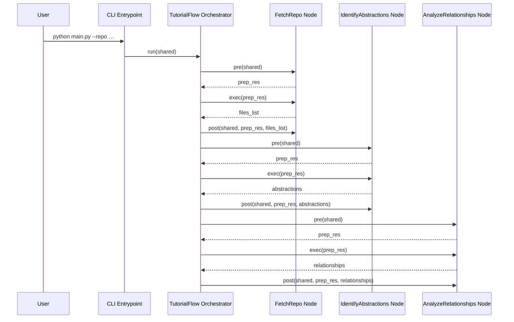
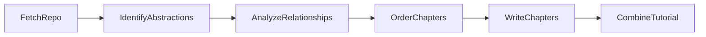

# Chapter 3: Tutorial Flow Orchestrator

In [Chapter 2: Shared Execution Context](02_shared_execution_context_.md) we saw how a mutable `shared` dictionary carries configuration, intermediate artifacts, and final outputs through each Node. Now we introduce the **Tutorial Flow Orchestrator**—the central scheduler that:

- Instantiates each Node (e.g. `FetchRepo`, `IdentifyAbstractions`, …)
- Wires them into a **directed acyclic graph (DAG)**
- Executes them in topological order with retry/failure policies
- Streams the same `shared` context through every stage

---

## 3.1 Motivation: Why a Flow Orchestrator?

### Central Use Case

A senior engineer wants to generate a polished tutorial by running a single command:

```bash
python main.py \
  --repo https://github.com/example/my-project.git \
  --output tutorial_output
```

Under the hood the system must:

1. Fetch and filter code files  
2. Identify core abstractions (via LLM)  
3. Analyze relationships between abstractions  
4. Determine the chapter sequence  
5. Write each chapter in Markdown  
6. Combine chapters into a final tutorial  

**Without** a dedicated orchestrator, wiring these steps:

- Leads to brittle, ad-hoc scripts  
- Makes centralized error handling or retries almost impossible  
- Obscures end-to-end data flow  

**With** the Tutorial Flow Orchestrator, we treat each step as a **Node** in a pipeline—analogous to microservices orchestrated by a cloud scheduler, or stages in a data-engineering ETL pipeline. Data “tokens” (our `shared` dict) flow through a predetermined DAG of transformations, ensuring modularity, maintainability, and reproducibility.

---

## 3.2 Key Concepts

1. **Directed Acyclic Graph (DAG)**  
   Each Node is a vertex; edges define execution order.  
2. **Node Instantiation & Configuration**  
   Nodes accept parameters like `max_retries` and `wait` to govern failure policies.  
3. **Operator Overloading (`>>`)**  
   We overload `Node.__rshift__` to chain one Node into the next.  
4. **Flow Runner**  
   A `Flow` class performs a topological sort of the DAG and invokes each Node’s  
   `pre → exec → post` lifecycle.  
5. **Retry & Failure Policies**  
   Each Node may declare how many times to retry on error; the orchestrator enforces it.

---

## 3.3 Assembling the Tutorial Flow

The core assembly logic lives in **`flow.py`**. Here’s the complete function that builds our orchestrator:

```python
# flow.py

from pocketflow import Flow
from nodes import (
    FetchRepo,
    IdentifyAbstractions,
    AnalyzeRelationships,
    OrderChapters,
    WriteChapters,
    CombineTutorial
)

def create_tutorial_flow():
    # 1. Instantiate nodes with optional retry parameters
    fetch_repo            = FetchRepo()
    identify_abstractions = IdentifyAbstractions(max_retries=5, wait=20)
    analyze_relationships = AnalyzeRelationships(max_retries=5, wait=20)
    order_chapters        = OrderChapters(max_retries=5, wait=20)
    write_chapters        = WriteChapters(max_retries=5, wait=20)   # BatchNode
    combine_tutorial      = CombineTutorial()

    # 2. Connect them into a linear DAG
    fetch_repo >> identify_abstractions
    identify_abstractions >> analyze_relationships
    analyze_relationships >> order_chapters
    order_chapters >> write_chapters
    write_chapters >> combine_tutorial

    # 3. Create and return the Flow starting from the first Node
    return Flow(start=fetch_repo)
```

**Explanation**  

- We import each Node class from `nodes.py`.  
- Retry parameters (`max_retries`, `wait`) are passed to Node constructors.  
- The `>>` operator (overloaded on `Node`) establishes downstream links.  
- `Flow(start=…)` captures this DAG and returns a runnable orchestrator.

---

## 3.4 Execution Sequence: Step-by-Step

When you call:

```python
tutorial_flow = create_tutorial_flow()
tutorial_flow.run(shared)
```

the orchestrator:

1. Discovers all reachable Nodes via a DFS on `.downstream` links  
2. Topologically sorts them so upstream Nodes run before downstream ones  
3. Executes each Node in turn, handling retries  

Below is a **Mermaid sequence diagram** for the first three Nodes:



Each Node follows the **`pre → exec → post`** lifecycle:

- `pre(shared)`: read inputs from `shared`  
- `exec(prep_res)`: perform core logic (e.g. LLM calls)  
- `post(shared, …)`: write results back into `shared`

This repeats through `OrderChapters`, `WriteChapters`, and finally `CombineTutorial`.

---

## 3.5 DAG Visualization

For a high-level view, here’s the **flowchart** of our orchestrator:



This DAG shows the one-to-one progression of pipeline stages.

---

## 3.6 Operator Overloading & Topological Sort

### 3.6.1 Linking Nodes with `>>`

```python
# pocketflow/node.py

class Node:
    def __init__(self):
        self.upstream = []
        self.downstream = []

    def __rshift__(self, other: 'Node'):
        # Create a directed edge: self → other
        self.downstream.append(other)
        other.upstream.append(self)
        return other
```

- Using `node_a >> node_b` adds `node_b` as a downstream consumer of `node_a`.

### 3.6.2 Building Execution Order

```python
# pocketflow/flow.py

class Flow:
    def __init__(self, start: Node):
        # Discover and order nodes
        self.nodes = self._collect(start)

    def _collect(self, start: Node):
        visited = set()
        order   = []

        def dfs(node):
            if node in visited:
                return
            visited.add(node)
            for child in node.downstream:
                dfs(child)
            order.append(node)

        dfs(start)
        # Reverse so that upstream nodes run before downstream
        return list(reversed(order))

    def run(self, shared):
        for node in self.nodes:
            attempts = 0
            while True:
                try:
                    prep_res = node.pre(shared)
                    exec_res = node.exec(prep_res)
                    node.post(shared, prep_res, exec_res)
                    break
                except Exception as e:
                    attempts += 1
                    if attempts > getattr(node, "max_retries", 0):
                        raise
                    time.sleep(getattr(node, "wait", 1))
```

- `_collect` performs a DFS to gather all reachable Nodes and then reverses them for correct order.  
- `run` wraps each Node’s logic in a retry loop based on `max_retries` and `wait`.

---

## Conclusion & Next Steps

In this chapter we’ve:

- Motivated the need for a **central scheduler** to chain and run modular Nodes  
- Shown how to **instantiate**, **wire**, and **run** each Node using a **DAG** abstraction  
- Explored operator overloading (`>>`), topological sort, retry logic, and execution lifecycle  
- Visualized the pipeline with **Mermaid** sequence and flowchart diagrams  

With the orchestrator in place, every Node can focus on its core task—decoupled from execution concerns. Next up: dive into the first processing Node, the **[File Fetcher Abstraction](04_file_fetcher_abstraction_.md)**, which retrieves and filters your code files to kick off the tutorial generation.

---

Generated by fork of [AI Codebase Knowledge Builder](https://github.com/vegeta03/PocketFlow-Tutorial-Codebase-Knowledge.git)
