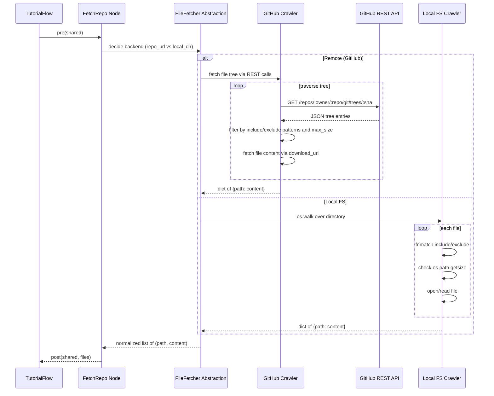

# Chapter 4: File Fetcher Abstraction

In [Chapter 3: Tutorial Flow Orchestrator](03_tutorial_flow_orchestrator_.md) we wired up a sequence of Nodes into a DAG and discovered how `shared` context flows through each stage. Now we kick off the core work with the **File Fetcher Abstraction**—the component that “mounts” a codebase, whether on GitHub or on disk, and presents every source file as a uniform list of `(path, content)` tuples for downstream Nodes.

## 4.1 Motivation: Why a File Fetcher Abstraction?

Imagine you’re building tooling that must analyze code hosted on GitHub or on your local machine. Without an abstraction:

- You’d have two disjoint implementations—one cloning or walking a repo, another scanning the filesystem.
- Downstream logic (LLM prompts, analyses) would have to handle two different data shapes.
- Maintenance and testing would balloon.

**Solution**: Encapsulate both remote and local crawling behind a single Node, `FetchRepo`. Internally it chooses:

1. **GitHub crawler** (REST API, tree traversal, pattern‐matching, size checks)
2. **Local crawler** (os.walk, fnmatch, size filters)

The caller always gets back the same type:  

```python
List[Tuple[str /*relative path*/, str /*file content*/]]
```

Conceptually, this is a **virtual file‐system driver** for your pipeline—unifying disparate storage backends into one logical view.

---

## 4.2 Central Use Case

A user runs:

```bash
python main.py --repo https://github.com/example/my-project.git \
               --include "*.py" "*.md" \
               --exclude "tests/*" \
               --max-size 200000
```

Under the hood:

1. `FetchRepo.pre(shared)` reads `shared["repo_url"]`, `shared["local_dir"]`, include/exclude patterns, and size limit.
2. `FetchRepo.exec(...)` dispatches to either `crawl_github_files(...)` or `crawl_local_files(...)`.
3. The result is normalized to a list of `(path, content)`.
4. `FetchRepo.post(...)` writes `shared["files"]`.

Downstream Nodes (IdentifyAbstractions, AnalyzeRelationships, etc.) never care where the files came from.

---

## 4.3 How to Use the FetchRepo Node

Here’s a simplified excerpt showing how `FetchRepo` fits into the Node lifecycle:

```python
from pocketflow import Node
from utils.crawl_github_files import crawl_github_files
from utils.crawl_local_files import crawl_local_files

class FetchRepo(Node):
    def prep(self, shared):
        return {
            "repo_url":   shared.get("repo_url"),
            "local_dir":  shared.get("local_dir"),
            "token":      shared.get("github_token"),
            "include":    shared["include_patterns"],
            "exclude":    shared["exclude_patterns"],
            "max_size":   shared["max_file_size"],
            "use_relative_paths": True
        }

    def exec(self, params):
        if params["repo_url"]:
            files_map = crawl_github_files(
                repo_url=params["repo_url"],
                token=params["token"],
                include_patterns=params["include"],
                exclude_patterns=params["exclude"],
                max_file_size=params["max_size"],
                use_relative_paths=params["use_relative_paths"]
            )["files"]
        else:
            files_map = crawl_local_files(
                directory=params["local_dir"],
                include_patterns=params["include"],
                exclude_patterns=params["exclude"],
                max_file_size=params["max_size"],
                use_relative_paths=params["use_relative_paths"]
            )["files"]

        files_list = list(files_map.items())
        if not files_list:
            raise ValueError("No files fetched by File Fetcher")
        return files_list

    def post(self, shared, prep_res, exec_res):
        shared["files"] = exec_res
```

**Input to Node**  
A dictionary of parameters derived from `shared`.  
**Output from Node**  
A list of `(relative_path, content)` tuples stored back into `shared["files"]`.

---

## 4.4 Runtime Sequence: What Happens Under the Hood

Below is a simplified **Mermaid sequence diagram** illustrating the decision path and sub‐component calls. We show a single path for GitHub crawling; the local crawler path is analogous.



This diagram shows how `FetchRepo` never deals with HTTP or filesystem details directly. It delegates to the right crawler, then flattens the result.

---

## 4.5 Internal Implementation Walkthrough

### 4.5.1 GitHub Crawler (utils/crawl_github_files.py)

#### A. Pattern Filtering Helper

```python
def should_include(file_path: str, patterns: Set[str], exclude: Set[str]) -> bool:
    # Include if it matches at least one include pattern
    include = any(fnmatch.fnmatch(file_path, pat) for pat in patterns) if patterns else True
    # Exclude if it matches any exclude pattern
    exclude_match = any(fnmatch.fnmatch(file_path, pat) for pat in exclude)
    return include and not exclude_match
```

#### B. Tree Traversal + Download

```python
def fetch_contents(path: str):
    url = f"https://api.github.com/repos/{owner}/{repo}/contents/{path}"
    resp = requests.get(url, headers=headers)
    items = resp.json() if resp.status_code == 200 else []
    for item in items:
        if item["type"] == "dir":
            yield from fetch_contents(item["path"])
        elif item["type"] == "file":
            rel_path = item["path"]
            size = item.get("size", 0)
            if size <= max_file_size and should_include(rel_path, include_patterns, exclude_patterns):
                download_url = item["download_url"]
                content = requests.get(download_url, headers=headers).text
                yield rel_path, content
```

This generator recurses the GitHub tree, applies size and pattern filters, and streams file contents.

### 4.5.2 Local Filesystem Crawler (utils/crawl_local_files.py)

```python
def crawl_local_files(directory, include_patterns, exclude_patterns, max_file_size, use_relative_paths):
    for root, _, files in os.walk(directory):
        for name in files:
            abs_path = os.path.join(root, name)
            rel_path = os.path.relpath(abs_path, directory) if use_relative_paths else abs_path

            if not should_include(rel_path, include_patterns, exclude_patterns):
                continue
            if os.path.getsize(abs_path) > max_file_size:
                continue

            with open(abs_path, 'r', encoding='utf-8') as f:
                content = f.read()
            yield rel_path, content
```

This iterator mirrors the GitHub crawler’s filtering logic but on the local disk.

---

## 4.6 Example: Customizing Fetch Parameters

Suppose you only want `.js` and `.css` files under 50 KB from a GitHub repo:

```bash
python main.py \
  --repo https://github.com/example/site.git \
  --include "*.js" "*.css" \
  --exclude "test/*" \
  --max-size 50000
```

Internally, `shared` will contain:

```python
shared["include_patterns"] = {"*.js", "*.css"}
shared["exclude_patterns"] = {"test/*"}
shared["max_file_size"]   = 50000
```

`FetchRepo` reads those, invokes the GitHub crawler, and you get back `shared["files"]` ready for abstraction extraction.

---

## 4.7 Analogy: Mounting a Filesystem

The File Fetcher is like a **virtual filesystem driver** in an OS:

- **Mount point**: your GitHub URL or local path  
- **Driver logic**: chooses network vs disk traversal  
- **Uniform API**: downstream code always sees a sequence of `(path, content)`  

No consumer ever has to call `requests` or `os.walk`—it’s all behind a uniform façade.

---

## 4.8 Conclusion & Next Steps

You’ve now seen how the **File Fetcher Abstraction** unifies remote and local code access into one coherent data structure. This foundation lets every downstream Node—[LLM Interface](05_llm_interface_.md), Abstraction Extraction, Relationship Analysis, and beyond—operate on a consistent file list, regardless of source.

Next up, we’ll explore how those raw files are presented to the LLM in the **[LLM Interface](05_llm_interface_.md)**, transforming code snippets into rich, context‐aware prompts. Stay tuned!

---

Generated by fork of [AI Codebase Knowledge Builder](https://github.com/vegeta03/PocketFlow-Tutorial-Codebase-Knowledge.git)
