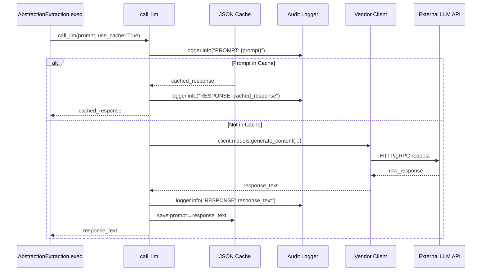

# Chapter 5: LLM Interface

In [Chapter 4: File Fetcher Abstraction](04_file_fetcher_abstraction_.md) we unified disk and GitHub crawling into a list of `(path, content)` tuples. Now it’s time to turn those raw snippets into rich semantic data by querying Large Language Models (LLMs). The **LLM Interface** encapsulates every detail of talking to vendor APIs—caching, logging, retries, authentication and client configuration—so that the rest of our pipeline can treat an LLM as a black‐box function `prompt → response`.

---

## 5.1 Motivation & Central Use Case

Imagine you’ve just fetched 50 small Python files and you need to extract the public API surface or summarize each file’s responsibilities. Naively:

- You’d write one block of code per vendor (OpenAI, Anthropic, Google Gemini).  
- You’d litter every Node with `requests`, `openai` or `anthropic` imports.  
- Caching, logging and retry logic would be duplicated, making auditability and rate‐limit handling a nightmare.

**Enter the LLM Interface abstraction**, implemented in `utils/call_llm.py`. It behaves like an RPC stub or microservice client:

- Transforms a high‐level `prompt: str` into a network call.  
- Logs **every** prompt and response for auditing.  
- Implements simple JSON caching to skip duplicate queries.  
- Handles authentication (API keys, env vars) and retry on rate limits.  
- Lets callers swap vendors with zero downstream change.

**Concrete Example:**  
You have a function’s source code in a string and want a JSON list of its parameters and return type. You call:

```python
from utils.call_llm import call_llm

prompt = f"Analyze this function and return JSON schema:\n\n{function_source}"
schema_json = call_llm(prompt)
```

—regardless of whether you’re using Gemini, Claude, or OpenAI under the hood.

---

## 5.2 Core Concepts

1. **Vendor Clients**  
   The call‐site needn’t know which LLM powers the query. Environment variables (`GEMINI_*`, `OPENAI_API_KEY`, `ANTHROPIC_API_KEY`) select and configure the correct client.

2. **Audit Logging**  
   Every `PROMPT:` and `RESPONSE:` is written to a daily rotating log file under `logs/llm_calls_YYYYMMDD.log`. You can trace who asked what, when, and got which answer.

3. **JSON‐Based Caching**  
   Prompts and responses are cached in a local `llm_cache.json`. Duplicate prompts return immediately, saving cost and latency.

4. **Authentication & Retry**  
   API keys come from `.env` or environment. On rate‐limit or transient failures, the function can back off and retry (configurable per vendor).

5. **Decoupling**  
   Callers treat `call_llm(prompt)` as a pure function. They never import vendor SDKs or manage tokens, logging or error handling—that’s all inside the utility.

---

## 5.3 Using the LLM Interface

Below is how a typical Node in our pipeline invokes the LLM Interface. In this example, an **AbstractionExtraction** Node asks the LLM to identify “core abstractions” within a file’s content.

```python
# nodes/abstraction_extraction.py
from pocketflow.node import Node
from utils.call_llm import call_llm  # our LLM Interface

class AbstractionExtraction(Node):
    def pre(self, shared):
        # read the list of files fetched earlier
        return {"files": shared["files"], "use_cache": True}

    def exec(self, params):
        abstractions = []
        for path, content in params["files"]:
            prompt = (
                f"Extract the top-level abstractions (classes, functions, modules) "
                f"from the following Python file `{path}`. "
                f"Return a JSON list of objects with name, type, and description.\n\n"
                f"{content}"
            )
            response = call_llm(prompt, use_cache=params["use_cache"])
            abstractions.append({"path": path, "response": response})
        return abstractions

    def post(self, shared, prep, exec_res):
        shared["abstractions"] = exec_res
```

Explanation:

- We never worry about which vendor’s SDK we imported.  
- We pass `use_cache` from the shared context to enable/disable JSON caching.  
- Each prompt/response pair is automatically logged for audit.

---

## 5.4 LLM Call Lifecycle: Sequence Diagram

Here’s what happens when a Node calls `call_llm(prompt)`:



1. **Log the prompt**  
2. **Look up** in local JSON cache  
3. **If cached**, return immediately (and re‐log)  
4. **Else**, instantiate the correct vendor client  
5. **Perform** the network call  
6. **Log** the response, **persist** to cache, and **return**  

---

## 5.5 Internal Implementation Walkthrough (`utils/call_llm.py`)

Below is the core of our LLM Interface. We break it into sections for clarity.

### 5.5.1 Logging Configuration

```python
# utils/call_llm.py (top)
import os, json, logging
from datetime import datetime

# Set up a daily log file for all LLM calls
log_dir = os.getenv("LOG_DIR", "logs")
os.makedirs(log_dir, exist_ok=True)
log_file = os.path.join(log_dir, f"llm_calls_{datetime.now():%Y%m%d}.log")

logger = logging.getLogger("llm_logger")
logger.setLevel(logging.INFO)
# Prevent double-logs if root logger is configured
logger.propagate = False  

file_handler = logging.FileHandler(log_file)
file_handler.setFormatter(logging.Formatter('%(asctime)s - %(levelname)s - %(message)s'))
logger.addHandler(file_handler)
```

- We create `logs/llm_calls_YYYYMMDD.log`.  
- Every prompt and response is logged with timestamp and level.

### 5.5.2 JSON Cache Setup

```python
cache_file = "llm_cache.json"

def _load_cache():
    if not os.path.exists(cache_file):
        return {}
    try:
        with open(cache_file, 'r') as f:
            return json.load(f)
    except Exception:
        logger.warning("Failed to load LLm cache, starting fresh")
        return {}

def _save_cache(cache: dict):
    try:
        with open(cache_file, 'w') as f:
            json.dump(cache, f)
    except Exception as e:
        logger.error(f"Failed to save LLM cache: {e}")
```

- We keep a simple prompt→response map in `llm_cache.json`.  
- Corrupted files are handled by resetting to an empty dict.

### 5.5.3 Core `call_llm` Function

```python
from google import genai  # default vendor client
import time

def call_llm(prompt: str, use_cache: bool = True) -> str:
    # 1. Audit-log the prompt
    logger.info(f"PROMPT: {prompt}")

    # 2. Check JSON cache
    if use_cache:
        cache = _load_cache()
        if prompt in cache:
            response = cache[prompt]
            logger.info(f"RESPONSE (cached): {response}")
            return response

    # 3. Instantiate the vendor client (default: Google Gemini)
    client = genai.Client(
        vertexai=True,
        project=os.getenv("GEMINI_PROJECT_ID", "your-project-id"),
        location=os.getenv("GEMINI_LOCATION", "us-central1")
    )
    model = os.getenv("GEMINI_MODEL", "gemini-2.5-pro")
    
    # 4. Perform the API call
    try:
        resp = client.models.generate_content(model=model, contents=[prompt])
        response_text = resp.text
    except Exception as e:
        # Simple retry logic on failure
        logger.warning(f"LLM call failed: {e}, retrying in 5s")
        time.sleep(5)
        resp = client.models.generate_content(model=model, contents=[prompt])
        response_text = resp.text

    # 5. Audit-log and cache the response
    logger.info(f"RESPONSE: {response_text}")
    if use_cache:
        cache = _load_cache()
        cache[prompt] = response_text
        _save_cache(cache)

    return response_text
```

1. **Log** the prompt  
2. **Load** and **check** cache  
3. **Configure** and **instantiate** the chosen LLM client  
4. **Call** the API, with a simple retry on exception  
5. **Log** & **persist** the response, then **return**

---

## 5.6 Vendor Switching & Extensions

The file also contains alternate implementations commented out:

- **Anthropic Claude**  
- **OpenAI o1**

Just uncomment and swap out the default `call_llm` body:

```python
# # Example: Anthropic Claude
# from anthropic import Anthropic
# def call_llm(prompt, use_cache=True):
#     client = Anthropic(api_key=os.getenv("ANTHROPIC_API_KEY"))
#     response = client.messages.create(
#         model="claude-3-7-sonnet-20250219",
#         messages=[{"role": "user", "content": prompt}]
#     )
#     return response.content[1].text
```

This design isolates vendor‐specific logic in one file. Downstream Nodes need never change.

---

## 5.7 Analogy: Messaging Broker

Think of the **LLM Interface** as a **message broker** between your pipeline and external inference engines:

- **Producer**: a Node publishes a “prompt” message.  
- **Broker**: handles delivery, retries, authentication, logging, optional de‐duplication (caching).  
- **Consumer**: the LLM service processes and returns a “response” message.  
- **Subscriber**: your Node receives the response, oblivious to vendor or protocol.

This decoupling means you can swap out brokers (vendors), replay messages (cached prompts), or inspect the log as an audit trail—without touching your pipeline logic.

---

## 5.8 Conclusion & Next Steps

We’ve now seen how the **LLM Interface** abstracts away every vendor‐specific concern, offering a simple `call_llm(prompt)` function with built-in logging, caching, authentication, and retry logic. All you need in your Nodes is:

- A human‐readable prompt  
- A flag to enable/disable caching  
- A call to `call_llm`  

In the next chapter, we’ll leverage this interface in the **[Abstraction Extraction Node](06_abstraction_extraction_node_.md)** to harvest meaningful abstractions from your codebase.

---

Generated by fork of [AI Codebase Knowledge Builder](https://github.com/vegeta03/PocketFlow-Tutorial-Codebase-Knowledge.git)
