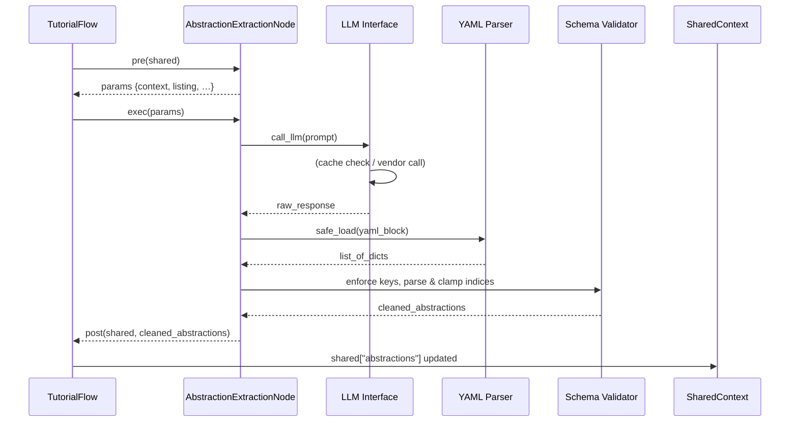

# Chapter 6: Abstraction Extraction Node

In [Chapter 5: LLM Interface](05_llm_interface_.md) we learned how to treat an LLM call as a black-box RPC with built-in logging, caching, retries and multi-vendor support. Now we’ll build on that foundation to extract the **core abstractions** from your codebase: the classes, functions and modules that matter most when teaching a newcomer.  

As a senior engineer, you’ll recognize this Node as analogous to a compiler’s semantic analyzer—it doesn’t parse grammar, it “mines” knowledge. It takes raw file contents, annotates them with indices, prompts the LLM for YAML output, then enforces a strict schema, normalizes index formats and filters duplicates. The result is a structured list of concepts ready for chapter writing.

---

## 6.1 Motivation: Why an Abstraction Extraction Node?

Central use case: you’ve fetched 200 source files and you need to identify the handful of conceptual building blocks to structure a tutorial. Manually reading every file is error-prone and time-consuming. A naive keyword search misses context and relationships.

**Solution**:  

- Concatenate file contents with index annotations to give the LLM a complete codebase snapshot.  
- Ask it to list the top 5–10 abstractions (name, description, file references).  
- Parse its YAML output into a Python list of dictionaries.  
- Post-process: validate schema, normalize indices, remove duplicates.

This Node bridges unstructured code with structured tutorial concepts—a “knowledge miner” that outputs a concept map.

---

## 6.2 Key Concepts

1. **Indexed Context**  
   Every file is labeled by an integer index and path. The prompt includes both code and a listing like:

   ```plaintext
   --- File Index 0: src/server.py ---
   <file contents>

   List of file indices:
   - 0 # src/server.py
   - 1 # src/router.py
   - …
   ```

2. **Prompt Assembly**  
   We build a single prompt string combining project name, optional language hints, the full context, instructions, and an example YAML schema.

3. **YAML Parsing & Schema Validation**  
   After receiving the response, we extract the YAML block, call `yaml.safe_load`, and enforce that each item has `name` (str), `description` (str) and `file_indices` (list).  

4. **Normalization & Deduplication**  
   We parse each index entry (`"3 # utils.py"` or `3`), clamp it to valid ranges, sort and dedupe the final list of indices per abstraction.

5. **Compiler Analogy**  
   Like an AST builder, but instead of syntactic nodes you produce semantic “concept” nodes.

---

## 6.3 Usage Example

Below is a minimal excerpt of the `IdentifyAbstractions` Node (renamed here for clarity):

```python
# nodes/abstraction_extraction.py

class IdentifyAbstractions(Node):
    def pre(self, shared):
        files = shared["files"]                  # [(path, content), …]
        project = shared["project_name"]
        language = shared.get("language", "english")

        # Build context string + a file index listing
        ctx, listing = "", []
        for i, (path, content) in enumerate(files):
            ctx += f"--- File Index {i}: {path} ---\n{content}\n\n"
            listing.append(f"- {i} # {path}")

        return {
            "context": ctx,
            "listing": "\n".join(listing),
            "file_count": len(files),
            "project": project,
            "language": language
        }

    def exec(self, params):
        # Assemble prompt with optional language hints
        prompt = f"""
For project `{params['project']}`:

Code Context:
{params['context']}

Analyze the code and identify the top 5–10 core abstractions.
For each, output a YAML list entry with keys:
  - name: a concise name
  - description: ~100-word beginner-friendly explanation
  - file_indices: list of indices from the listing

File index reference:
{params['listing']}

```yaml
- name: |
    QueryProcessor
  description: |
    Responsible for routing queries to the correct handler...
  file_indices:
    - 0 # src/server.py
    - 2 # src/processor.py
# … up to 10 items
```"""
        raw = call_llm(prompt)
        # Extract the YAML block
        yaml_block = raw.split("```yaml")[1].split("```")[0]
        data = yaml.safe_load(yaml_block)

        # Validate and normalize
        abstractions = []
        for item in data:
            # schema enforcement
            assert all(k in item for k in ("name","description","file_indices"))
            # parse indices
            files = set()
            for entry in item["file_indices"]:
                if isinstance(entry, str) and "#" in entry:
                    idx = int(entry.split("#")[0].strip())
                else:
                    idx = int(entry)
                assert 0 <= idx < params["file_count"]
                files.add(idx)
            abstractions.append({
                "name": item["name"].strip(),
                "description": item["description"].strip(),
                "files": sorted(files)
            })
        return abstractions

    def post(self, shared, _, result):
        shared["abstractions"] = result
```

**Input**  

```python
shared["files"] = [
  ("src/server.py", "..."), 
  ("src/router.py", "..."),
  …
]
```

**Output**  

```python
shared["abstractions"] = [
  {
    "name": "QueryProcessor",
    "description": "Responsible for routing queries to the correct handler ...",
    "files": [0, 2]
  },
  …
]
```

---

## 6.4 Runtime Sequence: Step-by-Step



---

## 6.5 Internal Implementation Walkthrough

### 6.5.1 Gathering Context (`pre`)

- Read `shared["files"]`, `project_name`, optional `language`.  
- Build a single string with all file contents, each preceded by an index header.  
- Build a bullet-list of index→path for reference.

### 6.5.2 Prompt Construction & LLM Call (`exec`)

```python
# snippet: assembling the core prompt
instruction = "Identify the top 5–10 core abstractions to help new users."
language_hint = ""
if params["language"] != "english":
    language_hint = f"Generate names and descriptions in {params['language'].title()}.\n\n"

prompt = f"""
For project `{params['project']}`:

{language_hint}
Code Context:
{params['context']}

{instruction}

File reference:
{params['listing']}

```yaml
- name: |
    <AbstractionName>
  description: |
    <Beginner-friendly explanation>
  file_indices:
    - 0 # path/to/file.py
...
```"""
response = call_llm(prompt)
```

- **Language hint**: if the user requested Spanish, the Node injects “Generate names and descriptions in Spanish.”
- **Triple-backtick YAML template** guides the LLM’s output.

### 6.5.3 YAML Extraction & Schema Validation (`exec` continued)

```python
# extract and parse
yaml_text = response.split("```yaml")[1].split("```")[0]
parsed = yaml.safe_load(yaml_text)

validated = []
for item in parsed:
    # 1. Ensure required keys
    for key in ("name","description","file_indices"):
        if key not in item:
            raise ValueError(f"Missing `{key}` in {item}")

    # 2. Parse file_indices entries
    indices = set()
    for entry in item["file_indices"]:
        # handle "3 # utils.py" or plain int
        raw = str(entry)
        idx = int(raw.split("#")[0].strip())
        if not (0 <= idx < file_count):
            raise ValueError(f"Invalid index {idx}")
        indices.add(idx)

    validated.append({
        "name": item["name"].strip(),
        "description": item["description"].strip(),
        "files": sorted(indices)
    })
return validated
```

- **Schema enforcement** guards against malformed LLM output.
- **Normalization** handles string-based indices, deduplication, sorting.

### 6.5.4 Finalizing (`post`)

Write the validated list into `shared["abstractions"]` for downstream Nodes such as [Relationship Analysis Node](07_relationship_analysis_node_.md).

---

## 6.6 Analogy: Semantic Analyzer vs. Concept Miner

- A **compiler** transforms tokens into an AST, enforcing grammar rules.  
- Our **Abstraction Extraction Node** transforms raw code into a **concept map**, enforcing a JSON/YAML schema.  
- It’s like feeding a textbook to a knowledge-graph builder: you give it text, it returns nodes and relationships.

---

## 6.7 Conclusion & Next Steps

In this chapter we’ve:

- Motivated the need for automated concept extraction when generating tutorials.  
- Shown how to assemble an LLM prompt with indexed file contexts.  
- Parsed and validated YAML output into a structured list of abstractions.  
- Drew a parallel to compiler semantic analysis and knowledge mining.

Next up: we’ll take these abstractions and uncover how they relate to one another in the **[Relationship Analysis Node](07_relationship_analysis_node_.md)**—building the links that drive chapter sequencing.

---

Generated by fork of [AI Codebase Knowledge Builder](https://github.com/vegeta03/PocketFlow-Tutorial-Codebase-Knowledge.git)
