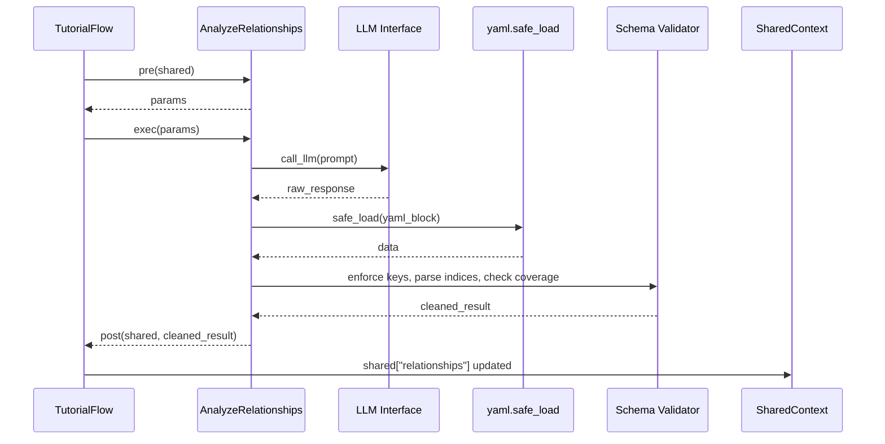

# Chapter 7: Relationship Analysis Node

In [Chapter 6: Abstraction Extraction Node](06_abstraction_extraction_node_.md) we mined your codebase for core abstractions—classes, functions and modules—each annotated with file indices. Now we’ll connect the dots: build a miniature “call‐graph” or dependency network where each abstraction is a node and each edge is a directed interaction labeled with semantics. Along the way we’ll also generate a beginner-friendly project summary. Conceptually, think of this as social network analysis of your code: identify the people (abstractions) and their friendships or hierarchies (relationships), then validate and normalize the graph so it’s ready for chapter ordering and visualization.

## 7.1 Motivation: Why a Relationship Analysis Node?

Central use case: you have a list of abstractions  

```json
[
  { "name": "QueryProcessor",  "description": "...", "files": [0,2] },
  { "name": "Router",          "description": "...", "files": [1]   },
  …
]
```  

but no overview of how they interact. A human would inspect call sites, imports, parameters. Here we automate:

1. **Context assembly**: gather code snippets referenced by each abstraction.  
2. **LLM prompt**: ask for  
   - A **project summary** (beginner-friendly, Markdown with **bold**/*italic*).  
   - A **YAML list** of directed relationships, each with `from_abstraction`, `to_abstraction` and a short `label`.  
3. **Post-processing**: parse YAML, ensure no abstraction sits orphaned, normalize indices and label strings.  

Result:  

```json
{
  "summary": "A simple search service that routes queries ...",
  "details": [
    { "from": 0, "to": 1, "label": "Uses" },
    { "from": 2, "to": 0, "label": "Provides config" },
    …
  ]
}
```  

This becomes `shared["relationships"]` for later visualization and chapter sequencing.

## 7.2 Key Concepts

1. **Context grafting**  
   Use the same helper `get_content_for_indices(files, indices)` to pull code for every file index referenced by at least one abstraction.  
2. **YAML‐prompt design**  
   Embed the list of abstraction names with indices, then ask the LLM for a `summary` plus a `relationships` list.  
3. **Schema enforcement**  
   Validate that LLM output is a dict with keys `"summary"` (string) and `"relationships"` (list of dicts).  
4. **Normalization**  
   Parse entries like `"2 # Router"` → integer `2`, clamp to `[0, N-1]`, dedupe relationships, and enforce that each abstraction appears at least once.  
5. **Graph‐mining analogy**  
   Equivalent to call-graph mining in static analysis; here we rely on LLM reasoning to identify semantic links.

## 7.3 Using the Relationship Analysis Node

Below is the core Node implementation (`AnalyzeRelationships`), showing `pre`, `exec` and `post`.

```python
class AnalyzeRelationships(Node):
    def prep(self, shared):
        # 1. Read abstractions and file list
        abstractions = shared["abstractions"]
        files_data    = shared["files"]
        project_name  = shared["project_name"]
        language      = shared.get("language", "english")

        # 2. Build a listing of abstractions for the prompt
        lines = []
        all_indices = set()
        for i, a in enumerate(abstractions):
            idxs = ", ".join(map(str, a["files"]))
            lines.append(f"- {i} # {a['name']} → files [{idxs}]")
            all_indices.update(a["files"])

        # 3. Pull relevant code snippets
        snippet_map = get_content_for_indices(files_data, sorted(all_indices))
        snippets = "\n\n".join(
            f"--- File: {k} ---\n{v}"
            for k, v in snippet_map.items()
        )

        return {
            "abstraction_list": "\n".join(lines),
            "code_snippets":    snippets,
            "project":          project_name,
            "language":         language
        }

    def exec(self, params):
        # 4. Assemble an LLM prompt
        prompt = f"""
Based on the project `{params['project']}` and these core abstractions:

Abstractions:
{params['abstraction_list']}

Relevant Code Snippets:
{params['code_snippets']}

Please provide:
1. A beginner-friendly **project summary** in Markdown with **bold** and *italic*.
2. A YAML object with:
   summary: |  
     <your summary>
   relationships:
     - from_abstraction: 0 # <Name>
       to_abstraction:   1 # <Name>
       label: "Uses"
     - …

Ensure EVERY abstraction index appears at least once across `from_abstraction` or `to_abstraction`.
"""
        raw = call_llm(prompt)

        # 5. Extract YAML block
        yaml_text = raw.split("```yaml")[1].split("```")[0].strip()
        data = yaml.safe_load(yaml_text)

        # 6. Validate top-level structure
        if not isinstance(data, dict) or "summary" not in data or "relationships" not in data:
            raise ValueError("LLM output missing 'summary' or 'relationships'")

        # 7. Validate and normalize each relationship
        rels = []
        num_abs = len(params["abstraction_list"].splitlines())
        seen = set()
        for item in data["relationships"]:
            # Check required keys
            if not all(k in item for k in ("from_abstraction","to_abstraction","label")):
                raise ValueError(f"Relationship missing keys: {item}")
            # Parse indices
            def parse_idx(x):
                s = str(x).split("#")[0].strip()
                i = int(s)
                if not 0 <= i < num_abs:
                    raise ValueError(f"Index {i} out of range")
                return i

            f = parse_idx(item["from_abstraction"])
            t = parse_idx(item["to_abstraction"])
            lbl = item["label"].strip()

            seen.add(f); seen.add(t)
            rels.append({"from": f, "to": t, "label": lbl})

        # 8. Check coverage: every abstraction appears
        if seen != set(range(num_abs)):
            missing = set(range(num_abs)) - seen
            raise ValueError(f"Some abstractions have no relationships: {missing}")

        return {
            "summary": data["summary"].strip(),
            "details": rels
        }

    def post(self, shared, _, result):
        shared["relationships"] = result
```

**Inputs** (in `shared`):  

- `shared["abstractions"]`: list of `{name,description,files}`  
- `shared["files"]`: list of `(path,content)` tuples  

**Outputs**:  

- `shared["relationships"] = {"summary": str, "details": [{"from":int,"to":int,"label":str},…]}`

## 7.4 Runtime Sequence



## 7.5 Internal Mechanics & Code Walkthrough

1. **Gather abstraction listing**  
   We prefix each abstraction with an index comment so the LLM knows labels.  
2. **Collect code snippets**  
   Delegate to `get_content_for_indices` to pull only relevant files.  
3. **Prompt design**  
   Provide clear instructions: output a Markdown **summary** and a YAML `summary`+`relationships`.  
4. **YAML extraction**  
   Split on triple-tick fences and load with `yaml.safe_load`.  
5. **Schema validation**  
   - Ensure `data` is a dict with both keys.  
   - Ensure each `relationship` entry has `from_abstraction`, `to_abstraction`, `label`.  
   - Convert string-annotated indices (`"3 # Foo"`) into integers and clamp.  
   - Collect the set of involved indices and throw an error if any abstraction is orphaned.  

This Node effectively applies **graph mining**: building a directed graph whose vertices are abstractions and edges are labeled interactions. It guarantees that our tutorial remains well-connected—no isolated concept.

## 7.6 Analogy: Social Network vs. Call Graph

- In social network analysis you identify people (abstractions) and friendships or follower relationships (edges).  
- Here, abstractions “follow” or “use” one another—LLM infers calls, imports, data-flow.  
- The project summary is like a group description: “This team solves X by ….”  

## 7.7 Conclusion & Next Steps

In this chapter we’ve:

- Assembled a directed, labeled graph of your code’s conceptual modules.  
- Generated a concise, beginner-friendly project summary.  
- Enforced that every abstraction participates in at least one relationship.  
- Normalized indices and label strings for downstream processing.  

With relationships in hand, our next step is to decide **in which order** to teach these abstractions. Head over to [Chapter 8: Chapter Sequencing Node](08_chapter_sequencing_node_.md) to discover how to sequence your tutorial for maximal clarity.

---

Generated by fork of [AI Codebase Knowledge Builder](https://github.com/vegeta03/PocketFlow-Tutorial-Codebase-Knowledge.git)
